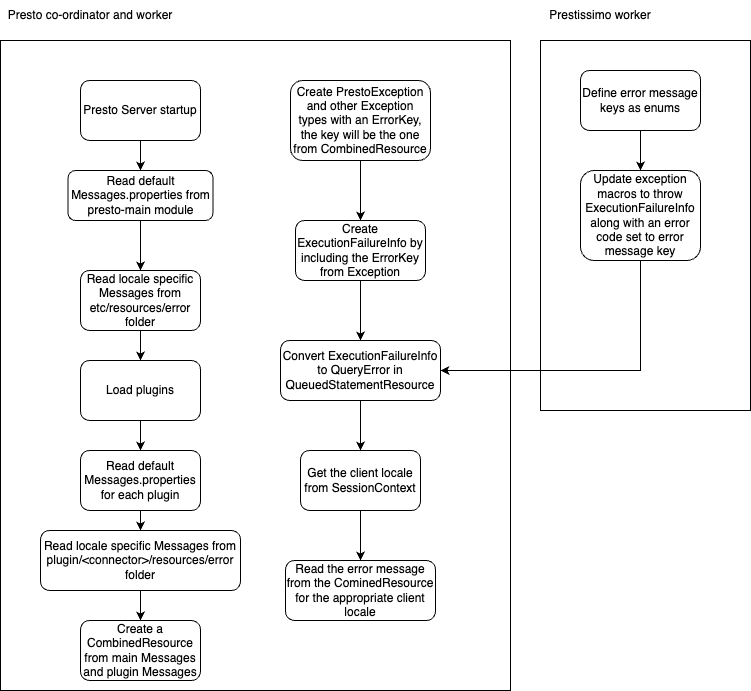

# **RFC1 for Presto**

See [CONTRIBUTING.md](CONTRIBUTING.md) for instructions on creating your RFC and the process surrounding it.

## Loading error messages from resource bundles / localization of error messages

Proposers

* Elbin Pallimalil

## [Related Issues]

https://github.com/prestodb/presto/issues/21199

## Summary

Move all the inline error messages to resource bundles. Take advantage of this change to serve client locale specific error messages from Presto.

## Background

Presto now has inline error messages written in multiple locations. If we need to review the error messages we don't have a central location to review all the messages. We can move the inline error messages to resource files to keep them in a central location.

When we are moving the error messages to resource files, we can also load locale specific error messages during server startup so that we can serve client locale specific error messages from Presto. 

## Proposed Implementation

### Presto implementation

 1. Create a default Messages.properties resource under `src/main/resources/error` folder in presto-main module 
 2. Add all error messages used in Presto code in Messages.properties 
 3. Deprecate inline error messages in Presto code and load message from Messages.properties 
 4. Only load locale specific error messages if server property `error.i18n.enabled` is true. By default it's value will be false.
 4. Check if there are Messages files for different locales in `etc/resources/error` folder during Presto startup. If yes load those locale specific resources. 
 5. When loading messages from resources, load from the locale specific resource. The locale to be used should be determined from the client session. 
 6. Each plugin can define additional error messages under `src/main/resources/error` folder in the corresponding plugin module. 
 7. These resource files from plugins will be read on server startup and a combined resource file for each locale will be created. 
 8. On server startup, read locale specific Messages.properties files for connector from a configurable path.
 9. Read the configurable path from `error.resources.location` connector property. The root will be `plugin/<connector-name>` and the default value will be `resources/error` 
 10. Load localized error messages in `QueuedStatementResource.toQueryError` method by getting the client locale from `sessionContext.language`
 11. Warn when the default resource bundle entries are not the same as the translated entries 
 12. When a translation is not available, a locale message is transcribed that explains an error message is not available, and then prints the message in the default locale (English).  That makes it embarrassing to the deployer of Presto, but less bad than preventing debugging. 
 13. Presto exceptions in query logs contain both the default and the locale-specific exception messages 
 14. Compile time validation of error message keys. 
        1. Unit test validation 
            1. All error message keys should be defined as enums 
            2. Write a unit test to ensure all the defined enums have a corresponding entry in default Messages.properties file. 
        2. Run time validation 
            1. All error message keys should be defined as enums 
            2. On server startup verify that all the defined enums have a corresponding entry in default Messages.properties file. 
 15. OSS community will maintain English bundle for presto-main and the other connectors. 
 16. OSS community can optionally maintain additional bundles for different locales but Presto can also read available bundles from a specified path at runtime, so sys admins can choose to maintain their own version of localized error bundles. 
 17. The error bundles for English and localized bundles for both presto-main and other connectors can be verified to be consistent in step 15. ii. mentioned above. (If we choose that approach) 

### Prestissimo implementation

 1. Define error message keys as enums in presto-native CPP code.
 2. Update exception macros in files like https://github.com/facebookincubator/velox/blob/523e561d3da99a78a33c4e22106ba7d1cf83c8a2/velox/common/base/Exceptions.h to set error code in `ExecutionFailureInfo` struct to the error message key
 3. When the result reaches the Presto co-ordinator, read the error code from `ExecutionFailureInfo` and read the localized error message as mentioned in step 10. 

### Design diagram

## [Optional] Metrics

How can we measure the impact of this feature?

## [Optional] Other Approaches Considered

Based on the discussion, this may need to be updated with feedback from reviewers.

## Adoption Plan

- All future code contributions to Presto should use error messages loaded from resource file as mentioned above.
- All inline error messages need to be moved to resource files and PrestoException and similar classes should have their signature updated to accept an error key and arguments for the error message.
- Create a wiki on how to define a new error message and how to create a localized version of resource file for error messages.

## Test Plan

A POC was developed that loads error messages from presto-main Messages.properties and from connector folders. This POC can be found here https://github.com/elbinpallimalilibm/presto/tree/error_message_load_from_plugins . https://github.com/elbinpallimalilibm/presto/compare/master...elbinpallimalilibm:presto:error_message_load_from_plugins