# **RFC-0004-jdbc-join-pushdown for Presto**

See [CONTRIBUTING.md](CONTRIBUTING.md) for instructions on creating your RFC and the process surrounding it.

## Jdbc join pushdown in presto

Proposers

* Ajas M M


## Related Issues

https://github.com/prestodb/presto/issues/23152

## Summary

At present, when a query joins multiple tables, it creates a separate TableScanNode for each table. Each TableScanNode select all the records from that table. The join operation is then executed in-memory in Presto using a JOIN node by applying JoinCriteria, FilterPredicate and other criteria (like sort, limit etc).

However, if the query joins tables from the same JDBC datasource, it would be more efficient to let the datasource handle the join instead of creating a separate TableScanNode for each table and joining them in Presto. If we  "Push down" or send these joins to remote JDBC datasource it increase the performance 3x to 10x.

For example for the below postgres join query if we pushdown the join to a single TableScanNode, then the Presto Plan and performance will be as follows.

**Join Query**

```
SELECT order_id,
       c_customer_id
FROM postgresql.public.orders o
    INNER JOIN postgresql.public.customer c ON c.c_customer_id = o.customer_id;
```


**Original presto plan**

```

 - Output[PlanNodeId 9][order_id, c_customer_id] => [order_id:integer, c_customer_id:char(16)]
    - RemoteStreamingExchange[PlanNodeId 266][GATHER] => [order_id:integer, c_customer_id:char(16)]
        - InnerJoin[PlanNodeId 4][("customer_id" = "c_customer_id")][$hashvalue, $hashvalue_11] => [order_id:integer, c_customer_id:char(16)]
                Distribution: PARTITIONED
            - RemoteStreamingExchange[PlanNodeId 264][REPARTITION][$hashvalue] => [customer_id:char(16), order_id:integer, $hashvalue:bigint]
                    Estimates: {source: CostBasedSourceInfo, rows: ? (?), cpu: ?, memory: 0.00, network: ?}
                - ScanProject[PlanNodeId 0,326][table = TableHandle {connectorId='postgresql', connectorHandle='postgresql:public.orders:null:public:orders', layout='Optional[{domains=ALL, additionalPredicate={}}]'}, projectLocality = LOCAL] => [customer_id:char(16), order_id:integer, $hashvalue_10:bigint]
                        Estimates: {source: CostBasedSourceInfo, rows: ? (?), cpu: ?, memory: 0.00, network: 0.00}/{source: CostBasedSourceInfo, rows: ? (?), cpu: ?, memory: 0.00, network: 0.00}
                        $hashvalue_10 := combine_hash(BIGINT'0', COALESCE($operator$hash_code(customer_id), BIGINT'0')) (1:45)
                        LAYOUT: {domains=ALL, additionalPredicate={}}
                        order_id := JdbcColumnHandle{connectorId=postgresql, columnName=order_id, jdbcTypeHandle=JdbcTypeHandle{jdbcType=4, jdbcTypeName=int4, columnSize=10, decimalDigits=0, arrayDimensions=null}, columnType=integer, nullable=true, comment=Optional.empty} (1:45)
                        customer_id := JdbcColumnHandle{connectorId=postgresql, columnName=customer_id, jdbcTypeHandle=JdbcTypeHandle{jdbcType=1, jdbcTypeName=bpchar, columnSize=16, decimalDigits=0, arrayDimensions=null}, columnType=char(16), nullable=true, comment=Optional.empty} (1:45)
            - LocalExchange[PlanNodeId 297][HASH][$hashvalue_11] (c_customer_id) => [c_customer_id:char(16), $hashvalue_11:bigint]
                    Estimates: {source: CostBasedSourceInfo, rows: ? (?), cpu: ?, memory: 0.00, network: ?}
                - RemoteStreamingExchange[PlanNodeId 265][REPARTITION][$hashvalue_12] => [c_customer_id:char(16), $hashvalue_12:bigint]
                        Estimates: {source: CostBasedSourceInfo, rows: ? (?), cpu: ?, memory: 0.00, network: ?}
                    - ScanProject[PlanNodeId 1,327][table = TableHandle {connectorId='postgresql', connectorHandle='postgresql:public.customer:null:public:customer', layout='Optional[{domains=ALL, additionalPredicate={}}]'}, projectLocality = LOCAL] => [c_customer_id:char(16), $hashvalue_13:bigint]
                            Estimates: {source: CostBasedSourceInfo, rows: ? (?), cpu: ?, memory: 0.00, network: 0.00}/{source: CostBasedSourceInfo, rows: ? (?), cpu: ?, memory: 0.00, network: 0.00}
                            $hashvalue_13 := combine_hash(BIGINT'0', COALESCE($operator$hash_code(c_customer_id), BIGINT'0')) (2:12)
                            LAYOUT: {domains=ALL, additionalPredicate={}}
                            c_customer_id := JdbcColumnHandle{connectorId=postgresql, columnName=c_customer_id, jdbcTypeHandle=JdbcTypeHandle{jdbcType=1, jdbcTypeName=bpchar, columnSize=16, decimalDigits=0, arrayDimensions=null}, columnType=char(16), nullable=true, comment=Optional.empty} (2:12)

```

**Joinpushdown presto plan**

```
 - Output[PlanNodeId 9][order_id, c_customer_id] => [order_id:integer, c_customer_id:char(16)]
        Estimates: {source: CostBasedSourceInfo, rows: ? (?), cpu: ?, memory: 0.00, network: ?}
    - RemoteStreamingExchange[PlanNodeId 233][GATHER] => [order_id:integer, c_customer_id:char(16)]
            Estimates: {source: CostBasedSourceInfo, rows: ? (?), cpu: ?, memory: 0.00, network: ?}
        - TableScan[PlanNodeId 217][TableHandle {connectorId='postgresql', connectorHandle='postgresql:public.orders:null:public:orders', layout='Optional[{domains=ALL, additionalPredicate={}}]'}] => [order_id:integer, c_customer_id:char(16)]
                Estimates: {source: CostBasedSourceInfo, rows: ? (?), cpu: ?, memory: 0.00, network: 0.00}
                LAYOUT: {domains=ALL, additionalPredicate={}}
                order_id := JdbcColumnHandle{connectorId=postgresql, columnName=order_id, jdbcTypeHandle=JdbcTypeHandle{jdbcType=4, jdbcTypeName=int4, columnSize=10, decimalDigits=0, arrayDimensions=null}, columnType=integer, nullable=true, comment=Optional.empty} (1:45)
                c_customer_id := JdbcColumnHandle{connectorId=postgresql, columnName=c_customer_id, jdbcTypeHandle=JdbcTypeHandle{jdbcType=1, jdbcTypeName=bpchar, columnSize=16, decimalDigits=0, arrayDimensions=null}, columnType=char(16), nullable=true, comment=Optional.empty} (2:12)
``` 


**Original presto plan performance**

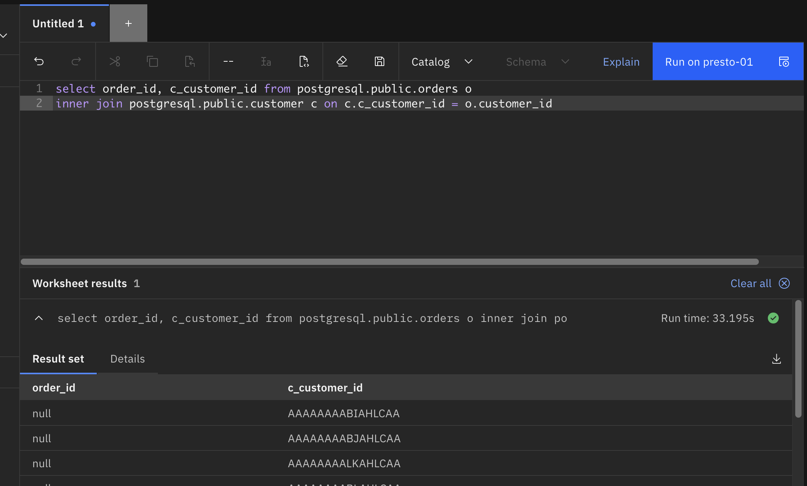


**Joinpushdown presto plan performance**

  

## Background


This implementation is to address a performance limitation of Presto federation of SQLs of JDBC connector to remote data sources such as DB2, Postgres, Oracle etc. Currently, Presto support predicate pushdown (WHERE condition pushdown) to some extent in JDBC connectors, but it does not have any join pushdown capabilities. This cause high performance impact on join queries and it is raised by some of our client. While comparing with competitors we also missing the Jdbc join pushdown capabilities.

We did a poc by changing the presto generated PlanNode to handle jdbc join pushdown and it increases the performance from 3x on postgres and  8x on db2 remote datasource. Now we need to perform its actual implementation 


## Proposed Implementation

If presto get a join query (from the CLI or UI) which is trying to join tables either from same datasource or from different datasource, it is receiving as a string formatted sql query. Presto validate the syntax and convert it to Query (Statement) object using presto parser and analyser. This Query object is converted to presto internal reference architecture called Plan, using its logical and physical optimizers. Finally this plan is executed by the executor. 

Currently for the join query, presto create a final plan which contains separate TableScanNode for each table that participated on join query and this TableScanNode info is used by the connector to create the select query. On top of this select query result, presto apply join condition and other predicate to provide the final result.

In the proposed implementation, while performing the logical optimization, instead of creating separate TableScanNode for each table of the JoinNode, it uses a new single TableScanNode which holds all the table details which satisfies the "JoinPushdown condition". The "JoinPushdown condition" is a simple term that check some conditions on tables which are participated on join query, to identify its eligibility to participate on join pushdown. This is not having any relation with the JoinCriteria (Join clause) or FilterCriteria and do not confuse it with that. 

### JoinPushdown condition

The "JoinPushdown condition" term or capability can be defined based on below four conditions

 1. Table condition: The JoinNode left and right should be a TableScanNode (table) and the tables should be from same connector (datasource)
 2. Join clause condition: The Join criteria of that JoinNode should be from same datasource
 3. Pushdown feature flag : A global setting is there for enable JdbcJoinPushdown. This flag is 'enable-join-query-pushdown=true' and configured in custom-config.properties. If it is 
    false then no joinpushdown should happen.
 4. Filter Criteria condition: The filter criteria should be from same connector

For example JoinPushdown condition for below query is as follows

**JoinQuery**

```
select pg1.name, 
       db24.item, 
       pg2.rate 
from postgres.pg.table1_pg1 pg1 
    join postgres.pg.table_pg2 pg2 on  pg1.cut_id = pg2.cust_id 
    join db2.table_db11 db11 on  pg1.cut_id = db11.cust_id 
    join db2.table_db22 db22 on  pg1.cut_id = db22.product_own_id
```

Here for the presto resolved JoinNode (deep left JoinNode) the left table will be 'pg.table1_pg1 pg1' and right table will be 'pg.table_pg2 pg2', both are from same datasource called  postgres, hence it satisfies 'Table condition' for JoinPushdown. Next we need to check 'Join clause condition' for this JoinNode, here it is 'on  pg1.cut_id = pg2.cust_id' and both the column in the join clause (JoinCriteria) is from same data source called postgres, hence it satisfies 'Join clause condition'. Here no additional filter predicate for this JoinNode if it was there it should be from same data source (postgres) to enable this node for join pushdown.

If a JoinNode satisfies the JoinPushdown condition then it convert to  new TableScanNode, it holds tables from JoinNode, join criteria and other information related to that JoinNode. Using this new TableScanNode it builds join query at connector level and return the join result to presto. Now the further predicate which was not pushed down to connector level will apply on the result by the presto and return the final result.


## Highlevel Design

In presto, on Logical planning it converting the Query object  to  Presto Object called PlanNode by using the parser and analyser. In Physical planning this PlanNode passes through different logical and Physical optimiser - Rules, to optimize the PlanNode and to create the final Plan object.

Basically the PlanNode or the Plan is a tree datastructure which represent the sql query, and is able to understand and process by presto. When a join Query received on logical planning, presto create a PlanNode with JoinNode. JoinNode is a tree structure which can hold another node, left tables, right tables, join conditions, projections and filters related to that join query. If there are multiple tables to join then it create a join tree structure where the left side of the JoinNode will be another JoinNode which hold sub joins to resolve multiple table.  The logical PlanNode is created in such a way, where the first table (which is the from clause table) is resolved first either from the left TableScanNode or from JoinNode hierarchy using left dept first algorithm, then its adjacent table (very next table) as right side.  So the order and position of the tables in the join query plays an important role to determine query pushdown. Below is the example of PlanNode that created for the join query.

 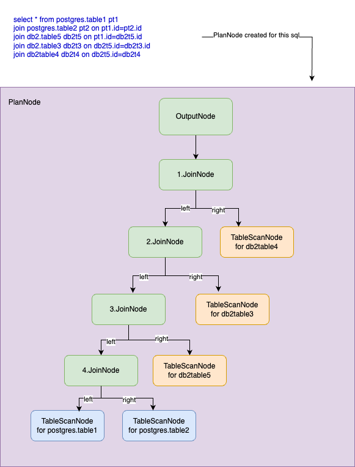 


For doing jdbc join pushdown, we need to create a new logical optimiser called JoinPushdown optimiser which is applicable only for JdbcConnector. In this optimizer the PlanNode tree traversal happen against connector specific JoinNode on left depth first manner. During left depth traversal, if the JoinNode left and right tables are from same connector,  and if join conditions is from same connector and if satisfies all other 'join pushdown condition' then it will create a new TableScanNode by replacing that JoinNode and merging that JoinNode left and right TableScanNode into single one. Then the left depth travesal reach to its parent JoinNode and validate left table, right table, join condition against the 'join pushdown condition'. If that also matches the connector and join condition then that table also add to previously created ‘single table scan’ and replace the JoinNode.  This JoinNode replacement to ‘single table scan’ will continue until the traversal find any fail case on 'join pushdown condition' or end the JoinNode hierarchy. Once it fail or complete then it will immediately return the node without traversing on remaining parent node or pushing down the remaining parent nodes. For the JoinNode which is not pushingdown (not converted to new TableScanNode) will follow presto default behaviour to handle the JoinNode.

After JoinPushdown optimizer, the PlanNode ensure only one TableScanNode against the JoinNode if the JoinNode matches 'join pushdown condition'. So there is only one split is generated and not break the join query to multiple select statement for the JoinNode which satisfies 'join pushdown condition'. Now the single new TableScanNode split will transfer to the connector and the connector will generate the join query from the new TableScanNode split as it contains all the tables and join conditions related to that join query.

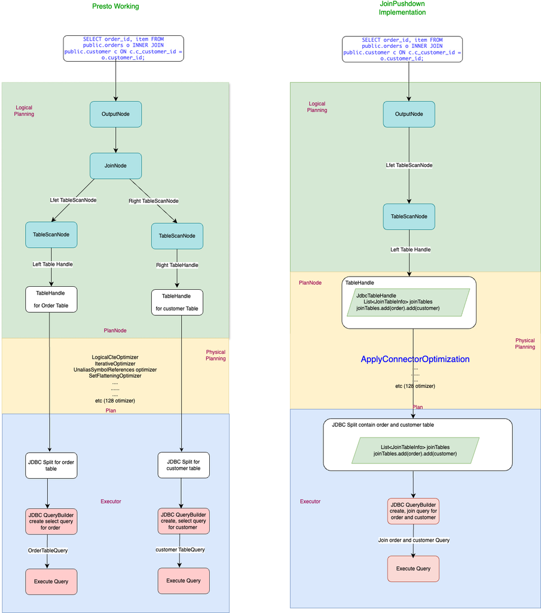 


#### Join pushdowns for bushy trees & queries involving multiple connectors

This jdbc join pushdown proposal is based on the existing presto flow and it is optimizing the PlanNode using JdbcJoinPushdown optimizer to pushing down the join node to connector level. 

Presto always produces a left deep Join tree for a PlanNode (JoinNode). The JoinNode never met another JoinNode on right, and the right always will be a source for TableScanNode. But the left of the JoinNode could be another JoinNode. 

That is, for a join query the left always resolve from 'FROM' clause table. So if we use a federated join query (which involves multiple connectors) we could pushdown all the tables of the connector which is defined as 'FROM' table. No other connector tables are going to pushing down as the left is always resolve from 'FROM' clause table and the right is the other connector level table. Below is the possible pushdown if we use postgres table as from table.

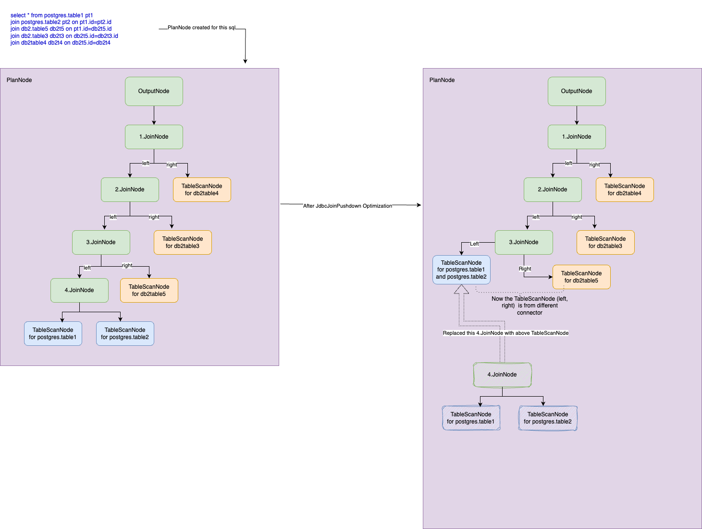 


For doing federated join pushdown (pushing down tables from multiple connector) either we need to group the tables based on connector or need to rewrite the PlanNode to build right JoinNode instead of TableScanNode (bushy join). It is not planning on this proposal and here we are planning to pushing down all the tables from the single connector which is defined as 'FROM' clause.

## Lowlevel Design

#### Below is the detailed flow for jdbc join pushdown.

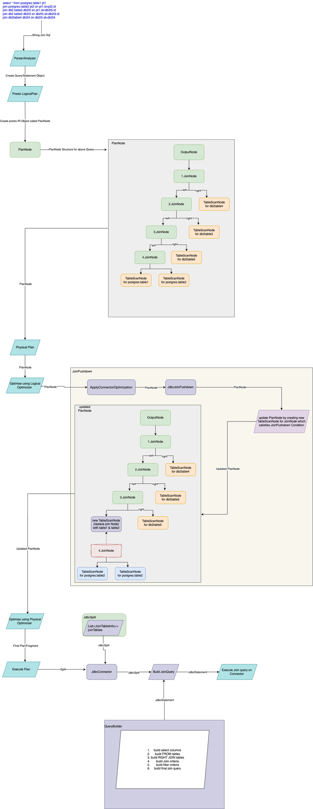 


#### Below are new points that Proposed for Join Pushdown Implementation

* JoinNode make available on ConnectorPlanOptimizer

* On ApplyConnectorOptimization Optimizer, add new ConnectorPlanOptimizer called JdbcJoinPushdown

* JdbcJoinPushdown needs to implement ConnectorPlanOptimizer and the optimze method use ConnectorPlanRewriter to rewrite the JoinNode to a TableScanNode

* Handle JoinNode on JdbcJoinPushdown ConnectorPlanRewriter. 

* visitJoinNode to identify which Join nodes can be pushed down and handled by the connector. Multiple JoinNodes need to handle here.

* If the connector, identifies a JoinNode that it wants to rewrite, collapsing the JoinNode into a new TableScanNode property by removing the JoinNode.

* Handle join query or  parameters for join query on new TableScanNode property may be a new data structure on JdbcTableHandle

* Handle output projection for multiple table (from collapsed Join) using new TableScanNode(JdbcTableHandle)

* Modify Jdbc split to handle the new TableScanNode property

* Create Querybuilder to create join query from the new JdbcSplit property

* Handle where clause associated with JoinNode

* Handle other predicate like Limit, rowcount, nvl, abs(), etc.

##  1) JoinNode make available on ConnectorPlanOptimizer

Currently we are focusing only for Jdbc join pushdown. The join pushdown should be at connector level.  If we use join queries from multiple connector like iceberg, postgres and db2 then, 

  * No join pushdown is expected for iceberg tables,
  * If there are multiple tables to join on postgres which satisfies 'join pushdown condition' then that join should pushed down to 
    connector as a single postgres join query 
  * and if there are multiple tables on db2 connector which satisfies 'join pushdown condition' then that also need to pushed down to db2 
    connector as a single join query. 

Now the presto is responsible for return the final result by joining above iceberg, postgres and db2 connector response.

For implementing connector level join pushdown, first we need JoinNode and make available it for accessing on connector level. For that JoinNode should move to spi package (com.facebook.presto.spi.plan) from sql planner (com.facebook.presto.sql.planner.plan). It includes,

* Moving dependent class to spi package.
```
         JoinNode.java

         AbstarctJoinNode.java

         SemiJoinNode.java
```
* Refactor codes that use above class : Refactor the imports 

* Currently visitJoin() is implemented on InternalPlanVistor. This class should not move to spi, instead add visit join method on PlanVistor 
  and extend PlanVistor on JoinNode instead of InternalPlanVistor

* Correct all build fails, test fails and method missing by implementing them for new JoinNode.

* Do sample unit testing and ensure Join query coverage.

## 2) On ApplyConnectorOptimization Optimizer, add new ConnectorPlanOptimizer called JdbcJoinPushdown

We  have ApplyConnectorOptimization Optimizer to add connector specific plan optimizer. This Optimizer is created on application initialization and load values while read catalogue properties. Existing general flow for optimizer is as follows. 

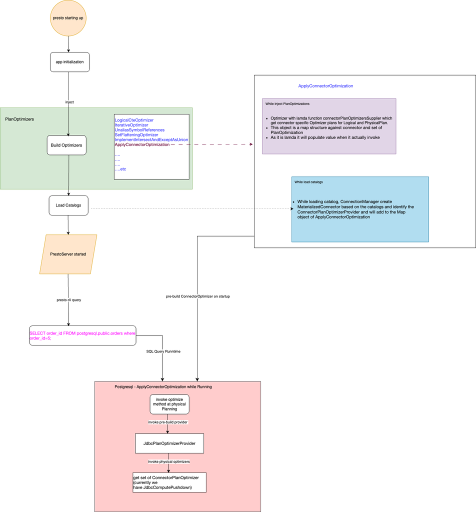 


#### New Changes required as part of this enhancement

#### Add new optimizer JdbcJoinPushdown to JdbcPlanOptimizerProvider

While starting application, it build ‘ApplyConnectorOptimization’ with logical and physical plan optimiser. The optimizer provider for JDBC Connectors for  ‘ApplyConnectorOptimization’ is  JdbcPlanOptimizerProvider. Now JdbcPlanOptimizerProvider provide physical plan optimizer called JdbcComputePushdown. We need to create a new optimizer JdbcJoinPushdown and should implement JdbcPlanOptimizerProvider getLogicalPlanOptimizers method to return this JdbcJoinPushdown optimizer.

```

   public class JdbcPlanOptimizerProvider
   
           implements ConnectorPlanOptimizerProvider
   
   {
   
       
   
       @Inject
   
       public JdbcPlanOptimizerProvider(…….)
   
       {
   
           ……………
   
           ……………
           
           …………..
     
         }
   
       @Override
   
       public Set<ConnectorPlanOptimizer> getLogicalPlanOptimizers()
   
       {
   
           return ImmutableSet.of(new JdbcJoinPushdown());
   
       }
   
       @Override
   
       public Set<ConnectorPlanOptimizer> getPhysicalPlanOptimizers()
   
       {
   
          …….
   
          …..,..
          
          ……..
   
       }
   
       
   
   }
```

## 3) JdbcJoinPushdown Rule creation

In presto, when we use a join query, presto create a PlanNode with JoinNode. JoinNode is a tree structure which can hold left and right table details, join conditions, projections and filter details. If there are multiple tables to join then it create a join tree structure where the left side of the JoinNode will be another JoinNode which hold sub joins to resolve multiple table.  The logical PlanNode is created in such a way, where the first table (which is the from clause table) is resolved first either from the left TableScanNode or from JoinNode hierarchy using left dept first algorithm, then its adjacent table (very next table) as right side.  So the order and position of the tables in the join query plays an important role to determine query pushdown. 

 

In JoinPushdown optimiser, we need to traverse the JoinNode on left depth first manner. During traversal, if the left and right tables are from same connector and its join conditions are  from the same connector then it satisfies the  “join pushdown condition” and needs to create a ‘single table scan’ (join query builder) and replace JoinNode with ‘single table scan’ if the global pushdown flag is enabled. Then need to check with its parent JoinNode right table to match above “join pushdown condition”. If that also matches the connector and join condition then that table also add to previously created ‘single table scan’ and replace the JoinNode.  

This JoinNode replacement to ‘single table scan’ will continue until the traversal find any of the below condition and immediately return the node without travers or pushing down the parent nodes. 

a) left and right tables are from different catalogue

b) join condition are from different catalogue

c) filter condition is not from same catalogue

d) if there is any functions or operators (presto functions or sql functions like abs()) on JoinNode that cannot handle by the connector

#### The JoinPushdown Rule representation

JoinPushdown Rule or traverse algorithm should consider traversing the PlanNode hierarchy on left depth first JoinNode and then right JoinNodes (if the right is a JoinNode instead of TableScanNode) to reach out the left and right table of the JoinNode and then to validate its 'Joinpushdown condition'. If it satisfies the join pushdown condition then it will replace that JoinNode to TableScanNode.

#### The algorithm for join query which contains tables from same connector (postgres) is as follows.

Here the JoinQuery with 3 tables (employee, department and project) which are from same connector (postgres) and the JoinNode tree structure for the PlanNod is generated with two join (JoinNode-1 and JoinNode-2) as follows.  JoinNode-1 left is another JoinNode-2 and its right is project table. JoinNode-1 is the left deep JoinNode which resolve ‘FROM’ table employee from its ‘left’ and next adjacent table department from its ‘right’.

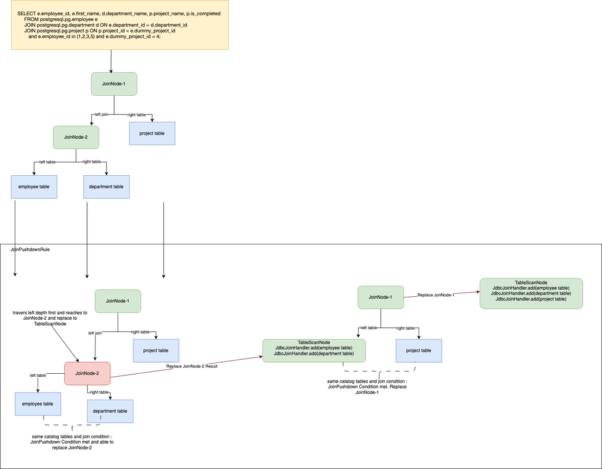 

In JoinPushdown Optimizer-Rule, the JoinNode is traversed on left depth first manner to find the left deep JoinNode and it will reach to the JoinNode-2. Now it check its left and right table with ‘join pushdwon condition’. As both tables staisfies the condition the Rule will create a 'new TableScanNode' which contain employee and department details and replace the JoinNode-2 with that 'new TableScanNode'.  Now it validate ‘join pushdown condition’ against this tree (parent) hierarchy and it observe 'new TableScanNode' as left and project table as right, which also satisfies the condition. So merging this children’s too, to the single TableScanNode by adding the project table to previously created ‘new TableScanNode’ and replace the JoinNode-1 with this ‘modified new TableScanNode’. Now there is no JoinNode but it is replaced with a single 'new TableScanNode' which contains all the table details (employee, department and project) as per the query table order.

#### The algorithm for join query which contains tables from multiple connector

JoinPushdown Rule or traverse algorithm should consider traversing the JoinNode on left depth first to identify left deep JoinNode and then travers to its right JoinNode on left depth first then right. After traversing all JoinNode on this manner it will validate the resolved left table and right table of that visited JoinNode. For example if we have a PlanNode like below 

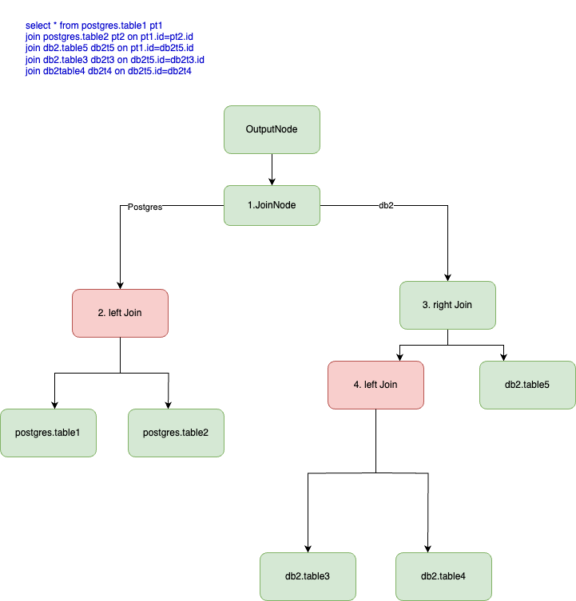 

It should first go through the left of the JoinNode and should replace '2.left Join' with TableScanNode as '2.left Join' is a completed JoinNode with left and right are tables which satisfies the join condition. Then traverse through right (right is a JoinNode instead of TableScanNode) of the left visited JoinNode and should replace '4.left Join'. Here '4.left Join' satisfies the JoinPushdown Condition as the left and right of the tables of join are from same catalogue and join condition are from same catalogue. Here '3.right Join' tables are from same catalogue (after replace 4. left Join), but the join condition is from different catalogue. So while visit '3. right Join' it immediately return the node as it is, without replace that node and without traverse through the remaining parent node. The final output of the JdbcJoinPushdwon is as follows.

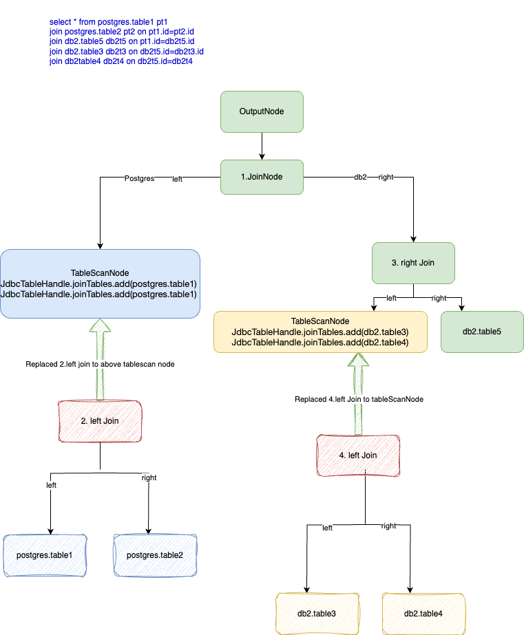 

When we analyze the Presto created PlanNode for the same join query, it is observed that it is never created right part of the JoinNode as a JoinNode, instead it is always a TableScanNode. All the Join is hold under the left JoinNode hierarchy as follows. If that is the case then the optimizer code change will pushingdown the JoinNode '4. JoinNode', as it is the only node which satisfies the join pushdown condition. For federated query (multiple catalogue query), for pushingdown multiple catalog tables, presto should create above defined bushy PlanNode which is able to hold JoinNode on left and right of the Join. Creating bushy PlanNode is not planned on this scope.

 

## 4) JdbcJoinPushdown invoke from ApplyConnectorOptimization 

While running the sql, presto invokes all its optimizers  including ApplyConnectorOptimization.  We added a new Jdbc logical optimizer called JdbcJoinPushdown on above step2, and it will be available on this point to execute. We need to invoke JdbcJoinPushdown optimize  for JoinNode or FilterNode (which is the complete context for the JoinNode) from ApplyConnectorOptimization, which matches the connector and the applyconnector context. It should not pass any other JoinNode or any PlanNode implementation which not satisfies the existing applyconnector context.

#### Applyconnector context that required for JdbcJoinPushdown optimizer

*) Only nodes with JoinNode should process on JdbcJoinPushdown optimizer

*) The nodes that passed to JdbcJoinPushdown optimizer should be the root level node (complete node) corresponding to the JdbcConnector

*) Only single connector level node should pass to JdbcJoinPushdown optimizer at a time

Currently JoinNode is not accessible at Connector level (ApplyConnectorOptimization). We need to enhance the capability by adding JoinNode to CONNECTOR_ACCESSIBLE_PLAN_NODES that defined against connector optimization. This may have impact with existing (There is large number of connector level optimizer that already exist) logical and physical optimizers. Need to confirm the impact and fix as required while implementing this.

## 5) JdbcJoinPushdown Optimizer Implementation

JdbcJoinPushdown needs to implement ConnectorPlanOptimizer and the optimze method need to use ConnectorPlanRewriter to rewrite the JoinNode to a TableScanNode. Refer existing JdbcComputePushdown class for reference.

```
public class JdbcJoinPushdown

        implements ConnectorPlanOptimizer

{

@Override

public PlanNode optimize(PlanNode maxSubplan, ConnectorSession session, VariableAllocator variableAllocator, PlanNodeIdAllocator idAllocator)

{

return rewriteWith(new Rewriter(session, idAllocator), maxSubplan);

}

private class Rewriter

        extends ConnectorPlanRewriter<Void>

{

@Override

public PlanNode visitProject(ProjectNode node, RewriteContext<Void> context)

{

}

@Override

public PlanNode visitJoin(JoinNode node, RewriteContext<Void> context)

{

}

}

}
```
On JdbcJoinPushdown, we have the JoinNode (PlanNode). Here we need to travers through the JoinNode to find out JoinNodes which satisfies the “Joinpushdown Condition”. For the nodes which satisfies this condition needs to converted to TableScanNode.  Refer session 3 for the details.

## 6) Handle JoinNode on JdbcJoinPushdown ConnectorPlanRewriter. 

On JdbcJoinPushdown, we need to override visitJoin() and it will be invoke from ApplyConnectorOptimization. Once a node reach to  visitJoin() we should validate the node against  “JoinPushdown Condition” and if satisfies the condition then replace the JoinNode with a new TableScanNode. Using this new TableScanNode we should able to hold all the table details which is enabled for join pushdown and transfer it to connector level. 

For this we need to introduce a new structure on JdbcTableHandle to hold all the table details as follows.

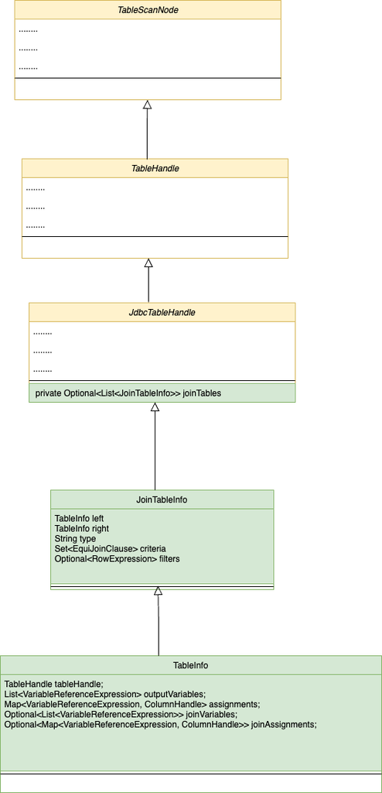 

If the JoinNode is not satisfies the “JoinPushdown condition” then there should have an algorithm to traverse the JoinNode to left depth first and then right node left depth first to visit all the child node. This algorithm should travers JoinNode left/right child even though  the Node is  JoinNode, ProjectNode or FilterNode to get the leaf TableScanNode. After getting the leaf based on “JoinPushdown condition” it can be converted to TableScanNode.If we get other than JoinNode, ProjectNode, FilterNode or TableScanNode as left or right of JoinNode then we could skip the pushdown and able to return the node from there itself.

#### For the newly created TableScanNode, there should have some logic to handle

*) output projection for multiple table (from collapsed Join) 

*) assignment for multiple tables from the JoinNode

*) General predicate that received from sql

*) predicate received from JoinNode tables

*) Handle or skip pushdown for function which may not support by jdbc

*) Handle or skip pushdown for presto specific Sql statement

*) Handle or skip pushdown for join with subquery

*) or skip pushdown for different type of Join (inner, outer, cross , etc) 

## 7) Create presto Split corresponding to newly created TableScanNode

After completing JdbcJoinPushdown optimization we have a PlanNode which contain TableScanNode with join table details. After all optimization process the final plan and fragment will create by presto engine and generate a split to execute on JdbcConnector. Now we need to get the join table details from TableScanNode and populate on split to get on connector level. Modify JdbcSplit to hold the details as follows.

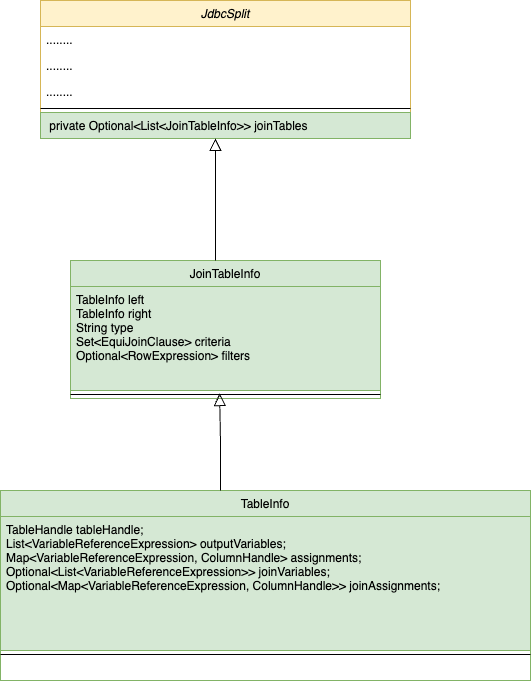 


## 8) Create Join Query on Connector Level using the split

The split manager works on JdbcSplit and provide objects for processing on connector level. We need to modify this logic to transfer the new object (Optional<List<JoinTableInfo>> joinTables) too, to the connector level. Currently, for the Join query, the split is transfer to buildSql() to create the select statement. If the split contains ‘joinTables’ details then we need to transfer this ‘joinTables’ details to the new method called ‘buildJoinSql()’ where we need to create and return join query instead of select query.

On buildJoinSql(), we need to handle select column, left tables, right join tables, join condition and filter condition.

#### Handling From Table.

The parameter  ‘Optional<List<JoinTableInfo>> joinTables’ that received on buildJoinSql() contains the JoinTableInfo in an order.  All left object of every JoinTableInfo instance will be the same table instance called FROM table and we need to resolve the from table from the very first JoinTableInfo left object only. 

Table fromTable = joinTables.get(0).left;

#### Handling Select Column

The select column needs to resolve from the above fromTable.joinVariables. The values for TableInfo.joinVariables will be filled only on the very first JoinTableInfo.left (joinTables.get(0).left) which we may use to resolve left table. All other TableInfo.joinVariables will be null or empty.

#### Handling Right/Join Tables

The right/join table need to resolve from JoinTableInfo by strictly following the index of JoinTableInfo on joinTables list that we receive.  The first Join table should the right table of first item (JoinTableInfo) of the joinTables list and the second join table should be the right table of the second (JoinTableInfo) of the joinTables list. This order should keep for the last n’th item as n’th join table will be the nth item right value of  joinTables list.


#### Handling JoinType

The Join type (inner, outer, cross etc) is available with each JoinTableInfo and we need to use that directly for each right table resolved 

#### Handling Join criteria

The Join criteria is also available with each JoinTableInfo as JoinTableInfo.criteria and we could get the same from that

#### Resolving Assignment

The select column name and join criteria may be available as an expression and so each column (expression) we need to resolve from exact table assignment. Against each  TableInfo we have assignments object and we need to extract the actual table name and column name from this assignment for each select and criteria column.

#### Handling Filter

TODO: Open for now 

## 9) Connector Specific implementation

Current implementation will work for every JdbcConnector which use JdbcPlanOptimizerProvider as ConnectorPlanOptimizerProvider. It is noticed that some existing JdbcConnector not using JdbcPlanOptimizerProvider.

During this task we are focusing on postgres (for OSS) and db2 (for IBM) to do the join pushdown and now other Jdbc connectors are not testing .

## 10) Open Points

*) Bushy Join

*) After JoinPushdown optimizer Explain and Analyze join query may show only one tablescannode. We may able to list all the tables on it .

*) How we cover all test cases

*) Currently we planned to validate postgres (oss) connector and db2 (IBM) connector. Validation is required for all Jdbc Connector.


## [Optional] Other Approaches Considered

Based on the discussion, this may need to be updated with feedback from reviewers.

## Adoption Plan

- We can enable join pushdown for JDBC connectors using Presto's custom configuration enable-join-query-pushdown=true.
- Currently, Presto is able to push down only one connector table. Pushing down multiple connector tables to the JDBC level is out of scope for this RFC.
- Cost based Join Pushdown is not handled now 
- We cannot handle predicates (like LIMIT, rowcount, NVL, ABS(), etc.) and custom functions and operators (Presto-specific functions) that are used inside join criteria. For such
  joins, pushdown will not take place and the process will return to the original Presto flow.
  


## Test Plan

- Unit tests can test the JdbcJoinPushdown capabilities by enabling 'enable-join-query-pushdowntesting' flag
- Regression testing will do locally to validate all sql for Postgres
- Regression testing will do locally to validate all sql for IBM specific db2
- We did a poc for join query with postgres, db2 and iceberg table.
    *) While pushing down the postgres join its performance is 3x
    *) While pushing down the db2 join its performance is 8x


