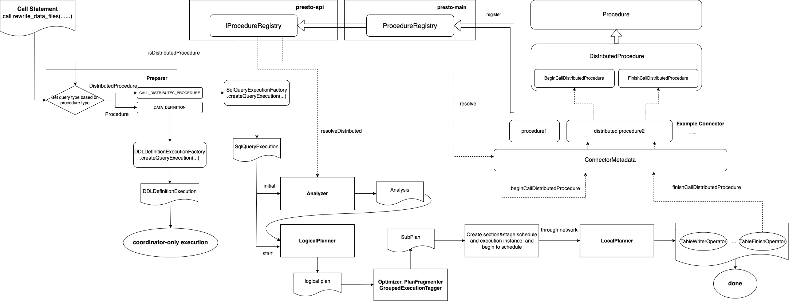

## **Expand Procedure Architecture to Support Distributed Execution**

## Proposers

* Dong Wang

## Related Issues

* https://github.com/prestodb/presto/issues/20425

## Summary

Propose design to expand the current procedure architecture in presto, support defining, registering and calling procedures which need to be executed in a distributed way.
In this way, we can follow the previous `CALL` syntax to execute distributed procedures, for example, when we want to rewrite and optimize the data files of a extremely huge
target table (which means it should be executed distributively), we can call:

```sql
CALL catalog_name.system.rewrite_data_files('db', 'sample', 'partition_key = 1');
```

Besides, in order to demonstrate as an example and figure out the functional boundaries among the different architecture levels, also describe the design for Iceberg to support distributed procedure and then describe a specific distributed procedure `rewrite_data_files` here.

> When we talk about procedure here, strictly speaking, we mean the connector-specific system procedure. That is, these procedures are predefined and provided to users by connectors. As presto neither support user defined procedures, nor have a concept of global system procedure (`system.runtime.kill_query()` belongs to `GlobalSystemConnector`, which could be considered as a special connector as well), so we simply call them `procedures` throughout the entire article.

## Background

### Problem

Currently, presto support procedures which are running on coordinator only. These procedures are mainly used to do things that related to metadata modification, so do not need to be executed distributively. That is, no worker nodes participate in the execution process.

But in practice, there indeed exists some functions that could not simply be completed in coordinator only. These functions often involve operations on table's data, for example, rewrite table data, merge small data files, sort table data, repartition table data etc. These features may not have specific standard SQL syntax corresponding to them, and often related to specific connectors so would be different between one and the other.

Therefore, compared to extending SQL syntax, they are more suitable to be implemented as procedures.

### Other Computing Engines

#### Spark

Spark support calling procedures which need to be executed distributively. For example, Spark has procedures as follows on Iceberg:

##### rewrite_data_files

`rewrite_data_files` is used to compact data files in parallel, it will combine small files into larger files to reduce metadata overhead and runtime file open cost:

```sql
CALL catalog_name.system.rewrite_data_files('db.sample');
CALL catalog_name.system.rewrite_data_files(table => 'db.sample', where => 'id = 3 and name = "foo"');
```

##### rewrite_position_delete_files

`rewrite_position_delete_files` is used to serves two purposes:
* Minor Compaction: Compact small position delete files into larger ones.
* Remove Dangling Deletes: Filter out position delete records that refer to data files that are no longer live.

```sql
CALL catalog_name.system.rewrite_position_delete_files('db.sample');
CALL catalog_name.system.rewrite_position_delete_files(table => 'db.sample', options => map('rewrite-all', 'true'));
```

Reference:
* https://iceberg.apache.org/docs/nightly/spark-procedures/#rewrite_data_files
* https://iceberg.apache.org/docs/nightly/spark-procedures/#rewrite_position_delete_files

#### BigQuery

BigQuery's system procedure `BQ.REFRESH_MATERIALIZED_VIEW` is used to refresh a materialized view. It involves scanning the data from source table, calculating and rewriting to the target materialized view, so need to be executed distributively:

```sql
CALL BQ.REFRESH_MATERIALIZED_VIEW(view_name);
```

Reference:
* https://cloud.google.com/bigquery/docs/reference/system-procedures#bqrefresh_materialized_view

#### Trino

Trino use its own SQL syntax extension `ALTER TABLE EXECUTE` to support these scenarios. For example, it use optimize command to rewrite the content of the specified table so that it is merged into fewer but larger files:

```sql
ALTER TABLE test_table EXECUTE optimize;
ALTER TABLE test_table EXECUTE optimize(file_size_threshold => '128MB');
ALTER TABLE test_partitioned_table EXECUTE optimize WHERE partition_key = 1;
```

Reference:
* https://trino.io/docs/current/connector/iceberg.html#alter-table-execute

## Goals

* Expand the ability of procedures, enable them to leverage worker nodes to manipulate table data as well as metadata, which could be called as `distributed procedure`.
* Expand currently procedure architecture to support the definition, registration, invocation and execution of `distributed procedures`.
* Provide clarify architecture hierarchy and well defined SPI interface, enable various connectors to easily support distributed procedures.
* Support distributed procedure for Iceberg connector, and implement a specific distributed procedure: `rewrite_data_files`.

The ultimate goal of all of the above is that we can follow the original `CALL` syntax to execute procedures which have to be executed distributively, rather than extending SQL syntax.

## Proposed Implementation

### Overview

1. Distributed procedure is used for processing of actual data besides metadata for a target table, such as data rewriting, merging, sorting or repartitioning. We need to re-factor and expand `Procedure/ProcedureRegistry` architecture, so that we can:
   * Define a distributed procedure and register it into procedure registry
   * Acquire and use procedure registry in `presto-analyzer` and `connectors` module

> Since a distributed procedure is used to handle the data of a target table, it is enforced to contain two required parameters: `schema` and `table_name`.
> Besides, it can also contain an optional parameter `filter` with the default value of `TRUE`, which indicates the filtering conditions for the data to be processed.
> A specific procedure implementation can define the parameter list on its own, but it must include the required parameters `schema` and `table_name`, and can optionally use parameter `filter` to narrow down the range of data to be processed.

2. Define a new query type `CALL_DISTRIBUTED_PROCEDURE`, and associate the call distributed procedure statement with this type during preparer phase. So that this kind of statements would fall into the path of `SqlQueryExecutionFactory.createQueryExecution(...)`. The generated `SqlQueryExecution` object can utilize the existing distributed querying, writing, and final committing mechanism to achieve distributed execution for procedures.


3. Add a new plan node type: `CallDistributedProcedureNode`. During the analyzing and logical planning phase, construct a logical plan with the following shape for `call distributed procedure` statement:

    ```text
    TableScanNode -> FilterNode -> CallDistributedProcedureNode -> TableFinishNode -> OutputNode
    ```
	
    Wherein, `CallDistributedProcedureNode` holds `CallDistributedProcedureTarget`, which is a subclass of `WriterTarget`, used to maintain the procedure information and related call parameters information.





4. The optimizing, segmenting, group execution tagging, and local planning of `CallDistributedProcedureNode` are similar to `TableWriterNode`. And it would be ultimately local planned to a `TableWriterOperator` (which holds a specific type of `ExecutionWriterTarget` subclass related to `call distributed procedure` statement). When creating a `PageSink` to execute data writing, a corresponding `ConnectorPageSink` will be generated based on the specific subclass and property values of `ExecutionWriterTarget` that are actually held by `TableWriterOperator`.


5. Similar to statements such as `create table as`/`insert`/`delete`/`refresh material view` that involve distributed processing, two related SPI methods are defined for `call distributed procedure` statement in the metadata and connector metadata interfaces. `beginCallDistributedProcedure` is used for preparation work before the start of distributed scheduling. And `finishCallDistributedProcedure` is used for transaction commitment after the completion of distributed writing.

> Both `beginCallDistributedProcedure` and `finishCallDistributedProcedure` are all invoked in coordinator. More precisely, `finishCallDistributedProcedure` will always be invoked by operator `TableFinishOperator` in the Java worker inside coordinator.
> That is to say, they will always be called in Java environment.

6. As for a specific connector (such as Iceberg), in the implementation logic of method `beginCallDistributedProcedure` and `finishCallDistributedProcedure` in `ConnectorMetadata`, in addition to accomplish the common logic for this connector (such as starting a transaction, building a transaction context, committing a transaction, etc.), it should also resolve the specified distributed procedure and call its relevant method to execute the procedure-customized logic.

### Detailed description

#### 1. Re-factor Procedure/ProcedureRegistry

Add a new type `DistributedProcedure`, which is a subclass of `Procedure`, but with some special requirements: the declared parameters must include `schema` and `table_name`, which are used to specify the target table. There are no strict restrictions on the position and order of these two parameters in the parameter list, but it is recommended to be placed in the first two positions by default.

DistributedProcedure does not utilize the property `methodHandle` in parent class, but instead defines two additional method interfaces: `BeginCallDistributedProcedure` and `FinishCallDistributedProcedure`. These two method interfaces would be invoked from related methods in the implementation of `ConnectorMetadata`. And a specific distributed procedure can customize its own actions during the distributed execution by implementing these two method interfaces:

```java
@FunctionalInterface
public interface BeginCallDistributedProcedure
{
    ConnectorDistributedProcedureHandle begin(ConnectorSession session, ConnectorTransactionContext transactionContext, ConnectorTableLayoutHandle tableLayoutHandle, Object[] arguments);
}

@FunctionalInterface
public interface FinishCallDistributedProcedure
{
    void finish(ConnectorTransactionContext transactionContext, ConnectorDistributedProcedureHandle procedureHandle, Collection<Slice> fragments);
}
```

Due to the fact that `DistributedProcedure` is a subclass of `Procedure`, the current implementation of `ProcedureRegistry` directly supports registration, deletion, and maintenance of `DistributedProcedure`. Besides, two additional methods were added to `ProcedureRegistry` to support the related judgment and resolution functions for `DistributedProcedure`:

```java
public DistributedProcedure resolveDistributed(ConnectorId connectorId, SchemaTableName name);
public boolean isDistributedProcedure(ConnectorId connectorId, SchemaTableName name);
```

Extract interface `IProcedureRegistry` for `ProcedureRegistry` and declare it in `presto-spi` module, so that it can be recognized and used in both the `presto-analyzer` and `connector` modules.

```java
public interface IProcedureRegistry
{
    void addProcedures(ConnectorId connectorId, Collection<Procedure> procedures);

    void removeProcedures(ConnectorId connectorId);

    Procedure resolve(ConnectorId connectorId, SchemaTableName name);

    DistributedProcedure resolveDistributed(ConnectorId connectorId, SchemaTableName name);

    boolean isDistributedProcedure(ConnectorId connectorId, SchemaTableName name);
}
```

#### 2. Set new query type during preparer phase

Add a new type in `QueryType` called `CALL_DISTRIBUTED_PROCEDURE(10)` for `call distributed procedure` statement, it's different from the query type 'DATA-DEFINITION' originally set for `call procedure` statement.

In the preparer phase, when encountering a call statement, utilize the injected `IProcedureRegistry` to determine whether the called procedure is a `DistributedProcedure`. If so, associate its query type to `CALL_DISTRIBUTED_PROCEDURE`.

In this way, in `LocalDispatchQueryFactory` we can choose `SqlQueryExecutionFactory` to generate the query execution for `call distributed procedure` statement. This allows for the utilization of distributed data scanning, writing, and unified committing mechanism during actual execution.

#### 3. Processing logic during analyzing and logical planning phase

Add a new plan node type `CallDistributedProcedureNode` for `call distributed procedure` statement, which is defined as follows:

```java
public class CallDistributedProcedureNode
            extends InternalPlanNode
{
    private final PlanNode source;
    private final Optional<CallDistributedProcedureTarget> target;
    private final VariableReferenceExpression rowCountVariable;
    private final VariableReferenceExpression fragmentVariable;
    private final VariableReferenceExpression tableCommitContextVariable;
    private final List<VariableReferenceExpression> columns;
    private final List<String> columnNames;
    private final Set<VariableReferenceExpression> notNullColumnVariables;
    private final Optional<PartitioningScheme> partitioningScheme;
    private final List<VariableReferenceExpression> outputs;

    ......
}
```

At present, it can be regarded as a simplified version of `TableWriterNode`, and holds `CallDistributedProcedureTarget`, a subclass of `WriterTarget` used to maintain information about the procedure and the call parameters:

```java
public static class CallDistributedProcedureTarget
            extends WriterTarget
{
    private final QualifiedObjectName procedureName;
    private final Object[] procedureArguments;
    private final Optional<TableHandle> sourceHandle;
    private final SchemaTableName schemaTableName;

    .....
}
```

During the analyzing and logical planning phase, the `call distributed procedure` statement will be planned into a logical plan with the following shape:

```text
TableScanNode -> FilterNode -> CallDistributedProcedureNode -> TableFinishNode -> OutputNode
```

Among them, `TableScanNode -> FilterNode` defines the data to be processed. It's based on the target table determined by `schema` and `table_name` in the parameters, as well as the possibly existing filter conditions.

The `CallDistributedProcedureNode -> TableFinishNode` structure is similar to the `TableWriterNode -> TableFinishNode` structure, used to perform distributed data manipulation and final unified submission behavior.

As will describe later, `CallDistributedProcedureNode` and `TableFinishNode` will be local planned to `TableWriterOperator` and `TableFinishOperator` in the worker end. So we can reuse the existing protocol message between `TableWriterNode` and `TableFinishNode`. Furthermore, we currently do not support collecting statistics during a data write in distributed procedure,
whether to collect statistics depends on the specific connectors and specific distributed procedures we need to support. So for now, we only need a subset of the current existing protocol, and can extend it when needed.

In details, `TableWriterOperator(CallDistributedProcedureNode)` will send output pages to `TableFinishOperator(TableFinishNode)` with the following format:

```
row         fragments           context
X           null                ctx_slice
null        frag_slice1         ctx_slice
null        frag_slice2         ctx_slice
......
```

- Column `row` contains number of rows processed by a `TableWriterOperator(CallDistributedProcedureNode)` instance.
- Column `fragments` contains arbitrary binary data provided by the `ConnectorPageSink.finish()` for the further post-processing on the coordinator. That is, they are connector related partial writing messages, and would be handled in connector related metadata method.
- Column `context` describes the partial commit context of a `TableWriterOperator(CallDistributedProcedureNode)` instance, including `lifespan`, `taskId`, `pageSinkCommitStrategy` and a flag to indicate whether it has handled the last page.
  This commit context corresponds to a `TableCommitContext` instance, and has the same value on all rows, so it uses a run length encoding.
  In `TableFinishOperator`, this commit context would be deserialized and used to track and maintain the partial commit messages in `lifespan+stage` dimensions from previous stage, and finally be submitted uniformly.

Note: when supporting `call distributed procedure` statement, using a new plan node `CallDistributedProcedureNode` instead of directly reusing `TableWriterNode`, mainly considering that although they are very similar in the entire process, they may have many differences in the future, for example:
* The `call distributed procedure` statement may not only return the updated rows number, but also a lot of content (such as the number of affected files, etc., referring to Spark's procedure for iceberg `rewrite_data_files`)
* We may allow each specific distributed procedure to define its own return result columns in the future

#### 4. Processing logic during optimizing, segmenting, and local planning phase

The optimizing, segmenting, group execution tagging, and local planning of `CallDistributedProcedureNode` are similar to `TableWriterNode`. Due to the current definition of `CallDistributedProcedureNode` skipping some fields in `TableWriterNode` that are currently considered not so necessary for distributed procedure, the current handling logic of `CallDistributedProcedureNode` in various visitors and rewriters can be considered as a simplified version of `TableWriterNode`. It was ultimately planned to a `TableWriterOperator`, which holds a `ExecuteProcedureHandle` used to maintain informations of the called procedure and the target table:

```java
public static class ExecuteProcedureHandle
            extends ExecutionWriterTarget
{
    private final DistributedProcedureHandle handle;
    private final SchemaTableName schemaTableName;
    private final QualifiedObjectName procedureName;

	......
}

public final class DistributedProcedureHandle
{
    private final ConnectorId connectorId;
    private final ConnectorTransactionHandle transactionHandle;
    private final ConnectorDistributedProcedureHandle connectorHandle;

	......
}
```

Wherein, `ConnectorDistributedProcedureHandle` is an empty interface that needs to be implemented by connectors. It represents a handle related to the execution of distributed procedures that Presto engine itself does not interpret and utilize, but is passed to the specific connector through connector metadata interfaces for interpretation and utilization.

Finally, a new optimizer `RewriteWriterTarget` is added specifically, which is placed after all optimization rules. The reason is that after optimizing the entire plan, some filter conditions may be pushed down to `TableScanNode`, and at this time, the information in `TableHandle` of the target table held in `CallDistributedProcedureTarget` built during the logical planning phase may become inaccurate (without including the pushed down filter conditions). Therefore, it is necessary to update the `CallDistributedProcedureTarget` held in `TableFinishNode` and `CallDistributedProcedureNode` based on the `TableHandle` held in the underlying `TableScanNode` after the entire optimization is completed.

#### 5. Definition of metadata interface

Similar to statements such as `create table as`/`insert`/`delete`/`refresh material view` that involving distributed processing, two related SPI methods are defined for `call distributed procedure` statement in the metadata and connector metadata interfaces:

```java
public interface Metadata
{
    ......

    /**
     * Begin call distributed procedure
     */
    DistributedProcedureHandle beginCallDistributedProcedure(Session session, QualifiedObjectName procedureName, TableHandle tableHandle, Object[] arguments);

    /**
     * Finish call distributed procedure
     */
    void finishCallDistributedProcedure(Session session, DistributedProcedureHandle procedureHandle, QualifiedObjectName procedureName, Collection<Slice> fragments);

    ......
}

public interface ConnectorMetadata
{
    ......

    /**
     * Begin call distributed procedure
     */
    default ConnectorDistributedProcedureHandle beginCallDistributedProcedure(
            ConnectorSession session,
            QualifiedObjectName procedureName,
            ConnectorTableLayoutHandle tableLayoutHandle,
            Object[] arguments)
    {
        throw new PrestoException(NOT_SUPPORTED, "This connector does not support distributed procedure");
    }

    /**
     * Finish call distributed procedure
     *
     * @param fragments all fragments returned by {@link com.facebook.presto.spi.UpdatablePageSource#finish()}
     */
    default void finishCallDistributedProcedure(ConnectorSession session, ConnectorDistributedProcedureHandle procedureHandle, QualifiedObjectName procedureName, Collection<Slice> fragments)
    {
        throw new PrestoException(NOT_SUPPORTED, "This connector does not support distributed procedure");
    }

    ......
}
```

Wherein, `beginCallDistributedProcedure` is used for preparation work before the start of distributed scheduling and generate the execution information that needs to be passed to worker nodes. And `finishCallDistributedProcedure` is used for the whole transaction submission after the completion of distributed writing.

As for a specific connector (such as Iceberg), in the implementation logic of method `beginCallDistributedProcedure` and `finishCallDistributedProcedure` in `ConnectorMetadata`, in addition to accomplish the common logic for this connector (such as starting a transaction, building a transaction context, committing a transaction, etc.), it should also resolve the specified distributed procedure and call its relevant method to execute the procedure-customized logic.

#### 6. Iceberg connector's support for distributed procedure

In Iceberg, we often need to record the original data files that have been scanned and rewritten during the execution of table data operations (including deleted files that have been fully applied), and in the final submission, combine the newly generated data files due to rewriting to make some changes and transaction submissions at the metadata level.

Therefore, we extended the concept of transaction context, and maintain the connector split source planned by the execution of `BeginCallDistributedProcedure` into current transaction context. Besides, we also maintain the actual scanned and processed data files and delete files during data file planning into current transaction context. The definition of the extended Iceberg transaction context is as follows:

```java
public class IcebergTransactionContext
            implements ConnectorTransactionContext
{
    final Optional<Table> table;
    final Transaction transaction;
    final Set<DataFile> scannedDataFiles = new HashSet<>();
    final Set<DeleteFile> fullyAppliedDeleteFiles = new HashSet<>();
    Optional<ConnectorSplitSource> connectorSplitSource = Optional.empty();

    ......
}
```

We also extended `IcebergSplitManager`, so that it will check firstly whether there is a planned `ConnectorSplitSource` set in current transaction context. If so, it will directly use and return the existing split source. This allows us to customize our own connector split source, and implement some additional logic within it, such as recording the actual scanned data files and delete files as we batch by batch obtain splits information during scheduling. The scanned data files and delete files are also maintained in current transaction context for future usage in final submission.

Define the `IcebergDistributedProcedureHandle` class, which is an implementation of the `ConnectorDistributedProcedureHandle` interface described above. It represents the information related to the actual data writing for specific target table:

```java
public class IcebergDistributedProcedureHandle
        implements ConnectorDistributedProcedureHandle
{
    private final String schemaName;
    private final IcebergTableName tableName;
    private final String schemaAsJson;
    private final String partitionSpecAsJson;
    private final List<IcebergColumnHandle> inputColumns;
    private final String outputPath;
    private final FileFormat fileFormat;
    private final Map<String, String> storageProperties;

    ......
}
```

The implementation logic of Iceberg for `ConnectorMetadata.beginCallDistributedProcedure(...)` is as follows:
1. Firstly, get a reference to the target iceberg table based on the parameters 
2. Next, open a new Iceberg transaction through the reference of the table, and encapsulate it into a transaction context `IcebergTransactionContext`
3. Resolve the procedure specified in the parameters through the injected procedure registry, and verify that it is of type `DistributedProcedure`
4. Finally, call `begin(...)` of the method handle `beginCallDistributedProcedure` held by the procedure, pass in the transaction context plus with other relevant parameters, and return the result of type `ConnectorDistributedProcedureHandle`.

The implementation logic of Iceberg for `ConnectorMetadata.finishCallDistributedProcedure(...)` is as follows:
1. Firstly, resolve the procedure specified in the parameters through the injected procedure registry, and verify that it is of type `DistributedProcedure`
2. Then, call `finish(...)` of the method handle `finishCallDistributedProcedure` held by the procedure, pass in the transaction context plus with other relevant parameters
3. Finally, commit the Iceberg transaction held in current transaction context and then destroy the transaction context

#### 7. Iceberg connector's implementation for `rewrite_data_files`

Firstly, a dedicated `CallDistributedProcedureSplitSource` was defined to support generating a split source with additional custom logic. It receives a consumer for `FileScanTask`, and would be used in the implementation logic of the interface method `BeginCallDistributedProcedure` by `rewrite_data_files`. As the splits information is obtained batch by batch during actual scheduling, the consumer logic passed in by `rewrite_data_files` will be executed, which record the actual scanned data files and delete files information into the current transaction context for later use in submission.

Then build a `DistributedProcedure` instance with parameters description as follows and a namespace of `system.rewrite_data_files`. And follow the normal procedures to register it into the `ProcedureRegistry`.

```text
(schema: varchar required, table_name: varchar required, filter: varchar, options: map (varchar, varchar))
```

The implementation logic for `BeginCallDistributedProcedure` in `rewrite_data_files` is:
1. Obtain `Table icebergTable` and `IcebergTableHandle tableHandle` from current transaction context
2. Build Iceberg's table scan object based on `snapshotId` and the valid filter condition `validPredicate` recorded in parameter `icebergTableLayoutHandle` (default `TRUE` if not set)
3. Build a consumer for `FileScanTask`, where the data files and delete files from scan tasks will be recorded into the corresponding properties of current transaction context
4. Build a `CallDistributedProcedureSplitSource` object based on the table scan and consumer obtained above, and set it into the current transaction context 
5. Finally, based on the relevant information of `icebergTable` and `tableHandle`, construct and return an `IcebergDistributedProcedureHandle` object

The implementation logic for `FinishCallDistributedProcedure` in `rewrite_data_files` is:
1. Obtain `Table icebergTable` from current transaction context 
2. Deserialize the parameter `fragments` to obtain the submission information of all distributed tasks `List<CommitTaskData> commitTasks` passed from the previous stage. A `CommitTaskData` instance here corresponds to a value in Column `fragments` described in the protocol message format between `CallDistributedProcedureNode` and `TableFinishNode` above
3. Obtain the set of new data files `Set<DataFile> newFiles` generated due to the actual distributed writing through `commitTasks`
4. Retrieve the set of scanned original data files `Set<DataFile> scannedDataFiles` as well as the set of fully applied deleted files `Set<DeleteFile> fullyAppliedDeleteFiles` from current transaction context 
5. Leverage `RewriteFiles` API from current Iceberg transaction to replace the scanned data files and fully applied delete files with the newly generated data files at metadata level 
6. Commit the single action, not the whole transaction. (The whole transaction would be unified committed in iceberg metadata)

## Adoption Plan

- As this is an extended feature, it should not have any impact on existing users.
- For connector maintainers, they can decide to implement the new defined SPI method to support distributed procedure, or leave it unimplemented.
- We will document the procedure architecture expansion and related SPI methods, so that connector maintainers can understand and support this expansion more easily.

## Test Plan

We will add test cases in each phase involving this procedure architecture expansion, including creating and registering for distributed procedures, preparing for `call distributed procedure`, analyzing for `call distributed procedure`, logical planning and optimizing for `call distributed procedure`, and finally add tests for the specific iceberg distributed procedure: `rewrite_data_files`. 