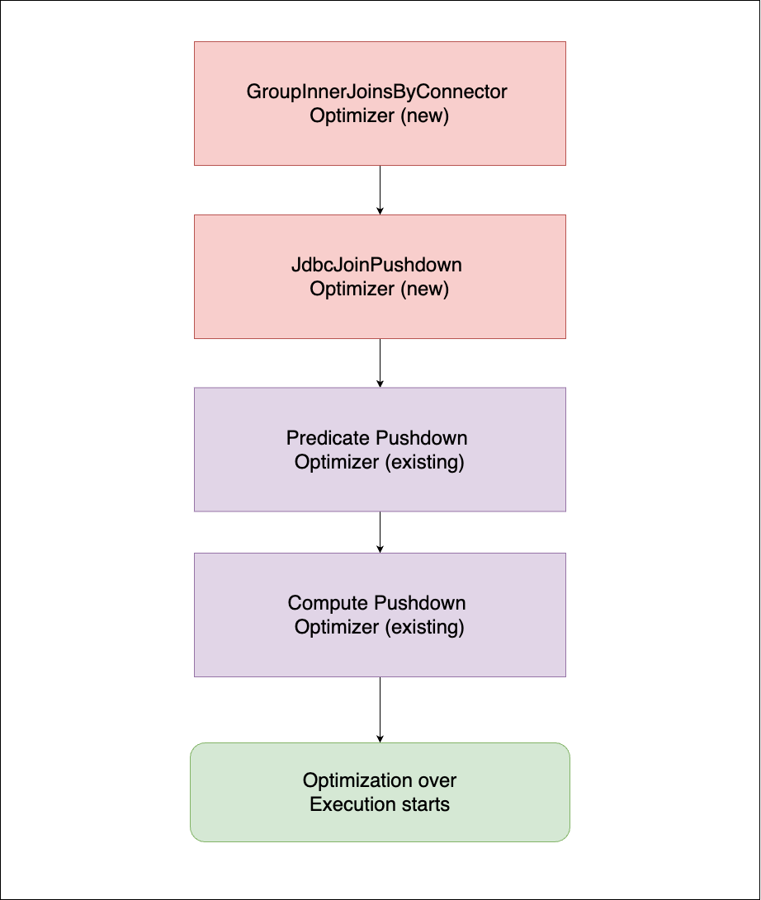
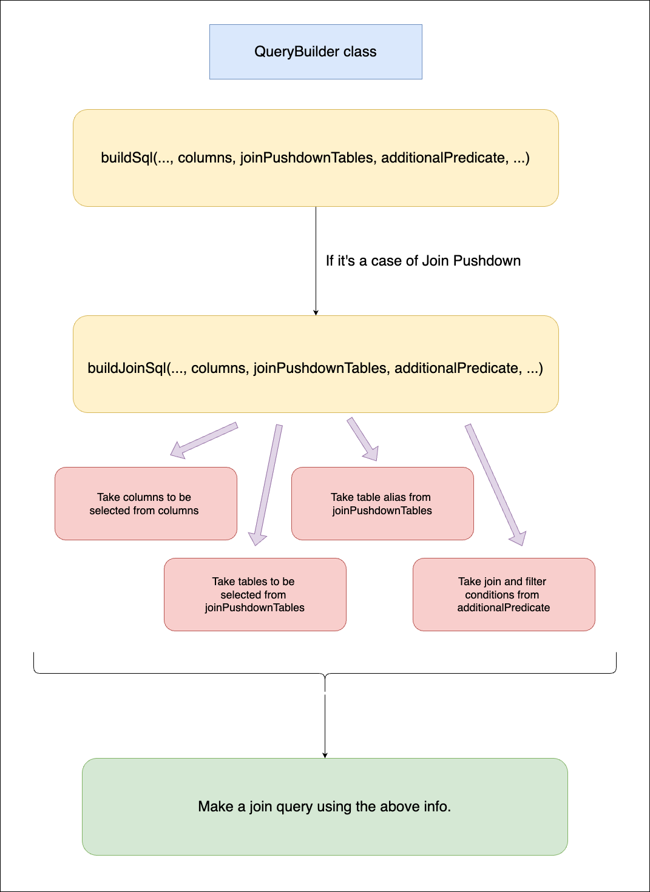

# **RFC0009 for Presto**

## Jdbc join push down in presto

Proposers

* Ajas M M
* Haritha K
* Thanzeel Hassan
* Glerin Pinhero

## Related Issues

https://github.com/prestodb/presto/issues/23152

## Summary

At present, when a query joins multiple tables, it creates a separate TableScanNode for each table. Each TableScanNode select all the records from that table. The join operation is then executed in-memory in Presto using a JOIN node by applying JoinCriteria, FilterPredicate and other criteria (like order by, limit, etc.).

However, if the query joins tables from the same JDBC datasource, it would most of the time be more efficient to let the datasource handle the join instead of creating a separate TableScanNode for each table and joining them in Presto. If we "Push down" these joins to remote JDBC datasource it increases the query performance. i.e., decreases the query execution time. We have seen an average improvement in query times of 3x-4x. Upto 10x in some cases.

**Join Query performance improvements :**
```
Select t1.custkey as t1_id, t2.custkey as t2_id, t1.name, t1.address, t1.phone, t2.orderstatus, t2.orderdate, t2.totalprice,
t2.orderpriority, t2.orderstatus, t2.clerk, t2.shippriority
from "postgres"."pg".customer t1
join "postgres"."pg".orders t2 
on t1.custkey = t2.orderkey;
```
- customer table has 45 million rows, orders table has 1.5 million rows – Result is 8 rows. 

| No | Parameter                    | Normal Presto Flow    | Join Pushdown Flow      |         
|----|------------------------------|-----------------------|-------------------------|
| 1  | Elapsed Time                 | 3.73m                 | 59.32s                  |
| 2  | Prerequisites Wait Time      | 4.01ms                | 13.21ms                 |
| 3  | Queued Time                  | 3.99ms                | 5.12ms                  |
| 4  | Planning Time                | 250.37ms              | 313.41ms                |
| 5  | Execution Time               | 3.73m                 | 58.98s                  |   
| 6  | CPU Time                     | 2.69m                 | 30.00ms                 |
| 7  | Scheduled Time               | 3.95m                 | 58.53s                  |   
| 8  | Input Rows                   | 46.5M                 | 16.0                    |
| 9  | Input Data                   | 3.93GB                | 1.12kB                  |
| 10 | Shuffled Rows                | 46.5M                 | 8.00                    |
| 11 | Shuffled Data                | 3.72GB                | 1.28kB                  |
| 12 | Peak User Memory             | 142.46MB              | 0B                      | 
| 13 | Peak Total Memory            | 192.88MB              | 0B                      |
| 14 | Cumulative User Memory       | 29.5G seconds         | 0 seconds               |
| 15 | Cumulative Total             | 30.9G seconds         | 0 seconds               |
| 16 | Output Rows                  | 8.00                  | 8.00                    |
| 17 | Output Data                  | 802B                  | 1.16kB                  |

For the below postgres join query if we push down the join to a single TableScanNode, then the Presto Plan and performance will be as follows :

**Join Query**

```
SELECT 
    b.book_id,
    b.copies_available,
    b.year_published,
    l.total_seating_capacity,
    l.number_of_staff
FROM 
    postgres.pg.books b
JOIN 
    postgres.pg.libraries l 
ON b.library_id = l.library_id;
```

**Original Presto Plan**

Explain Analyze output :
```
Query Plan
"Fragment 1 [HASH]
    CPU: 20.03ms, Scheduled: 57.41ms, Input: 10 rows (265B); per task: avg.: 10.00 std.dev.: 0.00, Output: 5 rows (125B), 1 tasks
    Output layout: [book_id, copies_available, year_published, total_seating_capacity, number_of_staff]
    Output partitioning: SINGLE []
    Stage Execution Strategy: UNGROUPED_EXECUTION
    - InnerJoin[PlanNodeId 4][(""library_id"" = ""library_id_0"")][$hashvalue, $hashvalue_23] => [book_id:integer, copies_available:integer, year_published:integer, total_seating_capacity:integer, number_of_staff:integer]
            CPU: 14.00ms (25.93%), Scheduled: 50.00ms (41.32%), Output: 5 rows (125B)
            Left (probe) Input avg.: 0.31 rows, Input std.dev.: 387.30%
            Right (build) Input avg.: 0.31 rows, Input std.dev.: 186.55%
            Distribution: PARTITIONED
        - RemoteSource[2] => [book_id:integer, library_id:integer, copies_available:integer, year_published:integer, $hashvalue:bigint]
                CPU: 0.00ns (0.00%), Scheduled: 0.00ns (0.00%), Output: 5 rows (145B)
                Input avg.: 0.31 rows, Input std.dev.: 387.30%
        - LocalExchange[PlanNodeId 363][HASH][$hashvalue_23] (library_id_0) => [library_id_0:integer, total_seating_capacity:integer, number_of_staff:integer, $hashvalue_23:bigint]
                Estimates: {source: CostBasedSourceInfo, rows: ? (?), cpu: ?, memory: 0.00, network: ?}
                CPU: 1.00ms (1.85%), Scheduled: 1.00ms (0.83%), Output: 5 rows (120B)
                Input avg.: 0.31 rows, Input std.dev.: 387.30%
            - RemoteSource[3] => [library_id_0:integer, total_seating_capacity:integer, number_of_staff:integer, $hashvalue_24:bigint]
                    CPU: 0.00ns (0.00%), Scheduled: 0.00ns (0.00%), Output: 5 rows (120B)
                    Input avg.: 0.31 rows, Input std.dev.: 387.30%

Fragment 2 [SOURCE]
    CPU: 21.82ms, Scheduled: 38.69ms, Input: 5 rows (0B); per task: avg.: 5.00 std.dev.: 0.00, Output: 5 rows (145B), 1 tasks
    Output layout: [book_id, library_id, copies_available, year_published, $hashvalue_22]
    Output partitioning: HASH [library_id][$hashvalue_22]
    Stage Execution Strategy: UNGROUPED_EXECUTION
    - ScanProject[PlanNodeId 0,401][table = TableHandle {connectorId='postgres', connectorHandle='JdbcTableHandle{connectorId=postgres, schemaTableName=pg.books, catalogName=null, schemaName=pg, tableName=books, joinTables=Optional.empty}', layout='Optional[{domains=ALL, additionalPredicate={}}]'}, grouped = false, projectLocality = LOCAL] => [book_id:integer, library_id:integer, copies_available:integer, year_published:integer, $hashvalue_22:bigint]
            Estimates: {source: CostBasedSourceInfo, rows: ? (?), cpu: ?, memory: 0.00, network: 0.00}/{source: CostBasedSourceInfo, rows: ? (?), cpu: ?, memory: 0.00, network: 0.00}
            CPU: 21.00ms (38.89%), Scheduled: 37.00ms (30.58%), Output: 5 rows (145B)
            Input avg.: 5.00 rows, Input std.dev.: 0.00%
            $hashvalue_22 := combine_hash(BIGINT'0', COALESCE($operator$hash_code(library_id), BIGINT'0')) (9:5)
            LAYOUT: {domains=ALL, additionalPredicate={}}
            copies_available := JdbcColumnHandle{connectorId=postgres, columnName=copies_available, jdbcTypeHandle=JdbcTypeHandle{jdbcType=4, jdbcTypeName=int4, columnSize=10, decimalDigits=0, arrayDimensions=null}, columnType=integer, nullable=true, comment=Optional.empty} (9:5)
            year_published := JdbcColumnHandle{connectorId=postgres, columnName=year_published, jdbcTypeHandle=JdbcTypeHandle{jdbcType=4, jdbcTypeName=int4, columnSize=10, decimalDigits=0, arrayDimensions=null}, columnType=integer, nullable=true, comment=Optional.empty} (9:5)
            library_id := JdbcColumnHandle{connectorId=postgres, columnName=library_id, jdbcTypeHandle=JdbcTypeHandle{jdbcType=4, jdbcTypeName=int4, columnSize=10, decimalDigits=0, arrayDimensions=null}, columnType=integer, nullable=true, comment=Optional.empty} (9:5)
            book_id := JdbcColumnHandle{connectorId=postgres, columnName=book_id, jdbcTypeHandle=JdbcTypeHandle{jdbcType=4, jdbcTypeName=int4, columnSize=10, decimalDigits=0, arrayDimensions=null}, columnType=integer, nullable=true, comment=Optional.empty} (9:5)
            Input: 5 rows (0B), Filtered: 0.00%

Fragment 3 [SOURCE]
    CPU: 18.99ms, Scheduled: 35.35ms, Input: 5 rows (0B); per task: avg.: 5.00 std.dev.: 0.00, Output: 5 rows (120B), 1 tasks
    Output layout: [library_id_0, total_seating_capacity, number_of_staff, $hashvalue_25]
    Output partitioning: HASH [library_id_0][$hashvalue_25]
    Stage Execution Strategy: UNGROUPED_EXECUTION
    - ScanProject[PlanNodeId 1,402][table = TableHandle {connectorId='postgres', connectorHandle='JdbcTableHandle{connectorId=postgres, schemaTableName=pg.libraries, catalogName=null, schemaName=pg, tableName=libraries, joinTables=Optional.empty}', layout='Optional[{domains=ALL, additionalPredicate={}}]'}, grouped = false, projectLocality = LOCAL] => [library_id_0:integer, total_seating_capacity:integer, number_of_staff:integer, $hashvalue_25:bigint]
            Estimates: {source: CostBasedSourceInfo, rows: ? (?), cpu: ?, memory: 0.00, network: 0.00}/{source: CostBasedSourceInfo, rows: ? (?), cpu: ?, memory: 0.00, network: 0.00}
            CPU: 18.00ms (33.33%), Scheduled: 33.00ms (27.27%), Output: 5 rows (120B)
            Input avg.: 5.00 rows, Input std.dev.: 0.00%
            $hashvalue_25 := combine_hash(BIGINT'0', COALESCE($operator$hash_code(library_id_0), BIGINT'0')) (11:5)
            LAYOUT: {domains=ALL, additionalPredicate={}}
            library_id_0 := JdbcColumnHandle{connectorId=postgres, columnName=library_id, jdbcTypeHandle=JdbcTypeHandle{jdbcType=4, jdbcTypeName=int4, columnSize=10, decimalDigits=0, arrayDimensions=null}, columnType=integer, nullable=true, comment=Optional.empty} (11:5)
            total_seating_capacity := JdbcColumnHandle{connectorId=postgres, columnName=total_seating_capacity, jdbcTypeHandle=JdbcTypeHandle{jdbcType=4, jdbcTypeName=int4, columnSize=10, decimalDigits=0, arrayDimensions=null}, columnType=integer, nullable=true, comment=Optional.empty} (11:5)
            number_of_staff := JdbcColumnHandle{connectorId=postgres, columnName=number_of_staff, jdbcTypeHandle=JdbcTypeHandle{jdbcType=4, jdbcTypeName=int4, columnSize=10, decimalDigits=0, arrayDimensions=null}, columnType=integer, nullable=true, comment=Optional.empty} (11:5)
            Input: 5 rows (0B), Filtered: 0.00%",
```

**Joinpushdown presto plan**

Explain Analyze output :

```
Query Plan
"Fragment 1 [SOURCE]
    CPU: 23.40ms, Scheduled: 46.42ms, Input: 5 rows (0B); per task: avg.: 5.00 std.dev.: 0.00, Output: 5 rows (175B), 1 tasks
    Output layout: [book_id, library_id, copies_available, year_published, library_id_0, total_seating_capacity, number_of_staff]
    Output partitioning: SINGLE []
    Stage Execution Strategy: UNGROUPED_EXECUTION
    - TableScan[PlanNodeId 361][TableHandle {connectorId='postgres', connectorHandle='JdbcTableHandle{connectorId=postgres, schemaTableName=pg.books, catalogName=null, schemaName=pg, tableName=books, joinTables=Optional[[JdbcTableHandle{connectorId=postgres, schemaTableName=pg.books, catalogName=null, schemaName=pg, tableName=books, joinTables=Optional.empty}, JdbcTableHandle{connectorId=postgres, schemaTableName=pg.libraries, catalogName=null, schemaName=pg, tableName=libraries, joinTables=Optional.empty}]]}', layout='Optional[{domains=ALL, additionalPredicate={}}]'}, grouped = false] => [book_id:integer, library_id:integer, copies_available:integer, year_published:integer, library_id_0:integer, total_seating_capacity:integer, number_of_staff:integer]
            CPU: 23.00ms (100.00%), Scheduled: 45.00ms (100.00%), Output: 5 rows (175B)
            Input avg.: 5.00 rows, Input std.dev.: 0.00%
            LAYOUT: {domains=ALL, additionalPredicate={}}
            year_published := JdbcColumnHandle{connectorId=postgres, columnName=year_published, jdbcTypeHandle=JdbcTypeHandle{jdbcType=4, jdbcTypeName=int4, columnSize=10, decimalDigits=0, arrayDimensions=null}, columnType=integer, nullable=true, comment=Optional.empty} (9:5)
            total_seating_capacity := JdbcColumnHandle{connectorId=postgres, columnName=total_seating_capacity, jdbcTypeHandle=JdbcTypeHandle{jdbcType=4, jdbcTypeName=int4, columnSize=10, decimalDigits=0, arrayDimensions=null}, columnType=integer, nullable=true, comment=Optional.empty} (11:5)
            copies_available := JdbcColumnHandle{connectorId=postgres, columnName=copies_available, jdbcTypeHandle=JdbcTypeHandle{jdbcType=4, jdbcTypeName=int4, columnSize=10, decimalDigits=0, arrayDimensions=null}, columnType=integer, nullable=true, comment=Optional.empty} (9:5)
            book_id := JdbcColumnHandle{connectorId=postgres, columnName=book_id, jdbcTypeHandle=JdbcTypeHandle{jdbcType=4, jdbcTypeName=int4, columnSize=10, decimalDigits=0, arrayDimensions=null}, columnType=integer, nullable=true, comment=Optional.empty} (9:5)
            library_id := JdbcColumnHandle{connectorId=postgres, columnName=library_id, jdbcTypeHandle=JdbcTypeHandle{jdbcType=4, jdbcTypeName=int4, columnSize=10, decimalDigits=0, arrayDimensions=null}, columnType=integer, nullable=true, comment=Optional.empty} (9:5)
            library_id_0 := JdbcColumnHandle{connectorId=postgres, columnName=library_id, jdbcTypeHandle=JdbcTypeHandle{jdbcType=4, jdbcTypeName=int4, columnSize=10, decimalDigits=0, arrayDimensions=null}, columnType=integer, nullable=true, comment=Optional.empty} (11:5)
            number_of_staff := JdbcColumnHandle{connectorId=postgres, columnName=number_of_staff, jdbcTypeHandle=JdbcTypeHandle{jdbcType=4, jdbcTypeName=int4, columnSize=10, decimalDigits=0, arrayDimensions=null}, columnType=integer, nullable=true, comment=Optional.empty} (11:5)
            Input: 5 rows (0B), Filtered: 0.00%",
```

## Proposal for Join Pushdown

### Current Implementation

Below image shows the flow of a query from user input to execution.

  

The join order is syntactic in the case of JDBC - Presto builds the join graph using the order specified by the SQL statement. This is true if the join reordering strategy is set to NONE or in case of AUTOMATIC, we do not have any table stats to do any join reordering. In most JDBC connectors we don't have table stats and so we will not see any join reordering. So the order and position of the tables in the join query plays an important role to determine whether join pushdown will happen, or if it happens to what extend. 

Below is the example of PlanNode that is created for the join query.

 

Currently while executing a JoinNode, a TableScanNode is created for each JDBC source table.

### Proposed Implementation

In our proposed implementation, instead of creating one TableScanNode per JDBC table, we could create a single TableScanNode that represents the result of pushing down the join to the underlying JDBC source

| No | Node Description                                  | SQL query to JDBC source (with join pushed down)                                                           |
|----|---------------------------------------------------|------------------------------------------------------------------------------------------------------------|
| 1  | TableScanNode [mypg_table1, mypg_table2] for PostgreSQL | `select * from postgresql.pg.mypg_table1 t1, postgresql.pg.mypg_table2 t2 where t1.pgfirsttablecolumn=t2.pgsecondtablecolumn` |
| 2  | TableScanNode [mydb2_table1, mydb2_table2, mydb2_table3] for DB2 | `select * from db2.db2.mydb2_table1 t3, db2.db2.mydb2_table2 t4, db2.db2.mydb2_table5 t5 where t3.dbthirdtablecolumn = t4.dbfourthtablecolumn and t4.dbfourthtablecolumn = t5.dbfifthtablecolumn` |

For performing this jdbc join pushdown,  we need to create two logical optimizers GroupInnerJoinsByConnector and JdbcJoinPushdown. 

GroupInnerJoinsByConnector - is an optimizer rule that, if enabled, will attempt to group sources by connector into a single TableScanNode that represents the result of pushing down the INNER JOINs between these sources. The low level design is available [here](#groupinnerjoinsbyconnector-optimizer)

JdbcJoinPushdown - is a JDBC connector optimizer which will operate on these 'grouped' table sets to build the pushdown SQL to acheive the join result. The low level design is available [here](#2-jdbcjoinpushdown-optimizer)

After all optimizations the flow will pass to the presto-base-jdbc module to create the final join query. The final join query is prepared at the connector level using the Querybuilder. It is explained in the low level design [here](#4-create-join-query-in-querybuilder).

Sql Query : 
``` 
select t1.intcolumn2
from postgresql.pg.mypg_table1 t1
join postgresql.pg.mypg_table2 t2 on t1.pgfirsttablecolumn = t2.pgsecondtablecolumn
Join db2.db2.mydb2_table1 t3 on t3.dbthirdtablecolumn = t2.pgsecondtablecolumn
JOIN db2.db2.mydb2_table2 t4 ON t3.dbthirdtablecolumn = t4.dbfourthtablecolumn
JOIN db2.db2.mydb2_table3 t5 ON t4.dbfourthtablecolumn = t5.dbfifthtablecolumn
``` 


Below diagram shows the the optimization flow :


## Criteria for Join pushdown

Presto validate Join operation (PlanNode) specifications to perform join pushdown. The specifics for the supported pushdown of table joins varies for each data source, and therefore for each connector. However, there are some generic conditions that must be met in order for a join to be pushed down in jdbc connector

**1. The Jdbc connector should be able to process the Join operation.**

Presto Jdbc connector will process almost every Join operation except presto functions and operators. 

When we use some aggregate, math operations or datatype conversion along with join query it is converted to presto functions and applied to Join operation. Any join query which creates intermediate presto functions, cannot be handled by the connector and hence will not be pushed down.

| No | Condition which create presto function                   | SQL Query                                    |
|----|-------------------------------------|-------------------------------------------------------------------|
| 1  | abs(int_clumn) = int_cilumn2        | `Select * from table a join table b on abs(a.col1) = b.col2;`                            
| 2  | int_sum_column = int_value1_column1 + int_value1_column2       | `Select * from table a join table b on a.col1 = b.col2 + b.col3;` 
| 3  | cast(varchar_20_column, varchar(100)) = varchar100_column       | `Select * from table a join table b on cast(a.varchar_20_column, varchar(100)) = b.varchar100_column;` 

**2. Join operation should be an INNER JOIN or a SELF JOIN.**

A SELF JOIN is when a table is joined with itself.

Note: Other optimizers in Presto may change the Join operation. We can call this as Inference. Sometimes presto will change a Pushdown capable Inner join to another Join operation incapable of pushdown (Eg: Infering to remove join condition/predicate in the plan). This will lead to pushdown capability being removed. And sometimes presto will change Join operation to a pushdown capable one. (Eg: Infering to create Inner join from Right/Left join)

Examples to explain presto change an inner join to another Join operation : 

Suppose we have a query like this: 

`Select * from table a join table b on a.col1 = b.col2 and a.col1 = 5;`

Presto will change this from an inner join to two different select statements like this: 

`Select * from table a where a.col1 = 5;`

`Select * from table b where b.col2 = 5;`

Then it does a cross join with these two results. We will not do pushdown in this case.

**3. Join criteria (joining column) should be of Datatypes and operators that support join pushdown.**

| No | DataType support join pushdown                   | Operations                                           |
|----|-------------------------------------|-------------------------------------------------------------------|
| 1  | TinyINT        | `=, <, >, <=, >=, !=, <>`                    |
| 2  | SmallINT       | `=, <, >, <=, >=, !=, <>`                    |   
| 3  | Integer        | `=, <, >, <=, >=, !=, <>`                    |
| 4  | BigINT         | `=, <, >, <=, >=, !=, <>`                    |
| 5  | Boolean        | `=, !=, <>`                                  |   
| 6  | Integer        | `=, <, >, <=, >=, !=, <>`                    |
| 7  | Real           | `=, <, >, <=, >=, !=, <>`                    |   
| 8  | Double         | `=, <, >, <=, >=, !=, <>`                    |
| 9  | Decimal        | `=, <, >, <=, >=, !=, <>`                    |
| 10 | Varchar        | `=, <, >, <=, >=, !=, <>`                    |
| 11 | Char           | `=, <, >, <=, >=, !=, <>`                    |

**4. All tables from same connector will be grouped based on above specifications and pushed down to underlying datasource.**

**5. Enable presto Join pushdown capabilities by setting the session flag optimizer_inner_join_pushdown_enabled = true.**

## Low level Design

As part of performing JDBC Join pushdown, we need to introduce 2 new optimizers and then need to use the existing Predicate pushdown optimizer and JDBC Compute Pushdown Optimizer.

We are going to create a new optimizer (GroupInnerJoinsByConnector) which implements PlanOptimizer and another optimizer (JdbcJoinPushdown) which implements ConnectorPlanOptimizer.

After completing GroupInnerJoinsByConnector optimization, JdbcJoinPushdown Optimizer will be invoked. After that predicate pushdown optimizer is invoked to recreate join criteria from the filter node of the JoinNode.

Below is the overall process :
1. Run GroupInnerJoinsByConnector Optimizer (new)
2. Run JdbcJoinPushdown Optimizer (new)
3. Run Predicate Pushdown Optimizer (existing)
4. Run Jdbc compute Pushdown Optimizer (existing)
5. Optimizing is over, execution starts
6. From JdbcSplit the new values are passed to Query builder
7. Query Builder checks if pushdown is happening and builds join query accordingly.
8. The built join query is passed to BaseJdbcClient for execution.

## GroupInnerJoinsByConnector optimizer

GroupInnerJoinsByConnector Optimizer is implemented inside the presto-main module. This optimizer is used to group the tables (which are part of inner joins) in a query so that we can push down these grouped tables.

#### GroupInnerJoinsByConnector in brief : 

#### 1. Create a plan rewriter for GroupInnerJoinsByConnector by implementing SimplePlanRewriter
- The GroupInnerJoinsByConnector uses SimplePlanRewriter methods VisitJoin and VisitFilter to traverse through the nodes. The reason we need to traverse the JoinNode is that we need to identify whether the join query (presto plan) is able to be processed by the datasource. For this we traverse all the nodes of the join node and [validate all the 5 points](#join-query-pushdown-in-presto-jdbc-datasource)

#### 2. Flatten all TableScanNode, filter, outputVariables and assignments to a new data structure called MultiJoinNode
- Presto already has an existing data structure called multiJoinNode which is used to flatten Plan nodes into list of source nodes. We are using a similar approach to create multiJoinNode.
- We have a logic so that the grouping only happens to sources that have the following structure :
  - TableScanNode
  - FilterNode -> TableScanNode
  - ProjectNode -> FilterNode -> TableScanNode

#### 3. Use MultiJoinNode to group Jdbc Tables based on connector name
- 3.1. We take each item of multiJoinNode's sourceList and check if it’s a connector which supports join push down. For this we have introduced a new capability in ConnectorCapabilities (in SPI module) called "SUPPORTS_JOIN_PUSHDOWN”.
```
public enum ConnectorCapabilities
{
    NOT_NULL_COLUMN_CONSTRAINT,
    SUPPORTS_REWINDABLE_SPLIT_SOURCE,
    SUPPORTS_PAGE_SINK_COMMIT,
    PRIMARY_KEY_CONSTRAINT,
    UNIQUE_CONSTRAINT,
    ENFORCE_CONSTRAINTS,
    ALTER_COLUMN,
    SUPPORTS_JOIN_PUSHDOWN
}
```
- 3.2. In JdbcConnector, we set this capability to enable Join Pushdown. So that all Jdbc connectors will get this join pushdown capability. 
```
@Override
public Set<ConnectorCapabilities> getCapabilities()
{
 return immutableEnumSet(NOT_NULL_COLUMN_CONSTRAINT, SUPPORTS_JOIN_PUSHDOWN);
}
```
- 3.3. Once it identifies the connector as pushdown supported, it creates a Map with key as connector name and value as a List of tables which are from the connector. 
- 3.4. This ensures that no other connector is affected by this optimizer. Only connectors with Join pushdown capability will be pushed down.

#### 4. Grouping tables for creating join query - based on [JDBC datasource capability](https://github.com/Thanzeel-Hassan-IBM/rfcs/blob/main/RFC-0009-jdbc-join-push-down.md#join-query-pushdown-in-presto-jdbc-datasource)
- 4.1. JoinTables (List of ConnectorTableHandle) creation happens from the Map which is created above. [Point number 3.3]
- 4.2. For each item in map, based on connector, we get a list of tables/nodes. Each node is then analyzed for join pushdown capability and either added to JoinTables List or added back to rewrittenList (If it can not be pushed down).

#### 5. If we are able to create a JoinTables list, then we create a single table scan for that and then add to the rewrittenList.
- 5.1. If there are 4 tables in JoinTables list against Postgres, then we create a single table scan node with ConnectorHandleSet 
- 5.2. Inside the ConnectorHandleSet, these 4 tables will be there.
- 5.3. This rewrittenList is used to create another multiJoinNode (rewrittenMultiJoinNode).

#### 6. Create a joinNode for each sourceList
- Iterate over the rewrittenMultiJoinNode, for each sourceList, call createLeftDeepJoinTree() method. This creates a joinNode with all the nodes in the sourceList.

#### 7. Create a filterNode on top of this joinNode
- A new FilterNode is created with the combinedFilters of the multiJoinNode as the predicate. This is finally returned.

## JdbcJoinPushdown optimizer

JoinPushdown Optimizer is implemented inside the presto-base-jdbc module. This optimizer is called after GroupInnerJoinsByConnector. It is used to convert JoinTableSet to List of ConnectorTableHandles which is able to be understood by JdbcTableHandle.

- JdbcJoinPushdown Optimizer is added as Logical Plan Optimizer in JdbcPlanOptimizerProvider.
```
@Override
public Set<ConnectorPlanOptimizer> getLogicalPlanOptimizers()
{
 return ImmutableSet.of(new JdbcJoinPushdown());
}
```
- When the logical optimization of Jdbc connector happens, it invokes JdbcJoinPushdown optimizer visitTableScan() to rewrite JoinTableSet to List of ConnectorTableHandles

Inside the visitTableScan() :
- We check if connectorHandle of tableHandle is an instance of JoinTableSet
- If that is the case, make a new JdbcTableHandle with joinTables as the tableHandles.getConnectorTableHandles()
- If not, return the node.


JdbcJoinPushdown optimizer will create a TableScanNode structure which is able to hold all the jdbc tables which are grouped as part of above implementation. Below is the proposed structure for the new TableScanNode


## PredicatePushDown Optimizer

#### Pushdown the overall filter to the newly created TableScanNode.
After creating Single TableScanNode for grouped tables (refer point 7) we need to pushdown the FilterNode (join criteria specific to the grouped tables of new tableScanNode and all filters specific to the group tables) on connector level for the applicable filter and maintain the FilterNode for presto if it is not able to pushdown. For this we are just invoking predicate pushdown after jdbc join pushdown optimizer and there is no code change.

## JdbcComputePushdown Optimizer
Using JdbcComputePushdown optimizer, we are pushing down the join criteria as additional predicate. For doing this, we enhanced JdbcComputePushdown optimizer by adding a join predicate to sql translator. 
```
private final JdbcJoinPredicateToSqlTranslator jdbcJoinPredicateToSqlTranslator;
```

```
this.jdbcJoinPredicateToSqlTranslator = new JdbcJoinPredicateToSqlTranslator(
                functionMetadataManager,
                buildFunctionTranslator(ImmutableSet.of(JoinOperatorTranslators.class)),
                identifierQuote);
```
We have also added visitPlan() method and enhanced the visitFilter() method.

Enhancements done to visitFilter() are from this PR : https://github.com/prestodb/presto/pull/16412/
Before, if the complete filter could not be pushed down, nothing would be pushed down.
The changes help in finding what all can be pushed down and able to be translated. The filters that can't be pushed down are kept in a new FilterNode.

## Changes in SPI module 

- Added 2 new classes : JoinTableInfo, JoinTableSet
- JoinTableInfo holds the information about a table that is undergoing pushdown. It has details about tableHandle, assignments and outputVariables.
- JoinTableSet is used to store a set of JoinTableInfo objects.

### Basic outline of JoinTableInfo :
```
JoinTableInfo
{
    private final ConnectorTableHandle tableHandle;
    private final Map<VariableReferenceExpression, ColumnHandle> assignments;
    private final List<VariableReferenceExpression> outputVariables
}

```

### Basic outline of JoinTableSet :
```
public class JoinTableSet
        implements ConnectorTableHandle
{
    private final Set<JoinTableInfo> innerJoinTableInfos;
}
```
How these two classes are used is mentioned [here](#proposed-solution-)

We have added a new Connector capability called SUPPORTS_JOIN_PUSHDOWN ConnectorCapabilities enum in SPI. Any connector which wants to participate in pushdown need to added this Connector capability to their Set of ConnectorCapabilities. JDBC has done it like [this](#3-use-multijoinnode-to-group-jdbc-tables-based-on-connector-name)

## Edge cases

### Self Join
Self join is a scenario where a table is joined with itself. This is handled in Presto by assigning unique TableScanNode's for each instance of the table being joined
We want to push down this self join to database level. This is similar to pushing down an inner join. But, we faced some difficulties in achieving this.

#### Difficulty faced :
If we do a join query which joins the same table with itself, We get 2 TableScans in the plan.
There isn’t a way to differentiate between the columns of these TableScans.

Example : Assume there is a column 'col_1' in a table 'table_1'.  We join table_1 with itself ->
```
select * from table_1 a join table_1 b on a.col_1 = b.col_1;
```
The column 'col_1' will be referred as col_1 (in outputVariables) inside TableScan1 and will point to 'col_1' JdbcColumnHandle (in assignments)
It will be referred as col_1_0 (in outputVariables) inside TableScan2 and will point to 'col_1' JdbcColumnHandle (in assignments)
When our Optimiser `JdbcJoinRenderByConnector` is run, both these TableScan's get converted to a single TableScan, with assignments, output variables, etc. are combined.
(Note : assignments now has two references to the same column 'col_1'. One from 'col_1' and the other from 'col_1_0')
This creates a problem in pushPredicateIntoTableScan method in PickTableLayout class, which assumes that all the values in assignments are unique.
This assumption by presto is done on the basis that till now all queries done by presto to any database is as a select from a single table.

#### Proposed Solution :

We can bring in a 'table alias' to uniquely identify the tables. This is not the table alias that the user passes in his query.
This alias can then be used to unique identify columns and assignments even in the case of self joins.
This alias can then be used to build the pushdown filter (`WHERE` clauses) from the query predicates

Addition of JoinTableInfo Class:
Please check the outline [here](#basic-outline-of-jointableinfo-) 
A new class, JoinTableInfo, has been introduced to encapsulate essential information for each join table. This includes:
- A tableHandle representing the table.
- Corresponding assignments to specify how columns are mapped.
- Output variables associated with the table.

Storing JoinTableInfo in JoinTableSet:
Please check the outline of JoinTableSet [here](#basic-outline-of-jointableset-)
- Within the GroupInnerJoinsByConnector, we gather a set of JoinTableInfo objects, each representing one of the join tables.
- This set is stored in the JoinTableSet, which is an implementation of ConnectorTableHandle.

Iterating JoinTableInfo in JdbcJoinPushdown:
- The JdbcJoinPushdown optimizer then iterates through the JoinTableInfo objects in the set.
- During this iteration, an alias is applied to each JdbcTableHandle and JdbcColumnHandle objects within assignments.

Creating the New TableScanNode:
- The updated list of ConnectorTableHandle and updated assignments are then used to construct the new TableScanNode

## Create Join Query in QueryBuilder

At present we are focusing on common operators =, <, >, <=, >= and !=  with common datatype like int, bigint, float, real, string, varchar, char. So there is no connector level implementation required and focusing on single implementation for all supported Jdbc connector through QueryBuilder class.

The issue with handling a larger set of operators + types for the join conditions is being tracked [here](https://github.com/prestodb/presto/pull/23642).

Now we have a new TableScanNode with a list of JoinTableInfos. We need to modify the logic to transfer the new object (Optional<List< ConnectorTableHandle >> joinPushdownTables), to the connector level. If the split contains 'joinTables' details then we need to transfer those details to the new method called 'buildJoinSql()' where we will build the join query to be executed.

In buildJoinSql(), we will handle columns to be selected, the tables from which to query, the join condition and filter conditions if any.
Note that join filters are pushed down as 'regular' WHERE clause filters. The change here, compared to the traditional 'buildSql()' is adding support for building a FROM clause with multiple tables. The rest are plumbing details of how we set the tables, aliases, columns names, etc. for this. The table alias that we set earlier will be used here. 



## Session flags

#### 1. Enable JdbcJoinPushdown at session level 

We have a new session flag 'optimizer.inner-join-pushdown-enabled'. This flag should be configured in presto-main config.properties with default value as false.
eg:
```
optimizer.inner-join-pushdown-enabled = true
```
It can be set from user session to override the above config.
eg:
```
SET SESSION optimizer_inner_join_pushdown_enabled = true
```
If we do not set this flag or set it to false (SET SESSION optimizer_inner_join_pushdown_enabled = false’) then Join Pushdown will not happen. 

GroupInnerJoinsByConnector optimizer will be invoked based on session flag 'optimizer.inner-join-pushdown-enabled'. 

#### 2. Inequality join pushdown

We also have one more flag 'optimizer.inequality-join-pushdown-enabled' in config.properties with default value as false. This is used to denote whether join conditions with inequality conditions (<, >, <=, >=, !=, <>) should be pushed down or not. 
Eg :- 
```
optimizer.inner-join-pushdown-enabled = true
optimizer.inequality-join-pushdown-enabled = false
```
This will only pushdown inner joins based on equality conditions (=)

```
optimizer.inner-join-pushdown-enabled = true
optimizer.inequality-join-pushdown-enabled = true
```
This will pushdown inner joins based on equality conditions (=) and inequality conditions (<, >, <=, >=, !=, <>).

## Metrics

How can we measure the impact of this feature?

We can see the impact in the performance improvement in Inner Join Queries involving JDBC connectors.
We can also see the change in the Plan that is created by Presto. This can be observed by executing EXPLAIN or EXPLAIN ANALYZE queries.

## [Optional] Other Approaches Considered

Based on the discussion, this may need to be updated with feedback from reviewers.

## Adoption Plan

- What impact (if any) will there be on existing users? Are there any new session parameters, configurations, SPI updates, client   API updates, or SQL grammar?
  - There will be a new session parameter. Users will need to set it to True if they queries to be pushed down to JDBC connectors.

- If we are changing behaviour how will we phase out the older behaviour?
  - Not Applicable

- If we need special migration tools, describe them here.
  - Not Applicable

- When will we remove the existing behaviour, if applicable.
  - Not Applicable

- How should this feature be taught to new and existing users? Basically mention if documentation changes/new blog are needed?
  - Yes, documentation changes will be required. 

- What related issues do you consider out of scope for this RFC that could be addressed in the future independently of the solution that comes out of this RFC?
  - 1. Push down all kinds of Joins
  - 2. Some queries may become slower due to this change, if the session flag is set to true.

## Test Plan

Added 3 new test classes - TestJdbcJoinPushdown, TestJdbcQueryBuilderJoinPushdown, TestJdbcQueryBuilderJoinPushdownExtended
Added 1 new class TestJoinQueriesWithPushDown which extends AbstractTestJoinQueries. 
Total 221 new test cases - all are passing

All the test cases in AbstractTestJoinQueries are passing with the join pushdown flag enabled. This gives us a lot of confidence on the correctness of the implementation.

## Proof of concept
We have done a POC on the implementation and we were able to see following performance improvements : 


### Individual connectors
| S.No. | Database | Query          | Matrix    | Rows  | Normal | Pushdown | Improvement | Explain Analyze Normal | Explain Analyze Pushdown | 
|-------|----------|----------------|-----------|-------|--------|----------|-------------|------------------------|--------------------------|
|1| DB2 | [Query](RFC-0009-jdbc-join-push-down/Files_for_performance_table/query_1.txt) | Table 1 - 10 million rows, Table 2 - 10 million rows, Table 3 - 10k rows, Result - 50 rows | 20 million | 105 seconds | 10 seconds | 10.5x | [Explain Analyze](RFC-0009-jdbc-join-push-down/Files_for_performance_table/explain_analyze_normal_1.txt) | [Explain Analyze](RFC-0009-jdbc-join-push-down/Files_for_performance_table/explain_analyze_pushdown_1.txt) |
|2| DB2 | [Query](RFC-0009-jdbc-join-push-down/Files_for_performance_table/query_2.txt) | Table 1 - 10 million rows, Table 2 - 10k rows, Result - 50 rows | 10 million | 42.5 seconds | 7.5 seconds | 5.66x | [Explain Analyze](RFC-0009-jdbc-join-push-down/Files_for_performance_table/explain_analyze_normal_2.txt) | [Explain Analyze](RFC-0009-jdbc-join-push-down/Files_for_performance_table/explain_analyze_pushdown_2.txt) |
|3| Postgres | [Query](RFC-0009-jdbc-join-push-down/Files_for_performance_table/query_3.txt) | Table 1 - 10 million rows, Table 2 - 10 million rows, Result - 25 rows | 20 million | 81 seconds | 14 seconds | 5.8x | [Explain Analyze](RFC-0009-jdbc-join-push-down/Files_for_performance_table/explain_analyze_normal_3.txt) | [Explain Analyze](RFC-0009-jdbc-join-push-down/Files_for_performance_table/explain_analyze_pushdown_3.txt) |
|4| Postgres | [Query](RFC-0009-jdbc-join-push-down/Files_for_performance_table/query_4.txt) | Table 1 - 45 million rows, Table 2 - 1.5 million rows, Result - 8 rows | 46.5 million | 303 seconds | 56 seconds | 5.5x | [Explain Analyze](RFC-0009-jdbc-join-push-down/Files_for_performance_table/explain_analyze_normal_4.txt) | [Explain Analyze](RFC-0009-jdbc-join-push-down/Files_for_performance_table/explain_analyze_pushdown_4.txt) |


## Limitations

1) Dependency on Predicate Pushdown for Join Pushdown:

- Join pushdown relies on pushing down join criteria as a filter object to the underlying datasource, using the existing filter pushdown capabilities. Therefore, join pushdown inherits all the features and limitations of the current filter pushdown functionality.
- Example:
  Joins with OR conditions or cases where Presto doesn’t infer a join criterion cannot be pushed down.
  Join pushdown cannot handle certain filters that Presto doesn’t currently push down, such as LIKE '%FR%' or OR conditions. These filters are also not handled in the join 
  criteria, so such joins will not be pushed down to the datasource.

2) Compatibility with Database-Supported Join Queries:

- Jdbc join pushdown only works for join queries that the database can fully understand.
- If a query uses filters, projections, conditions, or special keywords along with a join, Presto may add a function or special operator node to that table. This transformation may prevent the datasource from processing the join, making it ineligible for pushdown.
