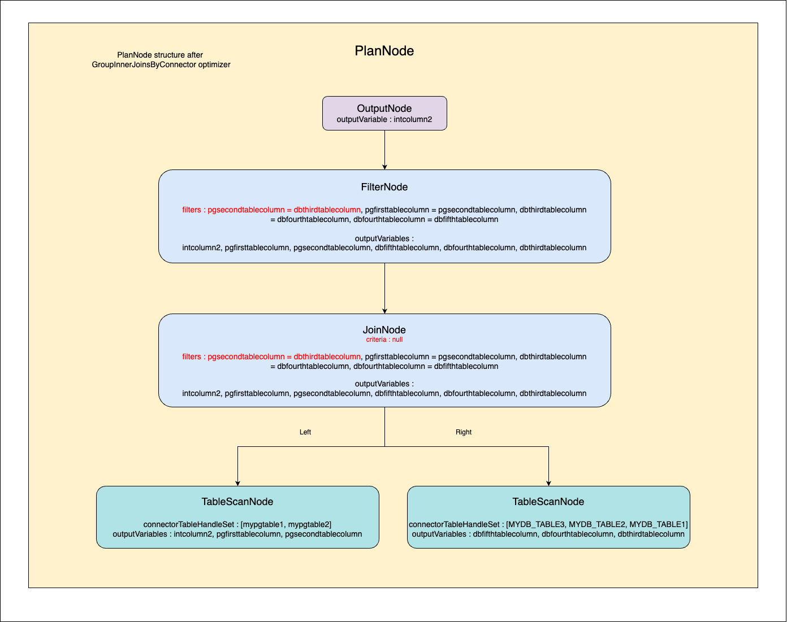
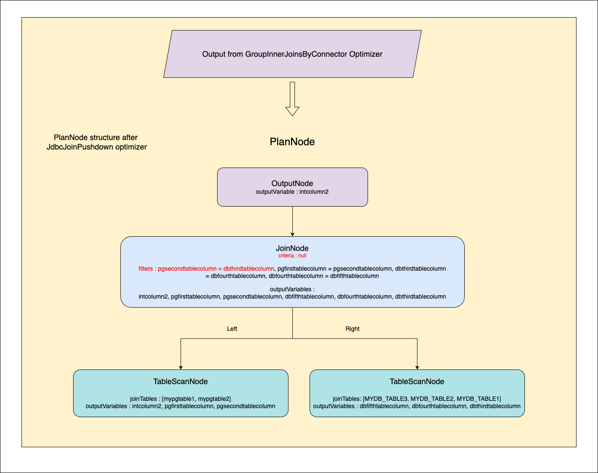
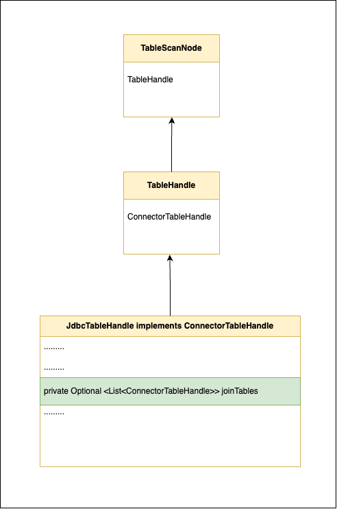
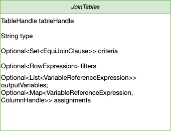
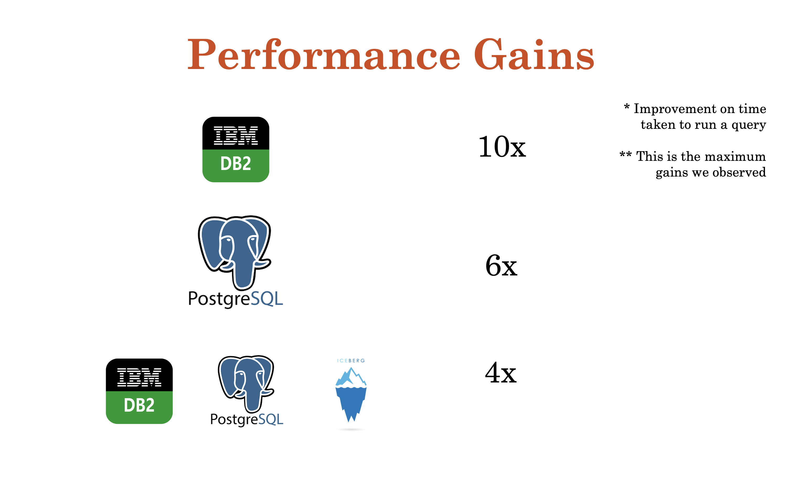
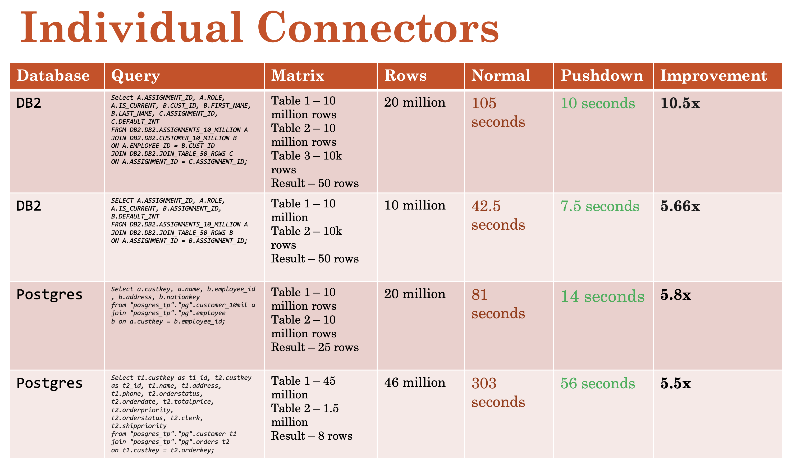
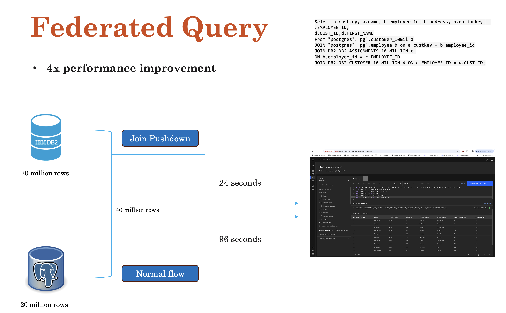
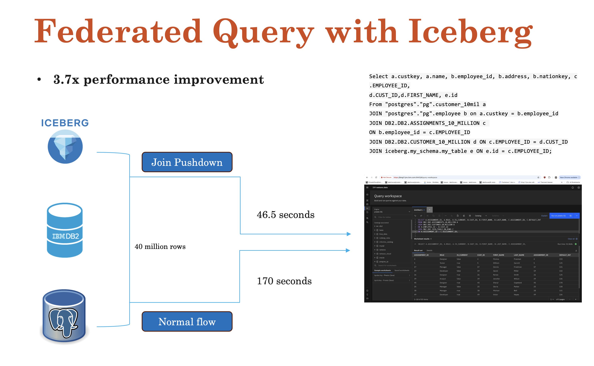

# **RFC0009-jdbc-join-push-down for Presto**

## Jdbc join push down in presto

Proposers

* Ajas M M
* Haritha K
* Thanzeel Hassan
* Glerin Pinhero


## Related Issues

https://github.com/prestodb/presto/issues/23152

## Summary

At present, when a query joins multiple tables, it creates a separate TableScanNode for each table. Each TableScanNode select all the records from that table. The join operation is then executed in-memory in Presto using a JOIN node by applying JoinCriteria, FilterPredicate and other criteria (like order by, limit, etc.).

However, if the query joins tables from the same JDBC datasource, it would be more efficient to let the datasource handle the join instead of creating a separate TableScanNode for each table and joining them in Presto. If we "Push down" or send these joins to remote JDBC datasource it increases the query performance. i.e., decreases the query execution time. We have seen improvements from 3x to 10x.

For example, for the below postgres join query if we push down the join to a single TableScanNode, then the Presto Plan and performance will be as follows :

**Join Query**

```
SELECT order_id,
       c_customer_id
FROM postgresql.public.orders o
    INNER JOIN postgresql.public.customer c ON c.c_customer_id = o.customer_id;
```


**Original presto plan**

```

 - Output[PlanNodeId 9][order_id, c_customer_id] => [order_id:integer, c_customer_id:char(16)]
    - RemoteStreamingExchange[PlanNodeId 266][GATHER] => [order_id:integer, c_customer_id:char(16)]
        - InnerJoin[PlanNodeId 4][("customer_id" = "c_customer_id")][$hashvalue, $hashvalue_11] => [order_id:integer, c_customer_id:char(16)]
                Distribution: PARTITIONED
            - RemoteStreamingExchange[PlanNodeId 264][REPARTITION][$hashvalue] => [customer_id:char(16), order_id:integer, $hashvalue:bigint]
                    Estimates: {source: CostBasedSourceInfo, rows: ? (?), cpu: ?, memory: 0.00, network: ?}
                - ScanProject[PlanNodeId 0,326][table = TableHandle {connectorId='postgresql', connectorHandle='postgresql:public.orders:null:public:orders', layout='Optional[{domains=ALL, additionalPredicate={}}]'}, projectLocality = LOCAL] => [customer_id:char(16), order_id:integer, $hashvalue_10:bigint]
                        Estimates: {source: CostBasedSourceInfo, rows: ? (?), cpu: ?, memory: 0.00, network: 0.00}/{source: CostBasedSourceInfo, rows: ? (?), cpu: ?, memory: 0.00, network: 0.00}
                        $hashvalue_10 := combine_hash(BIGINT'0', COALESCE($operator$hash_code(customer_id), BIGINT'0')) (1:45)
                        LAYOUT: {domains=ALL, additionalPredicate={}}
                        order_id := JdbcColumnHandle{connectorId=postgresql, columnName=order_id, jdbcTypeHandle=JdbcTypeHandle{jdbcType=4, jdbcTypeName=int4, columnSize=10, decimalDigits=0, arrayDimensions=null}, columnType=integer, nullable=true, comment=Optional.empty} (1:45)
                        customer_id := JdbcColumnHandle{connectorId=postgresql, columnName=customer_id, jdbcTypeHandle=JdbcTypeHandle{jdbcType=1, jdbcTypeName=bpchar, columnSize=16, decimalDigits=0, arrayDimensions=null}, columnType=char(16), nullable=true, comment=Optional.empty} (1:45)
            - LocalExchange[PlanNodeId 297][HASH][$hashvalue_11] (c_customer_id) => [c_customer_id:char(16), $hashvalue_11:bigint]
                    Estimates: {source: CostBasedSourceInfo, rows: ? (?), cpu: ?, memory: 0.00, network: ?}
                - RemoteStreamingExchange[PlanNodeId 265][REPARTITION][$hashvalue_12] => [c_customer_id:char(16), $hashvalue_12:bigint]
                        Estimates: {source: CostBasedSourceInfo, rows: ? (?), cpu: ?, memory: 0.00, network: ?}
                    - ScanProject[PlanNodeId 1,327][table = TableHandle {connectorId='postgresql', connectorHandle='postgresql:public.customer:null:public:customer', layout='Optional[{domains=ALL, additionalPredicate={}}]'}, projectLocality = LOCAL] => [c_customer_id:char(16), $hashvalue_13:bigint]
                            Estimates: {source: CostBasedSourceInfo, rows: ? (?), cpu: ?, memory: 0.00, network: 0.00}/{source: CostBasedSourceInfo, rows: ? (?), cpu: ?, memory: 0.00, network: 0.00}
                            $hashvalue_13 := combine_hash(BIGINT'0', COALESCE($operator$hash_code(c_customer_id), BIGINT'0')) (2:12)
                            LAYOUT: {domains=ALL, additionalPredicate={}}
                            c_customer_id := JdbcColumnHandle{connectorId=postgresql, columnName=c_customer_id, jdbcTypeHandle=JdbcTypeHandle{jdbcType=1, jdbcTypeName=bpchar, columnSize=16, decimalDigits=0, arrayDimensions=null}, columnType=char(16), nullable=true, comment=Optional.empty} (2:12)

```

**Joinpushdown presto plan**

```
 - Output[PlanNodeId 9][order_id, c_customer_id] => [order_id:integer, c_customer_id:char(16)]
        Estimates: {source: CostBasedSourceInfo, rows: ? (?), cpu: ?, memory: 0.00, network: ?}
    - RemoteStreamingExchange[PlanNodeId 233][GATHER] => [order_id:integer, c_customer_id:char(16)]
            Estimates: {source: CostBasedSourceInfo, rows: ? (?), cpu: ?, memory: 0.00, network: ?}
        - TableScan[PlanNodeId 217][TableHandle {connectorId='postgresql', connectorHandle='postgresql:public.orders:null:public:orders', layout='Optional[{domains=ALL, additionalPredicate={}}]'}] => [order_id:integer, c_customer_id:char(16)]
                Estimates: {source: CostBasedSourceInfo, rows: ? (?), cpu: ?, memory: 0.00, network: 0.00}
                LAYOUT: {domains=ALL, additionalPredicate={}}
                order_id := JdbcColumnHandle{connectorId=postgresql, columnName=order_id, jdbcTypeHandle=JdbcTypeHandle{jdbcType=4, jdbcTypeName=int4, columnSize=10, decimalDigits=0, arrayDimensions=null}, columnType=integer, nullable=true, comment=Optional.empty} (1:45)
                c_customer_id := JdbcColumnHandle{connectorId=postgresql, columnName=c_customer_id, jdbcTypeHandle=JdbcTypeHandle{jdbcType=1, jdbcTypeName=bpchar, columnSize=16, decimalDigits=0, arrayDimensions=null}, columnType=char(16), nullable=true, comment=Optional.empty} (2:12)
``` 

**Original presto plan performance**


**Joinpushdown presto plan performance**

  

## Background

This implementation is to address a performance limitation of Presto federation of SQLs of JDBC connectors to remote data sources such as DB2, Postgres, Oracle etc. Currently, Presto support predicate pushdown (WHERE condition pushdown) to some extent in JDBC connectors, but it does not have any join pushdown capabilities. This causes high performance impact on join queries and it is raised by some of our clients.

## Proposed Implementation

At present, if presto get a join query (from the CLI or UI) which is trying to join tables either from same datasource or from different datasource, it is received as a string formatted sql query. Presto validates the syntax and converts it to Query (Statement) object using presto parser and analyzer. This Query object is converted to presto internal reference architecture called Plan, using its logical and physical optimizers. Finally, this plan is executed by the executor.

  

Basically the PlanNode or the Plan is a tree datastructure which represents the sql query. When a join Query is received in logical planning, presto creates a PlanNode with a JoinNode. JoinNode is a tree structure which can hold another node, left table, right table, join conditions, projections and filters related to that join query. If there are multiple tables to join then it create a join tree structure where the left side of the JoinNode will be another JoinNode which hold sub joins to resolve multiple tables. The logical PlanNode is created in such a way, where the first table (the first table in the from clause) is resolved first either from the left TableScanNode or from JoinNode hierarchy using left dept first algorithm, then its adjacent table (very next table) as right side.  So the order and position of the tables in the join query plays an important role to determine query pushdown. Below is the example of PlanNode that is created for the join query.

 

Currently while executing a JoinNode, presto creates separate TableScanNodes for each table that is participating in the join query. This TableScanNode info is used by the connector to create the select query for that table. On top of this select query result, presto apply join condition and other predicates to provide the final result.

 

In the proposed implementation, all tables from the join query are grouped based on the Jdbc connector (data source). A single TableScanNode is created for each jdbc connector by using the grouped table info, wherever it is possible. It ensures a single TableScanNode against a connector rather than against each table of a join query. 

**For example consider below join query**

``` 
select  *

from postgresql.pg.mypg_table1 t1

join postgresql.pg.mypg_table2 t2 on t1.pgfirsttablecolumn = t2.pgsecondtablecolumn

Join db2.db2.mydb2_table1 t3 on t3.dbthirdtablecolumn = t2.pgsecondtablecolumn

JOIN db2.db2.mydb2_table2 t4 ON t3.dbthirdtablecolumn = t4.dbfourthtablecolumn

JOIN db2.db2.mydb2_table3 t5 ON t4.dbfourthtablecolumn = t5.dbfifthtablecolumn
``` 

**Here we have five tables,** 

mypg_table1 and  mypg_table2 from postgresql connector

mydb2_table1, mydb2_table2 and mydb2_table3 from db2 connector


At present, presto creates five select statement (TableScanNodes) for this query as follows

| No | Node Description                     | SQL Query                                                         |
|----|--------------------------------------|-------------------------------------------------------------------|
| 1  | TableScanNode for mypg_table1        | `select t * from postgresql.pg.mypg_table1 t1`                    |
| 2  | TableScanNode for mypg_table2        | `select t * from postgresql.pg.mypg_table2 t2`                    |
| 3  | TableScanNode for mydb2_table1       | `select t * from db2.db2.mydb2_table1 t3`                         |
| 4  | TableScanNode for mydb2_table2       | `select t * from db2.db2.mydb2_table2 t4`                         |
| 5  | TableScanNode for mydb2_table3       | `select t * from db2.db2.mydb2_table3 t5`                         |


In our proposed implementation, we restrict select statement (TableScanNode) creation based on tables and instead create select statement (TableScanNode) against each connector by grouping the tables based on the connector

| No | Node Description                                  | SQL Query                                                                                                  |
|----|---------------------------------------------------|------------------------------------------------------------------------------------------------------------|
| 1  | TableScanNode [mypg_table1, mypg_table2] for PostgreSQL | `select * from postgresql.pg.mypg_table1 t1, postgresql.pg.mypg_table2 t2 where t1.pgfirsttablecolumn=t2.pgsecondtablecolumn` |
| 2  | TableScanNode [mydb2_table1, mydb2_table2, mydb2_table3] for DB2 | `select * from db2.db2.mydb2_table1 t3, db2.db2.mydb2_table2 t4, db2.db2.mydb2_table5 t5 where t3.dbthirdtablecolumn = t4.dbfourthtablecolumn and t4.dbfourthtablecolumn = t5.dbfifthtablecolumn` |


For performing this jdbc join pushdown,  we need to create two logical optimizers GroupInnerJoinsByConnector and JdbcJoinPushdown. 

GroupInnerJoinsByConnector optimizer is a PlanOptimizer which is responsible for flattening the JoinNode and adding the sundered nodes to a data structure called MultiJoinNode. 

GroupInnerJoinsByConnector optimizer will work on MultiJoinNode and will group TableScanNodes based on connector name if the connector supports join pushdown. This optimizer will create a single TableScanNode by using a new data structure called ConnectorTableHandleSet from the grouped TableScanNode. ConnectorTableHandleSet is a set of ConnectorTableHandles which is generated from grouped TableScanNode. This optimizer also creates a combined overall predicate and overall assignments for the ConnectorTableHandleSet and will add these to the newly created TableScanNode. This newly created TableScanNode structure will replace the source list of MultiJoinNode.
GroupInnerJoinsByConnector optimizer will then work on re-creating join node with updated MultiJoinNode structure. The low level design is available [here](https://github.com/Thanzeel-Hassan-IBM/rfcs/blob/main/RFC-0009-jdbc-join-push-down.md#1-groupinnerjoinsbyconnector-optimizer)

Sql Query : 
``` 
select t1.intcolumn2
from postgresql.pg.mypg_table1 t1
join postgresql.pg.mypg_table2 t2 on t1.pgfirsttablecolumn = t2.pgsecondtablecolumn
Join db2.db2.mydb2_table1 t3 on t3.dbthirdtablecolumn = t2.pgsecondtablecolumn
JOIN db2.db2.mydb2_table2 t4 ON t3.dbthirdtablecolumn = t4.dbfourthtablecolumn
JOIN db2.db2.mydb2_table3 t5 ON t4.dbfourthtablecolumn = t5.dbfifthtablecolumn
``` 


JdbcJoinPushdown optimizer is a ConnectorPlanOptimizer, specific to jdbc tables and it generate a single JdbcTableHandle from the grouped ConnectorTableHandle. The low level design is available [here](https://github.com/Thanzeel-Hassan-IBM/rfcs/blob/main/RFC-0009-jdbc-join-push-down.md#2-jdbcjoinpushdown-optimizer)

After GroupInnerJoinsByConnector optimizer and JdbcJoinPushdown optimizer, we will invoke existing Predicatepushdown optimizer. PredicatePushdown optimizer will pushdown the filter and join criteria to the re-created JoinNode using the overall predicate and overall assignment. 

After Predicatepushdown optimizer the flow will invoke existing JdbcComputePushdown optimizer and it will pushdown the overall join criteria to the additional predicates.

After all optimization the PlanNode will pass to the presto-base-jdbc module to create the final join query. The final join query is prepared at the connector level using the Querybuilder. It is explained in the low level design [here](https://github.com/Thanzeel-Hassan-IBM/rfcs/blob/main/RFC-0009-jdbc-join-push-down.md#4-create-join-query-in-querybuilder).

## Join query pushdown in presto Jdbc datasource

Presto validate Join operation (PlanNode) specifications to perform join pushdown. The specifics for the supported pushdown of table joins varies for each data source, and therefore for each connector. However, there are some generic conditions that must be met in order for a join to be pushed down in jdbc connector

**1. The Jdbc connector should be able to process the Join operation.**

Presto Jdbc connector will process almost every Join operation except presto functions and operators. 

When we use some aggregate, math operations or datatype conversion along with join query it is converted to presto functions and applied to Join operation. Any join query which creates intermediate presto functions, cannot be handled by the connector and hence will not be pushed down.


| No | Condition which create presto function                   | SQL Query                                    |
|----|-------------------------------------|-------------------------------------------------------------------|
| 1  | abs(int_clumn) = int_cilumn2        | `Select * from table a join table b on abs(a.col1) = b.col2;`                            
| 2  | int_sum_column = int_value1_column1 + int_value1_column2       | `Select * from table a join table b on a.col1 = b.col2 + b.col3;` 
| 3  | cast(varchar_20_column, varchar(100)) = varchar100_column       | `Select * from table a join table b on cast(a.varchar_20_column, varchar(100)) = b.varchar100_column;` 


**2. Join operation should be an INNER JOIN or a SELF JOIN.**

A SELF JOIN is when a table is joined with itself.

Note: Other optimizers in Presto may change the Join operation. We can call this as Inference. Sometimes presto will change a Pushdown capable Inner join to another Join operation incapable of pushdown (Eg: Infering to remove join condition/predicate in the plan). This will lead to pushdown capability being removed. And sometimes presto will change Join operation to a pushdown capable one. (Eg: Infering to create Inner join from Right/Left join)

Examples to explain presto change an inner join to another Join operation : 

Suppose we have a query like this: 

`Select * from table a join table b on a.col1 = b.col2 and a.col1 = 5;`

Presto will change this from an inner join to two different select statements like this: 

`Select * from table a where a.col1 = 5;`

`Select * from table b where b.col2 = 5;`

Then it does a cross join with these two results. We will not do pushdown in this case.

**3. Join criteria (joining column) should be of Datatypes and operators that support join pushdown.**

| No | DataType support join pushdown                   | Operations                                           |
|----|-------------------------------------|-------------------------------------------------------------------|
| 1  | TinyINT        | `=, <, >, <=, >=, !=, <>`                    |
| 2  | SmallINT       | `=, <, >, <=, >=, !=, <>`                    |   
| 3  | Integer        | `=, <, >, <=, >=, !=, <>`                    |
| 4  | BigINT         | `=, <, >, <=, >=, !=, <>`                    |
| 5  | Boolean        | `=, !=, <>`                                  |   
| 6  | Integer        | `=, <, >, <=, >=, !=, <>`                    |
| 7  | Real           | `=, <, >, <=, >=, !=, <>`                    |   
| 8  | Double         | `=, <, >, <=, >=, !=, <>`                    |
| 9  | Decimal        | `=, <, >, <=, >=, !=, <>`                    |
| 10 | Varchar        | `=, <, >, <=, >=, !=, <>`                    |
| 11 | Char           | `=, <, >, <=, >=, !=, <>`                    |


**4. All tables from same connector will be grouped based on above specifications and pushed down to underlying datasource.**

**5. Enable presto Join pushdown capabilities by setting the session flag optimizer_inner_join_pushdown_enabled = true.**

## Low level Design

As part of for performing JDBC Join pushdown, we need to introduce 2 new optimizers and then need to use the existing Predicate pushdown optimizer and JDBC Compute Pushdown Optimizer.

We are going to create a new optimizer (GroupInnerJoinsByConnector) which implements PlanOptimizer and another optimizer (JdbcJoinPushdown) which implements ConnectorPlanOptimizer.

After completing GroupInnerJoinsByConnector optimization, JdbcJoinPushdown Optimizer will be invoked. After that predicate pushdown optimizer is invoked to recreate join criteria from the filter node of the JoinNode.

Below is the overall process :
1. Run GroupInnerJoinsByConnector Optimizer (new)
2. Run JdbcJoinPushdown Optimizer (new)
3. Run Predicate Pushdown Optimizer (existing)
4. Run Jdbc compute Pushdown Optimizer (existing)
5. Optimizing is over, execution starts
6. From JdbcSplit the new values are passed to Query builder
7. Query Builder checks if pushdown is happening and builds join query accordingly.
8. The built join query is passed to BaseJdbcClient for execution.

### GroupInnerJoinsByConnector optimizer

GroupInnerJoinsByConnector Optimizer is implemented inside the presto-main module. This optimizer is used to group the tables (which are part of inner joins) in a query so that we can push down these grouped tables.

GroupInnerJoinsByConnector in brief : 
#### 1. Create a plan rewriter for GroupInnerJoinsByConnector by implementing SimplePlanRewriter
- The GroupInnerJoinsByConnector uses SimplePlanRewriter methods VisitJoin and VisitFilter to traverse through the nodes. The reason we need to traverse the JoinNode is that we need to identify whether the join query (that is created by presto before Pushdown Optimization is going to happen) is able to be processed by the datasource. For this we traverse all the nodes of the join node and [validate all the 5 points](https://github.com/Thanzeel-Hassan-IBM/rfcs/blob/main/RFC-0009-jdbc-join-push-down.md#join-query-pushdown-in-presto-jdbc-datasource)
#### 2. Flatten all TableScanNode, filter, outputVariables and assignment to a new data structure called MultiJoinNode
 Presto already has an existing data structure called multiJoinNode which is used to flatten Plan nodes into list of source nodes. We are using a similar approach to create multiJoinNode.
#### 3. Use MultiJoinNode to group Jdbc Tables based on connector name
- 3.1. We take each item of SourceList and check if it’s a connector which supports join push down. For this we have introduced a new capability in ConnectorCapabilities named "SUPPORTS_JOIN_PUSHDOWN”.
```
public enum ConnectorCapabilities
{
    NOT_NULL_COLUMN_CONSTRAINT,
    SUPPORTS_REWINDABLE_SPLIT_SOURCE,
    SUPPORTS_PAGE_SINK_COMMIT,
    SUPPORTS_JOIN_PUSHDOWN
}
```
- 3.2. In the getCapabilities() method of JdbcConnector class, we have added this new capability. So that all Jdbc connectors will get this join pushdown capability. 
```
@Override
public Set<ConnectorCapabilities> getCapabilities()
{
 return immutableEnumSet(NOT_NULL_COLUMN_CONSTRAINT, SUPPORTS_JOIN_PUSHDOWN);
}
```
- 3.3. Once it identifies the connector as pushdown supported, it creates a Map with key as connector name and value as a List of tables which are from the connector.
- 3.4. This ensures that no other connector is affected by this optimizer. Only connectors with Join pushdown capability will be pushed down.
#### 4. Grouping tables for creating join query - based on JDBC datasource capability [link](https://github.com/Thanzeel-Hassan-IBM/rfcs/blob/main/RFC-0009-jdbc-join-push-down.md#join-query-pushdown-in-presto-jdbc-datasource)
- 4.1. JoinTables (List of ConnectorTableHandle) creation happens from the Map which is created above. [Point number 3.3]
- 4.2. For each item in map, based on connector, we get a list of tables/nodes. Each node is then analysed for join pushdown capability and either added to JoinTables List or added back to rewrittenList (If it can not be pushed down).
#### 5. If we are able to create a JoinTables list, then we create a single table scan for that and then add to the rewrittenList.
- 5.1. If there are 4 tables in JoinTables list against Postgres, then we create a single table scan node with ConnectorHandleSet 
- 5.2. Inside the ConnectorHandleSet, these 4 tables will be there.
- 5.3. This rewrittenList is used to create another multiJoinNode (rewrittenMultiJoinNode).
#### 6. Create a joinNode for each sourceList
- Iterate over the rewrittenMultiJoinNode, for each sourceList, call createLeftDeepJoinTree() method. This creates a joinNode with all the nodes in the sourceList.
#### 7. Create a filterNode on top of this joinNode
- A new FilterNode is created with the combinedFilters of the multiJoinNode as the predicate. This is finally returned.
```
private PlanNode createLeftDeepJoinTree(MultiJoinNode multiJoinNode, PlanNodeIdAllocator idAllocator)
{
 PlanNode joinNode = createJoin(0, ImmutableList.copyOf(multiJoinNode.getSources()), idAllocator);
 RowExpression combinedFilters = and(multiJoinNode.getJoinFilter(), multiJoinNode.getFilter());
 return new FilterNode(Optional.empty(), idAllocator.getNextId(), joinNode, combinedFilters);
}
```

In-depth details of the GroupInnerJoinsByConnector optimizer :
#### 1. Create a plan rewriter for GroupInnerJoinsByConnector by implementing SimplePlanRewriter

In GroupInnerJoinsByConnector optimize method we need to invoke Rewriter to rewrite the plannode if it contains JoinNode. JoinNode rewrite is possible by overriding the visitJoin() method of SimplePlanRewriter.

In visitJoin() we should have method to validate JdbcJoinPushdown Conditions that is explained in the document. If the JoinNode satisfies the JdbcJoinPushdown Conditions we should pushdown the Join by creating a single table scan node for that Join. 

JoinPushdown should happen for InnerJoin. No other Joins like LEFT JOIN, RIGHT JOIN, OUTER JOIN, CROSS JOIN, etc should be pushed down.

Basic structure of GroupInnerJoinsByConnector optimizer is as follows :

``` 
public class GroupInnerJoinsByConnector
        implements PlanOptimizer
{

    public GroupInnerJoinsByConnector(Metadata metadata)
    {
        -----
    }

    @Override
    public PlanOptimizerResult optimize(PlanNode plan, Session session, TypeProvider types, VariableAllocator variableAllocator, PlanNodeIdAllocator idAllocator, WarningCollector warningCollector)
    {

    }
    private static class Rewriter
            extends SimplePlanRewriter<Void>
    {
        private final FunctionResolution functionResolution;
        private final DeterminismEvaluator determinismEvaluator;
        PlanNodeIdAllocator idAllocator;
        private final Logger logger;
        private final Metadata metadata;

        private Rewriter(FunctionResolution functionResolution, DeterminismEvaluator determinismEvaluator, PlanNodeIdAllocator idAllocator, Logger logger, Metadata metadata)
        {
            this.functionResolution = functionResolution;
            this.determinismEvaluator = determinismEvaluator;
            this.idAllocator = idAllocator;
            this.logger = logger;
            this.metadata = metadata;
        }
        @Override
        public PlanNode visitJoin(JoinNode node, RewriteContext<Void> context)
        {
            PlanNode source = getCombinedJoin(node, functionResolution, determinismEvaluator, metadata);
            return source;
        }
    }
    
}
```
#### 2. Flatten all TableScanNode, filter, outputVariables and assignment to a new data structure called MultiJoinNode

If a JoinNode satisfies all JdbcJoinPushdown requirement, then the very first step is to break the left deep tree structure of JoinNode and create a flattened structure called MultiJoinNode.

On visitJoin(), the core logic is started by flattening the JoinNode tables into a list. We also require to flatten all the predicates including Join predicate and filter predicate into a single filter list. We separate all the output variables and assignments against the connector and keep for further processing. This flatten result will keep in a data structure called MultiJoinNode.

```
class MultiJoinNode
{
    private final CanonicalJoinNode node;
    private final Assignments assignments;
    private final boolean isConnectorJoin;
}
```

```
public class CanonicalJoinNode
        extends PlanNode
{
    private final List<PlanNode> sources;
    private final JoinType type;
    private final Set<EquiJoinClause> criteria;
    private final Set<RowExpression> filters;
    private final List<VariableReferenceExpression> outputVariables;
}
```

Sample logic for flatten JoinNode is as follows.

```
private void flattenNode(PlanNode resolved)
{
    if (resolved instanceof FilterNode) {
        // We pull up all Filters to the top of the join graph, these will be pushed down again by predicate pushdown
        // We do this in hope of surfacing any TableScan nodes that can be combined
        FilterNode filterNode = (FilterNode) resolved;
        filters.add(filterNode.getPredicate());
        flattenNode(filterNode.getSource());
        return;
    }

    if (!(resolved instanceof JoinNode)) {
        //TODO optimize
        if (resolved instanceof ProjectNode) {
            // Certain ProjectNodes can be 'inlined' into the parent Jdbc TableScan, e.g a CAST expression
            // We will do this here while flattening the JoinNode if possible

            // For now, we log the fact that we saw a ProjectNode and if identity projection, will continue
            logger.info("Found ProjectNode [%s] above TableScan/Filter node %s", resolved, resolved.getSources());

            //Only identity projections can be handled.
            if (AssignmentUtils.isIdentity(((ProjectNode) resolved).getAssignments())) {
                flattenNode(((ProjectNode) resolved).getSource());
                return;
            }
        }
        sources.add(resolved);
        return;
    }

    JoinNode joinNode = (JoinNode) resolved;
    if (joinNode.getType() != INNER || !determinismEvaluator.isDeterministic(joinNode.getFilter().orElse(TRUE_CONSTANT))) {
        sources.add(resolved);
        return;
    }

    flattenNode(joinNode.getLeft());
    flattenNode(joinNode.getRight());
    joinNode.getCriteria().stream()
            .map(criteria -> toRowExpression(criteria, functionResolution))
            .forEach(joinCriteriaFilters::add);
    joinNode.getFilter().ifPresent(joinCriteriaFilters::add);
}
``` 

Here the sources contain all the tables (irrespective of connector) of that JoinNode, filters contain all the predicate of that JoinNode. Now we have completed the flattening of JoinNode.

#### 3. Use MultiJoinNode to group Jdbc Tables based on connector name 

At this point we have the MultiJoinNode data structure which holds all the tables, predicates, assignments and variables of the JoinNode hierarchy (presto PlanNode). 

Now we need to group the tables based on connector name. For this we will iterate the source list of MultiJoinNode and get TableScanNodes. If the ConnectorTableHandle of TableScanNodes is JdbcTableHandle then we put that TableScanNode in a map with key as its catalog name. So for the same catalog name we have a list of TableScanNode. If ConnectorTableHandle is not a JdbcTableHandle then we add that TableScanNode to rewrittenSources list without performing any grouping. 

```
Map<String, List<PlanNode>> sourcesByConnector = new HashMap<>();
Set<PlanNode> rewrittenSources = new LinkedHashSet<>();


for (PlanNode source : multiJoinNode.getSources()) {
    Optional<String> connectorId = getJdbcConnectorId(source);
    if (connectorId.isPresent()) {
        // This source can be combined with other 'sources' of the same connector to produce a single TableScanNode
        sourcesByConnector.computeIfAbsent(connectorId.get(), k -> new ArrayList<>());
        sourcesByConnector.get(connectorId.get()).add(source);
        // jdbcJoin = true;
    }
    else {
        rewrittenSources.add(source);
    }
}
```

Using the rewrittenSources we will create a new MultiJoinNode and that will be used for final presto Join creation. That means in further steps we will create a single TableScanNode for each group and add that single TableScanNode to rewrittenSources from the sourcesByConnector map.

In GroupInnerJoinsByConnector we have joinPushdownCombineSources() method for doing this. This creates a MultiJoinNode object rewrittenMultiJoinNode. That is then passed to 
createLeftDeepJoinTree to creates a joinNode and in turn creates a filterNode.

Thus we could create a group of tables against each catalog. Again every tables on the Jdbc catalog cannot pushed down and we should ensure there is at least one joining criteria against the grouped tables to avoid cross join at connector level. For example consider below query

```
Select *
from pg.table1 pg1
join pg.table2 pg2 on pg1.clmn1=pg2.clmn2
join db2.table3 t3 on pg1.clmn1=t3.clmn
join db2.table4 t4 on pg2.clmn1=t4.clmn
```
Now we group table1 and table2 based on catalog pg. The table3 and table4 group based on catalog db2. But here db2 catalog tables does not have a join criteria within the db2 catalog tables and all join criteria relay on another pg catalog. And so we should not pushdown db2 tables and need to revert back from the grouped list. For that we could build join relation for the grouped tables from the predicates and if there is no valid join relation that table would be send back to source list by removing it from the grouping list.

#### 4. Build join relation for the grouped tables from all the join predicates

The MultiJoinNode already flattened the join criteria  and created the overall join predicate list called joinFilter. We are able to re-create the equality and inequality inference for joinFilter using existing presto EqualityInference methods.

The approach is that we could recreate the overall join ‘on clause’ against the grouped table and check which all grouped tables are participated on that join clause. If there is any table which is not participating on any one of the join clause then we could remove it from the grouped list and add it to rewrittenSources. Once you identify the tables related to join ‘on clause’ then we should pass the join ‘on clause’  to connector level for executing it. So it could be understood by the connector. That means we should remove tables from the group list which ‘on clause’ cannot process by the underlying connector and will add to rewrittenSources.

Summarizing the activities as two :

Recreate join ‘on criteria’ aginst grouped table and remove tables which are not participated on ‘on criteria’

Remove tables from groups if the tables ‘on criteria’ is not able to be processed by the connector.

##### 4.1. Recreate join criteria for grouped tables

 We could generate filterEqualityInference and inequalityPredicates from the overall Join filters using existing presto methods.

below is the sample code for that.

```
EqualityInference filterEqualityInference = new EqualityInference.Builder(metadata)
        .addEqualityInference(multiJoinNode.getJoinFilter())
        .build();
Iterable<RowExpression> inequalityPredicates = filter(extractConjuncts(multiJoinNode.getJoinFilter()), isInequalityInferenceCandidate(metadata));
```

Then we need to recreate join predicate from the grouped table output as follows
```
List<RowExpression> equiJoinFilters = filterEqualityInference.generateEqualitiesPartitionedBy(combinedOutputVariables::contains)
                    .getScopeEqualities();
Set<RowExpression> inequalityPredicateSet = StreamSupport.stream(inequalityPredicates.spliterator(), false)
        .collect(Collectors.toSet());
List<RowExpression> scopedInequalities = getExpressionsWithinVariableScope(inequalityPredicateSet, combinedOutputVariables);
```

Now we have list of equiJoinFilters and inequalityPredicateSet. Then we need to remove tables which are not part of these predicates and part of the predicate which cannot be executed by the connector.

##### 4.2. Remove tables from groups if the tables ‘on criteria’ is not able to be processed by the connector.

After creating list of equality and inequality filters we are able to translate this predicate to JdbcExpression using existing JdbcFilterToSqlTranslator. Sample code is available on JdbcComputePushdown optimizer visitFilter(). Code snippet  from JdbcComputePushdown optimizer visitFilter() is as follows. We can reuse the code in JdbcTableHandle to check whether there is any JdbcExpression created or not. 

```
RowExpression predicate = expressionOptimizer.optimize(node.getPredicate(), OPTIMIZED, session);
predicate = logicalRowExpressions.convertToConjunctiveNormalForm(predicate);

JdbcTableHandle tableHandle = (JdbcTableHandle) oldTableScanNode.getTable().getConnectorHandle();
RowExpressionTranslator translator = tableHandle.hasJoinTables() ? jdbcJoinPredicateToSqlTranslator : jdbcFilterToSqlTranslator;
TranslatedExpression<JdbcExpression> jdbcExpression = translateWith(
        predicate,
        translator,
        oldTableScanNode.getAssignments());
Optional<JdbcExpression> translated = jdbcExpression.getTranslated();
```

Now we can remove all the tables from the group which have no join criteria and having join criteria which are not able to pushdown. The removed tables will be added in the rewrittenSources as explained on step5

#### 5. Recreate left deep join node from the MultiJoinNode source list
Now we have rewrittenSources list which contains new single TableScanNode (for grouped tables) and other normal TableScanNode which are not able to group. Using the rewrittenSources list we recreate MultiJoinNode. Using MultiJoinNode we are able to recreate LeftDeepJoinTree by following ReorderJoins Rule. Sample code is as follows :

```
private static PlanNode createJoin(int index, List<PlanNode> sources, PlanNodeIdAllocator idAllocator)
{
    if (index == sources.size() - 1) {
        return sources.get(index);
    }

    PlanNode leftNode = createJoin(index + 1, sources, idAllocator);
    PlanNode rightNode = sources.get(index);
    return new JoinNode(
            Optional.empty(),
            idAllocator.getNextId(),
            JoinType.INNER,
            leftNode,
            rightNode,
            ImmutableList.of(),
            ImmutableList.<VariableReferenceExpression>builder()
                    .addAll(leftNode.getOutputVariables())
                    .addAll(rightNode.getOutputVariables())
                    .build(),
            Optional.empty(),
            Optional.empty(),
            Optional.empty(),
            Optional.empty(),
            ImmutableMap.of());
}
```

#### 6. Build overall filter for the newly created join node
While we create MultiJoinNode we separated all the FilterNodes by getting its predicate and adding the predicate to a set called filters. Again we flatten the join criteria against each join node and create a row expression called joinFilter. This is needed to create an overall predicate list. Using the overall predicate list we need to create a FilterNode on top of recreated left deep JoinNode. 

```
PlanNode joinNode //Recreate left deep join node from the MultiJoinNode source list

RowExpression combinedFilters = and(multiJoinNode.getJoinFilter(), multiJoinNode.getFilter());
return new FilterNode(Optional.empty(), idAllocator.getNextId(), joinNode, combinedFilters);
```
This FilterNode will pushdown to JoinNodes as its join criteria in later stage by the existing optimizers called PredicatePushdown Optimizer.

### JdbcJoinPushdown optimizer

JoinPushdown Optimizer is implemented inside the presto-base-jdbc module. This optimizer is called after GroupInnerJoinsByConnector. 

How is it invoked ? 
- JdbcJoinPushdown Optimizer is added to the Logical Plan Optimizers Set of JdbcPlanOptimizerProvider.
- When this optimizer is called, it hits the optimize() method in the class. Inside that ConnectorPlanRewriter class calls it’s own override visitTableScan() method.

Inside the visitTableScan() :
- We check if connectorHanlde of tableHandle is an instance of ConnectorTableHandleSet
- If that is the case, make a new JdbcTableHandle with joinTables as the tableHandles.getConnectorTableHandles()
- If not, return the node.



In JdbcJoinPushdown we override visitTableScan() from ConnectorPlanOptimizer to create a new newTableHandle and new TableScanNode with the combined details in JDBC level. 

#### 2.1. Create Single TableScanNode for grouped tables and add as MultiJoinNode source list

Create a TableScanNode structure which is able to hold all the jdbc table which is grouped as part of above implementation. Below is the proposed structure for the new TableScanNode





Here we are able to iterate through grouped list against a connector and able to create JoinTables for each TableScanNode. Using this list of JoinTables we are creating a single TableScanNode for that connector. This Single table scan node is added to the rewrittenSources list to create MultiJoinNode source. 

### Changes required in JdbcSplit

We have added a new feild called joinTables in JdbcSplit.java

```
private final Optional<List<ConnectorTableHandle>> joinTables;
```

This means we will also require some changes in buildSql() and getSplits() of BaseJdbcClientj.java to pass the new feild to QueryBuilder.java

### Create Join Query in QueryBuilder

At present we are focusing on common operators =, <, >, <=, >= and !=  with common datatype like int, bigint, float, real, string, varchar, char. So there is no connector level implementation required and focusing on single implementation for all supported Jdbc connector through QueryBuilder class.

Now we have new TableScanNode with list of joinTables. The split manager works on JdbcSplit and provide objects for processing on connector level. We need to modify the logic to transfer the new object (Optional<List<ConnectorTableHandle>> joinPushdownTables) too, to the connector level. Currently, for the Join query, the split is transfer to buildSql() to create the select statement. If the split contains ‘joinTables’ details then we need to transfer this ‘joinTables’ details to the new method called ‘buildJoinSql()’ where we need to create and return join query instead of select query.

On buildJoinSql(), we need to handle columns to be selected, the tables from which to query, the join condition and filter conditions if any.

#### 1. Handling Select columns

The select column needs to resolve from the above input argument List<JdbcColumnHandle> columns

#### 2. Handling From tables.

The parameter  ‘List<ConnectorTableHandle> joinTables’ that received on buildJoinSql() contains the tables in an order to join.  We could use this list of tables as from tables

#### 3. Handling JoinType

We need not consider the JoinType, but we need to write the join query in the form of where clause. 

#### 4. Handling Join criteria

The Join criteria is also available in Optional<JdbcExpression> additionalPredicate.

#### 5. Resolving Assignment

The select column name and join criteria may be available as an expression and so each column (expression) we need to resolve from exact table assignement. Against each  JoinTables we have assignments object and we need to extract the actual table name and column name from this assignment for each select and criteria column.

#### 6. Handling Filter

There is no change expected but we may need to handle the assignment and alias.

### Session flag

#### 1. Enable JdbcJoinPushdown at session level 

We have a new session flag 'optimizer.inner-join-pushdown-enabled'. This flag should be configured in presto-main config.properties with default value as false.
eg:
```
optimizer.inner-join-pushdown-enabled = true
```
It can be set from user session to override the above config.
eg:
```
SET SESSION optimizer_inner_join_pushdown_enabled = true
```
If we do not set this flag or set it to false (SET SESSION optimizer_inner_join_pushdown_enabled = false’) then Join Pushdown will not happen. 

#### 2. Load GroupInnerJoinsByConnector optimizer based on session flag

GroupInnerJoinsByConnector optimizer will be loaded based on session flag 'optimizer.inner-join-pushdown-enabled'. 

If the flag is set ('optimizer-inner-join-pushdown-enabled=true'), then while starting presto GroupInnerJoinsByConnector optimizer will be added to PlanOptimizers list. If it is not set ('optimizer-inner-join-pushdown-enabled=false' or the flag is not set) the GroupInnerJoinsByConnector optimizer itself will not load to the application to perform JoinPushdown operation.

### Predicate Pushdown

#### 1. Pushdown the overall filter to the newly created TableScanNode.
After creating Single TableScanNode for grouped tables (refer point 7) we need to pushdown the FilterNode on connector level for the applicable filter and maintain the FilterNode for presto if it is not able to pushdown. For this there is no code change required.

## [Optional] Metrics

How can we measure the impact of this feature?

We can see the impact in the performance improvement in Inner Join Queries involving JDBC connectors.
We can also see the change in the Plan that is created by Presto. This can be observed by executing EXPLAIN or EXPLAIN ANALYZE queries.

## [Optional] Other Approaches Considered

Based on the discussion, this may need to be updated with feedback from reviewers.

## Adoption Plan

- What impact (if any) will there be on existing users? Are there any new session parameters, configurations, SPI updates, client API updates, or SQL grammar?
There will be a new session parameter. Users will need to set it to True if they queries to be pushed down to JDBC connectors.

- If we are changing behaviour how will we phase out the older behaviour?
Not Applicable

- If we need special migration tools, describe them here.
Not Applicable

- When will we remove the existing behaviour, if applicable.
Not Applicable

- How should this feature be taught to new and existing users? Basically mention if documentation changes/new blog are needed?
Yes, documentation changes will be required. 

- What related issues do you consider out of scope for this RFC that could be addressed in the future independently of the solution that comes out of this RFC?
1. Push down all kinds of Joins
2. Some queries may become slower due to this change, if the session flag is set to true.

## Test Plan

Added 3 new test classes - TestJdbcJoinPushdown, TestJdbcQueryBuilderJoinPushdown, TestJdbcQueryBuilderJoinPushdownExtended
Added 1 new class TestJoinQueriesWithPushDown which extends AbstractTestJoinQueries. 
Total 221 new test cases - all are passing

All the test cases in AbstractTestJoinQueries are passing with the join pushdown flag enabled. This gives us a lot of confidence on the correctness of the implementation.

We have done a POC on the implementation and we were able to see following performance improvements : 








