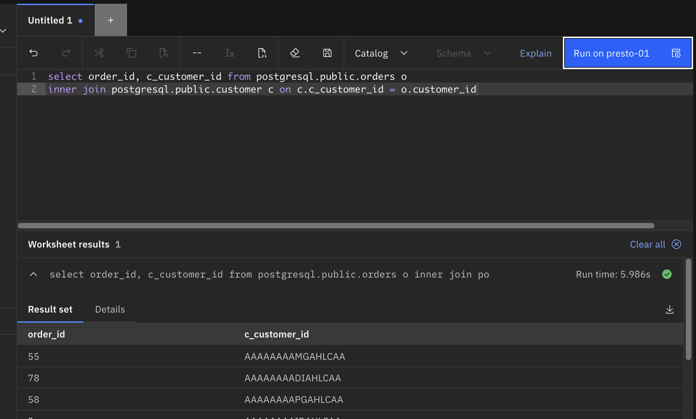
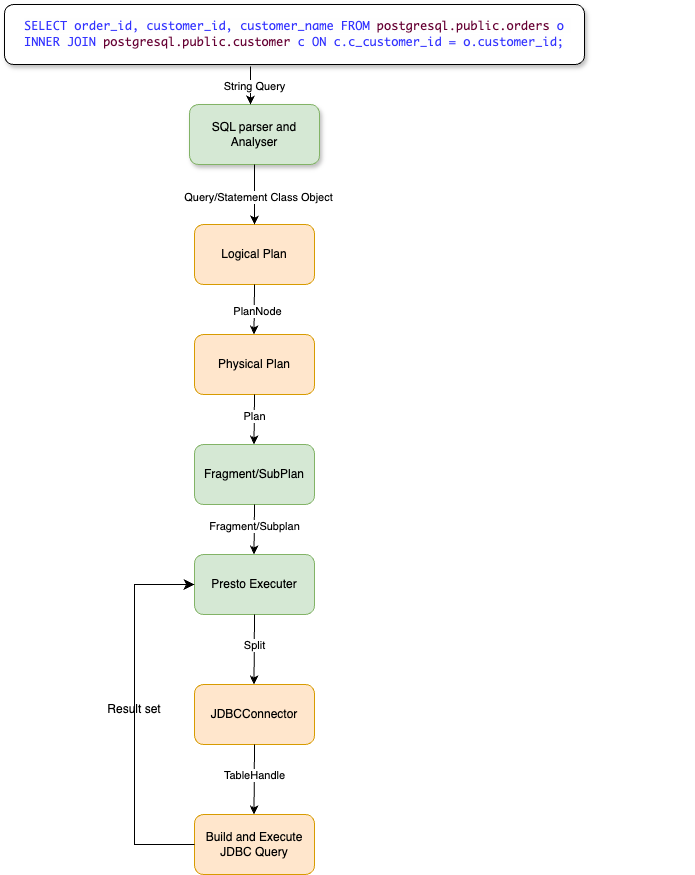
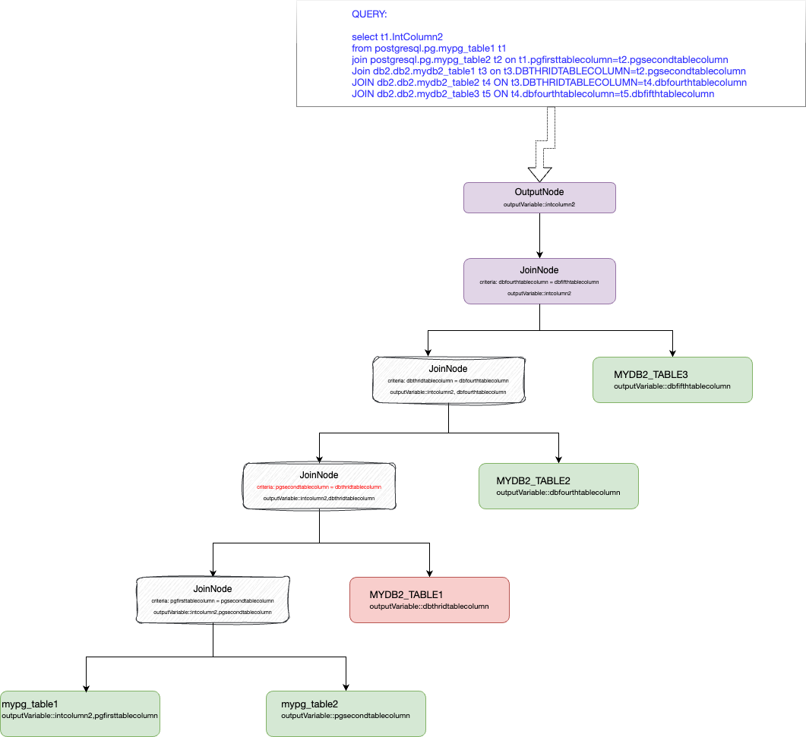
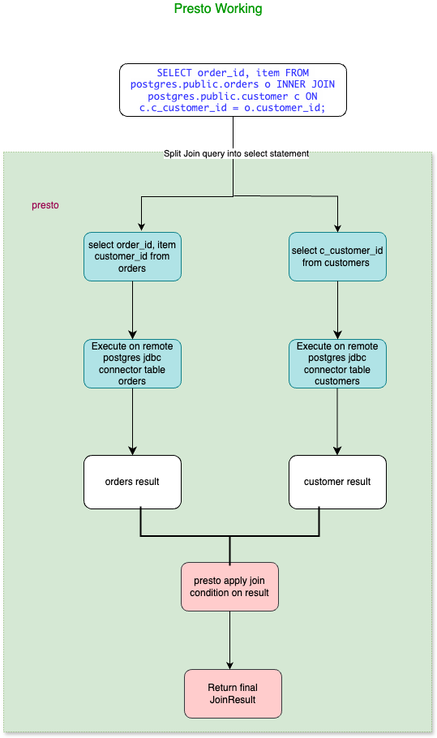
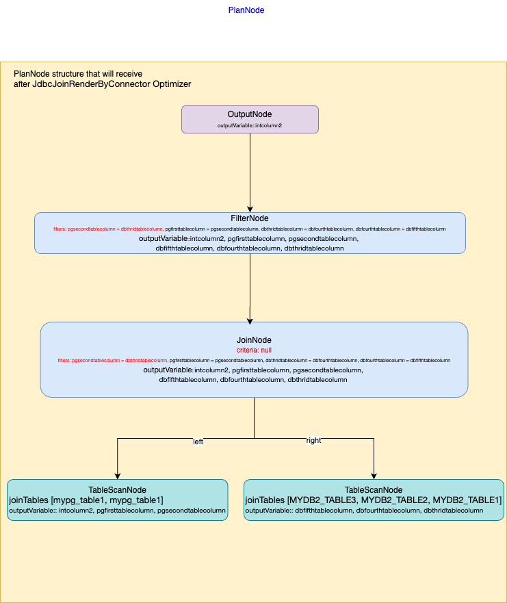

# **RFC0009-jdbc-join-push-down for Presto**

See [CONTRIBUTING.md](CONTRIBUTING.md) for instructions on creating your RFC and the process surrounding it.

## Jdbc join pushdown in presto

Proposers

* Ajas M M
* Haritha K
* Thanzeel Hassan
* Glerin Pinhero


## Related Issues

https://github.com/prestodb/presto/issues/23152

## Summary

At present, when a query joins multiple tables, it creates a separate TableScanNode for each table. Each TableScanNode select all the records from that table. The join operation is then executed in-memory in Presto using a JOIN node by applying JoinCriteria, FilterPredicate and other criteria (like sort, limit, etc.).

However, if the query joins tables from the same JDBC datasource, it would be more efficient to let the datasource handle the join instead of creating a separate TableScanNode for each table and joining them in Presto. If we "Push down" or send these joins to remote JDBC datasource it increases the performance 3x to 10x.

For example, for the below postgres join query if we push down the join to a single TableScanNode, then the Presto Plan and performance will be as follows.

**Join Query**

```
SELECT order_id,
       c_customer_id
FROM postgresql.public.orders o
    INNER JOIN postgresql.public.customer c ON c.c_customer_id = o.customer_id;
```


**Original presto plan**

```

 - Output[PlanNodeId 9][order_id, c_customer_id] => [order_id:integer, c_customer_id:char(16)]
    - RemoteStreamingExchange[PlanNodeId 266][GATHER] => [order_id:integer, c_customer_id:char(16)]
        - InnerJoin[PlanNodeId 4][("customer_id" = "c_customer_id")][$hashvalue, $hashvalue_11] => [order_id:integer, c_customer_id:char(16)]
                Distribution: PARTITIONED
            - RemoteStreamingExchange[PlanNodeId 264][REPARTITION][$hashvalue] => [customer_id:char(16), order_id:integer, $hashvalue:bigint]
                    Estimates: {source: CostBasedSourceInfo, rows: ? (?), cpu: ?, memory: 0.00, network: ?}
                - ScanProject[PlanNodeId 0,326][table = TableHandle {connectorId='postgresql', connectorHandle='postgresql:public.orders:null:public:orders', layout='Optional[{domains=ALL, additionalPredicate={}}]'}, projectLocality = LOCAL] => [customer_id:char(16), order_id:integer, $hashvalue_10:bigint]
                        Estimates: {source: CostBasedSourceInfo, rows: ? (?), cpu: ?, memory: 0.00, network: 0.00}/{source: CostBasedSourceInfo, rows: ? (?), cpu: ?, memory: 0.00, network: 0.00}
                        $hashvalue_10 := combine_hash(BIGINT'0', COALESCE($operator$hash_code(customer_id), BIGINT'0')) (1:45)
                        LAYOUT: {domains=ALL, additionalPredicate={}}
                        order_id := JdbcColumnHandle{connectorId=postgresql, columnName=order_id, jdbcTypeHandle=JdbcTypeHandle{jdbcType=4, jdbcTypeName=int4, columnSize=10, decimalDigits=0, arrayDimensions=null}, columnType=integer, nullable=true, comment=Optional.empty} (1:45)
                        customer_id := JdbcColumnHandle{connectorId=postgresql, columnName=customer_id, jdbcTypeHandle=JdbcTypeHandle{jdbcType=1, jdbcTypeName=bpchar, columnSize=16, decimalDigits=0, arrayDimensions=null}, columnType=char(16), nullable=true, comment=Optional.empty} (1:45)
            - LocalExchange[PlanNodeId 297][HASH][$hashvalue_11] (c_customer_id) => [c_customer_id:char(16), $hashvalue_11:bigint]
                    Estimates: {source: CostBasedSourceInfo, rows: ? (?), cpu: ?, memory: 0.00, network: ?}
                - RemoteStreamingExchange[PlanNodeId 265][REPARTITION][$hashvalue_12] => [c_customer_id:char(16), $hashvalue_12:bigint]
                        Estimates: {source: CostBasedSourceInfo, rows: ? (?), cpu: ?, memory: 0.00, network: ?}
                    - ScanProject[PlanNodeId 1,327][table = TableHandle {connectorId='postgresql', connectorHandle='postgresql:public.customer:null:public:customer', layout='Optional[{domains=ALL, additionalPredicate={}}]'}, projectLocality = LOCAL] => [c_customer_id:char(16), $hashvalue_13:bigint]
                            Estimates: {source: CostBasedSourceInfo, rows: ? (?), cpu: ?, memory: 0.00, network: 0.00}/{source: CostBasedSourceInfo, rows: ? (?), cpu: ?, memory: 0.00, network: 0.00}
                            $hashvalue_13 := combine_hash(BIGINT'0', COALESCE($operator$hash_code(c_customer_id), BIGINT'0')) (2:12)
                            LAYOUT: {domains=ALL, additionalPredicate={}}
                            c_customer_id := JdbcColumnHandle{connectorId=postgresql, columnName=c_customer_id, jdbcTypeHandle=JdbcTypeHandle{jdbcType=1, jdbcTypeName=bpchar, columnSize=16, decimalDigits=0, arrayDimensions=null}, columnType=char(16), nullable=true, comment=Optional.empty} (2:12)

```

**Joinpushdown presto plan**

```
 - Output[PlanNodeId 9][order_id, c_customer_id] => [order_id:integer, c_customer_id:char(16)]
        Estimates: {source: CostBasedSourceInfo, rows: ? (?), cpu: ?, memory: 0.00, network: ?}
    - RemoteStreamingExchange[PlanNodeId 233][GATHER] => [order_id:integer, c_customer_id:char(16)]
            Estimates: {source: CostBasedSourceInfo, rows: ? (?), cpu: ?, memory: 0.00, network: ?}
        - TableScan[PlanNodeId 217][TableHandle {connectorId='postgresql', connectorHandle='postgresql:public.orders:null:public:orders', layout='Optional[{domains=ALL, additionalPredicate={}}]'}] => [order_id:integer, c_customer_id:char(16)]
                Estimates: {source: CostBasedSourceInfo, rows: ? (?), cpu: ?, memory: 0.00, network: 0.00}
                LAYOUT: {domains=ALL, additionalPredicate={}}
                order_id := JdbcColumnHandle{connectorId=postgresql, columnName=order_id, jdbcTypeHandle=JdbcTypeHandle{jdbcType=4, jdbcTypeName=int4, columnSize=10, decimalDigits=0, arrayDimensions=null}, columnType=integer, nullable=true, comment=Optional.empty} (1:45)
                c_customer_id := JdbcColumnHandle{connectorId=postgresql, columnName=c_customer_id, jdbcTypeHandle=JdbcTypeHandle{jdbcType=1, jdbcTypeName=bpchar, columnSize=16, decimalDigits=0, arrayDimensions=null}, columnType=char(16), nullable=true, comment=Optional.empty} (2:12)
``` 

**Original presto plan performance**


**Joinpushdown presto plan performance**

  


## Background

This implementation is to address a performance limitation of Presto federation of SQLs of JDBC connector to remote data sources such as DB2, Postgres, Oracle etc. Currently, Presto support predicate pushdown (WHERE condition pushdown) to some extent in JDBC connectors, but it does not have any join pushdown capabilities. This cause high performance impact on join queries and it is raised by some of our client. While comparing with competitors we also missing the Jdbc join pushdown capabilities.

We did a POC by changing the presto generated PlanNode to handle jdbc join push down and it increases the performance from 5x on postgres and  8x on db2 remote datasource. Now we need to perform its actual implementation 


## Proposed Implementation

At present, if presto get a join query (from the CLI or UI) which is trying to join tables either from same datasource or from different datasource, it is receiving as a string formatted sql query. Presto validate the syntax and convert it to Query (Statement) object using presto parser and analyzer. This Query object is converted to presto internal reference architecture called Plan, using its logical and physical optimizers. Finally, this plan is executed by the executor.

  

Basically the PlanNode or the Plan is a tree datastructure which represent the sql query. When a join Query received on logical planning, presto create a PlanNode with JoinNode. JoinNode is a tree structure which can hold another node, left tables, right tables, join conditions, projections and filters related to that join query. If there are multiple tables to join then it create a join tree structure where the left side of the JoinNode will be another JoinNode which hold sub joins to resolve multiple table.  The logical PlanNode is created in such a way, where the first table (which is the from clause table) is resolved first either from the left TableScanNode or from JoinNode hierarchy using left dept first algorithm, then its adjacent table (very next table) as right side.  So the order and position of the tables in the join query plays an important role to determine query pushdown. Below is the example of PlanNode that created for the join query.

  

Currently while executing a JoinNode, presto create separate TableScanNode for each table that participated on join query and this TableScanNode info is used by the connector to create the select query. On top of this select query result, presto apply join condition and other predicate to provide the final result.

 

In the proposed implementation, all tables from the join query are trying to group based on the Jdbc connector (data source) name. And create a single TableScanNode for each jdbc connector by using the grouped table info, whenever it is possible. It ensures a single TableScanNode against a connector rather than each table of a join query. 

**For example consider below join query**

``` 
select t  *

from postgresql.pg.mypg_table1 t1

join postgresql.pg.mypg_table2 t2 on t1.pgfirsttablecolumn=t2.pgsecondtablecolumn

Join db2.db2.mydb2_table1 t3 on t3.DBTHRIDTABLECOLUMN=t2.pgsecondtablecolumn

JOIN db2.db2.mydb2_table2 t4 ON t3.DBTHRIDTABLECOLUMN=t4.dbfourthtablecolumn

JOIN db2.db2.mydb2_table3 t5 ON t4.dbfourthtablecolumn=t5.dbfifthtablecolumn
``` 

**Here we have five tables,** 

mypg_table1 and  mypg_table12 from postgresql connector (data source)

mydb2_table1, mydb2_table2 and mydb2_table3 from db2 connector


At present, presto create five select statement (TableScanNode) for this query as follows

| No | Node Description                   | SQL Query                                                         |
|----|-------------------------------------|-------------------------------------------------------------------|
| 1  | TableScanNode for mypg_table1       | `select t * from postgresql.pg.mypg_table1 t1`                    |
| 2  | TableScanNode for mypg_table2       | `select t * from postgresql.pg.mypg_table2 t2`                    |
| 3  | TableScanNode for mypg_table1       | `select t * from db2.db2.mydb2_table1 t3`                         |
| 4  | TableScanNode for mypg_table1       | `select t * from db2.db2.mydb2_table2 t4`                         |
| 5  | TableScanNode for mypg_table1       | `select t * from db2.db2.mydb2_table3 t5`                         |


In our proposed implementation, we restrict select statement (TableScanNode) creation based on tables and trying to create select statement (TableScanNode) against each connector by grouping the tables based on the connector

| No | Node Description                                  | SQL Query                                                                                                  |
|----|---------------------------------------------------|------------------------------------------------------------------------------------------------------------|
| 1  | TableScanNode [mypg_table1, mypg_table2] for PostgreSQL | `select t * from postgresql.pg.mypg_table1 t1, postgresql.pg.mypg_table2 t2 where t1.pgfirsttablecolumn=t2.pgsecondtablecolumn` |
| 2  | TableScanNode [mypg_table1, mypg_table2, mypg_table3] for DB2 | `select t * from db2.db2.mydb2_table1 t3, db2.db2.mydb2_table2 t4, db2.db2.mydb2_table5 t5 where t3.DBTHRIDTABLECOLUMN=t4.dbfourthtablecolumn and t4.dbfourthtablecolumn=t5.dbfifthtablecolumn` |


For performing this jdbc join pushdown,  we need to create two logical optimiser  GroupInnerJoinsByConnector and JdbcJoinPushdown. 


GroupInnerJoinsByConnector optimizer is a PlanOptimizer which is responsible for flattering the JoinNode and adding the sunder nodes to a data structure called MultiJoinNode. 

GroupInnerJoinsByConnector optimizer will work on MultiJoinNode and will group TableScanNode based on connector name if the connector support join pushdown. This optimizer will create a single TableScanNode by using a new data structure called ConnectorTableHandleSet from the grouped TableScanNode. ConnectorTableHandleSet is a set of ConnectorTableHandle which is generated from grouped TableScanNode. This optimizer also create a combined overall predicate and overall assignments for the ConnectorTableHandleSet and will added to the newly created TableScanNode structure. This newly created TableScanNode structure will replace with the source list of MultiJoinNode.
GroupInnerJoinsByConnector optimizer then work for re-creating join node with updated MultiJoinNode structure. The low level design is available in the session <GroupInnerJoinsByConnector optimizer>

  

JdbcJoinPushdown optimizer is a ConnectorPlanOptimizer, specific to jdbc tables and it generate a single JdbcTableHandle from the grouped ConnectorTableHandle. The low level design is available in the session <JdbcJoinPushdown optimizer>


After GroupInnerJoinsByConnector optimizer and JdbcJoinPushdown optimizer, we will invoke existing Predicatepushdown optimizer. PredicatePushdown optimizer will pushdown the filter and join criteria to the re-created JoinNode using the overall predicate and overall assignment. 

[Predicatepushdown optimizer](RFC-0009-jdbc-join-push-down/after_predicate.png)

After Predicatepushdown optimizer the flow will invoke existing JdbcComputePushdown optimizer and it will pushdown the overall join criteria to the additional predicates.


After all optimization the PlanNode will pass to the Jdbc to create the final join query. The final join query is prepared at the connector level using the Querybulder. We will explain the specific implementation in the low level design session.


**Join query pushdown in presto Jdbc datasource**

Presto validate Join operation (PlanNode) spec to perform join pushdown. The specifics for the supported pushdown of table joins varies for each data source, and therefore for each connector. However, there are some generic conditions that must be met in order for a join to be pushed down in jdbc connector

1) Join operation should be able to process by the Jdbc connector.

Presto Jdbc connector could process almost every Join operation except presto   functions and operators. 

When we use some aggregate, math operation or datatype conversion along with join query it is converted to presto functions and apply to Join operation. For any join query which create intermediate presto function cannot  handle by the connector and hence not pushing down.


| No | Condition which create presto function                   | SQL Query                                                         |
|----|-------------------------------------|-------------------------------------------------------------------|
| 1  | abs(int_clumn) = int_cilumn2        | `<Add Query>`                    |
| 2  | int_sum_column = int_value1_column1+int_value1_column2       | `<Add query>` 
| 3  | cast(varchar_20_column, varchar(100) )= varchar100_column       | `<Add query>` 


2) Join operation should be an inner join and should have at least one column to join with another table.

Note: Presto inferencing sometime remove Join operation pushdown capability specifics (Eg: Inferencing to remove join condition) and sometime provide Join operation pushdown specifics capability (Eg: Inferencing to create inner join from Right/left join)

3) Join criteria (joining column) should create using Datatype and operators that support join pushdown. 

| No | DataType support join pushdown                   | Operations                                                         |
|----|-------------------------------------|-------------------------------------------------------------------|
| 1  | <datatype>        | `=, <, >, <=, >=, !=, <>`                    |
| 2  | <datatype2>       | `=, <, >, <=, >=, !=, <>`  
| 3  | <datatype3>       | `=, <, >, <=, >=, !=, <>` 


4) All tables from same connector will group based on above specifications and pushed down to underlying datasource. 

5) Enable presto Join pushdown capabilities by setting the global flag enable-join-query-pushdown=true in custom-config.properties

Note: This flag is a tech preview specific and default value is enable-join-query-pushdown=false. For enable Join pushdown capabilities we need to update enable-join-query-pushdown=true through backend and then do a presto server restart. After enabling the flag, you are able to pushdown equi-join and non equi-join queries. 

In future release we will remove this global flag and bring as session properties to enable pushdown. If you enable that session properties it will pushdown equi-join queries. To enable non equi-join pushdown you need to enable another session flag  and will confirm on later stage.

## Low level Design


## [Optional] Metrics

How can we measure the impact of this feature?

## [Optional] Other Approaches Considered

Based on the discussion, this may need to be updated with feedback from reviewers.

## Adoption Plan

- What impact (if any) will there be on existing users? Are there any new session parameters, configurations, SPI updates, client API updates, or SQL grammar?
- If we are changing behaviour how will we phase out the older behaviour?
- If we need special migration tools, describe them here.
- When will we remove the existing behaviour, if applicable.
- How should this feature be taught to new and existing users? Basically mention if documentation changes/new blog are needed?
- What related issues do you consider out of scope for this RFC that could be addressed in the future independently of the solution that comes out of this RFC?

## Test Plan

How do we ensure the feature works as expected? Mention if any functional tests/integration tests are needed. Special mention for product-test changes. If any PoC has been done already, please mention the relevant test results here that you think will bolster your case of getting this RFC approved.
