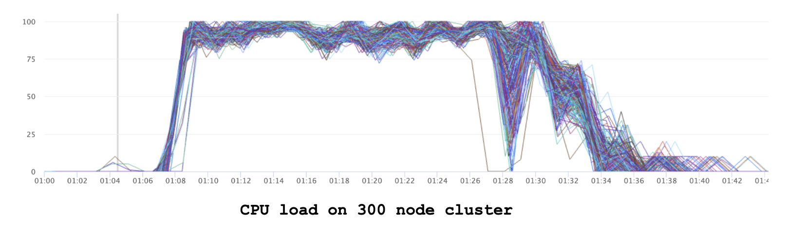
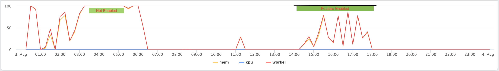

## Coordinator throttling mechanism

Proposers

* Prashant Golash (@PRASHANT GOLASH)


## Summary

Implement a mechanism to prevent queries from being admitted when a cluster is experiencing overload. 
A cluster is considered overloaded based on aggregated metrics reported by its underlying worker nodes. 

These metrics can include CPU utilization, memory usage, and task queue lengths. By analyzing this aggregated information, the system can make informed decisions about the cluster’s current load status.
The exact criteria used to determine overload are governed by customizable and extensible policies. For example, a policy might specify that a cluster is overloaded if a certain percentage or number of worker nodes reach critical resource thresholds (“run hot”).
In our case, most of the workers get overloaded within a matter of few minutes.

A sample graph of clusters running hot. All the workers are running hot in this case.



The impact is:

- Large variance in execution time
- Memory kills / Overload on dependency services like metastore / warm-storage etc 

This provide more reasons to work on protecting cluster overload.

## Background

While not exhaustive, current throttling/possible mechanisms relevant for this discussion

#### Granular task based scheduling

**Leaf Task scheduling**

The node selection logic in Presto involves randomly selecting 10 nodes from those that do not currently have scheduled splits for the given query. Among these 10 nodes, the system then chooses the node that is the least busy. For reference, the relevant code implementation can be found [here](https://github.com/prestodb/presto/blob/master/presto-main-base/src/main/java/com/facebook/presto/execution/scheduler/nodeSelection/SimpleNodeSelector.java#L182).
Additionally, in the process of leaf task scheduling, a feedback mechanism is employed whereby splits are assigned to the nodes deemed least busy. It is important to note that in this context, "busyness" is defined by the number of splits being processed by a node, rather than its actual system load. 

While this approach is generally effective for distributing work, it may not always result in the most optimal allocation of resources.

**Intermediate task scheduling**

For intermediate task scheduling in Presto, the selection of workers is based on a hash partition count. Specifically, intermediate tasks are assigned to worker nodes according to the hash of the partition, which determines the distribution across available intermediate workers. The relevant code implementation can be found [here](https://github.com/prestodb/presto/blob/master/presto-main-base/src/main/java/com/facebook/presto/sql/planner/SystemPartitioningHandle.java#L164).
This strategy does not consider the current system load when assigning intermediate tasks. 

While we could improve task scheduling (pro-active measure to not let worker overload) through load balancing (more on this in alternative approaches), this alone would be insufficient given the nature of our overload scenario where all workers are saturated in short period of time which is due to admitting lot of heavy queries in short duration of time.

#### Resource Group throttling
There are certain utilization metrics, such as softMemoryLimit, that exist at the Resource Group (RG) level for admission control. We have conducted a detailed analysis and identified several non-trivial limitations.
Current Limitations
- CPU Throttling: CPU usage is not accurately considered for throttling. Currently, there is no runtime throttling for CPU; aggregation occurs only after the query completes. Additionally, the existing load balancing logic for CPU does not strictly account for real-time usage.
- Memory Attribution on Velox: Memory usage is not correctly accounted for or attributed. Unaccounted memory arises from libraries with their own allocators, including the HTTP layer (proxygen), warm storage libraries (or other readers), and system libraries that may copy data from the network into buffers that we subsequently read. Attributing this memory usage to specific tasks or queries is challenging.
- No enforcement: Even if we fix the accounting and improve admission control to run the cluster less loaded, there is no guarantee that RGs won't exceed their limits, potentially causing some workers to become overloaded since Presto lacks preemption support and queries can use more resources once admitted.

Addressing these issues requires non-trivial changes, but this could be a potential improvement to this RFC as documented in Approach-1

In this RFC, we propose a comprehensive admission control mechanism that enables reactive throttling of the overall workload by selectively admitting queries without entwining with any RG level changes.

### Goals
- Decrease duration of overload on the cluster
- Also decrease overall variance of execution time of queries (queuing is fine)

## Proposed Implementation
### Worker side changes
- Added endpoint to gather worker load (`/v1/info/stats`)
  - Include NodeState + worker load. Idea is to just call `/v1/info/stats` rather than `/v1/info/state` (eventually deprecate it). Worker load is already getting populated in [cpp workers](https://github.com/prestodb/presto/blob/master/presto-native-execution/presto_cpp/main/PrestoServer.cpp#L1537).
  - **Fields**
    - **nodeState** [Code link](https://github.com/prestodb/presto/blob/master/presto-spi/src/main/java/com/facebook/presto/spi/NodeState.java)  
    - **loadMetrics**
      - This will be an object comprising fields such as **cpuUsedPercent**, **memoryUsedInBytes**, and other raw metrics reported from the worker. The design is intended to be extensible for both the worker and the coordinator components:
        - On the **worker side**, users may add metrics that are most relevant to their specific cluster.
        - On the **coordinator side**, users have the flexibility to override the **NodeOverloadPolicy** interface to determine worker load criteria and enhance admission control.
      - **Note:** To support the version 1 use case of Meta, additional fields **cpuOverload** and **memoryOverload** will be included, representing overload information as determined by the worker namely cpu_overload, memory_overload.
  - **Sample response**
    - curl <worker_host>/v1/info/nodestate
      - Response: ```{"loadMetrics":{"cpuUsedPercent":0.76,"memoryUsedInBytes":12222340, "cpuOverload": true, "memoryOverload": false},"nodeState":"ACTIVE"}```

##### Deprecation Plan
- The `/v1/info/state` endpoint is currently only used inside DiscoveryManager. Since this will be replaced by the new endpoint `/v1/info/stats`, we will remove `/v1/info/state` from the worker side after this RFC/change is accepted.

### Coordinator side changes
#### Collecting worker load data
  - Update DiscoveryManager to invoke this end point rather than the `/v1/info/state`
  - Expose `getNodeLoadMetrics` on InternalNodeManager

#### Scheduling policies
  - **Node overload policies** that can govern the policies to determine cluster overload. Based on these policies and load collected from worker, improve the admission control logic globally to selectively admit the query based on query configs.
  - **Load Determination**
    - The coordinator will analyze the raw metrics to assess whether a worker is overloaded. Using configuration properties, it will then determine if the entire cluster is overloaded by aggregating the overload status of individual workers.
#### Query configs
  - We will also introduce query configurations to allow flexibility in admitting relatively lightweight queries. For example, even when the cluster is fully loaded, DDL queries should still be permitted to run.
    


## Metrics

- Cluster overload. Added few JMX metrics:
  - **ClusterOverloadState** (Binary state)
  - **OverloadDetectionCount** (Cumulative)
  - **OverloadDuration** (Total time elapsed since cluster is overloaded)

- Variance in runtime of queries
  - **Cluster Overload Patterns:** We have identified clusters experiencing consistent overload patterns that cause significant variation in query runtime performance.
  - **Measurement Strategy:** We will measure end-to-end execution time improvements after implementing query admission controls to reduce the overall query load using this feature.


## Other Approaches Considered

### Approach 1
Improve the resource group accounting to include metrics that actually cause overload and improve admission control
Current limitations
- CPU is not considered correctly for throttling
- Memory is not accounted correctly on Velox

Given the limitations, the work here would be to be report the metrics that actually matter and attribute as accurately as it could be
For e.g. for cpu, we may need to look for a proxy metrics like `numQueuedDrivers` etc.

- **Pros**
  - RG throttling code could be reused
  - More fair to throttle workloads which are actually overloading

- **Cons**
  - Needs significant work on worker side
  - Also need work on coordinator side
  - Need more analysis on key metrics
  - No enforcement: Even if we fix the accounting and improve admission control to run the cluster less loaded, there is no guarantee that RGs won't exceed their limits, potentially causing some workers to become overloaded since Presto lacks preemption support and queries can use more resources once admitted.


**Based on learnings of key metrics that matter, we could improve admission control and would be extension of this RFC**


### Approach 2
#### Improve Granular task scheduling
Not fully baked, but at high-level based on load, the coordinator can assign scores to the workers and selects the top N highest-scoring workers, then randomly chooses from this subset to schedule tasks or splits.

**Few Examples**:
- **Intermediate stage**: For 333 hash partitions, randomly select 333 workers from the top 500 scoring workers. (We run with 300 node clusters so this property needs to be tuned as well if we go with this approach.)
- **Leaf stage**: For leaf task, the logic in `chooseLeastBusyNode` could be augmented to pick workers with best score and out of these assign the splits.


- **Pros**
This could provide load balancing to begin with and prevent some workers getting hot

- **Cons**
In our cluster most of the workers become overloaded in a fraction of minutes due to a lot of queries getting admitted. 

Load balancing may not be immediately helpful in such cases
This could be a good direction for the future if we see only a select few workers are causing issues.

### Approach 3
Write a separate service which can consume worker load and update global RG (max queries that can run based on the load / policies)

- **Pros**
No coordinator changes

- **Cons**
Extra service to maintain
Two brains


## Adoption Plan
Enabling this feature can cause additional queuing when the cluster is overloaded (which would be separate from queuing due to Resource Groups).
We will add following metrics to know if this feature has caused queueing

- Overload throttling state in UI
- Separate Metrics for queuing due to cluster overload 


## Test Plan
**Unit test cases**
- Mocked the InternalNodeManager with different load factors. Mocked different overload policies and verified that the throttling works as intended 

**E2E Test**

- The graph below illustrates two scenarios
  - When queries continue to be admitted, the load stabilizes at a constant level.
  - When query admission is halted, the system load gradually decreases.

- In these experiments, the policy enforced was that no worker should be allowed to become overloaded.

Load Graph


