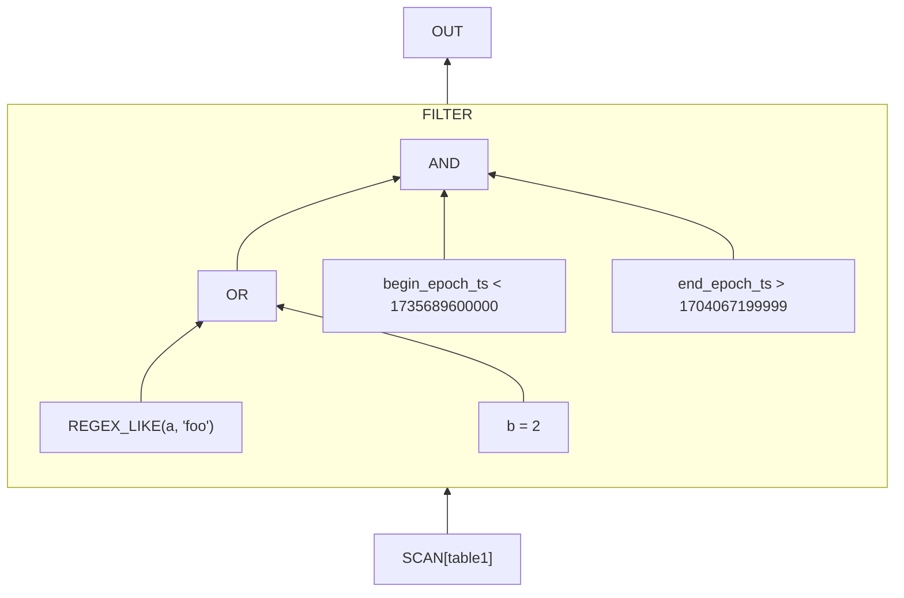
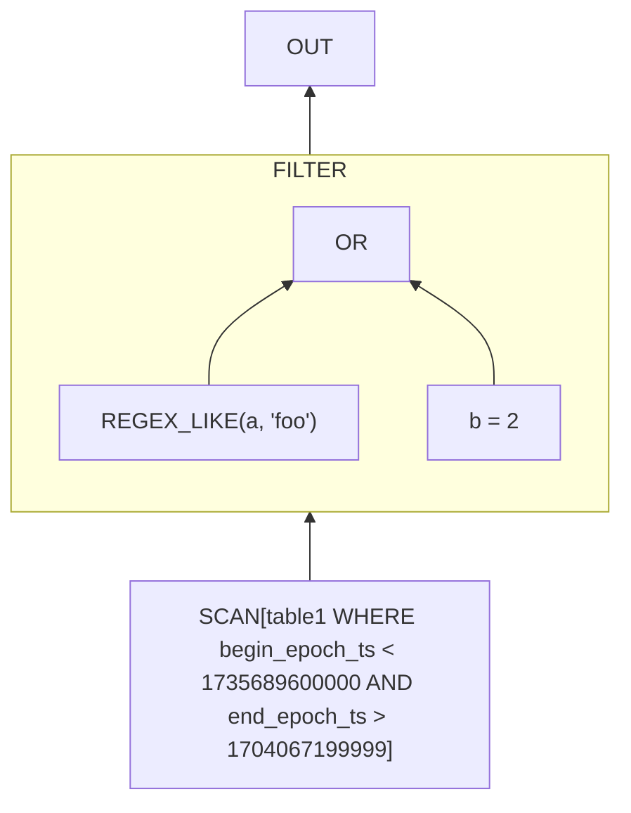

# **RFC0012 for Presto**

## CLP connector

Proposers

* Rui Wang ([@wraymo](https://github.com/wraymo)), YScope
* Devin Gibson ([@gibber9809](https://github.com/gibber9809)), YScope
* Xiaochong Wei ([@anlowee](https://github.com/anlowee)), YScope
* Yu(Jack) Luo ([@jackluo923](https://github.com/jackluo923)), YScope
* Kirk Rodrigues ([@kirkrodrigues](https://github.com/kirkrodrigues)), YScope

## Related Issues

* [y-scope/clp#78](https://github.com/y-scope/clp/issues/78)
* [yscope-clp Zulip chat](https://yscope-clp.zulipchat.com/#narrow/channel/364020-feature-requests/topic/Trino.20integration)

## Summary

We propose adding a connector and one or more UDFs to query specially-compressed schemaless log data directly through Presto and Prestissimo via a schema-oriented interface. Several users generate petabytes of log data per day and wish to store and query it efficiently. [CLP] is an open-source log management system that can significantly compress this log data and efficiently query it without full decompression. A Presto connector for CLP would allow Presto users to efficiently query their log data and correlate it with other data sources.

## Background

CLP is an open-source log management system that can significantly compress log data and efficiently query it without full decompression. Today's internet-scale companies (e.g., [eBay][ebay-logging], [Uber][clp-osdi24-paper], etc.) generate petabytes of log data per day, which is useful for a variety of tasks including debugging, security auditing, trend analysis, and so on. Log data here refers to a collection of log records, where each log record is a collection of key-value pairs (kv-pairs)--e.g., a JSON object. We define a record's schema as the set of key and value-type pairs in the record. Compared to other records, log records typically have dynamic schemas, wherein each record may have a different set of keys, and the value mapped to a particular key may change its type between records (i.e., values can have polymorphic types). As CLP's [research (OSDI) paper][clp-osdi24-paper] explains, storing these records in conventional log management or database systems is challenging due to the volume of data and the records' dynamic schemas. For instance, most databases (and formats like Parquet) require a stable schema, so they can only store such records using two sets of columns--a set of columns for key & value-type pairs that exist in all records, and a JSON column for all other key & value-type pairs. Since log records have dynamic schemas, the JSON column often results in high storage overhead and non-ideal query performance. Even log management tools like Elasticsearch incur high storage costs and can't handle values with polymorphic types, leading to significant [management overhead][uber-clickhouse-logging-blog]. In contrast, as shown in the research paper, CLP can store these records with minimal management overhead, it achieves significantly lower storage overhead, and it can efficiently query the compressed records.

Although log records have dynamic schemas, CLP still exposes a table-like interface to users. In a typical deployment, each service/application's logs are collected, aggregated, and then compressed into what CLP calls a dataset (akin to a relational database table). Users can then query log records in the dataset using a [flavor][clp-kql-docs] of the Kibana Query Language (KQL). A KQL query is a combination of conditions (predicates) where:

- each predicate filters for matching kv-pairs;
- keys are specified relative to the root of the record; and
- the values to filter for are primitives.

For example, consider the log records in Table 1 and the KQL query `(level: "INFO" OR level <= 3) AND attr.service: "*DonorService*"`. The query has three predicates joined by boolean operators. Notice how one of the predicates is for a nested kv-pair, `attr.service`, where the key is specified relative to the root of the record. Also notice that query filters for primitives values (as opposed to filtering for objects or arrays). This query would match records 1 & 3 in Table 1. Note that unlike a relational database table, CLP supports values with polymorphic types, so queries can include the same key with different value types (e.g., level in the example query).

| **#** | **Log Record**                                                      |
|-------|---------------------------------------------------------------------|
| 1     | `{"level": "INFO", "attr": {"service": "SharedSplitDonorService"}}` |
| 2     | `{"level": "DEBUG", "msg": "Ran initializers"}`                     |
| 3     | `{"level": 3, "attr": {"service": "TenantMigrationDonorService"}}`  |

**Table 1:** Example log records.

For each dataset, CLP stores the compressed log files in a series of archives and queries them using a typical scatter-gather execution model. Within each archive, CLP stores records using columnar storage, where each column corresponds to a particular key (relative to the root of the record) and primitive value-type pair. Each archive is independent, making it the ideal unit of parallelism for searches. Thus, when a user submits a query, CLP will distribute metadata about each archive (e.g., its path) and the query to the search workers. As a worker executes the query, it will send its results to some output. Since a dataset may have hundreds of thousands of archives, CLP also uses a database to store metadata about the records in each archive, and uses this metadata to narrow the set of archives to search (archive pruning) before distributing them to the search workers. For instance, the metadata store may contain the time range of the records in each archive. More details about CLP's design and implementation are available in the [research paper][clp-osdi24-paper].

Note that in practice, different users may have their own implementation of a CLP metadata database, with different granularities of metadata. For instance, one user may use MySQL with a table to store metadata about each archive--i.e., archive-level metadata--including the time range of records within each archive. Another user may use Pinot with a table to store metadata about each compressed log file--i.e., file-level metadata--including the time range of records within each file, and the archive that contains each file. The former implementation can only be used to prune irrelevant archives, but the latter, being more fine-grained, can also be used to perform filtering within the archive.

The main benefit of a CLP connector is to allow Presto users to query CLP-compressed schemaless log data and to correlate it with their other data sources through a schema-oriented interface. In addition, the proposed implementation would allow users to use Presto as the engine for querying CLP log data, eliminating the need to run a separate CLP search cluster. As the referenced issues demonstrate and from private discussions with users, we've seen significant interest for such a connector.

> [!NOTE]
>  For readers who are interested, CLP is an umbrella term that encompasses a subsystem for compressing structured logs (clp-json/clp-s) and another for compressing unstructured logs (clp-text/clp). This proposal is primarily concerned with the first subsystem, but in time, both subsystems will be merged into one.

# Proposed Implementation

We propose implementing a connector to query CLP archives through Presto and Prestissimo. At a high level, the connector should enable a query execution model where, instead of querying CLP as a separate service, Presto queries CLP's metadata and archives directly--the former in the Presto coordinator and the latter in Prestissimo workers. To achieve this, the connector mainly needs to implement the following categories of interfaces:

- **Table and column resolution:** These interfaces are necessary so that Presto can determine what tables (CLP datasets) exist, and what columns should be directly exposed in each table.
- **Query plan optimization:** These interfaces are necessary so that the connector can rewrite the logical query plan to push down any operations that CLP can handle when searching the data in each archive.
- **Splits retrieval:** These interfaces are necessary so that the connector can query CLP's metadata database to retrieve and return the splits (CLP archives) relevant to a particular query.
- **Table scanning and projection:** These interfaces are necessary so that Prestissimo can search each CLP archive and retrieve any query results for further processing.

Implementing a CLP connector has two unique aspects:

1. how to query records with *dynamic* schemas; and
2. how to leverage CLP's metadata for [splits retrieval](#splits-retrieval).

For the first aspect, consider that during column resolution, a connector typically needs to determine all columns that exist in a given table. For the CLP connector, if a CLP dataset has a constantly changing set of columns, enumerating all of them across all current archives can introduce scalability challenges. Instead, we propose a strategy where:

- during column resolution, the connector only returns a list of "stable" columns configured (manually or automatically) by the creator of the CLP dataset, where these columns typically correspond to columns that exist across most (if not all) records. Note that these columns cannot be polymorphic.
- users can query other columns using one or more UDFs, deferring resolution of these columns until each worker is searching an archive, thereby distributing the work. (Note that these UDFs will also be able to query the stable columns.)

When optimizing the query plan, the connector should replace instances of these UDFs with the corresponding columns that they reference. For the second unique aspect, recall that users can leverage CLP's metadata database to prune irrelevant archives. Thus, when optimizing a query plan, the connector should also analyze the filters in the query and generate a metadata query that can be used to prune irrelevant archives during [splits retrieval](#splits-retrieval). In addition, if a user's CLP metadata database includes metadata that's more fine-grained than archive-level metadata, the metadata query used during [splits retrieval](#splits-retrieval) may influence the query that should be run for that particular split.

We expect the implementation to be limited to a new module, `presto-clp`, the `presto-native-execution` module (to link Prestissimo with the Velox CLP connector), and the CLP connector in Velox itself. Much of the connector's implementation should be similar to existing connectors like `presto-clickhouse`, `presto-elasticsearch`, and `presto-mongodb`. The rest of the section describes, in more detail, the unique aspects of the proposed implementation.

### UDFs

To allow Presto to query the dynamic columns from a CLP dataset, we propose adding a handful of `CLP_GET_<TYPE>(<json-path>)` UDFs, where `<TYPE>` refers to the Presto type of the column and <json_path> refers to the column's JSON path. For instance, to reference the `attr.service` column from Table 1, a user could use `CLP_GET_STRING('$.attr.service')`. While optimizing the query, the connector should replace these UDFs with the corresponding column names and types. Note that when querying an archive, if CLP does not find the given column name with the given type, it will simply return an empty result set.

We propose type-specific UDFs instead of a single UDF combined with an extract-and-cast strategy (like is used with [JSON_EXTRACT_SCALAR]) since CLP queries are sensitive to data types; promoting explicit typed field-accesses can improve query performance and specificity.

Since CLP doesn't use SQL/Presto types internally, these UDFs need to convert from CLP's column types to Presto's as shown in Table 2 below. We name the UDFs roughly based on the type that they return rather than the corresponding CLP type since multiple CLP types may be mapped to the same Presto type (e.g., `ClpString` and `VarString`).

| **CLP column type** | **Description**                                                                                                                                                                   | **UDF name**                  | **Presto column type** |
|---------------------|-----------------------------------------------------------------------------------------------------------------------------------------------------------------------------------|-------------------------------|------------------------|
| `Integer`           | A 64-bit integer                                                                                                                                                                  | `CLP_GET_INT(<json-path>)`    | `BIGINT`               |
| `Float`             | An IEEE-754 double-precision floating point number                                                                                                                                | `CLP_GET_FLOAT(<json-path>)`  | `DOUBLE`               |
| `ClpString`         | A string that's encoded using CLP's unstructured-text encoding algorithm to improve compression ratio and search performance. It's decoded when the value is retrieved by Presto. | `CLP_GET_STRING(<json-path>)` | `VARCHAR`              |
| `VarString`         | A string                                                                                                                                                                          | `CLP_GET_STRING(<json-path>)` | `VARCHAR`              |
| `DateString`        | A string that's parsed into a timestamp to improve compression ratio and search performance. It's converted back into a string when the value is retrieved by Presto.             | `CLP_GET_STRING(<json-path>)` | `VARCHAR`              |
| `Boolean`           | A boolean                                                                                                                                                                         | `CLP_GET_BOOL(<json-path>)`   | `BOOLEAN`              |

**Table 2**: CLP column types and the corresponding Presto column types that they're converted to when returned by the CLP UDFs.

Besides the UDFs for retrieving primitive values above (Table 2), we also propose a few UDFs useful for retrieving select non-primitive values. Table 3 below lists these UDFs. The first UDF, `CLP_GET_JSON_STRING`, is useful for retrieving the entire log record rather than individual columns; without this UDF, users would have no practical way of retrieving an entire record since, given their dynamic schemas, each record may have a different set of kv-pairs. Similarly, the second UDF, `CLP_GET_STRING_ARRAY`, is useful for retrieving an array value as a whole, rather than accessing each element individually. Again, since the arrays in a log record can contain elements with heterogeneous types, without the UDF, there would be no practical way to iterate over the elements of the array. Note that because Presto doesn't support arrays whose elements have heterogeneous types, the UDF converts all values to strings. Finally, `CLP_WILDCARD_COLUMN` is a UDF that can be used to search all columns for a given value. Since the UDF can only be used for filtering, the connector will validate that it only appears as the left or right side of a comparison expression (e.g., `CLP_WILDCARD_COLUMN() LIKE ‘%foo%'`). If the query is valid, the connector's query plan optimizer will convert the expression into a KQL query where the key is a wildcard (e.g., `*: "*foo*"`).

| **UDF name**                        | **Description**                                                                                        | **Presto column type** |
|-------------------------------------|--------------------------------------------------------------------------------------------------------|------------------------|
| `CLP_GET_JSON_STRING()`             | Converts an entire log record into a JSON string.                                                      | `VARCHAR`              |
| `CLP_GET_STRING_ARRAY(<json-path>)` | Retrieves an array value corresponding to the given JSON path and converts each element into a string. | `ARRAY(VARCHAR)`       |
| `CLP_WILDCARD_COLUMN()`             | Used in filter expressions to allow comparisons with *any* column in the log record.                   | N/A                    |

**Table 3:** Useful CLP UDFs for working with schemaless data in CLP.

## Table & Column Resolution

Implementing `ConnectorMetadata` requires determining what tables and columns exist in a CLP dataset, which in turn requires querying CLP's metadata database. Since different users may have their own implementation of a CLP metadata database, the connector should expose the required methods through a `ClpMetadataProvider` interface. For table and column resolution, the interface should contain the following methods:

1. `listTableNames` that queries CLP's metadata database and returns a list of existing CLP datasets.
2. `listColumnHandles` that queries CLP's metadata database and returns the list of stable columns for a given dataset.

`listColumnHandles` also needs to convert from CLP's column types to compatible Presto types. When the stable columns for a dataset are primitives, `listColumnHandles` does the conversions listed in Table 2. However, a stable column may also be an object. For instance, consider a dataset where all records include the object `a`, and `a` has three child kv-pairs--`a.x`, `a.y`, and `a.z`, with the first two being integers, and the third is a string. In this case, the user could define `a` as a stable column of type `Object` with children `x`, `y`, and `z`. `listColumnHandles` would then convert this object into a Presto `ROW(x BIGINT, y BIGINT, z VARCHAR)` type, and users could access the `ROW`'s fields using syntax like `a.x`.

If querying the metadata service is a performance or resource concern, the connector should cache the result of one or more of the aforementioned methods.

## Query Plan Optimization

We propose implementing a `ConnectorPlanOptimizer` to:

- analyze the filters in a query to compute a metadata query that, in turn, can be used to prune irrelevant archives;
- rewrite the logical query plan to replace any CLP UDFs with the equivalent column name and type; and
- rewrite the logical query plan to push down any operations (e.g., filters) that CLP can execute while searching each archive.

We consider each step in turn with the following example query that we'll use in the remainder of this section.

```sql
SELECT
  a, d
FROM
  catalog1.schema1.table1
WHERE
  (
    REGEX_LIKE(a, 'foo')
    OR b = 2
  )
  AND begin_epoch_ts < 1735689600000
  AND end_epoch_ts > 1704067199999
```

This query searches for records that match a few predicates and projects two columns from the results. Note that:

- the predicates include a time range filter (those involving `begin_epoch_ts` and `end_epoch_ts`); and
- only one of the projected columns is used in the predicates.

Since each user may have their own implementation of a CLP metadata database, step 1 above should also be deferred to an implementation of the ClpMetadataProvider. For instance, CLP's metadata database may contain the time range of each archive. So for the previous example query, the computed metadata query should include the `begin_epoch_ts` and `end_epoch_ts` predicates. Accordingly, the `ClpMetadataProvider` interface should also include a method to analyze the filters and compute a metadata query.

Note that, similar to any query push-down, the computed metadata query should return a superset of the archives that would be searched by the complete filter expression. For instance, consider a filter expression that contains two clauses joined by an `OR` operator--one to search for archives in one time range and another to search for any archives that contain the kv-pair `"a": 1`. In this case, the computed metadata query cannot be just the time range predicates from the first half of the filter expression since that may return a subset of the archives necessary for the second half of the filter expression.

Step 2 above requires rewriting all parts of the query plan that use a CLP UDF. This can be achieved using a `RowExpressionVisitor`, similar to step 3.

Step 3 above requires:

- analyzing all operators in the query plan to find any that CLP can execute when searching each archive.
- determining which of these operators *can* be pushed down to CLP, to improve performance.
- converting any of these operators into a query that CLP can understand.

Currently, CLP only supports a set of filter operations on each archive, so the proposed implementation only needs to consider equivalent filter operators from the query plan. However, future versions of CLP will likely support additional filters, aggregations, and so on, so the connector should eventually be updated to support those as well.

Like for the metadata query, when pushing down filter operations to CLP's scan of archives, we need to ensure that the results returned are a superset of the results that would be returned by the complete filter expression. Consider the query plan in Figure 1 below. CLP supports all the operations in the filter expression except for `REGEX_LIKE`. However, the structure of the query also prevents us from pushing down the `b = 2 `predicate (if we did push down that predicate, the query's semantic would incorrectly change from `REGEX_LIKE(a, 'foo') OR b = 2` to `REGEX_LIKE(a, 'foo') AND b = 2`). Thus, we can only push down the less-than and greater-than comparison predicates, resulting in the query plan shown in Figure 2.



**Figure 1:** A query plan for the example query above. The FILTER node shows the predicate tree.



**Figure 2:** An optimized query plan for the example query above, where filter predicates that CLP supports are pushed down into the table scan.

Note that in some cases, e.g., `SELECT a FROM schema1.catalog1.table1 WHERE a = 1`, the entire filter expression can be pushed down to CLP, meaning we can entirely remove the FilterNode from the query plan.

Converting the pushed down operators into a query CLP can understand currently requires converting the operators into a single KQL expression per table scan operator. CLP's flavour of KQL currently supports the following operators, which can be directly converted from the query plan:

- Boolean expressions (`AND`, `OR`, `NOT`)
- Numeric comparison operators (`<`, `<=`, `>`, `>=`)
- Equality operators (`=`, `!=`)
- `LIKE` expressions (i.e., wildcard expressions on strings)

In addition, column names need to be converted by escaping any special characters from CLP's flavour of KQL. Finally, `ROW` dereference operators need to be converted into KQL-style keys, where nesting is denoted with dots (`.`).

We propose storing the computed metadata and KQL queries in the connector's `TableLayoutHandle` implementation, so that they can be used easily during [splits retrieval](#splits-retrieval).

## Splits Retrieval

We propose implementing a `ConnectorSplitManager` to:

1. query CLP's metadata database to retrieve, in batches, the list archives relevant to the query;
2. if necessary, convert the metadata for the archives into physical archive paths CLP can reference; and
3. depending on the granularity of CLP's metadata, add any additional predicates to the KQL query to be run on each archive.

Each `ConnectorSplit` returned should contain both the corresponding archive path and the KQL query to be run on that archive.

The connector can query CLP's metadata database using the query computed during query plan optimization, however the returned results--e.g., archive IDs--may need to be transformed into physical paths depending on where the archives are stored. Currently, CLP supports reading archives from a filesystem or object storage, and like CLP's metadata, users may store CLP's archives in different ways. For instance, users may store their archives on object storage, with the archives for each dataset organized under a different object storage key; or users may store their archives on a filesystem with the archives for all datasets in the same directory. Therefore, the connector should expose the required methods through a `ClpSplitProvider` interface that takes the CLP metadata query, executes it against CLP's metadata database, and then returns a list of archive paths or URLs.

In addition, recall from the [background](#background) section that some users may use fine-grained metadata that can affect the query that we should run on each archive. Thus, when computing a metadata query, implementations of the `ClpMetadataProvider` interface should also return a list of predicates that can be used to filter records within the archive. `ClpSplitProvider` implementations should then use these predicates to update the KQL query that is run on each archive, and return the KQL query as part of the split.

## Table Scanning and Projection

These interfaces mainly require the connector to use CLP's APIs to query an archive using the path and KQL query from a given split. We propose that they should be implemented in Prestissimo and Velox, since CLP's APIs are also written in C++ and can support retrieving results directly into Velox vectors. Overall, this should achieve better performance compared to implementing them in Presto's Java worker and using the Java Native Interface to invoke CLP's APIs. More details about the proposed implementation will be added in the Velox pull requests.

## Implementation Plan

We propose implementing the connector in multiple phases so we can manage complexity both for ourselves and reviewers. In the first phase, we will implement a basic connector with all the features mentioned above except:

- the UDFs; and
- CLP metadata queries to prune archives.

Phase one will also include implementations of the `ClpMetadataProvider` and `ClpSplitProvider` interfaces that can interoperate with CLP's open-source implementation.

Deferring the UDFs means that the connector will need to resolve *all* columns in a CLP dataset (essentially treating all columns as stable). As a result, this version of the connector won't scale for large datasets whose columns are constantly changing, but it will allow the connector to be functional for other datasets. In addition, columns that are polymorphic will need to be referenced by their type. For instance, if a dataset contains both records with the key and value-type pair `foo: Integer` and records with the key and value-type pair `foo: String`, users will need to differentiate these columns by appending the column's type to the column name--e.g., using `foo_Integer` to refer to the `foo: Integer` column.

Analyzing the query plan's filter expression to generate a metadata query that accurately prunes archives (i.e., the remaining archives must remain a superset of the archives that would be queried by the complete filter expression) is an optimization, so it should allow the connector to remain functional, at least on small datasets.

# Adoption Plan

The complete implementation of the proposal should not have any impact on users who don't use the new UDFs or connector. The proposal will require adding docs about both features.

# Test Plan

We anticipate the proposal will need both unit tests and integration tests, especially given that it requires interacting with external services (CLP's metadata database) and externally-generated data (CLP archives). For the integration tests, we propose invoking a Docker container to both generate CLP archives and run the metadata database used by CLP's open-source implementation. The rest of the integration tests can then query the metadata database and archives as the connector would in production.

We've successfully implemented phase 1 of this proposal (see Implementation Plan) within Uber and found that it allows users to query terabytes of CLP-compressed log data through Presto, but it also requires some performance optimization. The main bottleneck currently is [splits retrieval](#splits-retrieval) since the metadata database we're using is not designed for quick retrievals, and we're using a `FixedSplitSource` rather than one that can retrieve splits in batches. We anticipate implementing the remaining phases will significantly improve performance and allow the connector to scale for more use cases.

[CLP]: https://github.com/y-scope/clp
[clp-osdi24-paper]: https://www.usenix.org/system/files/osdi24-wang-rui.pdf
[clp-kql-docs]: https://docs.yscope.com/clp/main/user-guide/reference-json-search-syntax.html
[ebay-logging]: https://www.elastic.co/elasticon/conf/2018/sf/monitoring-anything-and-everything-with-beats-at-ebay
[JSON_EXTRACT_SCALAR]: https://prestodb.io/docs/current/functions/json.html#json_extract_scalar-json-json_path-varchar
[uber-clickhouse-logging-blog]: https://www.uber.com/blog/logging/
