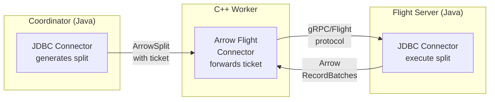

# **RFC-0013 for Java Connector Federation in C++ Workers**

## Java Connector Federation via Arrow Flight

Proposers

* Tim Meehan

## Related Issues

* [PR #25242](https://github.com/prestodb/presto/pull/25242): Custom Serialization Framework (ConnectorCodecProvider)
* Arrow Flight Connector in presto-native-execution

## Summary

Enable C++ workers to execute queries using existing single-connection Java connector implementations through Arrow Flight RPC, providing a migration path for connectors not yet ported to C++.

## Background

Presto's C++ workers provide performance improvements but require connectors to be rewritten in C++. Many connectors (JDBC, MongoDB, Elasticsearch) are single-connection systems where the data transfer, not computation, is the bottleneck. Rewriting these connectors in C++ does not improve performance, yet they require a complete reimplementation.

The recent addition of `ConnectorCodecProvider` ([PR #25242](https://github.com/prestodb/presto/pull/25242)) enables custom serialization of connector data structures. Combined with the existing Arrow Flight connector in C++, this provides a path to federation.

### Goals

* Enable single-connection Java connectors to work with C++ workers without code duplication
* Support both colocated and distributed Flight server deployments
* Optimize for connectors where all splits share a single database connection

### Non-goals

* Multi-split connectors (Hive, Iceberg) where parallelism and C++ execution improve performance
* Modifying the coordinator-worker protocol

## Proposed Implementation

### 1. Architecture Overview



### 2. Module Changes

#### presto-connector-flight-common (new)
Common library providing Arrow Flight wrapping with discovery (example psuedocode):

```java
// One-line integration for any connector
public class ArrowFlightCodecProvider implements ConnectorCodecProvider {
    public static ConnectorCodecProvider wrap(
            ConnectorCodecProvider original, 
            ArrowFlightFederationConfig config) {
        if (!config.isEnabled()) {
            return original;
        }
        return new ArrowFlightCodecProvider(original, config);
    }
    
    public Optional<ConnectorCodec<ConnectorSplit>> getConnectorSplitCodec() {
        return Optional.of(new ArrowFlightWrapperCodec(
            originalCodec, 
            discoveryService));
    }
}

public class ArrowFlightWrapperCodec implements ConnectorCodec<ConnectorSplit> {
    private final FlightDiscoveryService discoveryService;
    private final String connectorId;
    
    public byte[] serialize(ConnectorSplit split) {
        byte[] originalBytes = originalCodec.serialize(split);
        
        // Create ticket with connector ID prefix to identify the connector
        ByteBuffer ticketBuffer = ByteBuffer.allocate(
            4 + connectorId.length() + originalBytes.length);
        ticketBuffer.putInt(connectorId.length());
        ticketBuffer.put(connectorId.getBytes(UTF_8));
        ticketBuffer.put(originalBytes);
        
        // Perform discovery - transparent to connector
        List<String> servers = discoveryService.discoverServers(split);
        
        FlightEndpoint.Builder endpoint = FlightEndpoint.newBuilder()
            .setTicket(FlightTicket.newBuilder()
                .setTicket(ByteString.copyFrom(ticketBuffer.array())));
        
        for (String server : servers) {
            endpoint.addLocations(FlightLocation.newBuilder().setUri(server));
        }
        
        ArrowSplit arrowSplit = new ArrowSplit();
        arrowSplit.setFlightEndpointBytes(Base64.encode(endpoint.build().toByteArray()));
        return arrowFlightCodec.serialize(arrowSplit);
    }
}

// Handle all discovery logic with caching for single-connection connectors
public class FlightDiscoveryService {
    private final FlightClient discoveryClient;  // Client to discovery Flight server
    private final DiscoveryMode mode;
    private final int colocatedFlightPort;  // Configurable port
    // Cache discovery per query/connector to avoid per-split overhead
    private final LoadingCache<String, List<String>> serverCache;
    
    public FlightDiscoveryService(ArrowFlightFederationConfig config, ...) {
        this.mode = config.getDiscoveryMode();
        this.colocatedFlightPort = config.getColocatedPort();  // Default: 8815
        // ... other initialization
    }
    
    public List<String> discoverServers(ConnectorSplit split) {
        // For single-connection connectors, discovery should be cached per query
        String cacheKey = split.getConnectorId() + ":" + split.getQueryId();
        return serverCache.get(cacheKey, () -> performDiscovery(split));
    }
    
    private List<String> performDiscovery(ConnectorSplit split) {
        switch (mode) {
            case COLOCATED:
                // In colocated mode, always use localhost
                // The split will be scheduled to a worker that has the connector,
                // and that worker will have a colocated Flight server
                return ImmutableList.of(String.format("grpc://localhost:%d", colocatedFlightPort));
                
            case DISCOVERY:
                // Use Flight's GetFlightInfo protocol (once per query)
                // Return available Flight servers regardless of worker location
                FlightDescriptor descriptor = FlightDescriptor.newBuilder()
                    .addPath(split.getConnectorId())
                    .build();
                FlightInfo info = discoveryClient.getFlightInfo(descriptor);
                return extractLocations(info);
        }
    }
}
```

#### Integration for any single-connection Connector
```java
// JDBC Connector
public class JdbcConnector implements Connector {
    @Inject ArrowFlightFederationConfig flightConfig;
    
    @Override
    public ConnectorCodecProvider getConnectorCodecProvider() {
        // Enable federation
        return ArrowFlightCodecProvider.wrap(
            getDefaultJdbcCodecProvider(), 
            flightConfig);
    }
}

// MongoDB Connector - identical pattern
public class MongoConnector implements Connector {
    @Inject ArrowFlightFederationConfig flightConfig;
    
    @Override
    public ConnectorCodecProvider getConnectorCodecProvider() {
        return ArrowFlightCodecProvider.wrap(
            getDefaultMongoCodecProvider(), 
            flightConfig);
    }
}
```

#### presto-flight-server (new)
Flight server that loads connectors via standard Presto plugin mechanism:

```java
public class FlightServerPluginManager {
    private final Map<String, ConnectorFactory> connectorFactories = new ConcurrentHashMap<>();
    private final Map<String, Connector> connectors = new ConcurrentHashMap<>();
    
    public void loadPlugins() throws Exception {
        // Use same mechanism as PluginManager to load from installed plugins dir
        for (File pluginDir : listFiles(installedPluginsDir)) {
            loadPlugin(pluginDir);
        }
    }
    
    private void loadPlugin(File pluginDir) {
        URLClassLoader pluginClassLoader = buildClassLoader(pluginDir);
        ServiceLoader<Plugin> serviceLoader = ServiceLoader.load(Plugin.class, pluginClassLoader);
        
        for (Plugin plugin : serviceLoader) {
            for (ConnectorFactory factory : plugin.getConnectorFactories()) {
                log.info("Registering connector %s", factory.getName());
                connectorFactories.put(factory.getName(), factory);
            }
        }
    }
    
    public Connector getConnector(String connectorName) {
        // Create connector instances from factories as needed
        return connectors.computeIfAbsent(connectorName, name -> {
            ConnectorFactory factory = connectorFactories.get(name);
            return factory.create(name, config, connectorContext);
        });
    }
}

public class ConnectorFlightServer extends FlightProducer {
    private final FlightServerPluginManager pluginManager;
    
    @Override
    public void getStream(CallContext context, Ticket ticket, 
                         ServerStreamListener listener) {
        // Ticket format: [connectorId_length][connectorId][split_bytes]
        ByteBuffer buffer = ByteBuffer.wrap(ticket.getBytes());
        int connectorIdLength = buffer.getInt();
        byte[] connectorIdBytes = new byte[connectorIdLength];
        buffer.get(connectorIdBytes);
        String connectorId = new String(connectorIdBytes, UTF_8);
        
        // Get connector from plugin manager
        Connector connector = pluginManager.getConnector(connectorId);
        ConnectorCodec<ConnectorSplit> codec = connector.getConnectorCodecProvider()
            .getConnectorSplitCodec()
            .orElse(defaultJsonCodec);
        
        // Deserialize and execute
        byte[] splitBytes = new byte[buffer.remaining()];
        buffer.get(splitBytes);
        ConnectorSplit split = codec.deserialize(splitBytes);
        
        ConnectorPageSource pageSource = connector.getPageSource(split);
        streamPagesAsArrow(pageSource, listener);
    }
}
```

### 3. Discovery Mechanisms

Support two modes via configuration:

**Colocated Mode**: Flight servers run alongside C++ workers
```properties
arrow-flight-federation.discovery-mode=COLOCATED
arrow-flight-federation.colocated.port=8815
```
In this mode, the C++ worker can optionally spawn the Flight server process locally on startup, requiring only a configuration change with no separate deployment.

**Discovery Mode**: Use a dedicated Flight server for discovery
```properties
arrow-flight-federation.discovery-mode=DISCOVERY
arrow-flight-federation.discovery.server=grpc://discovery-flight-server:8816
```

### 4. Protocol Flow

1. Coordinator's JDBC connector create `JdbcSplit`
2. `ArrowFlightWrapperCodec` serialize as `ArrowSplit` with embedded ticket
3. C++ worker receive `ArrowSplit` (Thrift or JSON)
4. Arrow Flight connector extract ticket, send to Flight server
5. Flight server deserialize ticket as `JdbcSplit`, execute query
6. Results stream back as Arrow RecordBatches

### 5. NodeSelectionStrategy Integration

Respect both discovery mode and split scheduling hints:

```java
private List<String> determineFlightServers(ConnectorSplit split) {
    NodeSelectionStrategy strategy = split.getNodeSelectionStrategy();
    
    switch (discoveryMode) {
        case COLOCATED:
            // In colocated mode, respect node affinity if present
            if (strategy == HARD_AFFINITY || strategy == SOFT_AFFINITY) {
                return getColocatedServers(split.getPreferredNodes());
            }
            // Fall back to any available colocated server
            return getAllColocatedServers();
            
        case DISCOVERY:
            // In discovery mode, Flight servers are disaggregated
            // Node affinity applies to C++ workers, not Flight servers
            // Use discovery to find Flight servers independently
            return discoverFlightServers(split);
    }
}
```

Support the following deployment patterns:
- **Colocated + Affinity**: Flight server runs on same node as preferred worker
- **Discovery + Affinity**: Worker affinity respected, Flight server selected independently
- **Discovery + No Preference**: Both worker and Flight server selected at runtime

## Metrics

* Flight protocol overhead (latency comparison between C++ worker and Flight server metrics)
* Data transfer throughput between C++ worker and Flight server

## Other Approaches Considered

**JNI Integration**: Direct JVM embedding in C++ workers. Rejected due to memory management and debugging requirements.

**Custom Protocol**: Thrift-based connector protocol. Arrow Flight chosen instead for columnar-native transport, existing ecosystem support, and potential for future cross-language connector implementations.

## Adoption Plan

* New per-connector configuration properties:
  - `arrow-flight-federation.enabled`
  - `arrow-flight-federation.discovery-mode`
  - `arrow-flight-federation.discovery.server`
  - `arrow-flight-federation.colocated.port`

* Single-connection connectors can be migrated individually
* Documentation: Update each connector's documentation as it gains Flight support

## Test Plan

* Unit tests for split serialization and discovery logic
* Integration tests for end-to-end query execution through Flight server
