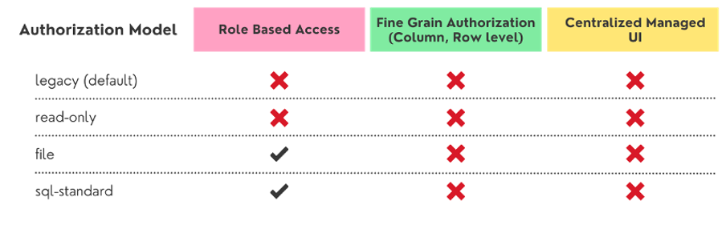
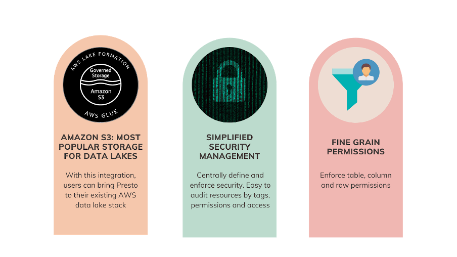
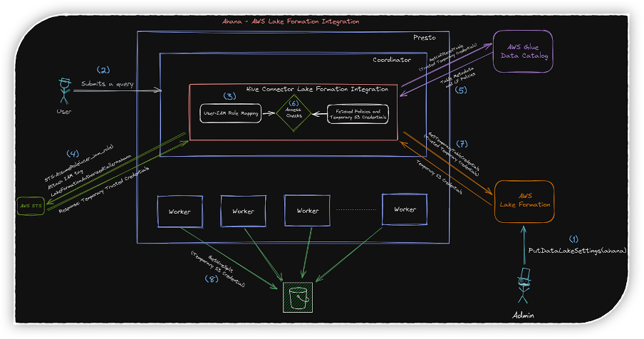
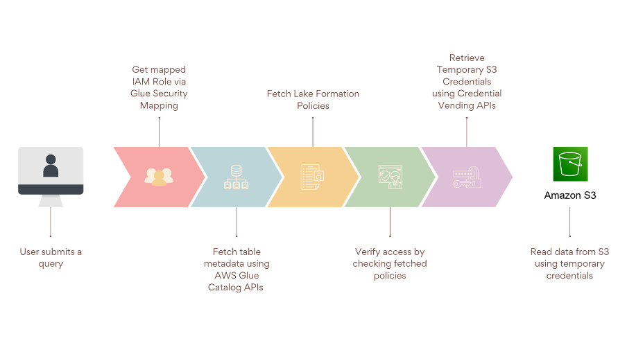
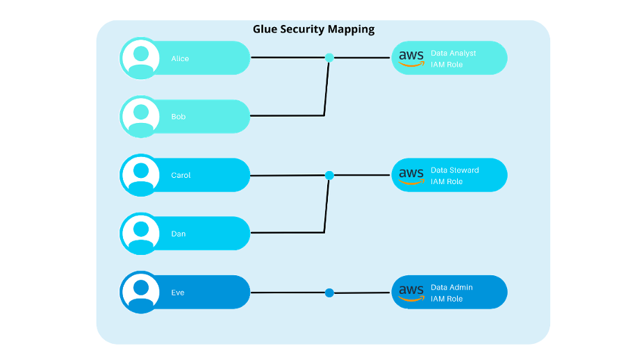
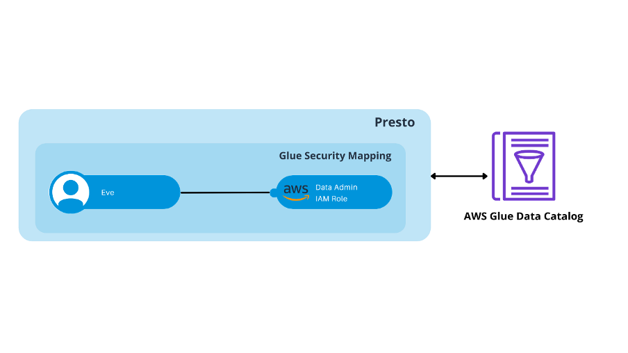
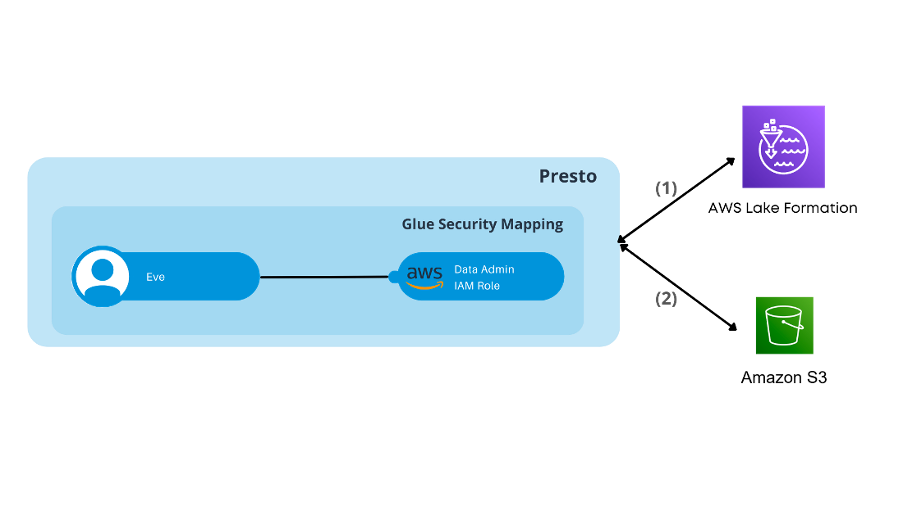
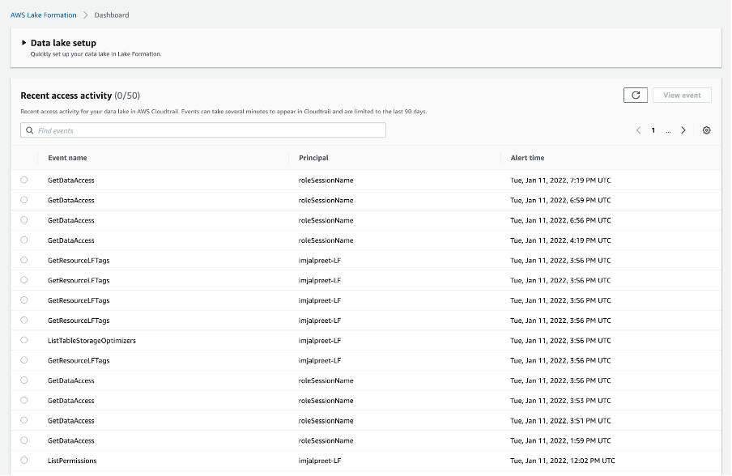

<!-- TOC -->
* [**RFC-0015 for Presto and AWS Lake Formation Integration**](#rfc-0015-for-presto-and-aws-lake-formation-integration)
  * [[Related Issues]](#related-issues)
  * [1.0 Background and Motivation](#10-background-and-motivation)
    * [1.1 Presto Authorization Models](#11-presto-authorization-models)
    * [1.2 Introduction to AWS Lake Formation](#12-introduction-to-aws-lake-formation)
    * [1.3 Integration with AWS Lake Formation](#13-integration-with-aws-lake-formation)
  * [2.0 Design](#20-design)
    * [2.1 High-Level Design](#21-high-level-design)
    * [2.2 Authorization Flow](#22-authorization-flow)
    * [2.3 Design Details](#23-design-details)
      * [2.3.1 Introduction of AWS Security Mapping in Presto](#231-introduction-of-aws-security-mapping-in-presto)
      * [2.3.2 Proposed modifications to implement Glue Metastore Impersonation](#232-proposed-modifications-to-implement-glue-metastore-impersonation)
      * [2.3.3 Add support for metadata restriction in Presto](#233-add-support-for-metadata-restriction-in-presto)
      * [2.3.4 Implement Connector Access Control for Lake Formation](#234-implement-connector-access-control-for-lake-formation)
      * [2.3.5 Integration with AWS Lake Formation Credential Vending API](#235-integration-with-aws-lake-formation-credential-vending-api)
      * [2.3.6 Implement custom `DynamicConfigurationProvider` for AWS Lake Formation](#236-implement-custom-dynamicconfigurationprovider-for-aws-lake-formation)
      * [2.3.7 Add support for allowing to filter unauthorized columns from `SELECT *` queries](#237-add-support-for-allowing-to-filter-unauthorized-columns-from-select--queries)
  * [3.0 Operational Considerations](#30-operational-considerations)
    * [3.1 Add Presto as a Truster Partner in User’s AWS Lake Formation](#31-add-presto-as-a-truster-partner-in-users-aws-lake-formation)
    * [3.2 Configuration Changes](#32-configuration-changes)
    * [3.3 Logging and Debugging](#33-logging-and-debugging)
    * [3.4 Audits](#34-audits)
  * [4.0 Testing Plan](#40-testing-plan)
    * [4.1 Unit Tests and Integration Tests](#41-unit-tests-and-integration-tests)
    * [4.2 Performance Evaluation](#42-performance-evaluation)
<!-- TOC -->

# **RFC-0015 for Presto and AWS Lake Formation Integration**

Proposers

* Jalpreet Singh Nanda

## [Related Issues]

[Presto and AWS Lake Formation Integration](https://github.com/prestodb/presto/issues/20851)

## 1.0 Background and Motivation

### 1.1 Presto Authorization Models



Currently, we have 4 authorization models that are natively available in Presto for the Hive Connector.

1. **legacy** Access Control: Only a few authorization checks are enforced, thus allowing most operations which makes it not suitable for the production workloads.
2. **read-only** Access Control: Operations that read data or metadata, such as `SELECT`, are permitted.
3. **file** based Access Control: Authorization checks are enforced using a config file.
4. **sql-standard** Access Control: In this mode, Presto enforces the authorization checks for queries based on the privileges defined in Hive metastore.

Each of the above available access control in Presto has it’s own limitations but one of the major drawbacks of all of them is that none of them supports fine-grained permissions at column-level or row-level. In addition to that, none of them provides a centralized managed UI.

Looking at the above state, there was a serious need for a more advanced authorization plug-in. So, recently, Presto added integration with **Apache Ranger** which solves most of the drawbacks mentioned above but we can still improve in terms of providing a more seamless and a user-friendly integration when using AWS Glue as the metadata catalog.

This is where <span style="color: red; font-weight: bold">AWS Lake Formation</span> comes into the picture.

[Back to top](#rfc-0015-for-presto-and-aws-lake-formation-integration)

### 1.2 Introduction to AWS Lake Formation

AWS Lake Formation is a fully managed service that makes it easier for you to build, secure, and manage data lakes. Lake Formation simplifies and automates many of the complex manual steps that are usually required to create data lakes.


<span style="color: green; font-weight: bold">Build data lakes quickly</span> Move, store, update and catalog your data faster Automatically organize and optimize your data


<span style="color: green; font-weight: bold">Simplify security management</span> Centrally define and enforce security, governance, and auditing policies


<span style="color: green; font-weight: bold">Easily discover and share data</span> Catalog all of your data assets and easily share datasets between consumers

Lake Formation provides its own permissions model that augments the AWS Identity and Access Management (IAM) permissions model. This centrally defined permissions model enables fine-grained access to data stored in data lakes through a simple grant/revoke mechanism.



Presto’s integration with AWS Lake Formation will overcome both the major drawbacks that the current authorization models have. Not only does AWS Lake Formation simplify security management by allowing users to centrally define and enforce security, but it also provides a centrally managed UI which none of the current authorization plug-ins provide. In addition to this, with the latest release of AWS Lake Formation, users can now enforce fine-grained permissions which include database, table, column and row permissions.

[Back to top](#rfc-0015-for-presto-and-aws-lake-formation-integration)

### 1.3 Integration with AWS Lake Formation

AWS Lake Formation has two key areas

* **Central Governance and Security**
    * Lake Formation Permissions at **Database**, **Table**, **Column** and **Row-Level** Security
* **Transaction Layer**
    * Governed Tables

As part of this integration, we will be looking to integrate with Lake Formation's Security Layer to start with.

**The integration will have two major deliverables as follows:**

* Integration with Lake Formation Column Permissions
* Integration with Lake Formation Row-Level Security

[Back to top](#rfc-0015-for-presto-and-aws-lake-formation-integration)

## 2.0 Design

### 2.1 High-Level Design



AWS Lake Formation exposes well defined APIs which can be used to fetch the policies defined in AWS Lake Formation and also APIs to generate temporary credentials to read data from Amazon S3. These APIs made it possible for Presto to add AWS Lake Formation as an authorization model.

Presto SPI supports a way to develop a custom authorization module for a specific connector, where a developer can implement the ConnectorAccessControl interface which can be configured for a particular connector like Hive/Glue. This module will then get all the callbacks before beginning the actual query execution in Presto.

We will be implementing a custom Connector Access Controller which integrates with AWS Lake Formation APIs.

Below are the major components that are going to be introduced or modified as part of this integration:

* Introduction of AWS Security Mapping in Presto
* Extend support of Metastore Impersonation when using Glue Metastore in Presto
* Add support for metadata restriction in Presto
  * Add support for authorization for `SHOW COLUMNS`, `DESCRIBE` and `SHOW CREATE TABLE/VIEW` queries
* Add new hive security module for Lake Formation
  * Implement `ConnectorAccessControl` for Lake Formation
* Implement custom `DynamicConfigurationProvider` for AWS Lake Formation
* Add support for allowing to filter unauthorized columns from `SELECT *` queries

[Back to top](#rfc-0015-for-presto-and-aws-lake-formation-integration)

### 2.2 Authorization Flow



**The LF Authorization flow would be as follows:**

* User submits a query
* Using the AWS Security Mapping in Presto, the IAM Role which has been mapped to this user's identity will be identified.
* AWS STS will be requested for Trusted Credentials by leveraging STS Assume Role Credentials Provider. The role which was identified in the previous step will be assumed. Additionally, this request should also contain an IAM tag `LakeFormationAuthorizedCaller=<clientTag>` where **clientTag** is the placeholder for the partner tag which has to be used by the user while adding your client(Presto) as the trusted caller in Lake Formation.

💡<span style="color: #337ea9;"> These trusted credentials should be used to interact with AWS Glue and AWS Lake Formation </span>

* The next step involves fetching the Lake Formation Policies. This can be achieved by interacting with the `getUnfilteredTableMetadata` API in AWS Glue. This API will return the table metadata as well as the permissions/policies set in Lake Formation.
* Post policy fetch, access control checks will take place. If the checks pass, the execution will move forward otherwise Access Denied exception will be thrown.
* Once access control checks are complete, to read data from S3, Presto Workers will leverage Lake Formation Credential Vending APIs to vend temporary S3 credentials which will have access to only the prefixes on which the assumed IAM role has access via Lake Formation.
* The Presto workers will then use the above temporary S3 credentials to read data from S3.

[Back to top](#rfc-0015-for-presto-and-aws-lake-formation-integration)

### 2.3 Design Details

#### 2.3.1 Introduction of AWS Security Mapping in Presto

Currently, when enabling a Glue Catalog in Presto, it is allowed to configure only 1 catalog-level IAM role which will be used for all interactions with AWS Glue. There is no concept of user-specific IAM roles. But Lake Formation Integration would require user-specific IAM roles to interact with Glue APIs since every API checks the permissions for the caller IAM role.

To make this possible, we are going to introduce AWS Security Mapping. This will allow flexible security mapping for AWS Glue and AWS Lake Formation API calls, allowing for separate IAM roles for specific users.

Each mapping entry must contain an IAM role and may contain match criteria for username.

* **user:** Regular expression to match against username
* **iamRole:** IAM role to be used when the matched user submits a query. This IAM role overrides any globally configured IAM role.



**Some important implementation specifics**

1. Introduction of two new configuration properties in `presto-hive` module
   1. <strong><code><em>hive.metastore.glue.security-mapping.config-file</em></code></strong>: Path to JSON configuration file containing glue security mappings
   2. <strong><code><em>hive.metastore.glue.security-mapping.refresh-period</em></code></strong>: Time interval after which securing mapping configuration will be refreshed
2. The mapping entries will be processed in the order they are listed in the configuration file. If no mapping entry matches and no default is configured, the access is denied.
3. The mapping entries will be cached in memory and refreshed after a configurable time period.

<strong>An example JSON configuration file</strong>

```json
{
"mappings": [
    {
      "user": "imjalpreet_read_only",
      "iamRole": "arn:aws:iam::XXXX:role/imjalpreet_read_only"
    },
    {
      "user": "imjalpreet_admin",
      "iamRole": "arn:aws:iam::XXXX:role/imjalpreet_admin"
    },
    {
      "iamRole": "arn:aws:iam::XXXX:role/imjalpreet_default"
    }
]
}
```

💡<span style="color: #337ea9;"> All IAM Roles which will be mapped to users must at a minimum include <span style="color: red;"> lakeformation:GetDataAccess </span> permission and <span style="color: red;"> AWSGlueConsoleFullAccess </span> Managed Policy in their attached policies. </span>

[Back to top](#rfc-0015-for-presto-and-aws-lake-formation-integration)

#### 2.3.2 Proposed modifications to implement Glue Metastore Impersonation

In the current design, up until now, all Glue interactions were being done using a globally configured IAM role. This did not require the presence of User Identity while interacting with Glue since all API calls were made using the same IAM role irrespective of the user.

But now with the upcoming modifications and introduction of AWS Security Mapping, we would require the presence of User Identity while making Glue API calls.

To make this possible, we will be extending the support of metastore impersonation in Presto to Glue integration as well.

In the current `GlueHiveMetastore` implementation, a glue client is created only once in the constructor method which uses STS Assume Role Credentials Provider for the globally configured IAM role.

With the introduction of MetastoreContext and AWS Security Mapping, we would need to make certain modifications in the above implementation. After exploring the APIs in AWS SDK, it was figured out that the base AWS SDK request, i.e. `AmazonWebServiceRequest` supports setting a credential provider per request(`setRequestCredentialsProvide()` or `withRequestCredentialsProvider()`). The credentials provider that was set while creating the client is only used if no credentials provider is set in the request object.

We can leverage the Request Credentials Provider to achieve our use case.

💡<span style="color: #337ea9;"> We will cache the Credentials Provider for each identity until there is a change in the AWS Security Mapping. </span>

In addition to the above change, we would also need to add a session tag `LakeFormationAuthorizedCaller=<clientTag>` while creating the Credentials Provider.



**Some important implementation specifics:**

1. Introduction of a new configuration property to enable Glue User Impersonation. This configuration property will be added in `GlueHiveMetastoreConfig` in `presto-hive-metastore`.
    1. <code><em>**hive.metastore.glue.impersonation.enabled**</em></code>: Should end-user be impersonated when communicating with the Hive Glue Metastore
2. If glue impersonation is enabled, a per-request STS Assume Role Credentials Provider will be created. With the help of Glue Security Mapping and Hive Identity, the role to assume will be figured out.

<strong>How to create STSAssumeRoleSessionCredentialsProvider along with Session Tags?</strong>

```
// How to create a session tag?
Tag tag = new Tag().withKey(lakeFormationPartnerTagName).withValue(lakeFormationPartnerTagValue);

return new STSAssumeRoleSessionCredentialsProvider
        .Builder(iamRole, "roleSessionName")
        .withSessionTags(tags)
        .build();

// tags contains a session tag LakeFormationAuthorizedCaller=clientTag
```

The below configuration properties will be added to externalize the session tag key and value.

1. <code><em>**hive.metastore.glue.lakeformation.partner-tag-name**</em></code></strong>: Name of the partner tag in AWS Lake Formation
2. <code><em>**hive.metastore.glue.lakeformation.partner-tag-value**</em></code>: Value of the partner tag in AWS Lake Formation's authorized partner list

💡<span style="color: #337ea9;"> Passing a session tag while assuming an IAM role requires an additional AWS permission (<code>sts:TagSession</code>) to be added to the trust policy of the IAM role. </span>

<strong> Sample Trust Policy </strong>

```json
{
  "Version": "2012-10-17",
  "Statement": [
      {
        "Effect": "Allow",
        "Principal": {
          "AWS": [
            "arn:aws:iam::789986721738:user/imjalpreet-glue",
            "arn:aws:iam::789986721738:root"
          ]
        }, 
        "Action": [
          "sts:AssumeRole",
          "sts:TagSession"
        ],
        "Condition": {}
      }
  ]
}
```

3. The credential provider created in the previous step will be used to interact with the respective Glue API.

    **How to set per-request credentials provider?**

    ```
    // An example for the getDatabase call
    glueClient.getDatabase(new GetDatabaseRequest()
                    .withCatalogId(catalogId)
                    .withName(databaseName)
                    .withRequestCredentialsProvider(credentialsProvider));
    ```

[Back to top](#rfc-0015-for-presto-and-aws-lake-formation-integration)

#### 2.3.3 Add support for metadata restriction in Presto

Currently, Presto allows all metadata queries irrespective of whether the user can access data in the table or not. This is due to no support for callbacks required for metadata queries like `SHOW CREATE TABLE`, `SHOW COLUMNS` or `DESCRIBE` in the current Connector Access Control or System Access Control SPI.

AWS Lake Formation expects the partners to also restrict access to metadata in addition to data. To support metadata restriction, we will be introducing new callback methods in Connector Access Control as well as System Access Control SPI. These methods will then be implemented for different Access Control plug-ins available in Presto adhering to the respective policies/permissions defined in each of them.

Below are the new access control methods that will be added to the SPI as part of this integration:

* Restrict access for `SHOW CREATE TABLE` queries
    ```java
    /**
     * Check if identity is allowed to execute SHOW CREATE TABLE or SHOW CREATE VIEW.
     *
     * @throws com.facebook.presto.spi.security.AccessDeniedException if not allowed
     */
    void checkCanShowCreateTable(TransactionId transactionId, Identity identity, AccessControlContext context, QualifiedObjectName tableName);
    ```

* Restrict access for `SHOW COLUMNS` and `DESCRIBE` queries
    ```java
    /**
     * Check if identity is allowed to show columns of tables by executing SHOW COLUMNS,
     * DESCRIBE etc.
     *
     * NOTE: This method is only present to give users an error message when listing is not allowed.
     * The {@link #filterColumns} method must filter all results for unauthorized users,
     * since there are multiple ways to list columns.
     *
     * @throws com.facebook.presto.spi.security.AccessDeniedException if not allowed
     */
    void checkCanShowColumnsMetadata(TransactionId transactionId, Identity identity, AccessControlContext context, CatalogSchemaTableName table);
    ```

* Callback method to filter columns to those visible to the identity
    ```java
    /**
     * Filter the list of columns to those visible to the identity.
     */
    List<ColumnMetadata> filterColumns(TransactionId transactionId, Identity identity, AccessControlContext context, CatalogSchemaTableName table, List<ColumnMetadata> columns);
    ```

    To filter columns for `SHOW CREATE TABLE` query, we would have to add a method call to `accessControl.filterColumns` in the class `ShowQueriesRewrite`
    <br/><br/>
    To filter columns for `SHOW COLUMNS` and `DESCRIBE `queries, we would have to make changes in the class `MetadataListing` (method: `listTableColumns` )

[Back to top](#rfc-0015-for-presto-and-aws-lake-formation-integration)

#### 2.3.4 Implement Connector Access Control for Lake Formation

Once the metadata is fetched from AWS Glue, the next step is to perform access checks. Presto provides an interface called ConnectorAccessControl which can be implemented to add a custom access control for a specific connector.

With connector access control, Presto allows you to configure fine-grained rights within a catalog. This interface expects the new access control to implement the methods for fine-grained checks.

```java
// An example method to check if a user has the permission to select columns

/**
 * Check if identity is allowed to select from the specified columns in a relation.  The column set can be empty.
 *
 * @throws com.facebook.presto.spi.security.AccessDeniedException if not allowed
 */
default void checkCanSelectFromColumns(ConnectorTransactionHandle transactionHandle, ConnectorIdentity identity, AccessControlContext context, SchemaTableName tableName, Set<String> columnNames);
```

As a part of this integration, we will be introducing a new access control for the Hive Connector which will implement the ConnectorAccessControl interface. We will call this access control `lake-formation`. This access control module will be allowed only when `hive.metastore=glue`.

**Some important implementation specifics**:

* To leverage the new access control, we need to set the below config in the respective glue catalog <br/><br/>
  `hive.security=lake-formation`
<br/><br/>
* Introduction of new configuration properties to set policy cache TTL and refresh period as part of the new access control module
    * <code><em>**hive.metastore.glue.lakeformation.policy-cache-ttl**</em></code></strong>
    * <code><em>**hive.metastore.glue.lakeformation.policy-refresh-period**</em></code>
    * <code><em>**hive.metastore.glue.lakeformation.policy-refresh-max-threads**</em></code>
<br/><br/>
* The permissions/policies defined in AWS Lake Formation can be fetched with the help of a new AWS Glue API <code>getUnfilteredTableMetadata</code>. With the help of Hive Identity, Glue Security Mapping and trusted partner tag, we can call this API. The response contains both the metadata of the table and policies defined in Lake Formation (including row filters). The policies fetched for each table will be cached and refreshed after a configurable time.
    ```java
    /**
     * @param getUnfilteredTableMetadataRequest
     * @return Result of the GetUnfilteredTableMetadata operation returned by the service.
     * @throws EntityNotFoundException
     *                A specified entity does not exist
     * @throws InvalidInputException
     *                The input provided was not valid.
     * @throws InternalServiceException
     *                An internal service error occurred.
     * @throws OperationTimeoutException
     *                The operation timed out.
     * @throws GlueEncryptionException
     *                An encryption operation failed.
     * @throws PermissionTypeMismatchException
     * @sample AWSGlue.GetUnfilteredTableMetadata
     * @see
     * <a href =
     * "[http://docs.aws.amazon.com/goto/WebAPI/glue-2017-03-31/GetUnfilteredTableMetadata](http://docs.aws.amazon.com/goto/WebAPI/glue-2017-03-31/GetUnfilteredTableMetadata)"
     *      target="_top">AWS API Documentation</a>
     */
    GetUnfilteredTableMetadataResult getUnfilteredTableMetadata(GetUnfilteredTableMetadataRequest getUnfilteredTableMetadataRequest);
    ```

* Based on the policies fetched, access will be granted or denied for the respective SQL statement. <br/><br/>
  💡<span style="color: #337ea9;"> AWS Lake Formation also released support for Cell Filtering (in addition to Row Filtering). But as part of this integration in Presto, we will be supporting Row Filtering only for now. </span>

[Back to top](#rfc-0015-for-presto-and-aws-lake-formation-integration)

#### 2.3.5 Integration with AWS Lake Formation Credential Vending API

In the High-Level Design added earlier, it can be seen that we need to generate temporary S3 credentials for reading data from S3. This can be achieved by leveraging the Lake Formation Credential Vending APIs.

We would be leveraging the below Credential Vending API

```java
// getTemporaryGlueTableCredentials

/**
* Allows a caller in a secure environment to assume a role with permission to access Amazon S3. In order to vend
* such credentials, Lake Formation assumes the role associated with a registered location, for example an Amazon S3
* bucket, with a scope down policy which restricts the access to a single prefix.
*
* @param getTemporaryGlueTableCredentialsRequest
* @return Result of the GetTemporaryGlueTableCredentials operation returned by the service.
* @throws InvalidInputException
*         The input provided was not valid.
* @throws InternalServiceException
*         An internal service error occurred.
* @throws OperationTimeoutException
*         The operation timed out.
* @throws EntityNotFoundException
*         A specified entity does not exist
* @throws AccessDeniedException
*         Access to a resource was denied.
* @throws PermissionTypeMismatchException
*         The engine does not support filtering data based on the enforced permissions. For example, if you call
*         the &lt;code>GetTemporaryGlueTableCredentials&lt;/code> operation with &lt;code>SupportedPermissionType&lt;/code>
*         equal to &lt;code>ColumnPermission&lt;/code>, but cell-level permissions exist on the table, this exception is
*         thrown.
* @sample AWSLakeFormation.GetTemporaryGlueTableCredentials
* @see &lt;a href="http://docs.aws.amazon.com/goto/WebAPI/lakeformation-2017-03-31/GetTemporaryGlueTableCredentials"
*      target="_top">AWS API Documentation&lt;/a>
*/
GetTemporaryGlueTableCredentialsResult getTemporaryGlueTableCredentials(GetTemporaryGlueTableCredentialsRequest getTemporaryGlueTableCredentialsRequest);
```

The above API returns the temporary credentials with a scope down policy that restricts access to a single prefix. The response object includes the following parameters:

* **_AccessKeyId_**: The access key ID for the temporary credentials.
* **_SecretAccessKey_**: The secret key for the temporary credentials.
* **_SessionToken_**: The session token for the temporary credentials.

[Back to top](#rfc-0015-for-presto-and-aws-lake-formation-integration)

#### 2.3.6 Implement custom `DynamicConfigurationProvider` for AWS Lake Formation

Since the temporary credentials have to be generated at the user as well as table level, we have to introduce a mechanism to dynamically update the S3 credentials based on the table whose data is being accessed.

Presto maintains a `PrestoFileSystemCache` for every S3 bucket accessed and maps a FileSystem object to it. The criteria when this cache gets updated are:

* New S3 Access Key is different from the cached S3 Access Key
* New S3 IAM Role is different from the cached S3 IAM Role

To retrieve the new Access Key or IAM Role, Hadoop Configuration object is used. Presto depending on the type of access setup stores the credentials in the Hadoop Configuration as follows:

* In the case of AWS Access Key and AWS Secret Key, it assigns value to the below config properties
    * **_presto.s3.access-key_**
    * **_presto.s3.secret-key_**
* In the case of AWS IAM Role, it assigns the value to **_presto.hive.s3.iam-role_** configuration property.

To leverage temporary S3 credentials generated using AWS Lake Formation Credential Vending, we would also need to introduce another configuration property in Hadoop Configuration for the session token. We will name this property as `presto.s3.session-token`.

We will be leveraging a custom implementation of `DynamicConfigurationProvider` for updating the credentials in the Hadoop Configuration Object dynamically.

```java
// To update configuration dynamically, we need to implement the below method

void updateConfiguration(Configuration configuration, HdfsContext context, URI uri);
```



1. Introduction of new configuration `presto.s3.session-token` in the class `S3ConfigurationUpdater`.
2. Presto, currently, creates only `BasicAWSCredentials` when using access key and secret key. For our use case, we will implement creation of `BasicSessionCredentials` if the config property `presto.s3.session-token` is not null. This change will be required in the class `PrestoS3FileSystem`.
3. Custom implementation of `DynamicConfigurationProvider`: Aim of this implementation is to vend temporary S3 credentials(at user and table level) using AWS Lake Formation Credential Vending API and set them in the Hadoop Config Object.<br/><br/>
   For vending temporary credentials, we need a `AWSCredentialsProvider` (Assume user-level IAM Role) and Table ARN.
    1. For creating the `STSAssumeRoleSessionCredentialsProvider`, we will be using the Glue Security Mapping to fetch the mapped IAM role for the identity in `HdfsContext`. Once we have the IAM role, we can create the credentials provider by assuming this role and attaching the required IAM tag.
    2. Table ARN in AWS is of the form - `arn:aws:glue:<region>:<accountId>:table/<databaseName>/<tableName>`. To generate this, we need the following parameters:
        1. region: This comes from **GlueHiveMetastoreConfig**. If that is null, it is assigned default region (`DefaultAwsRegionProviderChain().getRegion()`)
        2. accountId: This is assigned the value of `hive.metastore.glue.catalogid` config property in **GlueHiveMetastoreConfig**. If this is null, accountId is fetched using `getCallerIdentity` API in AWS STS.
        3. databaseName: This is extracted from HdfsContext
        4. tableName: This is extracted from HdfsContext
        
        ```
        // How to get accountId using AWS STS APIs?

        return stsClient.getCallerIdentity(new GetCallerIdentityRequest().withRequestCredentialsProvider(awsCredentialsProvider)).getAccount();
        ```

Once we have the above two parameters, we can vend temporary credentials using `getTemporaryGlueTableCredentials` API.

If the credentials returned are not null and are valid, we will update the below Hadoop Configuration Properties with the temporary credentials

1. **_presto.s3.access-key_**
2. **_presto.s3.secret-key_**
3. **_presto.s3.session-token_**

💡<span style="color: #337ea9;"> The Glue Security Mappings, User-level Credentials Provider, Account IDs(fetched from AWS STS) and Temporary Table Credentials will all be cached for a specific time period. </span>

The above `DynamicConfigurationProvider` will only be used if `hive.security=lake-formation`.

[Back to top](#rfc-0015-for-presto-and-aws-lake-formation-integration)

#### 2.3.7 Add support for allowing to filter unauthorized columns from `SELECT *` queries

The default behavior in Presto when a `SELECT *` query is submitted by a user and if the user doesn’t have access on one or more columns is to throw an exception like below

**Access Denied: Cannot select from columns [nationkey, regionkey, name, comment] in table or view local.tiny.nation**

AWS Lake Formation expects partners to display output for the columns on which the user has access rather than throwing an exception when a `SELECT *` query is submitted by a user and if the user doesn’t have access on one or more columns.

In order to implement this feature, we will be making use of the new Access Control method we added earlier `filterColumns` to filter the unauthorized columns from the output.

We will introducing the below config property to change the behavior to silently hide inaccessible columns from `SELECT *` queries

* <code><em>**hide-unauthorized-columns**</em></code>: When enabled unauthorized columns are silently filtered from results of `SELECT *` statements. This property has to be set in <code>config.properties</code>
* We will also be adding a system session property to control the behavior if it’s not set in <code>config.properties</code>. The session property will be named <strong><code><em>hide_unauthorized_columns</em></code></strong>

The changes will be implemented during the semantic analysis phase where relations are being analyzed in <code>com.facebook.presto.sql.analyzer.StatementAnalyzer.Visitor#analyzeSelect</code>

and also where output scope is being created in

`com.facebook.presto.sql.analyzer.StatementAnalyzer.Visitor#computeAndAssignOutputScope`.

After these changes are added, when the feature is enabled and a user tries to submit a `SELECT * `query, the unauthorized columns will be filtered out from the output results. In case a user tries to direct access a single column on which the user doesn’t have access, it will throw an `AccessDeniedException` like it does in the current implementation.

[Back to top](#rfc-0015-for-presto-and-aws-lake-formation-integration)

## 3.0 Operational Considerations

### 3.1 Add Presto as a Truster Partner in User’s AWS Lake Formation

💡<span style="color: #337ea9;"> Pre-requisite: The Credential Vending APIs in AWS Lake Formation and `getUnfilteredTableMetadata` API in AWS Glue are only allowed to be called by trusted partners. Presto must be added as a trusted partner by an admin in Customer's Lake Formation. As depicted in the above design, this can be done using the API `PutDataLakeSettings(clientTag)` (clientTag here is a placeholder for the partner tag) </span>

The above pre-requisite can be enabled in the following way (Remember that this needs to be done by the user):

* Fetch the current Data Lake Settings using the below AWS Lake Formation API
  <br/><br/>Below APIs have to be called by Lake Formation Admin:
  <br/>**get-data-lake-settings**
  ```bash
  # For example:
  aws --profile profile --region region lakeformation get-data-lake-settings
  ```  
  **Sample Response**
  ```json
  {
        "DataLakeSettings": {
            "DataLakeAdmins": [
                {
                    "DataLakePrincipalIdentifier": "arn:aws:iam::XXXX:user/imjalpreet-LF"
                }
            ],
            "CreateDatabaseDefaultPermissions": [],
            "CreateTableDefaultPermissions": [],
            "TrustedResourceOwners": [],
            "AllowExternalDataFiltering": false,
            "ExternalDataFilteringAllowList": [],
            "AuthorizedSessionTagValueList": []
        }
    }
  ```

* Modify the Data Lake Settings retrieved in the first step to add Presto as a trusted partner
    ```json
    {
        "DataLakeSettings": {
            "DataLakeAdmins": [
                {
                    "DataLakePrincipalIdentifier": "arn:aws:iam::XXXX:user/imjalpreet-LF"
                }
            ],
            "CreateDatabaseDefaultPermissions": [],
            "CreateTableDefaultPermissions": [],
            "TrustedResourceOwners": [],
            "AllowExternalDataFiltering": true,
            "ExternalDataFilteringAllowList": [
                {
                    "DataLakePrincipalIdentifier": "XXXX"
                }
            ],
            "AuthorizedSessionTagValueList": [
                "clientTag"
            ]
        }
    }
    ```

* Update the Data Lake Settings by using the below Lake Formation API
    <br/><br/>**put-data-lake-settings**
    ```bash
    # Sample API call
    aws --profile imjalpreet-admin --region us-east-1 lakeformation-preview put-data-lake-settings --catalog-id '789986721738' --data-lake-settings '{
            "DataLakeAdmins": [
                {
                    "DataLakePrincipalIdentifier": "arn:aws:iam::XXXX:user/imjalpreet-LF"
                }
            ],
            "CreateDatabaseDefaultPermissions": [],
            "CreateTableDefaultPermissions": [],
            "TrustedResourceOwners": [],
            "AllowExternalDataFiltering": true,
            "ExternalDataFilteringAllowList": [
                {
                    "DataLakePrincipalIdentifier": "XXXX"
                }
            ],
            "AuthorizedSessionTagValueList": [
                "clientTag"
            ]
    }'
    ```

[Back to top](#rfc-0015-for-presto-and-aws-lake-formation-integration)

### 3.2 Configuration Changes

To enable AWS Lake Formation Access Control on any Glue Catalog, we would need to make catalog config changes.

Below are the minimum requirements for enabling AWS Lake Formation Access Control:

1. This access control can only be used when `hive.metastore=glue`.

2. To enable this access control, we need to add `hive.security=lake-formation` to the respective Glue Catalog Config.

3. Glue Metastore Impersonation should be enabled using `hive.metastore.glue.impersonation.enabled=true`.

4. User and Glue IAM role mapping, i.e. AWS Security Mapping should also be configured. Required config is `hive.metastore.glue.security-mapping.config-file=pathto/glue-security-mapping`.

5. To enable support for allowing to filter unauthorized columns from `SELECT *` queries, the below config should be added to `config.properties`
   <br/><br/>`hide-unauthorized-columns=true`

Below table has the new config properties that are added as part of this integration

<table>
  <tr>
   <td><strong>Property Name</strong>
   </td>
   <td><strong>Description</strong>
   </td>
   <td><strong>Default</strong>
   </td>
   <td><strong>Location</strong>
   </td>
  </tr>
  <tr>
   <td><code>hive.security=lake-formation</code>
   </td>
   <td>Name of the security system to use for authorization checks
   </td>
   <td>
   </td>
   <td>Catalog Config
   </td>
  </tr>
  <tr>
   <td><code>hive.metastore.glue.impersonation.enabled</code>
   </td>
   <td>Should end user be impersonated when communicating with the Hive Glue Metastore
   </td>
   <td>false
   </td>
   <td>Catalog Config
   </td>
  </tr>
  <tr>
   <td><code>hive.metastore.glue.security-mapping.config-file</code>
   </td>
   <td>JSON configuration file containing AWS security mappings
   </td>
   <td>
   </td>
   <td>Catalog Config
   </td>
  </tr>
  <tr>
   <td><code>hide-unauthorized-columns</code>
   </td>
   <td>When enabled unauthorized columns are silently filtered from results of SELECT * statements
   </td>
   <td>false
   </td>
   <td>config.properties
   </td>
  </tr>
  <tr>
   <td><code>hive.metastore.glue.security-mapping.refresh-period</code>
   </td>
   <td>Time interval after which securing mapping configuration will be refreshed
   </td>
   <td>30 seconds
   </td>
   <td>Catalog Config
   </td>
  </tr>
  <tr>
   <td><code>hive.metastore.glue.lakeformation.partner-tag-name</code>
   </td>
   <td>Name of the partner tag in AWS Lake Formation
   </td>
   <td>LakeFormationAuthorizedCaller
   </td>
   <td>Catalog Config
   </td>
  </tr>
  <tr>
   <td><code>hive.metastore.glue.lakeformation.partner-tag-value</code>
   </td>
   <td>Value of the partner tag in AWS Lake Formation's authorized partner list
   </td>
   <td>presto
   </td>
   <td>Catalog Config
   </td>
  </tr>
  <tr>
   <td><code>hive.metastore.glue.lakeformation.policy-cache-ttl</code>
   </td>
   <td>Time after which policies will be cleared from Cache
   </td>
   <td>120 minutes
   </td>
   <td>Catalog Config
   </td>
  </tr>
  <tr>
   <td><code>hive.metastore.glue.lakeformation.policy-refresh-period</code>
   </td>
   <td>Time interval after which cached policies will be refreshed
   </td>
   <td>5 minutes
   </td>
   <td>Catalog Config
   </td>
  </tr>
  <tr>
   <td><code>hive.metastore.glue.lakeformation.policy-refresh-max-threads</code>
   </td>
   <td>Max number of refresh threads
   </td>
   <td>1
   </td>
   <td>Catalog Config
   </td>
  </tr>
  <tr>
   <td><code>hive.metastore.glue.lakeformation.supported-permission-type</code>
   </td>
   <td>Type of AWS Lake Formation permissions supported. <code>COLUMN_PERMISSION</code> or <code>CELL_FILTER_PERMISSION</code>
   </td>
   <td>CELL_FILTER_PERMISSION
   </td>
   <td>Catalog Config
   </td>
  </tr>
</table>

[Back to top](#rfc-0015-for-presto-and-aws-lake-formation-integration)

### 3.3 Logging and Debugging

INFO and DEBUG logs have been added wherever necessary. Whenever an Exception is thrown, the actual exception is also passed in wrapped exception along with an error log.

[Back to top](#rfc-0015-for-presto-and-aws-lake-formation-integration)

### 3.4 Audits

Every API call to AWS Lake Formation is automatically audited and can be viewed on AWS Lake Formation Console.



[Back to top](#rfc-0015-for-presto-and-aws-lake-formation-integration)

## 4.0 Testing Plan

### 4.1 Unit Tests and Integration Tests

Unit Tests have been added for every feature implemented as part of this integration.

Except Lake Formation Access Control implementation, Integration Tests have been added for the remaining features including(and not limited to) Glue Metastore Impersonation, AWS Security Mapping, new Access Control methods, etc.

### 4.2 Performance Evaluation

Performance benchmarks has been carried out on all TPC-H (sf1000) queries on a Glue Catalog with security as Lake Formation and default (Legacy).

[Back to top](#rfc-0015-for-presto-and-aws-lake-formation-integration)