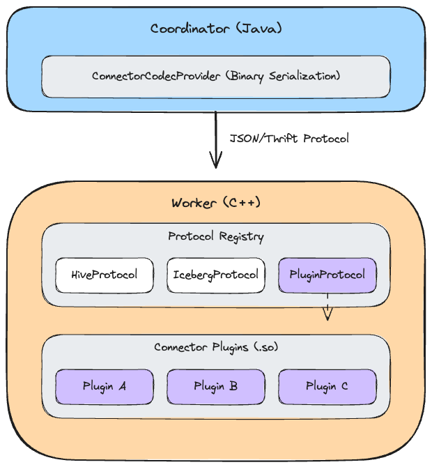

# RFC-0016 for Presto

## Connector Plugin Support for Presto C++ Workers

Proposers
* Tim Meehan

## Related Issues

* [RFC-0013](./RFC-0013-dyllib-cpp.md) - Introduced the `registerExtensions` mechanism for dynamically loaded functions, which this RFC extends for connectors
* [RFC #38](https://github.com/prestodb/rfcs/pull/38) - Introduces the Java and C++ codec infrastructure for connector-provided serialization in the context of Thrift serialization for coordinator to worker communication
* [PR #26026](https://github.com/prestodb/presto/pull/26026) - Builds on RFC #38 to enable binary serialization codecs for JSON protocol (avoiding Thrift migration) and adds missing codecs embedded in TaskUpdateRequest 

## Summary

Enable runtime connector registration in Presto C++ workers through connector plugins loaded as shared libraries using protocol-agnostic binary serialization. This allows developers to use the existing `registerExtensions` mechanism to add custom Velox connectors while providing the ability to decode Java-side connector structures into corresponding Velox structures.

## Background

Presto C++ workers require all connectors at compile time. The protocol generation statically creates C++ classes from Java definitions, requiring connector-specific data structures in the worker binary. This prevents development of new connectors not known to the Presto engine, representing a significant regression from Java's functionality.

Java coordinators support connector plugin registration with both JSON and Thrift protocols. [PR #26026](https://github.com/prestodb/presto/pull/26026)[^1] adds binary serialization codec support to the JSON protocol.

### Goals

* Enable runtime connector registration in C++ workers

### Non-goals

* Cross-language plugin support (Rust, Go)
* Hot-reload capabilities

## Proposed Implementation

### Modules Involved

1. **presto-native-execution**

### Components

This RFC leverages existing infrastructure:
* **ConnectorProtocol**: Existing interface that plugins implement with binary serialization for their connector types[^2]
* **PrestoToVeloxConnector**: Existing class that creates the ConnectorProtocol and converts protocol types to Velox types
* **registerExtensions**: Existing mechanism from RFC-0013 used to register connector components from shared libraries

### Implementation Flow

1. **Plugin Registration** (using existing `registerExtensions` mechanism):
   ```cpp
   extern "C" void registerExtensions() {
     // Register Presto-to-Velox converter (which creates the protocol)
     auto converter = std::make_unique<MyPrestoToVeloxConnector>();
     registerPrestoToVeloxConnector("my-connector", std::move(converter));

     // Register Velox connector factory
     velox::connector::registerConnectorFactory("my-connector", factory);
   }
   ```

2. **Message Routing**:
   - Coordinator includes connector name in the serialized payload (embedded in handle objects)
   - Worker extracts connector name from the deserialized handle to identify which ConnectorProtocol to use
   - ConnectorManager maintains registry mapping connector names to their protocols:
     * Static connectors → pre-compiled protocol classes registered at startup
     * Plugin connectors → ConnectorProtocol implementations from shared libraries

3. **Binary Serialization Protocol**[^3]:
   - JSON (via [PR #26026](https://github.com/prestodb/presto/pull/26026)) and Thrift support binary payloads
   - ConnectorCodecProvider (Java) ↔ ConnectorProtocol (C++)

4. **C++ Worker Configuration**[^4]:
   ```properties
   # config.properties for C++ worker
   plugin.dir=/opt/presto/plugin  # Optional, defaults to ./plugin
   ```
   Worker scans plugin directory at startup and loads all shared libraries (.so/.dylib files) using dlopen.

### Architecture Diagram



### Interface Contracts

Each plugin provides its own ConnectorProtocol implementation with connector-specific binary serialization. Worker loads plugins using the mechanism introduced in [RFC-0013](./RFC-0013-dyllib-cpp.md) (and documented [here](https://prestodb.io/docs/current/presto_cpp/plugin/function_plugin.html)), where shared libraries are loaded via dlopen/dlsym at startup based on configuration.

## Metrics

* N/A

## Other Approaches Considered

N/A

## Adoption Plan

* **Impact**: None on existing users. Static connectors unchanged.
* **New configurations**: `plugin.dir` property in C++ worker config.properties
* **Migration**: Gradual per-connector basis
* **Documentation**: Plugin development guide, example implementations
* **Out of scope**: Cross-language support, hot-reload

## Test Plan

1. **Unit tests**:
   - ConnectorProtocol serialization correctness
   - Plugin loading/unloading
   - Error handling

2. **Integration tests**:
   - End-to-end queries with plugin connectors
   - Mixed static/plugin queries
   - Failure scenarios

## Implementation Considerations

### Security

Shared libraries must be trusted code (same as Java plugins).

### Performance

Virtual function overhead negligible compared to network I/O.

### Compatibility

Plugins require same toolchain as worker binary for ABI compatibility. The Java coordinator must enable `use-connector-provided-serialization-codecs` and have a complete implementation of the binary codec for the connector. Both coordinator and worker need matching SerializationCodec implementations.

### Limitations

C++ ABI compatibility requires matching compiler versions and platform.

[^1]: [PR #26026](https://github.com/prestodb/presto/pull/26026) enables binary serialization in JSON protocol via ConnectorCodecProvider.

[^2]: ConnectorProtocol interface that plugins implement:
```cpp
class ConnectorProtocol {
public:
  // Plugins implement these for binary serialization
  virtual void serialize(const std::shared_ptr<ConnectorSplit>& proto,
                         std::string& binary) const = 0;
  virtual void deserialize(const std::string& binary,
                           std::shared_ptr<ConnectorSplit>& proto) const = 0;

  // JSON/Thrift methods
  virtual void to_json(json& j, const std::shared_ptr<ConnectorSplit>& p) const;
  virtual void from_json(const json& j, std::shared_ptr<ConnectorSplit>& p) const;
};
```

[^3]: Protocol extensions:
```thrift
struct PluginConnectorData {
  1: required string connectorName
  2: required binary serializedData
  3: optional map<string, string> metadata
  4: required i32 protocolVersion
}

union ConnectorSplitData {
  1: HiveSplit hiveSplit
  2: IcebergSplit icebergSplit
  3: PluginConnectorData pluginData
}
```
JSON with binary payload:
```json
{
  "@type": "ConnectorSplit",
  "connectorId": "my-connector",
  "serializedData": "<base64-encoded-binary>",
  "metadata": {"protocolVersion": "1"}
}
```

[^4]: C++ worker configuration and plugin example:
```properties
# config.properties for C++ worker
plugin.dir=/opt/presto/plugin  # Optional, defaults to ./plugin
```
Example plugin:
```cpp
// Step 1: Protocol deserialization - handles binary to protocol type
class ArrowFlightProtocol : public ConnectorProtocol {
  void deserialize(const std::string& binary,
                   std::shared_ptr<ConnectorSplit>& split) const override {
    // Deserialize binary into protocol-specific type
    ArrowFlightSplit protocolSplit;
    // ... deserialize binary data into protocolSplit ...
    split = std::make_shared<ArrowFlightSplit>(std::move(protocolSplit));
  }

  void serialize(const std::shared_ptr<ConnectorSplit>& split,
                 std::string& binary) const override {
    auto arrowSplit = std::dynamic_pointer_cast<ArrowFlightSplit>(split);
    // ... serialize arrowSplit to binary ...
  }
};

// Step 2: PrestoToVeloxConnector - creates protocol and converts types
class ArrowFlightPrestoToVeloxConnector : public PrestoToVeloxConnector {
public:
  std::unique_ptr<ConnectorProtocol> createConnectorProtocol() const override {
    return std::make_unique<ArrowFlightProtocol>();
  }

  std::unique_ptr<velox::connector::ConnectorSplit> toVeloxSplit(
      const std::shared_ptr<ConnectorSplit>& prestoSplit) const override {
    auto arrowSplit = std::dynamic_pointer_cast<ArrowFlightSplit>(prestoSplit);
    // Convert protocol ArrowFlightSplit to Velox ArrowFlightConnectorSplit
    return std::make_unique<ArrowFlightConnectorSplit>(
        arrowSplit->ticket,
        arrowSplit->endpoint);
  }
};

extern "C" {
  void registerExtensions() {
    // Register Presto-to-Velox converter
    auto converter = std::make_unique<ArrowFlightPrestoToVeloxConnector>();
    registerPrestoToVeloxConnector("arrow-flight", std::move(converter));

    // Register Velox connector factory
    velox::connector::registerConnectorFactory(
      "arrow-flight",
      std::make_unique<ArrowFlightConnectorFactory>());
  }
}
```