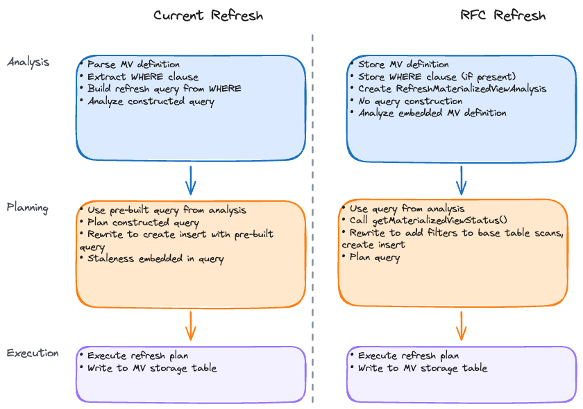
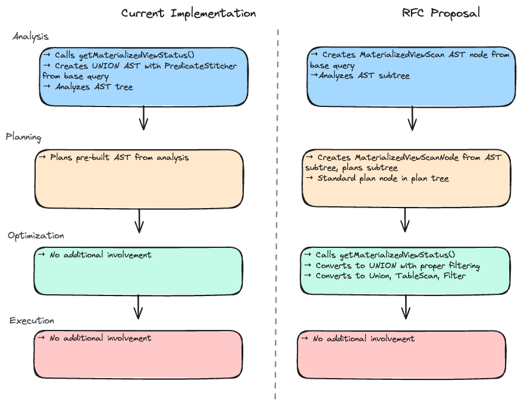

# **RFC-0016 for Presto: Materialized Views**

## Materialized Views Architecture

Proposers

* Tim Meehan

## Related Issues

Related issues may include Github issues, PRs or other RFCs.

* Existing Hive Materialized Views implementation in presto-hive module
* Proposed Iceberg Materialized Views support

## Summary

This RFC proposes a redesign of Presto's Materialized Views architecture. The current implementation has analysis-phase limitations that prevent proper MV-side filtering in UNION operations and requires expensive staleness computation during TableHandle creation. The proposed design moves stitching logic to the planning phase and allows connectors to compute staleness lazily when needed.

## Background

The current implementation was designed for Hive and has limitations that prevent other connectors from implementing materialized views effectively.

### Goals

* Connector-agnostic materialized views framework
* Move MV logic from analysis phase to planning phase
* Limit connector responsibilities to staleness detection only
* Planner handles all stitching logic using standard plan nodes
* Support incremental refresh patterns
* Iceberg connector implementation using snapshot-based change tracking

### Non-goals

* Major changes to existing user-facing APIs (the design reuses existing SPI methods)
* Automatic view selection/routing for arbitrary queries

## Current Implementation and How It Works

The existing materialized views implementation is located primarily in the presto-hive module and follows this flow:

### 1. Metadata Storage
- MVs are stored as Hive tables with special properties
- View definition stored in table properties as serialized SQL
- Base table references tracked in metadata

### 2. Query Analysis Phase

#### Query-Time Analysis (SELECT from MV)
When querying a materialized view, the system:
- Recognizes the table as an MV during name resolution
- Calculates staleness by checking partition modification times
- Constructs a UNION query combining fresh MV data with stale data recomputed from base query

#### Refresh-Time Analysis (REFRESH MATERIALIZED VIEW)
When refreshing a materialized view, the system:
- Parses the MV definition from metadata
- Constructs the refresh query by analyzing the stored view definition
- Determines partitioning alignment between MV and base tables
- Applies any user-specified WHERE predicates to limit refresh scope

### 3. Refresh Execution (Hive-Specific)
- Full refresh: Drops and recreates the entire MV table
- Partial refresh: Attempts to update only modified partitions (detected via Hive partition modification timestamps)
- Uses Hive's partition replacement semantics

### 4. Query Rewriting
- Simple pattern matching to detect if a query can use an MV
- Limited to exact matches or simple projections
- No cost-based selection between multiple MVs

## Problems with Current Implementation

### 1. Missing MV-Side Filtering in UNION

The current UNION implementation can include duplicate data because staleness information cannot be embedded in TableHandles during analysis[^13]. The code assumes the materialized view TableHandle will filter stale partitions, but any open source implementation would require expensive metadata lookups on the dependent tables. TableHandles are intended to be lightweight, but staleness tracking requires expensive metadata operations that must be deferred until query planning.

### 2. Manual WHERE Clauses in REFRESH MATERIALIZED VIEW

The current `REFRESH MATERIALIZED VIEW WHERE ...` approach requires users to manually specify refresh predicates. This doesn't work with Iceberg's hidden partitions because users cannot reference partition transform functions like `bucket(16, customer_id)` or `year(order_date)` directly in WHERE clauses. Users are forced to understand internal partitioning schemes and translate them to source column predicates, making incremental refresh impractical for complex partitioning strategies.

### 3. Analysis-Phase Early Binding

Performing MV logic during analysis prevents cost-based decisions. Moving to the planner would enable cost-based decisions like when to refresh (based on rows rather than number of missing partitions), when to use base query vs. stitching, and future cost-based view selection.

### 4. Inconsistent Access Control Model

Views can use either definer rights (execute with creator's permissions) or invoker rights (execute with querying user's permissions). The current implementation mixes both models inconsistently. During creation, it checks if the creating user has access to base tables following an invoker rights pattern. During refresh, it checks if the MV owner has access (suggesting definer rights) but then executes with the invoker's identity (invoker rights), creating a confusing hybrid model. Users need SELECT permission on the MV itself for queries, which is standard. The problem is that the refresh operation validates against owner permissions but executes with invoker permissions. This creates security and operational issues where both the MV owner and the refresh invoker need base table permissions, making the permission check on the owner effectively meaningless since execution uses invoker's identity. There's no true definer rights support, preventing controlled access to aggregated data, and this differs from both regular Presto views (which properly support both modes) and industry standard (most analytical databases default to definer rights for MVs).

## Existing Infrastructure

Presto already has substantial materialized view infrastructure:

Core SPI Methods (already implemented):
- `ConnectorMetadata.createMaterializedView()` - create MV metadata and storage
- `ConnectorMetadata.dropMaterializedView()` - remove MV and storage
- `ConnectorMetadata.getMaterializedView()` - retrieve MV definition
- `ConnectorMetadata.getMaterializedViewStatus()` - check freshness status
- `ConnectorMetadata.getReferencedMaterializedViews()` - discover MVs for tables

Refresh Infrastructure:
- `TableWriterNode.RefreshMaterializedViewReference` - identifies refresh operations in the plan
- `ConnectorMetadata.beginRefreshMaterializedView()` - starts the refresh execution
- `ConnectorMetadata.finishRefreshMaterializedView()` - completes the refresh with connector-specific logic
- `LogicalPlanner.createRefreshMaterializedViewPlan()` - creates the execution plan

Query-Time Infrastructure:
- `StatementAnalyzer` - handles MV stitching during analysis phase
- `PredicateStitcher` - combines fresh MV data with stale base table data
- `MaterializedViewColumnMappingExtractor` - maps columns between MV and base tables
- SQL parsing and validation for MV DDL statements

Storage Classes:
- `MaterializedViewDefinition` - stores MV metadata and SQL definition
- `MaterializedViewStatus` - reports staleness information
- `MaterializedDataPredicates` - wraps staleness predicates

## Proposed Changes

### 1. SPI Interface for Materialized Views

The approach reuses as much of the existing SPI as possible. Connectors detect staleness using the existing `getMaterializedViewStatus()` method, though the `MaterializedViewStatus` structure itself will be refactored to support the new functionality[^1].

Existing methods remain unchanged:
- `createMaterializedView()` / `dropMaterializedView()` - lifecycle operations
- `getMaterializedView()` - retrieve MV definition
- `getMaterializedViewStatus()` - the only method needed for stitching (with updated return structure)
- `beginRefreshMaterializedView()` / `finishRefreshMaterializedView()` - refresh execution

New optional methods for native refresh delegation:
- `delegateMaterializedViewRefreshToConnector()` - returns true for native connectors (PostgreSQL, Snowflake)
- `refreshMaterializedView()` - performs native refresh when delegated

The planner handles all stitching logic using staleness information from the refactored `MaterializedViewStatus`.

### 2. MaterializedViewStatus Structure

The MaterializedViewStatus reports base table staleness using pass-through columns, with the runtime deriving MV constraints using complement logic[^2]:

MaterializedViewStatus fields:
- `fullyMaterialized`: boolean indicating if MV is completely fresh (other freshness states are inferred from the presence of predicates)
- `staleDataConstraints`: StaleDataConstraints containing base table constraints only
- `lastRefreshTimes`: Map<SchemaTableName, Long> for metadata tracking

StaleDataConstraints structure (for examples of each predicate type being used, see Section 6 "Two Stitching Modes: Partition-Based and Filter-Based"):
- `dataDisjuncts`: Map<SchemaTableName, List<TupleDomain<String>>> - OR'd partition boundaries for base tables only (existing concept, used for bulk partition updates)
- `conjunctiveConstraints`: Map<SchemaTableName, TupleDomain<String>> - AND'd filtering within boundaries for base tables only (new concept, enables file-level or record-level precision)[^14]

The connector reports staleness exclusively on base tables using pass-through columns, which are simplest to implement. The runtime derives fresh MV constraints as the complement of base stale constraints using the shared column semantics. Connectors signal their incremental scan capabilities through the granularity of conjunctive constraints. When base and MV data tables have aligned partitioning schemes, connectors provide specific predicates; when partitioning schemes differ, connectors return empty predicate lists to signal broader refresh boundaries are needed. This enables different strategies per base table in multi-table materialized views[^12].

### 3. Dynamic Connector-Driven Refresh Planning

Transform refresh from static user-driven queries to dynamic connector-driven planning[^3]. Currently, users must manually specify WHERE predicates for incremental refresh, refresh queries are built during analysis without connector staleness input, and connectors have no way to signal what data is actually stale.



#### How Refresh Planning Works

The refresh planning mechanism parallels the read-time stitching approach but generates write plans instead of read plans. During planning, the system has access to the MV definition query that defines what the MV should contain, staleness information from `getMaterializedViewStatus()` indicating which base table partitions have changed, and the MV storage table containing existing materialized data that needs updating.

The planner in `LogicalPlanner.createRefreshMaterializedViewPlan()` gets staleness constraints from the connector, adds those constraints as filters to the base table scans in the MV definition query, and wraps the result in a TableWriterNode that writes to the MV storage table using either INSERT OVERWRITE for Phase 1 or MERGE for future Phase 2. The MV definition query itself remains unchanged except for the additional filters on base tables.

For example, if a materialized view aggregates sales by region and date, and the connector indicates that only January 2024 US sales are stale, the refresh plan simply adds the filter `sale_date >= '2024-01-01' AND sale_date < '2024-02-01' AND customer_region = 'US'` to the sales table scan in the existing MV definition query. The rest of the query including its GROUP BY aggregation executes unchanged.

This approach enables connectors to determine what needs refreshing based on actual data changes. Users no longer need to specify WHERE predicates for incremental refresh - the system automatically detects incrementality through connector staleness detection. The WHERE clause syntax in `REFRESH MATERIALIZED VIEW WHERE ...` will be deprecated in favor of automatic connector-driven staleness detection.

### 4. MaterializedViewScan AST and Plan Nodes

Instead of directly constructing UNION queries in the analyzer, introduce proper AST and plan nodes for materialized view scans that get optimized later[^4]:



New AST Node: MaterializedViewScan
- Left side of the AST node: Data table scan (storage table)
- Right side of the AST node: View query structure
- `MaterializedViewDefinition`

Analysis Phase: Create MaterializedViewScan Node
- `StatementAnalyzer.visitTable()` checks if table is materialized view
- Creates `MaterializedViewScan` AST node with data table and view query
- Analyzes both sides normally using existing infrastructure

Planning Phase: MaterializedViewScanNode
- Plan node containing data table plan and view query plan
- MV metadata and symbol mappings for optimization
- Standard `PlanNode` that integrates with existing infrastructure

Optimization Phase: MaterializedViewOptimizer Rule (Default Implementation)
- Default optimizer rule converts `MaterializedViewScanNode` to UNION
- Gets staleness information from `MaterializedViewStatus`
- Fresh MV: returns data table scan directly
- Partially stale: builds UNION of filtered fresh data + recomputed stale data

The planner constructs stitching plans by adding standard `UnionNode`, `TableScanNode`, and `FilterNode` nodes, then relies on existing planner rules for optimization. This design uses only the existing `MaterializedViewStatus` SPI method. Connectors only need to detect staleness and provide constraint information - they don't need to understand or implement stitching logic themselves. Filter nodes are pushed down by later planner rules through existing constraint pushdown mechanisms.

Moving to the planner phase enables connector-specific optimizations when the default MaterializedViewOptimizer doesn't fully meet connector needs. Connectors can implement custom optimizer rules that work alongside or replace the default rule.

### 5. Architecture and Responsibilities

This approach provides separation of concerns:

#### Architectural Principles

1. Single staleness source: `MaterializedViewStatus` is the only source of staleness information
2. Direct constraint application: Stale constraints from status are applied directly to table handles
3. Standard plan construction: Base query is planned as any other query subtree, filters from connector are added to base table scans, UnionNode combines fresh MV data with filtered base query

#### Separation of Responsibilities

Presto runtime handles:
- SQL parsing and validation
- Query planning and general optimization (join reordering, predicate pushdown, etc.)
- ALL MV stitching logic using standard plan nodes
- Construction of union plans for combining fresh and stale data
- Converting MV predicates to base table constraints using column mappings

Connector handles:
- MV metadata storage
- Staleness detection through partition-level tracking or snapshot-based change detection
- Signaling incremental scan capabilities through constraint granularity

### 6. Pass-Through Column Constraint Handling

The connector reports staleness on base tables using pass-through columns, and the runtime derives MV constraints using complement logic (similar to current implementation). This approach works for columns that appear unchanged in both base tables and materialized view data tables.

#### Connector Responsibility: Base Table Staleness

The connector detects and reports what data is stale on base tables. For example, a sales table might have stale partitions where `sale_date >= '2024-01-01'` and `customer_region = 'US'`. The connector populates the `StaleDataConstraints` structure with disjunctive constraints (OR'd partition boundaries) and conjunctive constraints (AND'd filtering within boundaries). If the connector can provide precise change tracking, it sets specific conjunctive predicates; otherwise it uses safe boundaries[^9].

#### Runtime Responsibility: MV Constraint Derivation

The planner derives MV data table constraints using complement logic for pass-through columns (similar to current refresh implementation, but different from current query-time stitching which lacks proper MV-side filtering). The process involves:

```
1. Get staleness information from getMaterializedViewStatus()
2. Union all stale constraints from base tables
3. Derive fresh constraints using logic similar to MaterializedViewUtils.differenceDataPredicates
4. Build UNION plan: fresh MV data + recomputed stale base data
```

The constraint derivation handles constraint negation and boundary computation for pass-through columns[^10].

#### Pass-Through Column Requirements

This approach works for columns that appear unchanged in both base tables and MV data tables:

```sql
-- Example: pass-through columns work naturally
CREATE MATERIALIZED VIEW sales_summary AS
SELECT
    customer_region,           -- ✓ Pass-through: base.customer_region = mv.customer_region
    sale_date,                 -- ✓ Pass-through: base.sale_date = mv.sale_date
    SUM(amount) as total_sales -- Aggregated: constraints apply to grouping columns only
FROM sales
GROUP BY customer_region, sale_date
```

UNION Construction (similar to current implementation):
```sql
-- Fresh data: everything except stale groups
SELECT customer_region, sale_date, total_sales
FROM sales_summary
WHERE NOT (sale_date >= '2024-01-01' AND customer_region = 'US')

UNION ALL

-- Stale data: recompute affected groups
SELECT customer_region, sale_date, SUM(amount)
FROM sales
WHERE sale_date >= '2024-01-01' AND customer_region = 'US'
GROUP BY customer_region, sale_date
```

### 7. Consistent Access Control Model

Align materialized views with regular views for access control[^5]:

Access control mode determination:
- If MV has owner different from session user → definer mode (use owner's permissions)
- Otherwise → invoker mode (use session user's permissions)

Implementation approach:
- Create appropriate identity and access control objects based on mode
- Build session with correct identity for refresh analysis
- Use `ViewAccessControl` wrapper for definer mode
- Analyze refresh query with appropriate permissions

## How Iceberg Will Handle It

### 1. Storage Model

```java
public class IcebergMaterializedView {
    // View component (stored in catalog)
    private final String viewName;
    private final String viewDefinition;
    private final Schema schema;

    // Table component (Iceberg table)
    private final Table storageTable;

    // Base table references and their snapshot IDs when MV was last fully refreshed
    // Used for incremental change detection.  This is stored as properties in 
    // the view.
    private final Map<SchemaTableName, Long> baseTableSnapshots;
}
```

### 2. Partitioning Support

Materialized views use the same `partitioning` property syntax as regular Iceberg tables, supporting partition transforms like `'year(ts)'`, `'bucket(N, col)'`, and `'truncate(N, str)'`. When MV and base table partitioning schemes differ, pass-through columns cannot participate in stitching and the system falls back to over-specification refresh boundaries.

### 3. Staleness Detection through MaterializedViewStatus

Iceberg implements staleness detection using snapshot-based change tracking[^6]:

Non-partitioned tables: Simple snapshot ID comparison between base table and MV refresh snapshot
Partitioned tables: Use Iceberg's incremental scan to detect changed partitions between snapshots
Constraint conversion: Convert changed Iceberg partitions to `TupleDomain` constraints for planner use

### 4. Iceberg Constraint Relationships and Column Mappings

Iceberg's implementation of constraint relationships leverages snapshot-based change detection and hidden partitions to simplify the conversion between base table and MV data table constraints.

#### Iceberg-Specific Constraint Processing

Iceberg implements staleness detection using snapshot-based change tracking[^11]. The connector compares base table snapshots to detect changes since the last refresh, then identifies changed partitions when snapshots differ. Changed partition information is extracted from file scan tasks and converted to TupleDomain constraints that apply to base table columns using their raw names. The approach relies on Iceberg partition transform functions being available as `iceberg.system` functions, allowing constraints to use transform functions directly.

#### Future: Advanced Constraint Mapping

Complex constraint transformations between misaligned partitioning schemes remain a future enhancement. The initial implementation uses the over-specification approach described in the refresh implementation section, where connectors signal partition misalignment by returning empty predicate lists, triggering broader refresh boundaries along natural partition lines.

### 5. Benefits of Iceberg's Snapshot-Based Approach

Iceberg's snapshot-based approach provides accuracy based on actual data changes rather than metadata timestamps, works with both partitioned and non-partitioned tables, and can detect deletes and updates in addition to appends.

#### Iceberg-Specific Refresh Implementation

Phase 1: Partition Overwrite with Alignment Requirements
Iceberg initially implements refresh using INSERT OVERWRITE of whole partitions. When base and MV data tables have aligned partitioning schemes, the connector provides specific predicates in `StaleDataConstraints` enabling partition updates. When partitioning schemes differ, the connector omits predicates (returns empty predicate lists) to signal that broader refresh boundaries are needed. This approach uses over-specification at partition boundaries - if one bucket in a day changes, all buckets for that day are refreshed to maintain simplicity and correctness.

Over-Specification Strategy:
To handle misaligned direct mapped columns that represent partitions but whose transforms differ, the system over-specifies refresh boundaries along natural partition lines. For example, if the base table is partitioned by `day(sale_date), bucket(16, customer_region)` and the MV is partitioned by `day(sale_date), bucket(30, customer_region)`, when bucket 5 changes in the base table for day '2024-01-15', the refresh recomputes all buckets for that entire day. This provides a simple, predictable refresh model at the cost of slightly higher recomputation for the initial phase.

Phase 2: MERGE-Based Refresh for Aggregation Queries
Future implementation will use MERGE operations to enable fine-grained updates for aggregation queries with grouping keys. This approach works well for aggregated materialized views where specific groups can be identified and updated, but has limited applicability to non-aggregation queries (filters, joins, window functions) which still require partition-level refresh strategies.

### 6. Two Stitching Modes: Partition-Based and Filter-Based

The design supports two complementary stitching approaches based on connector capabilities and query types:

**Partition-Based Stitching (Disjunctive Predicates)**
Uses partition boundaries for bulk operations. The connector provides disjunctive constraints identifying changed partitions, and the planner creates UNION plans that read entire fresh partitions from the MV data table and recompute entire stale partitions from base tables. This approach applies to aggregated materialized views and scenarios where partition-level granularity is used.

**Filter-Based Stitching (Conjunctive Predicates + Time Travel)**
Uses filtering predicates for record-level data selection. The connector provides conjunctive constraints identifying specific changed records or files, enabling the planner to create UNION plans with filtering. For simple filter-based materialized views, this enables time travel queries that read incremental data from base tables at the last refresh snapshot, combined with filtering of fresh data from the MV data table.

**Capability Signaling**
Connectors signal their capabilities through the granularity of conjunctive predicates:
- Specific conjunctive predicates (snapshot IDs, record keys) → enables filter-based stitching
- `TupleDomain.all()` conjunctive predicates → falls back to partition-based stitching

**Query Examples by Stitching Mode**

Partition-Based Stitching (aggregated materialized views):
```sql
-- Aggregation MV: requires recomputing entire groups when data changes
CREATE MATERIALIZED VIEW sales_summary AS
SELECT customer_region, sale_date, SUM(amount), COUNT(*)
FROM sales
GROUP BY customer_region, sale_date;

-- Join MV with deletes/updates: single table change affects multiple MV rows, requires partition-level refresh
-- Also required when both sides of join are stale (can't time travel on both sides)
CREATE MATERIALIZED VIEW sales_with_customer AS
SELECT s.*, c.customer_name, c.customer_tier
FROM sales s JOIN customers c ON s.customer_id = c.id;
```

Filter-Based Stitching (simple filter materialized views):
```sql
-- Simple filter MV: row-level changes can be precisely tracked
CREATE MATERIALIZED VIEW recent_sales AS
SELECT * FROM sales WHERE sale_date >= '2024-01-01';

-- Multi-table filter MV: can use time travel only if one side of join is stale and there are no deletes/updates
CREATE MATERIALIZED VIEW high_value_sales AS
SELECT s.*, c.customer_name
FROM sales s JOIN customers c ON s.customer_id = c.id
WHERE s.amount > 10000;
```

Both Approaches (connector capability dependent):
```sql
-- Filter MV where filter aligns with partitions: works with both approaches
-- Assumes sales table is partitioned by day(sale_date)
CREATE MATERIALIZED VIEW recent_sales AS
SELECT * FROM sales
WHERE sale_date >= '2024-01-01';
-- Partition-based: recompute entire day partitions when updates/deletes occur
-- Filter-based: use time travel for append-only changes within partitions

-- Filter with additional non-partition predicates
CREATE MATERIALIZED VIEW high_value_recent_sales AS
SELECT * FROM sales
WHERE sale_date >= '2024-01-01' AND amount > 10000;
-- Partition-based: recompute affected day partitions
-- Filter-based: append new high-value rows via time travel when possible
```

### 7. Handling Partition Evolution and Incremental Data

When a base table's partitioning evolves after MV creation, the system uses snapshot IDs to identify incremental changes since the last refresh. For append-only scenarios, the connector identifies files added after the MV's refresh snapshot and queries only those new rows. The snapshot ID marks the change boundary for incremental scans.

### 8. Handling Deletes and Updates

#### Incremental Scan Support via Conjunctive Predicates

The connector signals its incremental scan capabilities through the granularity of conjunctive predicates in `StaleDataConstraints`[^15]. For append-only tables, connectors can provide snapshot-based time travel predicates for record-level precision. For tables with deletes or updates, connectors return `TupleDomain.all()` to signal that only partition-level boundaries are available. Future MERGE operations will enable group-level tracking for aggregation queries where specific affected groups can be identified.

Connectors communicate their capabilities through predicate granularity rather than explicit capability methods. Specific conjunctive predicates indicate the connector supports record-level change tracking, while `TupleDomain.all()` indicates only partition-level refresh boundaries are available.

### 9. Storage Table Location Strategy

Iceberg will provide flexible configuration for where MV storage tables are created:

```sql
-- Default: Same schema as MV
CREATE MATERIALIZED VIEW catalog.sales.monthly_summary AS ...
-- Creates storage table: catalog.sales.$materialized_view_storage$monthly_summary

-- Option: Different schema for storage
CREATE MATERIALIZED VIEW catalog.sales.monthly_summary
WITH (
    storage_schema = 'sales_mv_storage',
    partitioning = ARRAY['year(sale_date)', 'month(sale_date)']
)
AS SELECT ...
-- Creates storage table: catalog.sales_mv_storage.$materialized_view_storage$monthly_summary
```

**Storage Configuration Options**:
- `storage_schema`: Schema for storage table (default: same as MV)
- `storage_table_prefix`: Prefix for storage table names (default: `$materialized_view_storage$`)

**Session-level Defaults**:
```sql
SET SESSION iceberg.default_mv_storage_schema = 'mv_storage';
SET SESSION iceberg.mv_storage_table_prefix = 'mv_';
```

### 10. Atomic Operations and Catalog Support

Since Iceberg doesn't support atomic multi-table operations, the implementation achieves consistency through a two-phase approach. During refresh, the storage table is updated first and its resulting snapshot ID is recorded. The view metadata is then updated with this snapshot ID, with this second commit serving as the atomic point. Queries always read the storage table at the snapshot specified in the view metadata, which serves as the ultimate source of truth.

## Adoption Plan

### Impact on Existing Users

- **Deprecation**: The existing Hive MV implementation will be deprecated and eventually removed through the migration cycle (this feature is currently undocumented)
- **New Feature Flags**:
    - `experimental.materialized-view-planner-stitching-enabled` (controls new query-time stitching)
    - `experimental.materialized-view-connector-driven-refresh-enabled` (controls new refresh planning)


### Documentation Requirements

- SPI implementation guide explaining the connector interfaces required for materialized view support
- Users guide covering system configurations and session properties for materialized views
- Iceberg-specific documentation for features like snapshot-based freshness and partition transforms

### Out of Scope

- Cross-connector materialized views
- Automatic MV selection for arbitrary queries
- View maintenance policies (TTL, auto-refresh)
- Cost-based refresh scheduling

## Test Plan

### Unit Tests

- Basic tests for SPI implementations
- Planner rule tests for refresh logic
- Freshness calculation tests
- Incremental filter generation tests
- Partition alignment detection tests

### Integration Tests

- End-to-end MV creation and refresh
- Concurrent refresh and query execution
- Transaction rollback scenarios
- Large-scale incremental refresh

## Migration Path from Current Implementation

Since there are no tests for the end-to-end stitching logic, the migration refactors `MaterializedViewStatus` in-place and uses feature flags to control behavior:

### Phase 1: In-Place Refactoring with Feature Flags

The existing `MaterializedViewStatus` class is enhanced with the new `StaleDataConstraints` structure while maintaining backward compatibility. The same `getMaterializedViewStatus()` method returns the enhanced structure, but runtime behavior depends on feature flags. Two experimental feature flags control the new behavior:
- `experimental.materialized-view-planner-stitching-enabled` (controls query-time stitching in planner)
- `experimental.materialized-view-connector-driven-refresh-enabled` (controls dynamic refresh planning)

Both flags default to false initially.

### Phase 2: Dual Code Paths with Feature Flag Control

The runtime maintains both old and new code paths simultaneously:

**Query-time stitching**: When the planner stitching flag is disabled, the system uses the existing AST-based PredicateStitcher. When enabled, it uses the new planner-based MaterializedViewOptimizer that leverages the enhanced `MaterializedViewStatus` structure.

**Refresh planning**: When the connector-driven refresh flag is disabled, the system uses the existing WHERE clause-based refresh. When enabled, it uses dynamic connector-driven refresh planning based on the `StaleDataConstraints` from `MaterializedViewStatus`.

### Phase 3: Gradual Rollout and Testing

**Release N: Experimental (flags off)** - Enhanced `MaterializedViewStatus` structure deployed, feature flags default to false, existing code paths remain active.

**Release N+1: Opt-in Testing** - Feature flags can be enabled per deployment for testing, connectors update their `getMaterializedViewStatus()` implementations to return enhanced structures, deprecation warnings appear for `REFRESH MATERIALIZED VIEW WHERE` syntax when flag is enabled.

**Release N+2: Default Transition** - Feature flags default to true, legacy code paths remain as fallback, connectors that haven't updated continue working with degraded functionality.

**Release N+?: Legacy Removal** - Remove AST-based PredicateStitcher and WHERE clause refresh parsing, remove feature flags as new behavior becomes standard, `getMaterializedViewStatus()` with enhanced structure becomes the only implementation.

## Open Questions

1. **How to handle multiple base tables with different partitioning schemes?**
   - Current design focuses on single base table scenarios
   - Multi-table MVs may need special handling for partition alignment
   - Simplified approach makes this easier to reason about

2. **Should we support time-based staleness tolerance?**
   - Allow MVs to be "acceptable stale" for performance
   - Per-MV configuration vs global settings
   - Could be implemented as filtering in MaterializedViewStatus

3. **How to handle cross-connector materialized views in the future?**
   - Not in initial scope but approach makes it easier
   - Could extend MaterializedViewStatus to handle multiple catalogs
   - Planner already handles cross-connector queries

---

## Footnotes

[^1]: **SPI Interface Details**: The existing `ConnectorMetadata` interface already contains all necessary methods for materialized views. The only addition is optional delegation methods for native connectors that handle refresh operations in their own databases (PostgreSQL, Snowflake, etc.) rather than using Presto's planning-based refresh.

[^2]: **StaleDataConstraints Structure**:
```java
public class StaleDataConstraints {
    // Disjunctive constraints: OR'd partition boundaries per table
    private final Map<SchemaTableName, List<TupleDomain<String>>> dataDisjuncts;

    // Conjunctive constraints: AND'd filtering within boundaries per table
    private final Map<SchemaTableName, TupleDomain<String>> conjunctiveConstraints;

    // Unified constraint calculation for any table
    public TupleDomain<String> getUnifiedConstraintForTable(SchemaTableName tableName);
}
```

The enhanced `MaterializedViewStatus` maintains backward compatibility while adding the new constraint structure and refresh time tracking.

[^3]: **Planning Phase Changes**: The refresh planning logic moves from `StatementAnalyzer.visitRefreshMaterializedView()` (analysis phase) to `LogicalPlanner.createRefreshMaterializedViewPlan()` (planning phase). Analysis stores MV definition and WHERE clause in `RefreshMaterializedViewAnalysis`. Planning gets staleness from connector, applies WHERE filters by intersecting with stale constraints, builds plans for affected base tables (excluding MV data table), combines with UNION nodes, and uses existing `TableWriterNode` infrastructure.

[^4]: **MaterializedViewScan AST and Plan Nodes**: New AST node `MaterializedViewScan` with data table and view query components. Analysis creates `MaterializedViewScanNode` plan node. Optimization converts to UNION via `MaterializedViewOptimizer` rule that gets staleness info and builds filtered fresh data + recomputed stale data union.

[^5]: **Access Control Implementation**: Modified `StatementAnalyzer.visitRefreshMaterializedView()` determines access control mode by checking MV owner vs session user. Definer mode creates new Identity with owner credentials and ViewAccessControl wrapper. Invoker mode uses session identity directly. Builds appropriate session and StatementAnalyzer for refresh query analysis with correct permissions.

[^6]: **Iceberg Staleness Detection**: `getMaterializedViewStatus()` compares current base table snapshot ID with MV's recorded refresh snapshot. For partitioned tables, identifies changed partitions between snapshots, converts to `TupleDomain` constraints. Helper methods detect stale partitions and convert Iceberg partition structs to constraint predicates for planner consumption.

[^7]: **Snapshot-Based Change Detection**: `detectChangedPartitions()` identifies all files added/modified between snapshots, extracting partition information from each file. Refresh planning uses staleness information to get stale constraints, optionally intersects with WHERE clause, builds plans for affected base tables, applies MV transformations, and combines with UNION nodes.

[^8]: **Query-Time Stitching Implementation**:
```java
// In RelationPlanner - when encountering a materialized view scan
public RelationPlan planMaterializedViewQuery(TableHandle mvHandle, MaterializedViewDefinition definition) {
    // Get staleness information using existing SPI method
    MaterializedViewStatus status = metadata.getMaterializedViewStatus(session, mvHandle.getSchemaTableName());

    if (status.isFullyMaterialized()) {
        // MV is completely fresh - just scan it directly
        return createSimpleTableScan(mvHandle);
    }

    // Build stitching plan using standard nodes
    List<PlanNode> unionParts = new ArrayList<>();

    // Part 1: Fresh data from MV
    Map<SchemaTableName, TupleDomain<String>> staleConstraints = status.getStaleDataConstraints();
    TupleDomain<String> freshConstraint = calculateFreshConstraint(staleConstraints);
    if (!freshConstraint.isNone()) {
        TableScanNode freshScan = new TableScanNode(mvHandle.withConstraint(freshConstraint), mvColumns, assignments);
        unionParts.add(freshScan);
    }

    // Part 2: Stale data from base tables (recomputed)
    for (Map.Entry<SchemaTableName, TupleDomain<String>> entry : staleConstraints.entrySet()) {
        SchemaTableName tableName = entry.getKey();
        TupleDomain<String> staleConstraint = entry.getValue();

        // Get base table and apply stale constraint
        TableHandle baseHandle = getBaseTableHandle(tableName);
        TableScanNode staleScan = new TableScanNode(baseHandle.withConstraint(staleConstraint), baseColumns, baseAssignments);

        // Apply MV transformations to stale data
        PlanNode transformedStaleData = applyMVTransformations(staleScan, definition);
        unionParts.add(transformedStaleData);
    }

    // Union fresh and stale data
    return new RelationPlan(new UnionNode(idAllocator.getNextId(), unionParts, mvColumns, symbolMapping), scope, mvColumns);
}

// Calculate what data is fresh (inverse of stale constraints)
private TupleDomain<String> calculateFreshConstraint(Map<SchemaTableName, TupleDomain<String>> staleConstraints) {
    // Union all stale constraints
    TupleDomain<String> allStaleData = TupleDomain.none();
    for (TupleDomain<String> staleConstraint : staleConstraints.values()) {
        allStaleData = allStaleData.union(staleConstraint);
    }
    // Fresh data is everything NOT stale
    return allStaleData.complement();
}
```

[^9]: **Connector Staleness Detection Implementation**:
```java
public MaterializedViewStatus getMaterializedViewStatus(SchemaTableName viewName) {
    // Connector detects staleness on base tables using pass-through columns
    Map<SchemaTableName, List<TupleDomain<String>>> staleDisjuncts = new HashMap<>();
    Map<SchemaTableName, TupleDomain<String>> conjunctiveConstraints = new HashMap<>();

    // Example: sales table has stale partitions for specific groups
    List<TupleDomain<String>> salesStalePartitions = ImmutableList.of(
        TupleDomain.withColumnDomains(Map.of(
            "sale_date", Domain.greaterThanOrEqual(DATE, DateTimeUtils.parseDate("2024-01-01")),
            "customer_region", Domain.singleValue(VARCHAR, utf8Slice("US")))));

    staleDisjuncts.put(salesTableName, salesStalePartitions);

    // Conjunctive: precise filtering within partition boundaries (if connector supports it)
    conjunctiveConstraints.put(salesTableName, TupleDomain.all()); // Safe boundary for this example

    StaleDataConstraints staleConstraints = new StaleDataConstraints(staleDisjuncts, conjunctiveConstraints);
    return new MaterializedViewStatus(false, staleConstraints);
}
```

[^10]: **Runtime MV Constraint Derivation**:
```java
// In RelationPlanner.planMaterializedViewQuery()
public RelationPlan planMaterializedViewQuery(TableHandle mvHandle, MaterializedViewDefinition definition) {
    MaterializedViewStatus status = metadata.getMaterializedViewStatus(session, mvHandle.getSchemaTableName());
    StaleDataConstraints staleConstraints = status.getStaleDataConstraints();

    // Runtime derives fresh constraints for MV data table using complement logic
    TupleDomain<String> mvFreshConstraints = deriveMVFreshConstraints(staleConstraints);

    // Build UNION: fresh MV data + recomputed stale base data
    return buildStitchingPlan(mvHandle, mvFreshConstraints, staleConstraints, definition);
}

private TupleDomain<String> deriveMVFreshConstraints(StaleDataConstraints staleConstraints) {
    // Union all stale constraints from base tables
    TupleDomain<String> allStaleConstraints = TupleDomain.none();
    for (Map.Entry<SchemaTableName, List<TupleDomain<String>>> entry : staleConstraints.getDataDisjuncts().entrySet()) {
        for (TupleDomain<String> staleConstraint : entry.getValue()) {
            allStaleConstraints = allStaleConstraints.union(staleConstraint);
        }
    }

    // Derive fresh constraints using custom logic similar to MaterializedViewUtils.differenceDataPredicates
    // This handles constraint negation and boundary computation for pass-through columns
    return MaterializedViewConstraintUtils.deriveFreshConstraints(allStaleConstraints);
}
```

[^11]: **Iceberg-Specific Constraint Processing Implementation**:
```java
// Step 1: Snapshot-Based Staleness Detection
public MaterializedViewStatus getMaterializedViewStatus(SchemaTableName viewName) {
    IcebergMaterializedView mv = getMaterializedView(viewName);
    Table baseTable = getTable(mv.getBaseTableName());

    long currentSnapshot = baseTable.currentSnapshot().snapshotId();
    long lastRefreshSnapshot = mv.getBaseTableSnapshotId();

    if (currentSnapshot == lastRefreshSnapshot) {
        return MaterializedViewStatus.fullyMaterialized();
    }

    // Use appropriate Iceberg scan to identify changed partitions
    Set<StructLike> changedPartitions = detectChangedPartitions(
        baseTable, lastRefreshSnapshot, currentSnapshot);

    return buildConstraintsFromChangedPartitions(changedPartitions, mv);
}

// Step 2: Constraint Building from Changed Partitions
private StaleDataConstraints buildConstraintsFromChangedPartitions(
        Set<StructLike> changedPartitions,
        IcebergMaterializedView mv) {

    List<TupleDomain<String>> baseTableStaleConstraints =
        convertPartitionsToConstraints(changedPartitions, mv.getBaseTable().spec());

    return new StaleDataConstraints(
        Map.of(mv.getBaseTableName(), baseTableStaleConstraints),
        Map.of(mv.getBaseTableName(), TupleDomain.all())
    );
}

// Step 3: Schema Mapping Elimination
private List<TupleDomain<String>> convertPartitionsToConstraints(
        Set<StructLike> partitions,
        PartitionSpec partitionSpec) {

    List<TupleDomain<String>> constraints = new ArrayList<>();

    for (StructLike partition : partitions) {
        Map<String, Domain> columnDomains = new HashMap<>();

        for (int i = 0; i < partitionSpec.fields().size(); i++) {
            PartitionField field = partitionSpec.fields().get(i);
            Object partitionValue = partition.get(i, Object.class);

            // Hidden partitions: use the raw column name, not transform name
            String sourceColumnName = field.transform().toString();
            Domain domain = createDomainFromPartitionValue(partitionValue, field.transform());

            columnDomains.put(sourceColumnName, domain);
        }

        constraints.add(TupleDomain.withColumnDomains(columnDomains));
    }

    return constraints;
}
```

[^12]: **Mixed Partition Alignment Example**:
```java
// Example showing different strategies per base table in multi-table materialized views
StaleDataConstraints mixed = new StaleDataConstraints(
    Map.of(
        // Aligned partitioning: specific predicates provided
        salesTable, List.of(TupleDomain.withColumnDomains(Map.of(
            "sale_date", Domain.singleValue(DATE, parseDate("2024-01-15"))))),

        // Misaligned partitioning: empty list signals full refresh needed
        ordersTable, List.of()
    ),
    Map.of(salesTable, TupleDomain.all(), ordersTable, TupleDomain.all())
);
```

[^13]: **Missing MV-Side Filtering Example**:
```java
// From StatementAnalyzer.java - creates UNION of:
// 1. Base table query with stale partition predicates (filtered correctly)
// 2. MV table with NO filtering (includes ALL data, even stale!)

// TODO: consider materialized view predicates https://github.com/prestodb/presto/issues/16034
QuerySpecification materializedViewQuerySpecification = new QuerySpecification(
    selectList(new AllColumns()),
    Optional.of(materializedView),
    Optional.empty(),  // NO WHERE clause - includes stale data!
    // ... all other constraints are empty
);

Union union = new Union(ImmutableList.of(
    predicateStitchedQuery.getQueryBody(),     // Base tables (filtered)
    materializedViewQuerySpecification        // MV (unfiltered - includes stale data!)
), Optional.of(Boolean.FALSE));
```

[^14]: **Disjunctive vs Conjunctive Constraints Examples**:
```java
// Disjunctive (existing): OR'd partition boundaries - for bulk partition operations
Map<SchemaTableName, List<TupleDomain<String>>> disjunctive = Map.of(
    salesTable, List.of(
        // Partition 1: January US sales
        TupleDomain.withColumnDomains(Map.of(
            "sale_date", Domain.singleValue(DATE, parseDate("2024-01-01")),
            "customer_region", Domain.singleValue(VARCHAR, utf8Slice("US")))),
        // Partition 2: February US sales
        TupleDomain.withColumnDomains(Map.of(
            "sale_date", Domain.singleValue(DATE, parseDate("2024-02-01")),
            "customer_region", Domain.singleValue(VARCHAR, utf8Slice("US"))))
    ) // These are OR'd together
);

// Conjunctive (new): AND'd filtering within boundaries - for file/record-level precision
Map<SchemaTableName, TupleDomain<String>> conjunctive = Map.of(
    salesTable, TupleDomain.withColumnDomains(Map.of(
        "file_id", Domain.multipleValues(BIGINT, List.of(101L, 102L, 103L)),
        "last_modified", Domain.greaterThan(TIMESTAMP, parseTimestamp("2024-01-15 10:00:00"))
    )) // These constraints are AND'd together for precision within partition boundaries
);
```

[^15]: **Incremental Scan Capability Signaling**:
```java
// Append-only tables: Can provide precise snapshot-based changes
Map<SchemaTableName, List<TupleDomain<String>>> appendOnlyDisjuncts = ImmutableMap.of(
    baseTableName, ImmutableList.of(TupleDomain.withColumnDomains(
        ImmutableMap.of("date", Domain.greaterThanOrEqual(VARCHAR, utf8Slice("2024-01-01"))))));
Map<SchemaTableName, TupleDomain<String>> appendOnlyConjuncts = ImmutableMap.of(
    baseTableName, TupleDomain.withColumnDomains(
        ImmutableMap.of("$snapshot_id", Domain.singleValue(BIGINT, lastRefreshSnapshotId))));
StaleDataConstraints appendOnlyConstraints = new StaleDataConstraints(appendOnlyDisjuncts, appendOnlyConjuncts);

// Tables with deletes/updates: Can only provide safe boundaries
Map<SchemaTableName, List<TupleDomain<String>>> safeDisjuncts = ImmutableMap.of(
    baseTableName, ImmutableList.of(TupleDomain.withColumnDomains(
        ImmutableMap.of("date", Domain.greaterThanOrEqual(VARCHAR, utf8Slice("2024-01-01"))))));
Map<SchemaTableName, TupleDomain<String>> safeConjuncts = ImmutableMap.of(
    baseTableName, TupleDomain.all()); // No precision available - broad recomputation needed
StaleDataConstraints safeConstraints = new StaleDataConstraints(safeDisjuncts, safeConjuncts);

// Future with MERGE: Can provide precise group-level changes
Map<SchemaTableName, List<TupleDomain<String>>> mergeDisjuncts = ImmutableMap.of(
    baseTableName, ImmutableList.of(TupleDomain.withColumnDomains(
        ImmutableMap.of("product_id", Domain.singleValue(INTEGER, 123L)))));
Map<SchemaTableName, TupleDomain<String>> mergeConjuncts = ImmutableMap.of(
    baseTableName, TupleDomain.withColumnDomains(ImmutableMap.of(
        "affected_groups", Domain.multipleValues(ROW_TYPE, affectedGroupingKeys))));
StaleDataConstraints mergeConstraints = new StaleDataConstraints(mergeDisjuncts, mergeConjuncts);
```