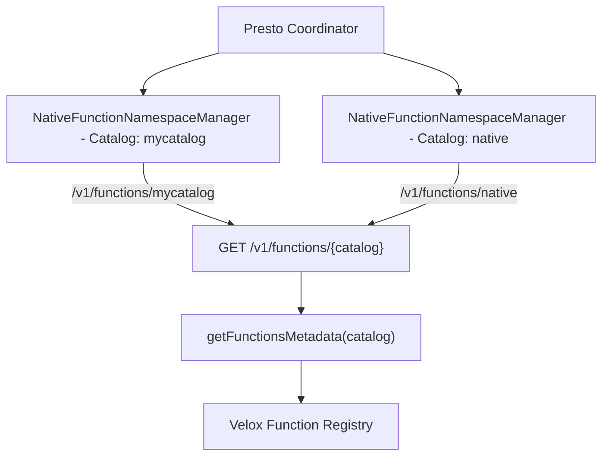

# **RFC-0017 for Presto**

## [Title] Support custom schemas in native sidecar function registry

## Summary
This feature enables namespace separation for C++ functions in Presto by allowing registration and querying of functions under different catalogs and schemas. It brings the native sidecar registry to feature parity with Java function namespace managers.

## [Related Issues]
- https://github.com/prestodb/presto/issues/25429

## Background
Currently, all functions (built-in and custom) were bundled together, preventing proper isolation and organization. Users could not namespace custom C++ functions separately from built-ins.

## Design & Architecture
The solution introduces catalog-based filtering:

- **C++ Backend:** Adds `/v1/functions/{catalog}` endpoint in `PrestoServer.cpp` that delegates to `getFunctionsMetadata(catalog)`.
- **Filtering Logic:** In `FunctionMetadata.cpp`, functions are filtered by catalog prefix (from fully qualified name: `catalog.schema.function_name`).
- **Java Plugin:** Each `NativeFunctionNamespaceManager` instance is bound to a catalog and queries only its catalog's functions from the sidecar.

## API Specification
- **GET /v1/functions**: Returns all functions (unfiltered).
- **GET /v1/functions/{catalog}**: Returns only functions from the specified catalog.

Example response for `/v1/functions/mycatalog`:
```json
{
  "my_custom_function": [
    {
      "outputType": "varchar",
      "paramTypes": ["varchar"],
      "schema": "myschema",
      "functionKind": "SCALAR",
      "routineCharacteristics": {
        "language": {"languageName": "CPP"},
        "determinism": "DETERMINISTIC",
        "nullCallClause": "RETURNS_NULL_ON_NULL_INPUT"
      }
    }
  ]
}
```

## Implementation Details
- Functions are registered in Velox as `catalog.schema.function_name`.
- Filtering is performed by splitting the function name and matching the catalog.

## Usage Example
Configure multiple function namespace managers:
```properties
# etc/function-namespace/mycatalog.properties
function-namespace-manager.name=native
function-implementation-type=CPP
supported-function-languages=CPP
```
