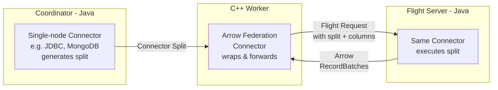

# **RFC-0018 for Java Connector Federation in C++ Workers**

## Java Connector Federation via Arrow Flight

Proposers

* Tim Meehan
* Bryan Cutler
* Pratik Dabre

## Related Issues

* [PR #25242](https://github.com/prestodb/presto/pull/25242): Custom Serialization Framework (ConnectorCodecProvider)
* Arrow Flight Connector in presto-native-execution

## Summary

Enable C++ workers to execute queries using existing single-node Java connector implementations through a dedicated Arrow Federation connector that forwards requests to an Arrow Flight server, providing a migration path for single-node connectors not yet ported to C++.

## Background

Presto's C++ workers provide performance improvements but require connectors to be rewritten in C++. Many single-node connectors (JDBC, MongoDB, Elasticsearch, Cassandra, Redis) are systems where the data transfer, not computation, is the bottleneck. Rewriting these connectors in C++ does not improve performance, yet they require a complete reimplementation.

By creating a dedicated Arrow Federation connector in C++ that derives from the existing Arrow Flight connector, we can forward splits from single-node Java connectors to a Flight server that executes them using the original Java connector implementations.

### Goals

* Enable single-node Java connectors to work with C++ workers without code duplication
* Provide a simple federation mechanism through a dedicated Arrow Federation connector
* Support connectors like JDBC, MongoDB, Elasticsearch, and other single-node systems

### Non-goals

* Distributed connectors (Hive, Iceberg, Delta Lake) where parallelism and C++ execution improve performance
* Modifying the coordinator-worker protocol

## Proposed Implementation

### 1. Architecture Overview



### 2. Module Changes

#### presto-native-execution: Arrow Federation Connector

##### Protocol Definition

The Arrow Federation connector uses a dedicated protocol to handle splits from single-node connectors:

```cpp
// ArrowFederationProtocol.h
namespace facebook::presto::protocol::arrow_federation {
using ArrowFederationProtocol = ConnectorProtocolTemplate<
    ArrowFederationTableHandle,
    ArrowFederationTableLayoutHandle,
    ArrowFederationColumnHandle,
    NotImplemented,
    NotImplemented,
    ArrowFederationSplit,
    NotImplemented,
    ArrowFederationTransactionHandle,
    NotImplemented,
    NotImplemented>;
} // namespace facebook::presto::protocol::arrow_federation
```

```cpp
// presto_protocol_arrow_federation.h
namespace facebook::presto::protocol::arrow_federation {
struct ArrowFederationSplit : public ConnectorSplit {
  String splitBytes = {};

  ArrowFederationSplit() noexcept;
};

void to_json(json& j, const ArrowFederationSplit& p) {
  auto split = folly::base64Decode(p.splitBytes);
  j = json::parse(split);
  j["@type"] = "arrow-flight";
}

void from_json(const json& j, ArrowFederationSplit& p) {
  p._type = j["@type"];
  p.splitBytes = folly::base64Encode(j.dump());
}
} // namespace facebook::presto::protocol::arrow_federation
```

##### Federation Connector Implementation

The Arrow Federation connector extends the Arrow Flight connector to wrap single-node connector splits and forward them:

```cpp
class ArrowFederationDataSource : public ArrowFlightDataSource {
 public:
  ArrowFederationDataSource(
      const velox::RowTypePtr& outputType,
      const velox::connector::ColumnHandleMap& columnHandles,
      std::shared_ptr<Authenticator> authenticator,
      const velox::connector::ConnectorQueryCtx* connectorQueryCtx,
      const std::shared_ptr<ArrowFlightConfig>& flightConfig,
      const std::shared_ptr<arrow::flight::FlightClientOptions>& clientOpts);

  void addSplit(
      std::shared_ptr<velox::connector::ConnectorSplit> split) override;
};

struct ArrowFederationSplit : public velox::connector::ConnectorSplit {
  /// @param splitBytes Base64 Serialized Split for Arrow Federation Flight Server
  /// Can contain any single-node connector split (JDBC, MongoDB, Elasticsearch, etc.)
  ArrowFederationSplit(const std::string& splitBytes)
      : ConnectorSplit(connectorId),
        splitBytes_(splitBytes) {}

  const std::string splitBytes_;
};
```

##### Request Creation and Split Processing

The federation connector wraps the connector split with column information and forwards it as a Flight request:

```cpp
void ArrowFederationDataSource::addSplit(
    std::shared_ptr<ConnectorSplit> split) {
  auto federationSplit = std::dynamic_pointer_cast<ArrowFederationSplit>(split);
  VELOX_CHECK(
      federationSplit,
      "ArrowFederationDataSource received wrong type of split");

  // Create request with split and column mapping
  nlohmann::json request = {
      {"split", federationSplit->splitBytes_},
      {"columns", this->columnMapping_}
  };

  // Create FlightEndpoint with request as ticket
  arrow::flight::FlightEndpoint flightEndpoint;
  flightEndpoint.ticket = request.dump();

  std::string flightEndpointBytes;
  AFC_ASSIGN_OR_RAISE(
      flightEndpointBytes,
      flightEndpoint.SerializeToString());

  // Create ArrowFlightSplit and forward to parent class
  auto flightSplit = std::make_shared<ArrowFlightSplit>(
      connectorId, flightEndpointBytes);

  // Let ArrowFlightDataSource handle the actual Flight communication
  ArrowFlightDataSource::addSplit(flightSplit);
}
```

The Arrow Federation connector leverages the existing Arrow Flight connector's infrastructure for communication with the Flight server, using the locally configured `arrow-flight.server` and `arrow-flight.server.port` properties.

#### presto-flight-server (new)
Flight server that loads connectors using Presto's plugin loading approach, adapted from the main Presto server implementation.

The Flight server uses standard Presto configuration structure:
- `jvm.config`: JVM heap size and flags (e.g., `-Xmx4G -XX:+UseG1GC`)
- `config.properties`: Flight server configuration including:
  - `catalog.config-dir`: Path to catalog configurations (default: `etc/catalog`)
  - `plugin.dir`: Path to plugin directory
  - Other Flight server-specific properties
- Catalog directory (as specified by `catalog.config-dir`): Connector configurations (jdbc.properties, mongodb.properties, etc.)

```java
public class FlightServerPluginManager {
  private final Map<String, ConnectorFactory> connectorFactories = new ConcurrentHashMap<>();
  private final Map<String, Connector> connectors = new ConcurrentHashMap<>();

  public void loadPlugins() throws Exception {
    // Use same approach as PluginManager to load from installed plugins dir
    for (File pluginDir : listFiles(installedPluginsDir)) {
      loadPlugin(pluginDir);
    }
  }

  private void loadPlugin(File pluginDir) {
    URLClassLoader pluginClassLoader = buildClassLoader(pluginDir);
    ServiceLoader<Plugin> serviceLoader = ServiceLoader.load(Plugin.class, pluginClassLoader);

    for (Plugin plugin : serviceLoader) {
      for (ConnectorFactory factory : plugin.getConnectorFactories()) {
        log.info("Registering connector %s", factory.getName());
        connectorFactories.put(factory.getName(), factory);
      }
    }
  }

  public Connector getConnector(String connectorName) {
    // Create connector instances from factories as needed
    return connectors.computeIfAbsent(connectorName, name -> {
      ConnectorFactory factory = connectorFactories.get(name);
      return factory.create(name, config, connectorContext);
    });
  }
}

public class ConnectorFlightProducer extends FlightProducer {
  private final FlightServerPluginManager pluginManager;

  @Override
  public void getStream(CallContext context, Ticket ticket,
          ServerStreamListener listener) {
    // Parse enhanced ticket with all execution context
    // Format: [version][connectorId_length][connectorId][params_length][params_serialized]
    String connectorId = extractConnectorId(ticket);
    PageSourceParameters params = extractParameters(ticket);

    // Get connector and deserialize all execution context
    Connector connector = pluginManager.getConnector(connectorId);
    ConnectorCodecProvider codecProvider = connector.getConnectorCodecProvider();

    // Deserialize transaction handle
    ConnectorTransactionHandle transactionHandle =
            codecProvider.getTransactionHandleCodec()
                    .deserialize(params.getTransactionHandle().toByteArray());

    // Deserialize split
    ConnectorSplit split = codecProvider.getConnectorSplitCodec()
            .deserialize(params.getSplit().toByteArray());

    // Deserialize column handles
    List<ColumnHandle> columns = deserializeColumns(params, codecProvider);

    // Reconstruct session from overrides (user, timezone, locale, query_id, etc.)
    ConnectorSession session = reconstructSession(params.getSessionOverrides(), connectorId);

    // Optional layout handle
    ConnectorTableLayoutHandle layout = deserializeLayout(params, codecProvider);

    // Split execution context
    SplitContext splitContext = new SplitContext(params.getSplitContextNanos());

    // Create page source with complete execution context
    ConnectorPageSource pageSource = connector.getPageSourceProvider()
            .createPageSource(
                    transactionHandle,
                    session,
                    split,
                    layout,
                    columns,
                    splitContext,
                    new RuntimeStats());

    streamPagesAsArrow(pageSource, listener);
  }
}
```

### 3. Configuration

#### Arrow Federation Connector Configuration

The Arrow Federation connector is configured through catalog properties like any other connector. The connector ID (catalog name) must be identical between the coordinator and C++ worker, even though they use different connector implementations. Both must use the same catalog configuration filename (e.g., `mongodb.properties`), which determines the connector ID/catalog name. This ensures splits are routed to the correct connector on the worker and allows the Flight server to load the appropriate Java connector for execution.

Example configuration:
```properties
# Coordinator: etc/catalog/mongodb.properties
connector.name=mongodb
mongodb.connection-url=mongodb://localhost:27017

# C++ Worker: etc/catalog/mongodb.properties (same filename)
connector.name=arrow-federation
arrow-flight.server=flight-server.internal
arrow-flight.server.port=8815
```

The Flight server is managed externally as a separate service.

### 4. Protocol Flow

#### Split Scheduling Phase
1. Coordinator's single-node connector (e.g., JDBC, MongoDB) creates its connector-specific split
2. Split is scheduled to C++ worker where the Arrow Federation protocol receives it but doesn't interpret it - it simply wraps the raw bytes as `ArrowFederationSplit` and forwards them unchanged to the Flight server

#### Split Processing Phase
1. C++ worker's Arrow Federation connector receives `ArrowFederationSplit`
2. Federation connector creates Flight request containing:
   - Original split bytes
   - Column mapping information
3. Request wrapped in FlightEndpoint and forwarded to parent ArrowFlightDataSource

#### Execution Phase
1. ArrowFlightDataSource sends request to configured Flight server
2. Flight server deserializes split and executes using Java connector
3. Results stream back as Arrow RecordBatches

### 5. Dependencies and Prerequisites

#### Arrow Flight Connector

The Arrow Federation connector depends on the existing Arrow Flight connector infrastructure in presto-native-execution. It extends `ArrowFlightDataSource` to reuse the Flight communication mechanisms.

#### Flight Request Format

The federation connector creates a simple JSON request containing:
- `split`: Base64-encoded serialized connector split (from any single-node connector)
- `columns`: Column mapping information needed for execution

The Flight server deserializes this request and executes the split using the appropriate Java connector.

## Metrics

* Flight protocol overhead (latency comparison between C++ worker and Flight server metrics)
* Data transfer throughput between C++ worker and Flight server

## Other Approaches Considered

**JNI Integration**: Direct JVM embedding in C++ workers. Rejected due to memory management and debugging requirements.

**Custom Protocol**: Thrift-based connector protocol. Arrow Flight chosen instead for columnar-native transport, existing ecosystem support, and potential for future cross-language connector implementations.

## Adoption Plan

* Configuration:
  - Configure catalogs to use `connector.name=arrow-federation` for federated execution
  - Set `arrow-flight.server` and `arrow-flight.server.port` to point to Flight server

* Flight server deployment:
  - Deploy `presto-flight-server` as a separate service
  - Configure with standard Presto server configuration structure
  - Can be colocated with C++ workers or deployed separately

* Migration:
  - Connectors can be migrated individually by creating federation catalog configurations
  - Documentation: Update connector documentation as federation support is added

## Test Plan

* Unit tests for split serialization and request creation
* Integration tests for end-to-end query execution through Flight server
* Performance tests comparing direct Java execution vs. federation through Flight
