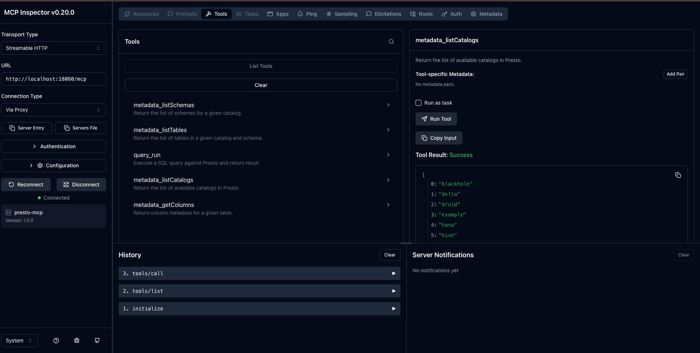
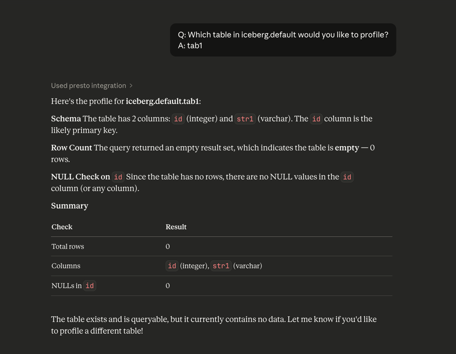
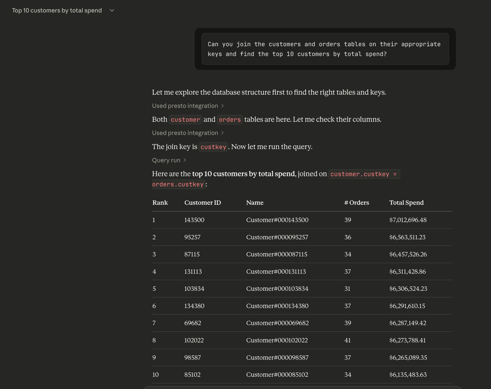

# **RFC-0022 for Presto**

## Presto Model Context Protocol Support

## Proposers

* Reetika Agrawal

## Related Issues

* https://github.com/prestodb/presto/pull/27300

## Summary

This proposal introduces support for integrating Model Context Protocol (MCP) with Presto through a separate lightweight process, referred to as the MCP Server.
The MCP Server acts as a protocol translation layer between AI agents using JSON-RPC and Presto’s existing HTTP-based query protocol.

## Background

Presto exposes a RESTful HTTP API for query submission and result retrieval. Clients submit a query via a POST request and receive a tokenized nextUri chain for incremental result fetching.
However, AI frameworks like OpenAI MCP operate on a request–response model over JSON-RPC, where clients expect complete results in a single response, not streamed batches.
Because MCP and Presto differ fundamentally in communication models, a direct integration is impractical. Additionally, direct embedding of MCP into Presto coordinators would disrupt routing and proxy layers that rely on Presto’s native HTTP semantics.

### Goals

- Enable MCP-compatible AI agents (e.g., OpenAI ChatGPT tools) to query Presto seamlessly.
- Preserve all existing Presto router, proxy, and load-balancing infrastructure without modification.
- Simplify authentication by reusing existing OAuth/JWT mechanisms.
- Prevent unbounded queries by applying automatic limits when appropriate.

### Proposed Plan

Introduce a new lightweight service: presto-mcp-server, deployed alongside Presto coordinators and Presto Router.

The MCP server will:

- Support multiple MCP transports:
    - stdio transport for local AI clients (Claude Desktop, Cline, etc.)
    - HTTP/SSE transport for remote AI clients and web integrations
- Implement JSON-RPC 2.0 protocol over both transports
- Expose HTTP endpoints at `/mcp` and `/v1/mcp` for HTTP-based clients
- Implement the core MCP primitives:
  - `tools/list` for tool discovery 
  - `tools/call` for executing tools
  - Provide a set of foundational MCP tools: 
    1. `query_run`, which supports only read-only, row-producing SQL statements (e.g. SELECT, SHOW, DESCRIBE). DML/DDL operations are intentionally excluded and can be introduced later as separate, mutation-oriented tools if needed.
    2. `metadata_listCatalogs` – returns available catalog names.
    3. `metadata_listSchemas` – returns available schema names.
    4. `metadata_listTables` – returns tables within a schema.
    5. `metadata.getColumns` – returns column metadata for a table.

metadata.getColumns – returns column metadata for a table.
- Internally communicate with Presto coordinators using standard Presto HTTP APIs.
- Forward OAuth/JWT Bearer tokens transparently from MCP clients to Presto, ensuring that Presto performs all authentication and authorization checks.
- Translate between the two protocols, aggregating streaming results into a single response within a configurable, enforced result-size limit.
- Remain stateless, delegating all query lifecycle management to Presto.

## Proposed Implementation

#### Core Changes

```json
JsonRpcServlet → McpDispatcher → ToolRegistry → QueryRunTool → PrestoQueryClient → Presto Coordinator
```

1. New Module: `presto-mcp-server`

   - Implements JSON-RPC 2.0 protocol.
   - Implements core MCP primitive like `tools/list` and `tools/call`
   - Handles methods like query.run.

2. On `query_run`:

   - Parses SQL input.
   - Optionally injects a LIMIT clause (if absent) to control data size.
   - Submits the query to Presto coordinator via /v1/statement.
   - Polls the returned nextUri until the query completes.
   - Returns final aggregated results as a single JSON-RPC response.

#### Example Queries

- `tools/list`

Request - 
```json
{
  "jsonrpc": "2.0",
  "id": 1,
  "method": "tools/list",
  "params": {}
}
```

Response -
```json
{
  "jsonrpc": "2.0",
  "id": 1,
  "result": {
    "tools": [
      {
        "name": "metadata_listSchemas",
        "description": "Return the list of schemas for a given catalog.",
        "inputSchema": {
          "type": "object",
          "properties": {
            "catalog": {
              "type": "string"
            }
          },
          "required": [
            "catalog"
          ]
        }
      },
      {
        "name": "metadata_listTables",
        "description": "Return the list of tables in a given catalog and schema.",
        "inputSchema": {
          "type": "object",
          "properties": {
            "catalog": {
              "type": "string"
            },
            "schema": {
              "type": "string"
            }
          },
          "required": [
            "catalog",
            "schema"
          ]
        }
      },
      {
        "name": "query_run",
        "description": "Execute a SQL query against Presto and return result",
        "inputSchema": {
          "type": "object",
          "properties": {
            "sql": {
              "type": "string"
            }
          },
          "required": [
            "sql"
          ]
        }
      },
      {
        "name": "metadata_listCatalogs",
        "description": "Return the list of available catalogs in Presto.",
        "inputSchema": {
          "type": "object"
        }
      },
      {
        "name": "metadata_getColumns",
        "description": "Return column metadata for a given table.",
        "inputSchema": {
          "type": "object",
          "properties": {
            "catalog": {
              "type": "string"
            },
            "schema": {
              "type": "string"
            },
            "table": {
              "type": "string"
            }
          },
          "required": [
            "catalog",
            "schema",
            "table"
          ]
        }
      }
    ]
  }
}
```

- `tools/call → query_run`

Request - 
```json
{
  "jsonrpc": "2.0",
  "id": 2,
  "method": "tools/call",
  "params": {
    "name": "query_run",
    "arguments": { "sql": "SELECT 1" }
  }
}
```

Response -
```json
{
  "jsonrpc": "2.0",
  "id": 2,
  "result": {
    "content": [
      {
        "type": "text",
        "text": "[[1]]"
      }
    ]
  }
}
```

### Rationale

  - Support both stdio and HTTP transports to maximize compatibility:
    - stdio for desktop AI assistants (Claude Desktop, Cline)
    - HTTP/SSE for web-based clients and remote integrations
  - This dual-transport approach makes the server truly generic and compatible with any MCP-compliant client
  - Introduce a new standalone service (presto-mcp-server) to avoid mixing dual-transport with Presto’s stateful HTTP protocol.
  - Translate MCP tool calls into Presto HTTP queries, using the existing StatementClient to follow nextUri pages and aggregate results into a single MCP response.
  - Keep the MCP server stateless, with all query lifecycle state remaining on Presto coordinators.
  - Forward OAuth/JWT Bearer tokens directly from MCP clients to Presto, allowing Presto to perform full authentication and authorization without changes.
  - Preserve all existing Presto infrastructure (Router, proxies) by keeping MCP outside the coordinator and communicating using standard Presto HTTP APIs.

## Backward Compatibility Considerations

  - MCP server is a new optional component
  - No impact on existing Presto or Router
  - All existing Presto deployments remain unchanged

## Test Plan

### Testing Methodology

- **Unit + Integration Tests:**
Verify ToolRegistry loading, dispatcher routing, SQL execution via QueryRunTool, and JSON-RPC error handling.

### Test Results

#### MCP Inspector Testing (HTTP Transport)



  - All 5 tools visible and properly documented
  - JSON-RPC protocol working correctly

#### Claude Desktop Testing (STDIO Transport)





  - Successful tool discovery and invocation
  - SQL query executed and results returned correctly

## Modules involved
- `presto-mcp` (new module)
- `presto-client`
- `airlift` modules
- `presto-main`

## Final Thoughts

This proposal cleanly bridges Presto with next-generation agent ecosystems (LLMs, AI workflows, model interaction tools). The MCP server architecture respects Presto’s deployment patterns, is backward-compatible, and provides a robust extension point for future interactive functionality such as:

- Schema browsing tools
- Table metadata tools
- Query explanation tools
