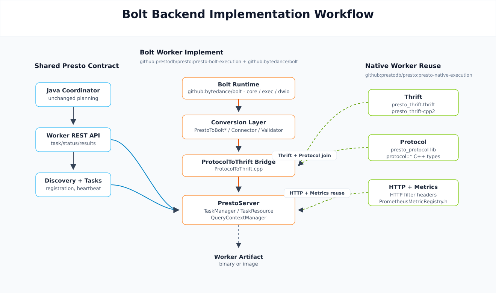

# RFC-0024: Introduce Bolt Backend for Presto Native Execution

## Proposers

* frankobe
* Weixin Xu
* Zac Blanco

## Related Issues

* [prestodb/rfcs#59](https://github.com/prestodb/rfcs/pull/59)
* [Weixin-Xu/presto#1](https://github.com/Weixin-Xu/presto/pull/1)

---

## Summary
This RFC introduces Bolt as an additional backend for Presto's native worker implementation.

The initial implementation keeps the existing Velox-based worker unchanged and adds a sibling module, `presto-bolt-execution`, that implements the same Presto worker protocol against Bolt. The coordinator, query protocol, and external worker model remain unchanged.

The current code does not turn `presto-native-execution` into a generic shared framework. Instead, it adds a Bolt-specific worker tree and extracts only a small set of reusable helpers from `presto-native-execution`. Build enablement is also separate in the initial implementation: Velox and Bolt are built from different module directories and produce different worker binaries from different build roots.

---

## Background

Bolt is a C++ execution library for analytical workloads. It provides its own plan, expression, operator, connector, and serialization layers, and can serve as the execution backend for a Presto native worker as long as the worker continues to speak the existing Presto worker protocol.

See: [bytedance/bolt](https://github.com/bytedance/bolt)

The implementation in [Weixin-Xu/presto#1](https://github.com/Weixin-Xu/presto/pull/1) validates this model by adding a Bolt-based worker that:

* speaks the existing Presto worker REST/thrift protocol,
* runs under the same external worker model used by the native worker tests,
* reuses only a narrow slice of existing native-execution code,
* keeps Bolt-specific planning and execution logic inside a dedicated module.

This allows us to add a second backend without changing the Java coordinator.

---

## Goals

* Add a Bolt-based native worker backend for Presto.
* Keep the coordinator and worker protocol unchanged.
* Keep backend selection simple and explicit at build and deployment time.
* Reuse only the parts of `presto-native-execution` that are already backend-agnostic or can be made backend-agnostic with small extracts.
* Reuse the existing native-worker test model and test data layouts as much as possible.

### Non-Goals

* Per-query or mixed-backend runtime scheduling within the same worker process.
* Turning `presto-native-execution` and `presto-bolt-execution` into one fully shared backend framework in the initial change.
* Changing the Java coordinator, worker REST protocol, or query protocol.
* Making Bolt part of the repo-wide root Maven reactor in the initial implementation.

---

## Proposed Implementation

### High-Level Shape

The initial implementation adds a new top-level module:

* `presto-native-execution`: existing Velox-based native worker
* `presto-bolt-execution`: new Bolt-based native worker

Each module owns its own worker server sources, build files, tests, and packaging flow. At runtime, the coordinator talks to either backend through the same worker protocol.

This means backend choice is made by selecting which worker binary to build, package, and launch. It is not a runtime flag inside a single worker binary.

### Bolt Worker Structure

The Bolt module contains its own:

* `presto_cpp/main`: worker server, task management, HTTP endpoints, operators, runtime metrics, and backend-specific task logic
* `presto_cpp/types`: Presto-to-Bolt plan, expression, connector, and split conversion
* `presto_cpp/presto_protocol`: Bolt-side generated protocol sources
* `src/test/java/com/facebook/presto/nativeworker`: Java external-worker and correctness tests
* Docker/Testcontainers assets for packaging and smoke testing
* Conan/CMake build files for Bolt dependencies

The coordinator contract stays the same. The Bolt worker still registers with discovery, accepts task updates, returns task info and results, and exposes the same worker endpoints expected by Presto.

### Plan and Protocol Flow

At a high level, the Bolt worker follows this flow:

1. The Java coordinator creates the same Presto plan fragments it already produces today.
2. The Bolt worker deserializes those fragments using the existing Presto protocol model.
3. Bolt-specific converters translate Presto plans, expressions, splits, and connector handles into Bolt-native structures.
4. Bolt executes the resulting plan and reports task state, results, and metrics back through the existing worker protocol.

The current code includes dedicated Bolt converters such as:

* `PrestoToBoltQueryPlan`
* `PrestoToBoltExpr`
* `PrestoToBoltConnector`
* `PrestoToBoltSplit`
* `BoltPlanConversion` and `BoltPlanValidator`

This is intentionally backend-local. The initial implementation does not try to share plan conversion logic with the Velox backend.

---

## Changes to `presto-native-execution` Architecture

The RFC draft should be explicit that the architecture change in this PR is incremental, not a large refactor.

### What Is Reused

The Bolt implementation reuses a small number of assets from `presto-native-execution`:

* small HTTP filter helper headers extracted for shared formatting and response behavior
* shared runtime-metrics helper header for Prometheus registry plumbing
* existing thrift base definitions and thrift-generation support files
* existing protocol base YAML files that define shared Presto protocol shapes

These are reused directly from the sibling `presto-native-execution` source tree rather than from a new shared library.

### What Stays Backend-Local

The following remain backend-specific in the current implementation:

* worker server implementation
* task execution logic
* operators
* plan, expression, connector, and split conversion
* backend-specific runtime metrics and error translation
* build system and dependency resolution
* Java integration-test module and packaging assets

### Important Constraint

`presto-bolt-execution` currently depends on the presence of the sibling `presto-native-execution` source tree. This is visible in the build files:

* Bolt reuses native thrift inputs from `../presto-native-execution/presto_cpp/main/thrift`
* Bolt protocol YAML files include native base YAML files from `presto-native-execution`
* Bolt includes a small number of native helper headers by source-tree path

So the code is organized as "separate module with selective source reuse", not "fully standalone module" and not "shared common library".

---

## Build and Backend Enablement

### Build Model in the Current Implementation

The two backends are enabled as separate module builds:

* Velox backend: built from `presto-native-execution`
* Bolt backend: built from `presto-bolt-execution`

The Bolt backend has its own:

* `CMakeLists.txt`
* `Makefile`
* `conanfile.py`
* module-local `pom.xml`

The current code therefore supports building both backends in the same source tree, but not through one shared root-level switch. A developer chooses the backend by entering the corresponding module directory and invoking that module's build flow.

### C++ Build Controls

The Bolt module exposes CMake and Conan controls comparable to the existing native worker flow, including:

* `PRESTO_ENABLE_TESTING`
* `PRESTO_ENABLE_HDFS`
* `PRESTO_ENABLE_S3`
* `PRESTO_ENABLE_PARQUET`
* `PRESTO_ENABLE_JEMALLOC`
* Conan `enable_testing`

This keeps the worker build configurable without affecting the existing Velox build.

### Packaging and Deployment Selection

The worker selected for deployment is determined by the binary path or image chosen by the launcher:

* local external-worker tests point `PRESTO_SERVER` at the desired worker binary
* container tests point `workerImage` at the desired worker image
* production packaging would likewise choose either the Velox worker artifact or the Bolt worker artifact

In other words, build-time and deployment-time backend selection is explicit and coarse-grained:

* one worker process -> one backend
* one binary/image -> one backend
* no mixed backend inside one worker binary

### Follow-Up Work

Repo-wide reactor integration and cleaner root-level build switching can be added later, but they are not part of the current PR and should not be described as already implemented.

Another follow-up is to move shared thrift inputs, protocol base YAML files, and helper headers out of `presto-native-execution` into a new top-level `presto-native-common/` module. The intent is for Velox and Bolt to depend on that module as siblings, rather than having Bolt depend directly on selected files under `presto-native-execution`. This should land as a separate mechanical PR after the initial Bolt backend PR.

---

## Protocol and Thrift Strategy

The implementation continues to use Presto's existing worker protocol and thrift contract.

The current code shape is:

* Bolt keeps its own generated `presto_protocol` sources in `presto-bolt-execution`
* Bolt reuses the native worker's thrift inputs and thrift support logic where possible
* Bolt preprocesses the reused thrift input as needed for its own build

This keeps the over-the-wire contract aligned with the existing worker protocol while avoiding a large upfront rewrite of thrift generation.

---

## Adoption Plan

The Bolt backend is introduced as an optional alternative native worker implementation.

Existing Velox-based native deployments are unaffected.

Initial adoption is expected to look like this:

1. Build `presto-bolt-execution`.
2. Launch Bolt workers instead of Velox workers.
3. Keep the existing Java coordinator unchanged.
4. Validate query correctness and operational behavior with the existing native-worker test model.

The initial implementation assumes a homogeneous worker pool per deployment. Running both native backends in one cluster, or scheduling different queries to different native backends, is outside the scope of this RFC.

---

## Test Plan

Testing should be described as layered so we get good coverage without duplicating large data sets or packaging flows.

### 1. C++ Unit Tests

Bolt has module-local C++ unit tests gated by `PRESTO_ENABLE_TESTING` / Conan `enable_testing`.

These tests cover:

* protocol serialization/deserialization
* thrift glue
* HTTP/filter helpers
* runtime metrics
* operators
* plan and expression conversion
* split and connector conversion
* worker server components

Locally, this is the fastest feedback loop and should run first.

### 2. Java External-Worker Integration Tests

The main correctness suite reuses the same external-worker model as the native worker tests:

* Java coordinator starts in-process
* Bolt worker binaries start as external processes
* the test harness points to the worker binary through `PRESTO_SERVER`
* `DATA_DIR` and optional `WORKER_COUNT` control the shared test data layout and worker fanout

This suite covers:

* worker startup, discovery, and heartbeat
* task submission and result retrieval
* TPCH query correctness
* Hive connector behavior
* writer/CTAS flows
* plan validation
* configuration-sensitive behavior such as thrift transport and storage format variants

The `presto-native-tests` harness is reused as-is against the Bolt worker. Bolt-specific gaps relative to Presto Java are tracked with a small skip list, and the expectation is to shrink that skip list over time as Bolt closes backend compatibility gaps.

The current module already organizes subsets with test groups such as:

* default suite
* `parquet`
* `remote-function`
* `textfile_reader`

This allows CI to split expensive cases without changing the core harness.

### 3. Container-Based Smoke Tests

The module also includes a container smoke-test path using Testcontainers.

This path:

* builds or references one coordinator image and one worker image,
* starts one coordinator and a small Bolt worker pool,
* generates config files at test time instead of checking in large environment-specific configs,
* uses `tpch.tiny` so it does not require separate bulk data loading.

This is intended as a packaging and deployment sanity check, not as the primary correctness suite.

### 4. Reusing Resources Instead of Duplicating Them

To keep Bolt testing cost under control, the initial plan is to reuse the same kinds of runtime resources already used by the native worker tests:

* same Java coordinator-side test harness pattern
* same `PRESTO_SERVER` / `DATA_DIR` / `WORKER_COUNT` contract
* same TPCH/Hive data layout conventions
* same small container smoke topology
* same native tests from `presto-native-tests`
* same Docker build profile shape for coordinator + worker images

The main thing that changes between backends is the worker binary or worker image. The coordinator artifact, test query patterns, and data conventions stay the same.

Short term, the code keeps Bolt tests in a separate module so backend-specific jobs remain isolated. Long term, we can reduce duplicated Java test sources further, but the immediate objective is to avoid duplicating heavyweight runtime resources and datasets.

### 5. CI Plan

CI for Bolt should be split into a few clear lanes:

1. **Build + C++ unit tests**
   Build `presto-bolt-execution` and run module-local `ctest`.

2. **Java external-worker correctness**
   Build the Bolt worker once, then run the Java native-worker suites against that worker binary using `PRESTO_SERVER`, including `presto-native-tests`.

3. **Focused optional lanes**
   Run heavier or specialized groups separately, for example `parquet`.

4. **Container smoke**
   Build the coordinator and Bolt worker images and run a small Testcontainers smoke suite.

This keeps most validation on the cheaper external-worker harness and reserves container-based validation for packaging smoke checks.

### 6. Local Developer Workflow

A practical local workflow is:

1. build the Bolt worker in `presto-bolt-execution`
2. run C++ unit tests
3. run targeted Java external-worker tests with `PRESTO_SERVER=<bolt worker binary>`
4. run `presto-native-tests` with `PRESTO_SERVER=<bolt worker binary>`

This gives a fast local loop while preserving comparability with CI.

---

## Risks and Limitations

* The current implementation is not yet a repo-wide selectable backend in the root Maven reactor.
* `presto-bolt-execution` currently depends on sibling sources from `presto-native-execution`.
* The shared surface between backends is intentionally small, so some source duplication remains in the initial landing.
* The native sidecar integration is currently Velox-shaped. Bolt clusters should run with the sidecar plugin disabled until Bolt registers its own callbacks behind the same HTTP endpoint shapes.
* Testing is designed to reuse datasets and harness patterns, but further consolidation of duplicated test sources can happen later.

---

## Conclusion

The code in [Weixin-Xu/presto#1](https://github.com/Weixin-Xu/presto/pull/1) adds Bolt as a second native backend by introducing a sibling `presto-bolt-execution` module, reusing only a narrow set of extracted helpers and protocol/thrift inputs from `presto-native-execution`, and preserving the existing coordinator and worker protocol.

The RFC should describe that implementation directly:

* separate backend module,
* explicit build-time backend selection,
* unchanged coordinator contract,
* small shared extracts instead of a large framework refactor,
* layered testing that reuses the same coordinator model, data layout, and container topology instead of duplicating heavyweight resources.

## TBD

1. How will future divergence between Bolt, Velox, and Presto be handled, especially when protocol or interface changes are not fully compatible across projects?

2. When multiple homogeneous backend pools are deployed, how can the planner avoid generating plans that the target backend pool cannot execute?
