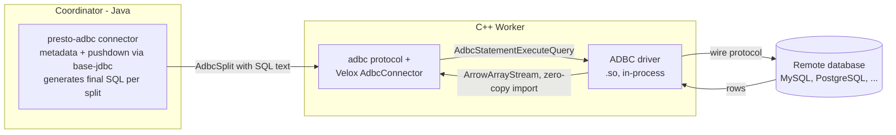

# **RFC-0026 for Presto**

## Native ADBC Connector for C++ Workers

Proposers

* Jianjian Xie

## Related Issues

* [RFC-0018: Java Connector Federation in C++ Workers](RFC-0018-java-connector-federation.md) — solves the same class of problem through a Java Flight server; see the comparison section below.
* [RFC-0009: JDBC join push down](RFC-0009-jdbc-join-push-down.md) — coordinator-side pushdown machinery this RFC reuses.
* [RFC-0004: Arrow Flight connector](RFC-0004-arrow-flight-connector.md) — prior art for Arrow-native data ingestion in the native worker.
* [velox#18258](https://github.com/facebookincubator/velox/pull/18258): generic ADBC connector for Velox (scan execution layer for this RFC).

## Summary

Enable C++ workers to scan relational databases (MySQL, PostgreSQL, and other systems with ADBC drivers) directly, in-process, through [Arrow ADBC](https://arrow.apache.org/adbc/) — a vendor-neutral C API whose drivers return query results as Arrow data. The coordinator keeps using the existing Java `base-jdbc` machinery for metadata and pushdown planning and embeds the final SQL text in each split; the C++ worker executes that SQL against the remote database through an ADBC driver and imports results into Velox vectors zero-copy.

This is a complement to RFC-0018 (Java connector federation), not a replacement: federation can forward splits from any Java connector (its stated goals focus on single-node systems, but the mechanism is general) at the cost of an extra service and an extra data hop; the ADBC path covers the subset of systems with ADBC drivers and removes both.

## Background

Presto's C++ workers require connectors to be implemented natively. For relational databases the Java engine has a mature family of `base-jdbc` connectors (mysql, postgresql, oracle, sqlserver, ...), none of which run on the native worker today. RFC-0018 addresses this by forwarding opaque Java splits from the C++ worker to a separate Java Arrow Flight server that executes them with the original connector.

That design is maximally general, but for the RDBMS family a native alternative now exists:

* **ADBC** is Apache Arrow's database connectivity standard: a stable C API (`AdbcDatabase` / `AdbcConnection` / `AdbcStatement`) implemented by per-database drivers, with results delivered as an Arrow `ArrowArrayStream`. Drivers exist for PostgreSQL, SQLite, Snowflake, Flight SQL, BigQuery, DuckDB, and MySQL ([adbc-drivers/mysql](https://github.com/adbc-drivers/mysql)). A small, dependency-free driver manager loads drivers as shared libraries.
* **Velox now has a generic ADBC connector** ([velox#18258](https://github.com/facebookincubator/velox/pull/18258)): one connector serves every database; the driver is chosen by configuration, driver-specific options pass through a config prefix, and each Arrow chunk of the result stream is imported into Velox vectors through the Arrow C-ABI bridge with the vectors taking ownership of the driver's buffers (no copy).

Because ADBC drivers speak Arrow natively and Velox consumes Arrow natively, the entire data path from the database wire protocol to Velox vectors runs in the worker process with a single format conversion (wire format → Arrow, inside the driver). There is no intermediate service, no JVM in the data path, and no second serialization hop. This also removes a conversion the Java path always pays: `base-jdbc` consumes results through a row-at-a-time `RecordCursor` and converts rows to columnar pages (under RFC-0018, the row → Arrow conversion happens in the Flight server instead).

### Goals

* Scan ADBC-capable databases from C++ workers directly, starting with MySQL and PostgreSQL.
* Reuse the coordinator's existing Java `base-jdbc` metadata and pushdown planning unchanged; the worker performs no planning — it assembles the final SQL from pre-rendered pieces (predicate from the split, SELECT list from the column handles) and executes it.
* Keep the worker-side implementation generic: adding a database means deploying its ADBC driver and writing a catalog file, not writing C++ code.

### Non-goals

* Replacing RFC-0018. Systems without ADBC drivers (MongoDB, Elasticsearch, Cassandra, Redis, and any other Java connector) remain federation's domain.
* Writes (`INSERT`/`CTAS`) — the Velox connector is read-only today; `AdbcStatementBind` makes writes a natural follow-up.
* Distributed connectors (Hive, Iceberg, Delta Lake).
* Coordinator-side use of ADBC. Metadata volume is small; JDBC on the coordinator is not a bottleneck.

## Proposed Implementation

### 1. Architecture Overview



Split scheduling, task protocol, and exchange are untouched. The only new coordinator→worker contract is the ADBC connector protocol (table handle, column handle, split).

### 2. Module Changes

#### How `base-jdbc` executes a scan today (for reference)

The design below is a point-for-point mapping of the existing `presto-base-jdbc` flow, so it is worth stating that flow precisely:

* Metadata, type mapping, and dialect knowledge live in coordinator-side `JdbcClient` plugins. For example, `MySqlClient` supplies the backtick identifier quote and per-column SELECT expressions (it wraps geometry columns in `ST_AsBinary(...)`).
* `JdbcComputePushdown`, a connector plan optimizer, translates filter row expressions into a `JdbcExpression` — a SQL fragment plus a list of bound `ConstantExpression`s — stored in the table layout.
* `getSplits` produces exactly one `JdbcSplit` per scan (`FixedSplitSource`), carrying the remote catalog/schema/table name, the pushed-down `TupleDomain`, and the optional `JdbcExpression`. Crucially, `JdbcMetadata.getTableLayoutForConstraint` returns the constraint summary as *unenforced*, so the engine re-applies the predicate above the scan: connector-side filtering is a pure optimization and can never change results.
* On the Java worker, SQL is rendered at scan time: `QueryBuilder` builds `SELECT <columns> FROM <table> WHERE <TupleDomain conjuncts> AND <JdbcExpression>` as a `PreparedStatement` with `?` placeholders and binds the constants separately — literals are never inlined into SQL text. Results are consumed through a row-at-a-time `RecordCursor` and converted to Presto pages.

#### presto-adbc (new Java module, coordinator only)

A thin connector deriving from `presto-base-jdbc`. Metadata, type mapping, dialect rules, and `JdbcComputePushdown` are reused unchanged; what changes is where SQL is rendered, because the native worker cannot call `QueryBuilder`:

* **Split generation renders the WHERE clause.** All of `QueryBuilder`'s predicate inputs — the `TupleDomain` and the `JdbcExpression` — are already in the layout handle at split time, so `AdbcSplit` carries the rendered WHERE text with `?` placeholders plus the ordered bound constants (type and value), alongside the remote table name and the dialect's identifier quote.
* **The SELECT list is composed on the worker,** not in the split, because projected columns are not known at split-generation time — they arrive with the scan's column assignments, which the native worker has at plan-conversion time. `AdbcColumnHandle` maps each Presto column to its remote SELECT expression, rendered by the coordinator's dialect-aware `JdbcClient` (defaulting to the quoted column name, preserving per-column rewrites like `ST_AsBinary`).
* **Constants bind natively.** ADBC has the same prepared-statement model as JDBC: `AdbcStatementBind` accepts parameters as an Arrow record batch, a 1:1 match for `QueryBuilder`'s `?` placeholder protocol. Phase 1 sidesteps binding by inlining a safe literal subset (integers, decimals, escaped strings, dates) and leaving other predicates unpushed — correct by construction, since the engine re-applies the full predicate; Phase 2 ships the constants in the split and adds parameter binding to the Velox connector.

The JDBC driver jar is needed on the coordinator only, for metadata.

#### presto-native-execution: ADBC connector protocol

Following the established pattern (`hive`, `tpch`, `arrow-flight`):

```cpp
// AdbcProtocol.h
namespace facebook::presto::protocol::adbc {
using AdbcProtocol = ConnectorProtocolTemplate<
    AdbcTableHandle,
    AdbcTableLayoutHandle,
    AdbcColumnHandle,
    NotImplemented,
    NotImplemented,
    AdbcSplit,
    NotImplemented,
    AdbcTransactionHandle,
    NotImplemented,
    NotImplemented>;
} // namespace facebook::presto::protocol::adbc
```

A `PrestoToVeloxConnector` implementation maps the protocol structs onto the Velox ADBC connector:

* The conversion composes the final SQL — `SELECT <rendered column expressions, aliased to their remote names> FROM <table> WHERE <split's rendered predicate>` — and hands it to the Velox `AdbcTableHandle` in query mode (executed verbatim).
* `AdbcColumnHandle.remoteName` → Velox `AdbcColumnHandle`; result columns are matched by case-insensitive name and validated for type equivalence at scan time. SELECT-list expressions are aliased (`AS <remoteName>`) so matching stays name-based.
* One Presto split maps to one Velox split (a remote database is not splittable; `base-jdbc` likewise emits exactly one split per scan).

#### Velox (dependency, already implemented)

[velox#18258](https://github.com/facebookincubator/velox/pull/18258) provides the execution layer behind a `VELOX_ENABLE_ADBC_CONNECTOR` build flag: the vendored ADBC driver manager, connection/statement lifecycle per split, Arrow stream import with buffer ownership transfer, and driver-error propagation into Velox exceptions. Prestissimo enables the flag and registers the connector factory alongside the protocol mapping.

### 3. Configuration

Coordinator and worker share the catalog name; each side reads the properties relevant to it:

```properties
# Coordinator: etc/catalog/mysql.properties
connector.name=adbc
connection-url=jdbc:mysql://mysql.internal:3306     # metadata only
connection-user=presto
connection-password=...

# C++ Worker: etc/catalog/mysql.properties
connector.name=adbc
adbc.driver=adbc_driver_mysql                        # shared library name or path
adbc.option.uri=mysql://mysql.internal:3306
adbc.option.username=presto
adbc.option.password=...
```

Any `adbc.option.<name>` key passes through to `AdbcDatabaseSetOption`, so driver-specific options (TLS, timeouts, session settings) need no Presto changes. Worker credentials should come from the deployment's secret mechanism rather than plaintext catalog files; this is the same posture as any native connector that talks to external storage (S3 keys, etc.).

### 4. Protocol Flow

1. Coordinator plans the query with `presto-adbc`: metadata via JDBC, filter pushdown via the existing `TupleDomain` and `JdbcComputePushdown` machinery, and one `AdbcSplit` per table scan carrying the rendered WHERE clause and its constants.
2. The split is scheduled to a C++ worker. The `adbc` protocol deserializes it, and the `PrestoToVeloxConnector` mapping composes the final SQL from the column assignments and the split, producing a Velox table handle in query mode.
3. The Velox ADBC connector opens a connection from the connector's shared `AdbcDatabase`, executes the SQL, and streams `ArrowArrayStream` chunks; each chunk is imported zero-copy and flows into the operator pipeline.
4. Driver errors surface as query failures carrying the driver's message and ADBC status code.

## Comparison with RFC-0018 (Java Connector Federation)

Federation can execute any Java connector, so the two proposals overlap wherever an ADBC driver exists; elsewhere federation is the only option. Where they overlap, the tradeoff is:

| Dimension | RFC-0018 federation | This RFC (native ADBC) |
| --- | --- | --- |
| Connector coverage | Any Java connector (JDBC, MongoDB, ES, Cassandra, Redis, ...). RFC-0018 scopes its goals to single-node systems, but the split-forwarding mechanism is general | Systems with ADBC drivers (MySQL, PostgreSQL, SQLite, Snowflake, Flight SQL, BigQuery, ...) |
| Data path | DB → Flight server (row→Arrow conversion in JVM) → Flight RPC → worker | DB → in-process driver (wire→Arrow) → worker; one conversion, no extra hop |
| New infrastructure | A Flight server fleet to deploy, size, monitor, and upgrade | ADBC driver shared libraries on workers; no new service |
| JVM in data path | Yes (Flight server heap sized for scan throughput) | No |
| Connector code reuse | Full Java connector, including its page source | Java side reused for metadata/planning only; scan is the generic Velox connector |
| Pushdown semantics | Whatever the Java connector does, unchanged | Same planning path (`TupleDomain` + `JdbcComputePushdown`); rendering is split between coordinator (predicate) and worker (SELECT list). Anything not pushed stays correct because the engine re-applies the predicate |
| Credential surface | Centralized on the Flight server | Distributed to every worker |
| Connection fan-out | Flight server can pool/limit connections to the DB | Each worker connects directly; N workers × concurrent splits connections (mitigations: connection reuse per connector instance, future per-catalog concurrency limits) |
| Failure isolation | Flight server is a shared dependency and potential bottleneck/SPOF | Worker-local; a driver bug affects that worker's process (mitigable by out-of-process drivers later) |
| Latency | Two network hops + Flight serialization | One network hop |

**Recommended posture: adopt both.** Use the ADBC path as the fast path for high-volume RDBMS scans where drivers exist, and federation as the general fallback for everything else. A deployment can even split per catalog: `mysql.properties` on ADBC, `mongodb.properties` on federation. The coordinator-side experience (catalogs, SQL, pushdown) is identical either way.

Two specific risks of the ADBC path and their mitigations:

* **Driver maturity varies.** The PostgreSQL and Snowflake drivers are mature; the MySQL driver is newer. The worker treats a driver crash as a process risk; deployments should qualify a pinned driver version per catalog, and the driver manager's manifest mechanism supports that pinning.
* **Type-mapping edge cases** (unsigned MySQL integers, zero dates, `DECIMAL` precision) are handled in two places: the driver (wire→Arrow) and the coordinator's existing JDBC type mapping (which decides the Presto type). Divergence between the two surfaces as a type-equivalence error at scan time rather than silent corruption; the test plan covers the known edge cases.

## Metrics

* Scan throughput and per-split latency vs the same catalog through RFC-0018 federation (primary comparison).
* Rows/bytes produced per split, ADBC connection open latency, and driver-error rates, exposed as runtime stats on the scan operator.
* Remote database connection counts per catalog (to validate the fan-out concern).

## Other Approaches Considered

**Only RFC-0018 federation.** Works, but for the RDBMS family it pays a permanent tax — an extra service and an extra hop — on the connectors most likely to carry heavy scan volume. The 80/20 here favors giving the common case a direct path.

**Reimplement each RDBMS wire protocol in C++.** A per-database native connector (a hand-written MySQL client in Velox, etc.) duplicates exactly the work the ADBC driver ecosystem already does and maintains, with none of the reuse across engines.

**ODBC.** Broad driver coverage, but row-oriented: every result would pay a row→columnar conversion in the worker, and driver managers/drivers are a notorious operational surface. ADBC exists precisely to fix this for analytics.

**JNI-embedding the Java connector in the worker.** Rejected by RFC-0018 as well; memory management and debugging across the boundary.

## Open Questions

* **Dialect selection in `presto-adbc`.** Dialect knowledge lives in per-database `JdbcClient` implementations bound by their own modules (`MySqlClient` in `presto-mysql`, `PostgreSqlClient` in `presto-postgresql`), so a single `connector.name=adbc` module needs a way to pick one. Options: an explicit `adbc.dialect=mysql` catalog property (leaning), deriving it from the `connection-url` prefix, or shipping per-database plugin variants that each bind one client.
* **Phase 1 literal subset: include strings?** String escaping is dialect- and mode-dependent (MySQL's `NO_BACKSLASH_ESCAPES`, PostgreSQL's `standard_conforming_strings`), and collation-sensitive remote comparison could diverge from Presto semantics. Since the engine re-applies the predicate anyway, restricting Phase 1 inlining to integers, decimals, and dates (leaning) costs only pushdown coverage, never correctness; strings then arrive with Phase 2 parameter binding.
* **Connection cap in Phase 1?** Per-catalog concurrency limits are scheduled for Phase 2, but worker→database fan-out (N workers × concurrent splits) is the primary operational objection to the direct-connect model. Should a simple per-worker, per-catalog max-connections setting ship in Phase 1?

## Adoption Plan

* No changes to existing users; the `adbc` connector is opt-in per catalog. No SQL grammar, client API, or protocol changes beyond the new connector protocol structs.
* Phase 1: MySQL and PostgreSQL catalogs, read-only; projection pushdown plus predicate pushdown for a safe inlinable-literal subset (other predicates remain engine-side, which is correct because `base-jdbc` layouts report the constraint as unenforced). Prestissimo builds with `VELOX_ENABLE_ADBC_CONNECTOR=ON`; drivers ship as deployment artifacts, not build dependencies.
* Phase 2: full predicate parity via `AdbcStatementBind` parameter binding (matching `QueryBuilder`'s `?` placeholder protocol), limit pushdown, join pushdown reuse (RFC-0009), per-catalog connection concurrency limits.
* Phase 3 (independent): writes via `AdbcStatementBind`.
* Documentation: a connector page describing catalog setup for coordinator and worker sides, driver deployment, and the decision guide vs federation.

## Test Plan

* Velox layer is already covered: end-to-end `TableScan` plans against a hermetic in-process fake ADBC driver (round trips with nulls, SQL text verification, column reordering, error propagation, serde) — no database required in CI.
* presto-adbc: unit tests for coordinator-side predicate rendering — `TupleDomain` conjuncts and `JdbcExpression` fragments against `QueryBuilder`'s output as the reference, plus literal-inlining rules (escaping, date/decimal formatting) per dialect.
* presto-native-execution: protocol serde round-trip tests for the new structs; e2e tests running the full coordinator→worker path against the SQLite ADBC driver (hermetic, file-backed).
* Integration: MySQL and PostgreSQL correctness runs (type-mapping edge cases: unsigned integers, decimals, dates/timestamps, NULLs, collations) against containerized databases, mirroring the existing Java connector test matrices.
* Performance: TPC-H scan-heavy queries on the same MySQL catalog through (a) Java workers, (b) RFC-0018 federation, (c) native ADBC, reported in the Metrics section's comparison.
