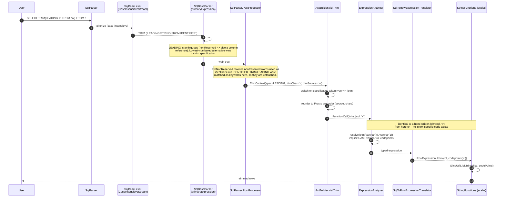

# **RFC0 for Presto**

See [CONTRIBUTING.md](CONTRIBUTING.md) for instructions on creating your RFC and the process surrounding it.

## ANSI SQL syntax support for the `TRIM` function

Proposers

* Nishitha Bhaskaran


## [Related Issues]

| Reference | Relevance |
|---|---|
| [#28190](https://github.com/prestodb/presto/pull/28190) (`67910e1cb98`) | First attempt at this feature. Merged 2026-08-04, ported from Trino. **Reverted.** |
| [#28334](https://github.com/prestodb/presto/pull/28334) (`20e7bf5cd33`) | The revert. Reason, verbatim: *"This PR makes trim a reserved keyword not acceptable for existing payloads - even if sql std. We should not add any new reserved words."* |
| [#28357](https://github.com/prestodb/presto/pull/28357) (`9bffdb678de`) | `TestReservedKeywords`, added after the revert to make a recurrence machine-detectable. This RFC's acceptance gate. |

## Summary

Add ANSI SQL `TRIM` syntax to Presto's parser:

```sql
TRIM(BOTH | LEADING | TRAILING FROM <source>)
TRIM(BOTH | LEADING | TRAILING <char> FROM <source>)
TRIM(<char> FROM <source>)          -- specification omitted, defaults to BOTH
TRIM(<source>, <char>)              -- existing comma form, unchanged
```

The three ANSI forms are desugared in `AstBuilder` into the `trim`, `ltrim` and `rtrim` scalar
functions that already exist, so there are no runtime, analyzer, planner or native-worker changes.

The defining constraint is that **no new reserved keywords are introduced**. `TRIM`, `BOTH`,
`LEADING` and `TRAILING` become `nonReserved` grammar tokens, which keeps them usable as unquoted
identifiers everywhere they work today. This is the exact point on which the previous attempt
(#28190) failed and was reverted, and this RFC makes the constraint machine-checked rather than
reviewer-checked.

## Background

### What fails today

Presto supports only the function-call form of trimming. The ANSI form is a parse error — verbatim
from the #28190 test plan, against master:

```
presto> SELECT trim('!' FROM '!foo!');
Query 20260720_141658_00002_5b9ir failed: line 1:17: mismatched input 'FROM'. Expecting: ',', <expression>
SELECT trim('!' FROM '!foo!')
```

Three user-visible problems follow:

1. **Standard conformance gap.** `TRIM ( [ [ <trim specification> ] [ <trim character> ] FROM ] <trim source> )`
   is ISO/IEC 9075-2 core syntax. Presto already implements the sibling special forms from the same
   part of the standard — `SUBSTRING(x FROM y FOR z)`, `POSITION(x IN y)`, `NORMALIZE`, `EXTRACT`
   (`SqlBase.g4:425, 450-452`). `TRIM` is a conspicuous hole in an otherwise complete set.
2. **Portability cost.** Trino, PostgreSQL, MySQL, Oracle, Snowflake, SQL Server 2022+, Spark and
   Hive all accept `TRIM(LEADING 'x' FROM col)`. Every migration into Presto has to hand-rewrite
   these expressions, and BI tools that emit standard SQL cannot be pointed at Presto unchanged.
3. **Direction is inexpressible in standard SQL.** A user who knows only ANSI SQL has no portable
   way to trim one side in Presto; `ltrim`/`rtrim` are Presto-specific names.

### Why the previous attempt was reverted, and why that shapes this RFC

#28190 added four lexer tokens and listed **three** of them in the `nonReserved` rule:

```antlr
BOTH: 'BOTH';  LEADING: 'LEADING';  TRAILING: 'TRAILING';  TRIM: 'TRIM';
nonReserved
    : ... | BOTH | ... | LEADING | ... | TRAILING | TRANSACTION | ...   // TRIM absent
```

In this grammar a token that is not in `nonReserved` is reserved by construction — `identifier` can
only reach a keyword token through the `nonReserved` alternative (`SqlBase.g4:658-665`). So the
moment `TRIM: 'TRIM';` existed, every query with a column, table or alias named `trim` stopped
parsing; the PR even documented the new reservation in
`presto-docs/src/main/sphinx/language/reserved.rst`. #28334 reverted on exactly that ground, and
#28357 added `TestReservedKeywords` so the mistake cannot be merged silently again.

The value of this RFC is therefore not just the feature: it is delivering the feature with the
reservation failure structurally ruled out.

### Nothing is missing at runtime

`trim`, `ltrim` and `rtrim` already implement all three directions, for `varchar(x)` and `char(x)`,
in one- and two-argument arities (`StringFunctions.java:504-608`, backed by
`SliceUtf8.{trim,leftTrim,rightTrim}`), and are already exercised on the C++ worker
(`AbstractTestNativeGeneralQueries.java:1010, 1013`). This is a pure front-end gap.

### Goals

1. Accept `TRIM(BOTH|LEADING|TRAILING FROM <source>)`.
2. Accept `TRIM(BOTH|LEADING|TRAILING <char> FROM <source>)`.
3. Accept `TRIM(<char> FROM <source>)`, defaulting to `BOTH` (ANSI + Trino parity).
4. Keep `TRIM(<source>)` and `TRIM(<source>, <char>)` on their current grammar path, unmodified.
5. Introduce **zero new reserved words**; `TRIM`, `BOTH`, `LEADING`, `TRAILING` stay usable as
   unquoted identifiers.
6. Reuse the existing scalars — no new runtime function, no native work.
7. Ship guard tests that fail loudly if any future change reserves one of the four words.
1
## Proposed Implementation

### 1. Modules involved

| Module | Change |
|---|---|
| `presto-parser` | `SqlBase.g4` (4 tokens, `nonReserved` entries, `trimSpecification` rule, 2 `primaryExpression` alternatives) and `AstBuilder.java` (`visitTrim`) |
| `presto-docs` | `functions/string.rst` only. **`language/reserved.rst` must not change.** |
| Tests | `TestSqlParser`, `TestSqlParserErrorHandling`, `TestReservedKeywords` resource list, `TestStringFunctions` |
| `presto-main-base` (main) | **no change expected** — confirming this is a stage exit criterion |
| `presto-native-execution` | **no change** — the desugared functions are already supported |

### 2. New terminology / SQL language additions

* **Trim specification** — `BOTH`, `LEADING` or `TRAILING`, the ANSI term for the direction.
* **Trim character** — ANSI's term for the second operand. In Presto it is a *set of code points*,
  not a substring: `TRIM(TRAILING 'ER' FROM 'WORKER')` → `WORK`, i.e. the set `{E,R}`. This follows
  the existing two-argument `trim` semantics and matches Trino/PostgreSQL; the standard's
  single-character restriction is intentionally not enforced.
* **Default trim character** — when omitted, the whitespace set of the one-argument scalars: the
  31 code points tabulated at `functions/string.rst:224` (TAB, LF, VT, FF, CR, FS, GS, RS, US,
  space, and Unicode space separators U+1680…U+3000). So `TRIM(BOTH FROM x)` ≡ `trim(x)`, **not**
  `trim(x, ' ')`.
* **Non-reserved keyword** — existing Presto concept, central here: a keyword token listed in the
  `nonReserved` rule, which `SqlParser.PostProcessor.exitNonReserved` (`SqlParser.java:237-263`)
  rewrites into a synthetic `IDENTIFIER` when used as an identifier.

### 3. How "no new reserved keywords" is achieved

The mechanism already exists and is used by 180+ words. Two pieces:

```antlr
identifier
    : IDENTIFIER             #unquotedIdentifier
    | QUOTED_IDENTIFIER      #quotedIdentifier
    | nonReserved            #unquotedIdentifier      // ← keyword tokens reach identifier here
    | BACKQUOTED_IDENTIFIER  #backQuotedIdentifier
    | DIGIT_IDENTIFIER       #digitIdentifier
    ;
```

plus `exitNonReserved`, which replaces the matched keyword token with an `IDENTIFIER` token in the
parse tree, so `AstBuilder`, the analyzer and the formatter cannot tell the difference.

The reason this is airtight: the raw `IDENTIFIER` token appears **nowhere in the grammar outside the
`identifier` rule** (verified — `grep -n IDENTIFIER SqlBase.g4` matches only lines 660-664 plus the
lexer definitions). There is no rule accepting `IDENTIFIER` directly that would reject a
`nonReserved` word. Adding a token and listing it in `nonReserved` changes the token stream but not
the set of accepted identifier positions.

`SUBSTRING` and `POSITION` are the working precedent — special-form keywords with their own
`primaryExpression` alternatives *and* members of `nonReserved` (`SqlBase.g4:729, 732`) — and
`TestSqlParser` asserts both spellings parse: `substring('x' FROM 2)` (line 855) and
`substring('x', 2)` (line 892). `EXTRACT` and `NORMALIZE` are the reserved counterexample: tokens
absent from `nonReserved`. #28190 accidentally put `TRIM` in the second group.

### 4. Grammar changes (`SqlBase.g4`)

**(a) Four lexer tokens**, alphabetically placed in the token block:

```antlr
BOTH: 'BOTH';
LEADING: 'LEADING';
TRAILING: 'TRAILING';
TRIM: 'TRIM';
```

**(b) All four in `nonReserved`** — the line #28190 got wrong:

```antlr
    | BEFORE | BERNOULLI | BOTH | BRANCH
    | LANGUAGE | LAST | LATERAL | LEADING | LEVEL | LIMIT | LOGICAL
    | ... | TO | TRAILING | TRANSACTION | TRIM | TRUNCATE | TRY_CAST | TYPE
```

**(c) A `trimSpecification` rule**, so `AstBuilder` can dispatch on token type instead of text:

```antlr
trimSpecification
    : LEADING
    | TRAILING
    | BOTH
    ;
```

**(d) Two `primaryExpression` alternatives**, placed beside `#substring` / `#normalize` / `#extract`:

```antlr
    | TRIM '(' trimSpecification (trimChar=valueExpression)? FROM trimSource=valueExpression ')'  #trim
    | TRIM '(' (trimChar=valueExpression)? FROM trimSource=valueExpression ')'                    #trim
```

Both alternatives share the `#trim` label, so ANTLR generates one `TrimContext` exposing
`trimSpecification()`, `trimChar` and `trimSource`, with unmatched elements `null`. #28190 used the
same two-alternatives-one-label shape, so it is known to generate and compile.


### 5. Ambiguity resolution (the one design corner that matters)

Because `BOTH`/`LEADING`/`TRAILING` are non-reserved, each is *also* a legal `valueExpression` (a
column reference), so `TRIM(LEADING FROM t.c)` has two candidate readings. This is inherent to the
no-new-reserved-words requirement and cannot be designed away — only resolved deterministically.

**Rule: the specification-first alternative is listed first, and ANTLR resolves an ambiguity between
alternatives in favour of the lowest-numbered one. A bare `BOTH`/`LEADING`/`TRAILING` token in the
first position inside `TRIM(...)` is therefore always the trim specification.**

| Input | Parsed as |
|---|---|
| `TRIM(LEADING FROM s)` | `ltrim(s)` — specification wins |
| `TRIM("leading" FROM s)` | `trim(s, leading)` — double quotes force the column reading |
| `TRIM(t.leading FROM s)` | `trim(s, t.leading)` — a qualified name cannot be a specification |
| `TRIM(s, leading)` | `trim(s, leading)` — comma form is never ambiguous |
| `TRIM(LEADING leading FROM s)` | `ltrim(s, leading)` — specification, then column |

The strongest compatibility statement available follows from this: **every input the new
alternatives can match is a parse error on master today**, so no query that parses today changes
meaning. The shadowing above is visible only for the shape
`TRIM(<unqualified column named both/leading/trailing> FROM x)`, which does not parse at all today,
and three escape hatches are ordinary SQL.

### 6. AST and semantic analysis — no new node

`AstBuilder` desugars to a `FunctionCall` on the existing scalar, exactly as the other ANSI special
forms already do:

| Grammar alternative | `AstBuilder` | Result |
|---|---|---|
| `#substring` | `visitSubstring` (`AstBuilder.java:2153`) | `FunctionCall(substr, args)` |
| `#position` | `visitPosition` (`:2159`) | `FunctionCall(strpos, reversed args)` |
| `#normalize` | `visitNormalize` (`:2166`) | `FunctionCall(normalize, [str, form])` |
| `#trim` (new) | `visitTrim` | `FunctionCall(trim\|ltrim\|rtrim, args)` |

`EXTRACT` is the one special form with a dedicated node (`Extract.java`), and only because its field
is an enum with no scalar equivalent. `TRIM` has three ready-made scalars, so it belongs with
`SUBSTRING` and `POSITION`.

Direction is encoded in the *choice of function name*; the trim character becomes the second
argument. Note the operand flip — ANSI writes `<char> FROM <source>`, Presto's scalars take
`(source, chars)`; `visitPosition` already does the same kind of reordering.

| Syntax | AST |
|---|---|
| `TRIM(BOTH FROM s)` / `TRIM(FROM s)` | `FunctionCall(trim, [s])` |
| `TRIM(LEADING FROM s)` | `FunctionCall(ltrim, [s])` |
| `TRIM(TRAILING FROM s)` | `FunctionCall(rtrim, [s])` |
| `TRIM(BOTH c FROM s)` / `TRIM(c FROM s)` | `FunctionCall(trim, [s, c])` |
| `TRIM(LEADING c FROM s)` | `FunctionCall(ltrim, [s, c])` |
| `TRIM(TRAILING c FROM s)` | `FunctionCall(rtrim, [s, c])` |

Method contract — `AstBuilder`, next to `visitSubstring`:

```java
@Override
public Node visitTrim(SqlBaseParser.TrimContext context)
{
    Expression source = (Expression) visit(context.trimSource);
    Optional<Expression> trimChar = visitIfPresent(context.trimChar, Expression.class);

    String name = "trim";
    if (context.trimSpecification() != null) {
        // token type, not text: the grammar has already restricted this to three tokens
        switch (((TerminalNode) context.trimSpecification().getChild(0)).getSymbol().getType()) {
            case SqlBaseLexer.LEADING:
                name = "ltrim";
                break;
            case SqlBaseLexer.TRAILING:
                name = "rtrim";
                break;
            default: // BOTH
                name = "trim";
        }
    }

    ImmutableList.Builder<Expression> arguments = ImmutableList.builder();
    arguments.add(source);
    trimChar.ifPresent(arguments::add);
    return new FunctionCall(getLocation(context), QualifiedName.of(name), arguments.build());
}
```

Dispatching on token type rather than `getText()` makes an invalid specification unreachable — the
grammar rejected it already — so there is no string comparison, no `Locale` handling, and no
validation branch to get wrong. `getLocation(context)` anchors the node at the `TRIM` token so
error messages point at the whole expression.

**Consequences of desugaring:**

* **Zero analyzer/planner work.** The resulting `FunctionCall` is indistinguishable from a
  hand-written `ltrim(s, c)`, so all nine files #28190 had to modify — `ExpressionAnalyzer`,
  `AggregationAnalyzer`, `ExpressionInterpreter`, `SqlToRowExpressionTranslator`,
  `ExpressionFormatter`, `AstVisitor`, `DefaultTraversalVisitor`, `ExpressionRewriter`,
  `ExpressionTreeRewriter` — need no changes. That also shrinks the blast radius should this be
  reverted again.
* **Function resolution and casts are automatic.** `ltrim(varchar(x), varchar(y))` resolves to the
  `int[] codePointsToTrim` overload via the existing implicit `CAST(varchar → codepoints)`
  (`StringFunctions.castVarcharToCodePoints`).
* **Accepted loss of fidelity.** `EXPLAIN`, `SHOW CREATE VIEW` and `ExpressionFormatter` print the
  desugared call — `ltrim(s, 'x')` for `TRIM(LEADING 'x' FROM s)`. Output is valid, semantically
  identical SQL, and `SUBSTRING(x FROM 1 FOR 2)` already prints as `substr(x, 1, 2)`, so this is
  consistent with existing behaviour rather than a new wart.

### 7. Execution / runtime

**None.** By the end of parsing an ANSI `TRIM` is a call to `trim`, `ltrim` or `rtrim` — already
registered scalars with `varchar(x)` and `char(x)` overloads in both arities
(`StringFunctions.java:504-608`). No function registration, no signature change, no plan-format,
session-property or configuration change, no native work. Plans are identical to the equivalent
hand-written call, so there is no runtime performance impact; parser cost is one extra alternative
discriminated on the `TRIM` token.

### 8. Code flow

ANSI form, `SELECT TRIM(LEADING 'x' FROM col) FROM t`:

* `SqlParser` lexes through a case-insensitive stream (which is why `trim`, `Trim`, `TRIM`, `both`,
  `LeAdInG` all work with no special handling) → `TRIM ( LEADING STRING FROM IDENTIFIER )`.
* `SqlBaseParser.primaryExpression` matches `#trim` alternative 1. `LEADING` is ambiguous
  (non-reserved ⇒ also a column reference); lowest-numbered alternative wins ⇒ it is the
  specification.
* `SqlParser.PostProcessor.exitNonReserved` rewrites non-reserved words *used as identifiers* into
  `IDENTIFIER` tokens. `TRIM`/`LEADING` here were matched as keywords by the `#trim` alternative,
  so they are left alone.
* `AstBuilder.visitTrim` switches on the specification token type ⇒ `ltrim`, reorders to Presto's
  `(source, chars)` order ⇒ `FunctionCall(ltrim, [col, 'x'])`.
* From here on, **no TRIM-specific code exists**: `ExpressionAnalyzer` resolves
  `ltrim(varchar(x), varchar(1))` with the implicit `varchar → codepoints` cast,
  `SqlToRowExpressionTranslator` emits the row expression, and `StringFunctions.leftTrim` →
  `SliceUtf8.leftTrim(slice, codePoints)` executes.

Comma form, `SELECT TRIM(col, 'x')` — not routed through any new code:

* Both `#trim` alternatives require `FROM` ⇒ no match.
* Falls through to the unchanged `#functionCall` alternative ⇒ `AstBuilder.visitFunctionCall` ⇒
  `FunctionCall(trim, [col, 'x'])`, byte-identical to master.



### 9. Error handling

All parse errors come from the generated parser via `SqlParser`'s error listener
(`SqlParser.java:50-56`), so they are deterministic and carry `line:column`.

| Input | Outcome |
|---|---|
| `TRIM(BOTH)` | parse error at `)`: expecting `FROM` or `<expression>` |
| `TRIM(LEADING FROM)` | parse error at `)`: expecting `<expression>` |
| `TRIM(BOTH 'x' 'y' FROM s)` | parse error at `'y'` — at most one trim character |
| `TRIM(BOTH 'x' s)` | parse error at `s`: expecting `FROM` |
| `TRIM(FROM)` | parse error at `)` — no source |
| `TRIM(LEADING 'x')` | **analysis-time** `Unknown type: LEADING` — see note |
| `TRIM(s FROM 'x')` | **valid**: `trim('x', s)` — ANSI operand order; see Adoption Plan |

**Note on `TRIM(LEADING 'x')`.** With `FROM` missing, no `#trim` alternative matches, so the input
falls through to `#functionCall`, where `LEADING 'x'` matches `identifier string` — the
`#typeConstructor` alternative (`SqlBase.g4:417`). It parses as `trim(LEADING 'x')` and fails in
`ExpressionAnalyzer.visitGenericLiteral` with `Unknown type: LEADING`
(`ExpressionAnalyzer.java:899-907`). This is pre-existing behaviour for any `identifier string`
pair — `trim(foo 'x')` behaves the same on master — not something this change introduces, and it is
why a parse-time "missing FROM" message is not achievable for this one shape. Accepted and pinned
by a test.

### 10. New user-facing metrics

None. No new CLI or UI surface, no new query statistics, no new session property. The only
user-visible change is that previously-rejected SQL now parses.


## Adoption Plan

**Impact on existing users: additive only.**

* **SQL grammar:** four new non-reserved keyword tokens and two new `primaryExpression`
  alternatives. Every input the new alternatives can match is a parse error on master, so **no query
  that parses today changes meaning.**
* **No new session parameters, configuration properties, SPI changes or client API changes.**
  Deliberately no feature flag: the syntax is a parse error today, so there is nothing to fall back
  to, and a flag would add a code path the desugaring approach otherwise avoids entirely.
* **No reserved-word list change**, so JDBC `getSQLKeywords()`-style lists and third-party
  lexers/linters are unaffected and there is nothing to communicate to tool vendors.
* **Cross-version clusters:** desugaring happens in the coordinator's parser, so a worker only ever
  receives pre-existing functions. No wire-format or plan-format coordination needed.

**No older behaviour is phased out and no migration tooling is required.** `TRIM(<source>)`,
`TRIM(<source>, <char>)`, `LTRIM` and `RTRIM` remain fully supported with no deprecation intended —
they stay on the untouched `#functionCall` grammar path, so they cost nothing to keep.

**Two behaviours to call out in documentation:**

1. Inside `TRIM(...)`, a bare `BOTH`/`LEADING`/`TRAILING` in first position is the trim
   specification, not a column reference. To mean the column, write `TRIM("leading" FROM s)`,
   `TRIM(t.leading FROM s)`, or `TRIM(s, leading)`.
2. `TRIM(<char> FROM <source>)` is ANSI operand order — `TRIM(a FROM b)` trims the characters of `a`
   from `b`, so `TRIM(col FROM 'abc')` is valid rather than an error. This is a direct consequence
   of supporting ANSI's specification-less form (Goal 3).

**Teaching / documentation:** extend the `trim` entry in
`presto-docs/src/main/sphinx/functions/string.rst` with the ANSI forms, examples, the
`BOTH`/`LEADING`/`TRAILING` semantics, the "set of code points, not a substring" clarification, and
the two notes above. Add a release note under General Changes. No blog post needed — this is a
standard-conformance fix users will discover by their existing SQL simply working. `reserved.rst`
must **not** change.

**Out of scope, addressable independently later:**

* `char(x)` trim semantics. For `char(x)` input, `trim`/`rtrim` return `char(x)`, which is
  space-padded, so `TRIM(TRAILING FROM CAST('ab ' AS CHAR(4)))` is effectively a no-op, and the
  two-argument `charRightTrim`/`charTrim` explicitly re-pad via `trimTrailingSpaces`
  (`StringFunctions.java:585, 603`). Changing this was attempted in #28280 and reverted in #28325.
  This RFC inherits and pins current behaviour; changing it needs its own RFC.
* Formatter fidelity — making `SHOW CREATE VIEW` reprint the ANSI spelling, which requires the
  `Trim` AST node of approach 3.
* A better parse-time message for `TRIM(LEADING 'x')`, which would need an extra grammar
  alternative existing purely to produce a diagnostic.
* Adding `BOTH`/`LEADING`/`TRAILING` to `presto-non-reserved-words.txt` is a durable commitment:
  Presto could not later reserve them without deleting a guard test. They are identifiers today, so
  this preserves the status quo — but reviewers should acknowledge it explicitly, since the standard
  reserves all three and some future feature may want them.

## Test Plan

### Unit / parser tests — `presto-parser/.../TestSqlParser.java`

New `testTrim()` beside the existing `testSubstring*` tests, asserting exact ASTs:

```java
assertExpression("TRIM(BOTH FROM ' abc ')",         new FunctionCall(QualifiedName.of("trim"),  ImmutableList.of(new StringLiteral(" abc "))));
assertExpression("TRIM(LEADING FROM ' abc ')",      new FunctionCall(QualifiedName.of("ltrim"), ImmutableList.of(new StringLiteral(" abc "))));
assertExpression("TRIM(TRAILING FROM ' abc ')",     new FunctionCall(QualifiedName.of("rtrim"), ImmutableList.of(new StringLiteral(" abc "))));
assertExpression("TRIM(BOTH ' ' FROM ' abc ')",     new FunctionCall(QualifiedName.of("trim"),  ImmutableList.of(new StringLiteral(" abc "), new StringLiteral(" "))));
assertExpression("TRIM(LEADING ' ' FROM ' abc ')",  /* ltrim, 2 args */ ...);
assertExpression("TRIM(TRAILING ' ' FROM ' abc ')", /* rtrim, 2 args */ ...);
assertExpression("TRIM('!' FROM '!foo!')",          new FunctionCall(QualifiedName.of("trim"),  ImmutableList.of(new StringLiteral("!foo!"), new StringLiteral("!"))));
assertExpression("TRIM(FROM ' abc ')",              new FunctionCall(QualifiedName.of("trim"),  ImmutableList.of(new StringLiteral(" abc "))));
```

Coverage checklist:

* Directions: `BOTH`, `LEADING`, `TRAILING`, omitted — with and without an explicit trim character.
* Case variations: `trim`, `Trim`, `TRIM`; `both`, `Both`, `leading`, `TrAiLiNg`.
* Expressions, not only literals: `TRIM(TRAILING upper(sep) FROM CAST(x AS varchar))`,
  `TRIM(BOTH t.c FROM t.d)`, `TRIM(BOTH ? FROM col)` (parameter), `TRIM(BOTH 'x' FROM a || b)`.
* The full ambiguity table asserted case by case, including `TRIM("leading" FROM s)` →
  `trim(s, leading)` and `TRIM(t.leading FROM s)` → `trim(s, t.leading)`.
* Comma/plain forms producing the same AST as today: `TRIM(x)`, `TRIM(x, 'a')`, `LTRIM(x)`,
  `LTRIM(x, 'a')`, `RTRIM(x)`, `RTRIM(x, 'a')`.
* Statement level: `assertStatement("SELECT TRIM(LEADING 'x' FROM c) FROM t", …)`, as `testSubstring`
  does, so the alternative is exercised inside a full query.
* Formatter round-trip: assert `TRIM(LEADING 'x' FROM s)` formats to `ltrim(s, 'x')` and that
  re-parsing that yields the same AST — documenting the accepted fidelity loss instead of leaving it
  implicit.

### Parser error tests — `TestSqlParserErrorHandling.java`

One case per parse-error row of the error table, asserting message **and** `line:column`:
`TRIM(BOTH)`, `TRIM(LEADING FROM)`, `TRIM(BOTH 'x' 'y' FROM s)`, `TRIM(BOTH 'x' s)`, `TRIM(FROM)`.

### Semantic / execution tests — `presto-main-base/.../TestStringFunctions.java`

New `testAnsiTrimSyntax()` beside the existing trim tests, asserting values **and** result types:

```java
assertFunction("TRIM(BOTH FROM '  hello  ')",       createVarcharType(9), "hello");
assertFunction("TRIM(LEADING FROM '  hello  ')",    createVarcharType(9), "hello  ");
assertFunction("TRIM(TRAILING FROM '  hello  ')",   createVarcharType(9), "  hello");
assertFunction("TRIM(BOTH '$' FROM '$var$')",       createVarcharType(5), "var");
assertFunction("TRIM(LEADING '$' FROM '$var$')",    createVarcharType(5), "var$");
assertFunction("TRIM(TRAILING '$' FROM '$var$')",   createVarcharType(5), "$var");
assertFunction("TRIM(TRAILING 'ER' FROM 'WORKER')", createVarcharType(6), "WORK");   // set, not substring
assertFunction("TRIM('!' FROM '!foo!')",            createVarcharType(5), "foo");
assertFunction("TRIM(both '$' FROM '$var$')",       createVarcharType(5), "var");    // case
```

Plus:

* **Equivalence assertions** — `TRIM(BOTH FROM x)` ≡ `trim(x)`, `TRIM(LEADING FROM x)` ≡ `ltrim(x)`,
  `TRIM(TRAILING c FROM x)` ≡ `rtrim(x, c)` — over a table of inputs including empty string,
  all-whitespace, no-op, and non-Latin data (`'źółć'` with `'źćł'`, matching the existing `testTrim`
  cases).
* **Whitespace-set correctness** — input containing `U+0009`/`U+000A`/`U+2000` proving the
  no-`<char>` form uses the full 31-code-point whitespace set, i.e. is *not* `trim(x, ' ')`.
* **`char(x)` inputs** — `TRIM(BOTH FROM CAST('  ab  ' AS CHAR(6)))` and the `TRAILING` variant,
  pinning current padding behaviour so a future change to it is a deliberate act.
* **`NULL` propagation** — `TRIM(BOTH NULL FROM 'abc')`, `TRIM(BOTH 'x' FROM NULL)`.
* **Semantic errors** — `TRIM(BOTH 1 FROM 'abc')` (non-string trim char), and `TRIM(LEADING 'x')`
  asserting `Unknown type: LEADING` so the surprising case is pinned.

### Regression tests proving no new reserved keywords — the acceptance gate

1. Add `BOTH`, `LEADING`, `TRAILING` to
   `presto-parser/src/test/resources/presto-non-reserved-words.txt` (`TRIM` is already there, line
   167 — its javadoc even calls `TRIM` out as one of the "words that were reserved by mistake in the
   past and reverted"). `TestReservedKeywords.testCurrentNonReservedWords` then drives all four
   through its twelve identifier positions: `SELECT %s FROM t`, `SELECT 1 AS %s`, `SELECT t.%s`,
   `FROM %s`, `AS %s`, `FROM %s.%s.%s`, `WHERE %s = 1`, `GROUP BY %s`, `ORDER BY %s`,
   `PARTITION BY %s`, `WITH %s AS …`, `CREATE TABLE t (%s bigint)`.
2. A focused `TestSqlParser` test asserting this list parses, so the guarantee sits next to the
   feature that constrains it:

```sql
SELECT trim, leading, trailing, both FROM t;
SELECT 1 AS trim, 2 AS leading, 3 AS trailing, 4 AS both;
SELECT t.trim, t.leading FROM t;
SELECT * FROM trim;
SELECT * FROM t AS leading;
SELECT * FROM cat.sch.trailing;
CREATE TABLE t (trim bigint, leading varchar, trailing double, both int);
SELECT count(*) OVER (PARTITION BY leading) FROM t;
WITH trailing AS (SELECT 1) SELECT * FROM trailing;
SELECT * FROM t WHERE both = 1 GROUP BY both ORDER BY both;
SELECT my_catalog.my_schema.trim(x);   -- UDF named trim, via qualifiedName → identifier → nonReserved
```

3. **Review gate, not a test:** `presto-docs/src/main/sphinx/language/reserved.rst` must be
   unchanged by the implementation PR. #28190 modified it; that diff is the tell-tale of a reserved
   word.

### Integration / functional / product tests

* `TestStatementBuilder` and `TestStatementSplitter` must stay green with no expectation edits.
* `TestSqlParser.testPossibleExponentialBacktracking` guards parse-time blowup from the new
  alternative.
* End-to-end: one ANSI-form query over a real table in `AbstractTestQueries`, plus extending the
  existing trim assertions in `AbstractTestNativeGeneralQueries` (`:1010, 1013`) so the
  coordinator → worker path is covered on **both** Java and native workers. No product-test (Tempto)
  changes are anticipated, since no connector, session or client behaviour changes.
* `presto-docs` build after the `string.rst` update.


