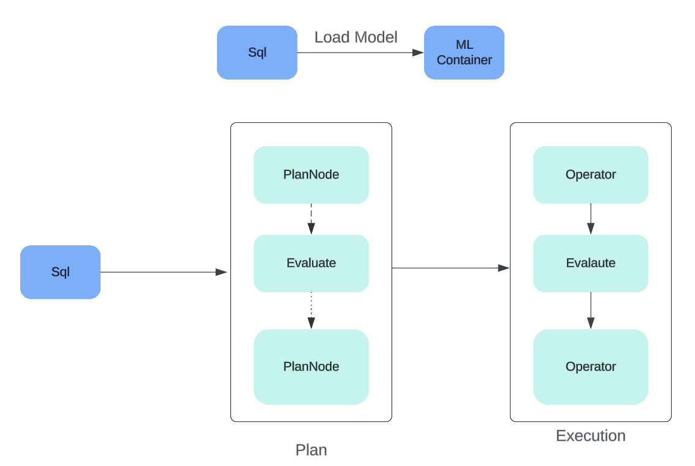
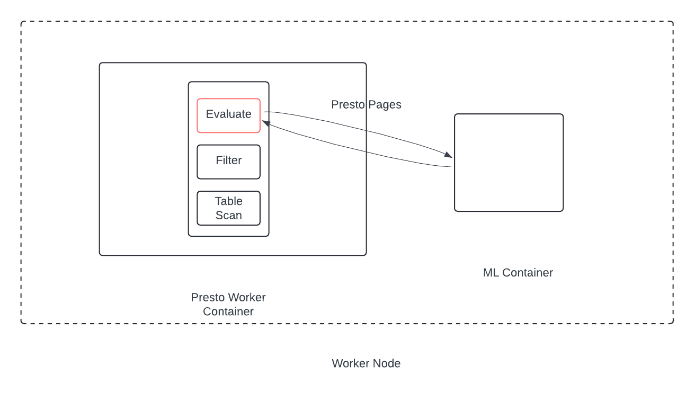

# **RFC05 for Presto**

See [CONTRIBUTING.md](CONTRIBUTING.md) for instructions on creating your RFC and the process surrounding it.

## Presto-ML Draft

Still WIP, writing down thoughts

Proposers

* jay

## [Related Issues]

https://github.com/prestodb/presto/issues/21410

## Summary
Allow efficient ML model evaluation through Presto

## Background
Related functionality in Big query
https://cloud.google.com/bigquery/docs/reference/standard-sql/bigqueryml-syntax-predict

### [Optional] Goals

Allow users to evaluate ML models on big data. This will be called offline evaluation since the model will be downloaded to presto and evaluated.

### [Optional] Non-goals

Model Creation, Training

## Terms

### ML.x SQL
SQL to allow model evaluation

### Evaluate Operator
New Operator which is responsible for the model evaluation

### ML Executor
GRPC process loaded with models and common model dependencies which will process presto batches.
The process will receive presto batches from evaluate operator and return presto batches to evaluate operator
The process can be a standalone, sidecar or a co-process


## Proposed Implementation

### End to end proposal





### ML Container Implementation
The GRPC process will be in python and will have common libraries like the hugging face's transformer library installed.
Hugging face transformer library is https://huggingface.co/docs/transformers/en/index
This will allow downloading models and evaluating.

### Proposed User SQL

Can be similar to big query - https://cloud.google.com/bigquery/docs/reference/standard-sql/bigqueryml-syntax-predict

### To Evaluate
For Linear regressions/classification based predictions
```
ML.PREDICT(
  MODEL `project_id.dataset.model`,
  { TABLE `project_id.dataset.table` | (query_statement) },
  STRUCT(
    [threshold_value AS threshold]
    [, keep_columns AS keep_original_columns]
    [, trial_id AS trial_id])
)
```

Input - label, column1,column2
Output - label, predict_label,  column1, column2,


Generate functions that take in a prompt and a base column

```
ML.GENERATE_TEXT(
MODEL project_id.dataset.model,
{ TABLE project_id.dataset.table | (query_statement) },
STRUCT(
  [max_output_tokens AS max_output_tokens]
  [, top_p AS top_p]
  [, temperature AS temperature]
  [, flatten_json_output AS flatten_json_output]
  [, stop_sequences AS stop_sequences]
  [, ground_with_google_search AS ground_with_google_search]
  [, safety_settings AS safety_settings])
)
```
Input ->  prompt , column
Output -> generated_column, column


Other functions like Translate, transcibe etc


### To Load Model 

There will be some governance/observability on models loaded.
```
ML.LOAD(
  MODEL `project_id.dataset.model`,
)
```

### To UnLoad Model

There will be some governance/observability on models loaded.
```
ML.DROP(
  MODEL `project_id.dataset.model`,
)
```

## [Optional] Metrics

Metrics around Evaluate Operator


## [Optional] Other Approaches Considered


## Adoption Plan
-- New feature

## Test Plan
