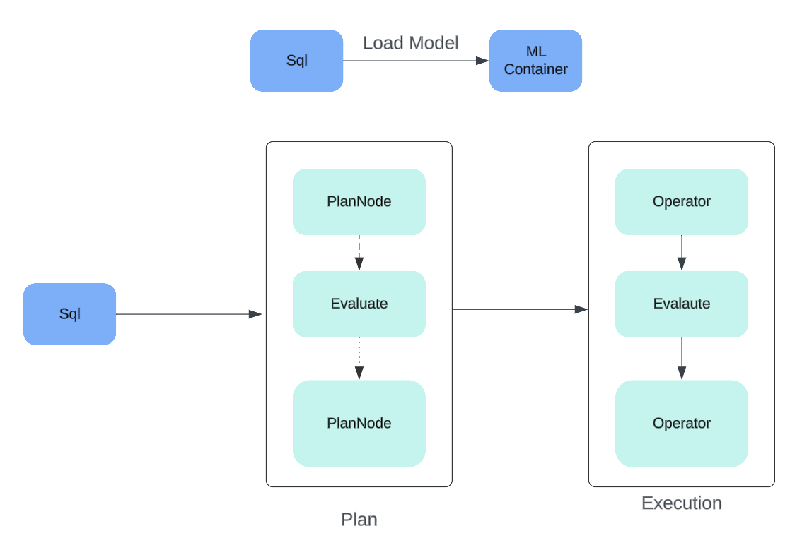
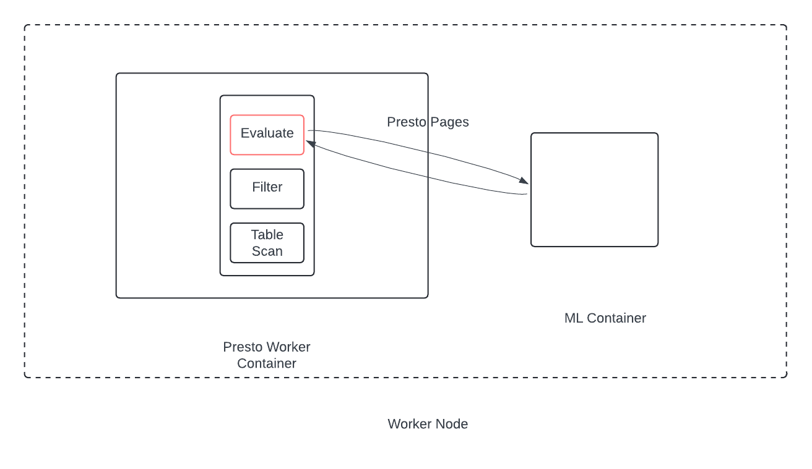

# **RFC05 for Presto**

See [CONTRIBUTING.md](CONTRIBUTING.md) for instructions on creating your RFC and the process surrounding it.

## Presto-ML Draft

Still WIP, writing down thoughts

Proposers

* jay

## [Related Issues]

https://github.com/prestodb/presto/issues/21410

## Summary
Allow efficient ML model evaluation through Presto

## Background
Related functionality in Big query
https://cloud.google.com/bigquery/docs/reference/standard-sql/bigqueryml-syntax-predict

### [Optional] Goals

### [Optional] Non-goals
Model Creation, Training

### [Optional] Goals

Allow users to evaluate ML models on big data. This will be called offline evaluation since the model will be downloaded to presto and evaluated.

### [Optional] Non-goals

Online Path - There can be another path for online evaluation where presto send requests to a remote udf server loaded with models

Model Creation, Training

## Terms

### ML.Predict SQL
SQL to allow model evaluation

### Evaluate Operator
New Operator which is responsible for the model evaluation

### ML Container
Sidecar container loaded with models and common model dependencies.
Loading new dependencies during ML.Load() is not the scope here.
The sidecar will receive presto batches from evaluate operator and return presto batches to evaluate operator

## Proposed Implementation

### End to end proposal




### ML Container Implementation
The container will be in python and will have common libraries like the hugging face's transformer library installed.
Hugging face transformer library is https://huggingface.co/docs/transformers/en/index
This will allow downloading models and evaluating.

### Proposed User SQL

Can be similar to big query - https://cloud.google.com/bigquery/docs/reference/standard-sql/bigqueryml-syntax-predict

### To Evaluate
```
ML.PREDICT(
  MODEL `project_id.dataset.model`,
  { TABLE `project_id.dataset.table` | (query_statement) },
  STRUCT(
    [threshold_value AS threshold]
    [, keep_columns AS keep_original_columns]
    [, trial_id AS trial_id])
)
```

### To Load Model 

There will be some governance/observability on models loaded.
```
ML.LOAD(
  MODEL `project_id.dataset.model`,
)
```

### To UnLoad Model

There will be some governance/observability on models loaded.
```
ML.DROP(
  MODEL `project_id.dataset.model`,
)
```

## [Optional] Metrics

Metrics around Evaluate Operator
Sidecar container Metrics


## [Optional] Other Approaches Considered

Native Operator directly (dependencies issues)

UDF like server (can be considered but could have latencies)


## Adoption Plan
-- New feature

## Test Plan

How do we ensure the feature works as expected? Mention if any functional tests/integration tests are needed. Special mention for product-test changes. If any PoC has been done
already, please mention the relevant test results here that you think will bolster your case of getting this RFC approved.